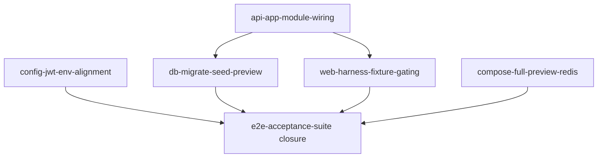

# Attendly — Integration Debt

**Product:** Attendly (*Smart Campus Attendance*)  
**Domain:** Digital campus attendance and class-session check-in for universities and schools  
**Status:** Open — phase 0–3 feature slices complete; production integration incomplete (~75% MVP readiness)  
**Related docs:** [10-local-development-setup.md](./10-local-development-setup.md) · [11-testing-plan.md](./11-testing-plan.md) · [13-docker-compose-local-runtime.md](./13-docker-compose-local-runtime.md) · [08-acceptance-mvp-future.md](../brds/08-acceptance-mvp-future.md)

### Document map

| Audience | Doc | Role |
| --- | --- | --- |
| Engineers, reviewers, BRD traceability | **This file** (`14-integration-debt.md`) | Canonical product technical reference — link here from other `docs/` |
| Harness agents (Ralph loop) | Harness **integration-debt-register** (scaffolded with Ralph loop) | Operational gap register; mirrors §4 gap table in this doc |
| Release sign-off | Harness **integration-checklist** (scaffolded with Ralph loop) | Mechanical checklist paired with `npm run aih:verify:integration` |

> **Naming:** Use `aih:verify:integration` (not legacy `aih:verify:mvp-integration`). A former stub `14-mvp-integration-debt.md` duplicated this content and has been removed.

## 1. Purpose

Phase 3 delivered isolated backend modules, React surfaces, and test harnesses. This document records **integration debt** — gaps between implemented feature slices and a **production-integratable preview runtime** that blocks MVP release sign-off.

**Do not treat `passes: true` on feature slices as release readiness.** Complete phase 4 backlog slices and run `npm run aih:verify:integration` before declaring MVP ready.

Harness agents implement remediation via **phase 4 backlog slices** in `ai-harness/whole-app-backlog.json`.

## 2. Why integration debt exists

Early-phase slices build NestJS modules, React pages, and tests in isolation. Common failure modes:

| Pattern | Symptom | Impact |
| --- | --- | --- |
| Unwired root module | Feature routes return `404` on preview API | Web falls back to harness fixtures silently |
| Missing migrate/seed | No demo accounts or baseline academic data | Local setup and demo runbook blocked |
| Fixture gating off | API 404 triggers in-memory fixture data | Staging validation appears green while API unwired |
| Incomplete compose | Only Postgres container exists | Full containerized demo unavailable |
| Browser gate unwired | `playwrightTestCount: 0` on acceptance slice | AC sign-off incomplete |

## 3. Current vs target runtime

| Concern | Current (2026-07-05) | Target |
| --- | --- | --- |
| `AppModule` imports | `HealthModule`, `IdentityModule` only | All MVP modules + `RealtimeModule` |
| Preview API routes | Auth + health; feature paths 404 | Full `/api/v1/*` surface per [05-api-design.md](./05-api-design.md) |
| Web data source | Silent harness fixture fallback on 404 | Live Postgres via API (fixtures opt-in only) |
| DB lifecycle | `CREATE TABLE IF NOT EXISTS` at repo init | `db:migrate` + `db:seed` scripts |
| Demo accounts | Test fixtures only | `*@attendly.local` / `Password123!` in preview DB |
| JWT env | Code: `ATTENDLY_JWT_SECRET`; docs: `JWT_SECRET` | Both names supported and documented |
| Compose | Postgres (`db`) only | + Redis, Dockerfiles, `full-preview` profile |

## 4. Gap register

| ID | Severity | Gap | Owner slice | Blocks |
| --- | --- | --- | --- | --- |
| GAP-01 | **Critical** | Root API module missing feature imports | `api-app-module-wiring` | Real preview API, demo runbook, acceptance on live data |
| GAP-02 | **Critical** | No `db:migrate` / `db:seed` scripts or preview seed dataset | `db-migrate-seed-preview` | Demo accounts, [10-local-development-setup.md](./10-local-development-setup.md) §5 |
| GAP-03 | **High** | Web harness fixture fallbacks active by default on API 404 | `web-harness-fixture-gating` | Honest staging validation |
| GAP-04 | **High** | Compose stack incomplete vs [13-docker-compose-local-runtime.md](./13-docker-compose-local-runtime.md) | `compose-full-preview-redis` | `aih:preview:full`, containerized demo |
| GAP-05 | **High** | JWT env naming mismatch between code and docs | `config-jwt-env-alignment` | Preview auth configuration drift |
| GAP-06 | **High** | Acceptance browser gate not fully wired | `e2e-acceptance-suite` | Final slice closure, browser AC sign-off |

### 4.1 GAP-01 — Production API not wired

**Expected:** Root application module (see `ai-harness/config/integration-checks.json` → `appModulePath`) imports all MVP backend modules listed in `requiredModules`.

**Verification:**

```bash
npm run aih:verify:integration -- --check app-module
```

**Do not** mark `api-app-module-wiring` done if modules exist only under `apps/api/src/modules/` but are absent from the root module.

### 4.2 GAP-02 — Database migrate and seed

**Expected:** Root `package.json` exposes `db:migrate` and `db:seed`; seed creates minimum demo dataset documented in [10-local-development-setup.md](./10-local-development-setup.md) §5.2.

**Verification:**

```bash
npm run aih:verify:integration -- --check seed-scripts
npm run db:migrate && npm run db:seed
```

### 4.3 GAP-03 — Harness fixture gating

**Expected:** Preview fixture data is gated by `VITE_PREVIEW_FIXTURE_MODE`. Default preview uses live `/api/v1` data — no silent API-404→fixture fallback.

**Verification:**

```bash
npm run aih:verify:integration -- --check fixture-flag
```

**Anti-pattern:** Adding new preview fallbacks without checking the fixture-enablement helper.

### 4.4 GAP-04 — Full compose preview

**Expected:** `docker-compose.yml` supports `full-preview` profile with api + web containers per [13-docker-compose-local-runtime.md](./13-docker-compose-local-runtime.md) §7.4.

**Verification:**

```bash
npm run aih:verify:integration -- --check compose
```

### 4.5 GAP-05 — JWT env alignment

**Expected:** API accepts both `JWT_SECRET` and `ATTENDLY_JWT_SECRET`; `.env.example` documents the canonical name with alias note.

### 4.6 GAP-06 — Acceptance browser gate

**Expected:** `tests/playwright-ui/scenarios/e2e-acceptance-suite.spec.ts` exists; browser test produces non-zero `playwrightTestCount`.

**Prerequisite:** GAP-01 + GAP-02 fixed so browser journeys hit live API where spec expects it.

**Verification:**

```bash
npm run aih:preview
npm run aih:browser-test -- e2e-acceptance-suite
npm run aih:playwright-check -- e2e-acceptance-suite
```

## 5. Phase 4 backlog slices

| Slice ID | Priority | Delivers | Closes |
| --- | --- | --- | --- |
| `api-app-module-wiring` | 91 | Wire all modules into production + E2E app | GAP-01 |
| `db-migrate-seed-preview` | 92 | Migrate/seed scripts + demo-runbook dataset | GAP-02 |
| `config-jwt-env-alignment` | 93 | JWT env parity | GAP-05 |
| `web-harness-fixture-gating` | 94 | `VITE_PREVIEW_FIXTURE_MODE`; fail loud by default | GAP-03 |
| `compose-full-preview-redis` | 95 | Full Compose topology + Redis | GAP-04 |
| `e2e-acceptance-suite` | 90 | Re-close after above (live browser + API) | GAP-06 |

### 5.1 Slice dependency order



Recommended priority: wiring → seed → JWT/fixtures → compose → re-close e2e acceptance.

## 6. Verification commands

| Command | Purpose |
| --- | --- |
| `npm run aih:verify:integration` | Mechanical integration gate — fails until phase 4 complete |
| `npm run aih:verify:integration -- --check app-module` | Root module wiring only |
| `npm run aih:verify:integration -- --check seed-scripts` | Migrate/seed script presence |
| `npm run aih:verify:integration -- --check fixture-flag` | Fixture gating env var |
| `npm run aih:verify:integration -- --check compose` | Compose profile completeness |
| `npm run aih:validate:backlog` | Backlog includes phase 4 slices |

## 7. Demo runbook impact

Until phase 4 completes, the stakeholder **demo runbook** (ManualsGen output) may run in **fixture mode** (`VITE_PREVIEW_FIXTURE_MODE=true`) for UI walkthroughs, but that does **not** satisfy release checklist AC-01–AC-19 on production-like data.

After phase 4: runbook flows must work with `VITE_PREVIEW_FIXTURE_MODE=false` against seeded preview DB.

## 8. Release readiness criteria

Integration debt is **closed** when all items pass:

| Checkpoint | Expected result |
| --- | --- |
| Mechanical gate | `npm run aih:verify:integration` exit 0 |
| Full harness | `npm run aih:check` exit 0 including `e2e-acceptance-suite` |
| Live preview | Demo runbook executable on seeded preview without fixture mode |
| Acceptance | AC-01 through AC-26 validated on production-like data |
| Human review | [ai-harness/workflows/human-review-checklist.md](../../ai-harness/workflows/human-review-checklist.md) live API items checked |

## 9. Parallel integration test flakes

Integration test flakes caused by cross-suite pollution are **integration debt** when they block release gates. Resolution policy:

1. Reproduce with isolated `node --test` on the failing file.
2. Classify via `{run-id}-integration-triage.json`.
3. Fix parallel test isolation in the owning module slice — do not resolve by bare full-suite re-run.

See [11-testing-plan.md](./11-testing-plan.md) §9.3–§9.4 and [09-error-handling.md](./09-error-handling.md) §6.3.

## 10. Requirement traceability

| Integration area | FR IDs | AC IDs | NFR IDs |
| --- | --- | --- | --- |
| End-to-end check-in on live preview | FR-07, FR-08, FR-16, FR-22 | AC-01, AC-04, AC-11, AC-18 | NFR-01, NFR-07 |
| Demo and local dev readiness | FR-01, FR-04, FR-36 | AC-01, AC-06, AC-07 | NFR-16 |
| Browser acceptance sign-off | FR-14, FR-16, FR-19 | AC-01–AC-19, AC-26 | NFR-14, NFR-15 |
| Release integration gate | FR-27, FR-30 | AC-15–AC-17, AC-25 | NFR-09, NFR-16 |

## 11. Future consideration

- Automated integration debt dashboard from `aih:verify:integration` JSON output.
- Staging environment parity checks against compose `full-preview` profile.
- Contract tests between frontend API client and OpenAPI spec after wiring completes.

## 12. MVP boundary note

- Integration debt tracking covers MVP Must and Should capabilities only.
- Out-of-scope items (native mobile app, facial recognition, SSO) must not expand phase 4 scope unless an MVP FR explicitly requires them.
