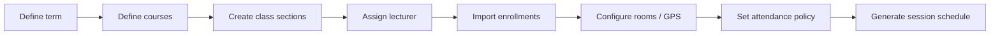
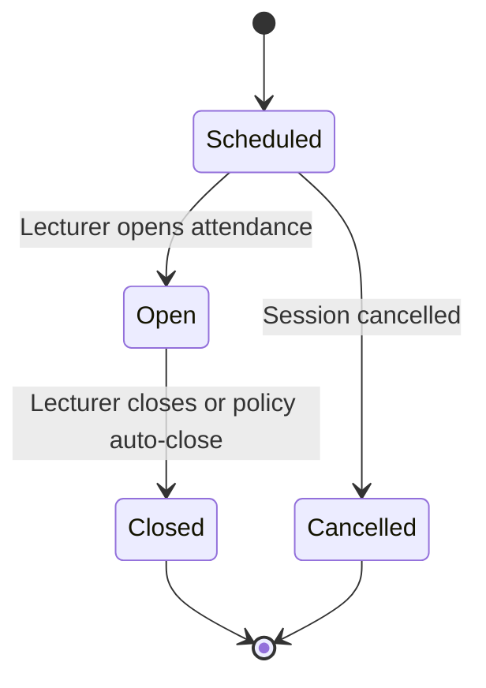
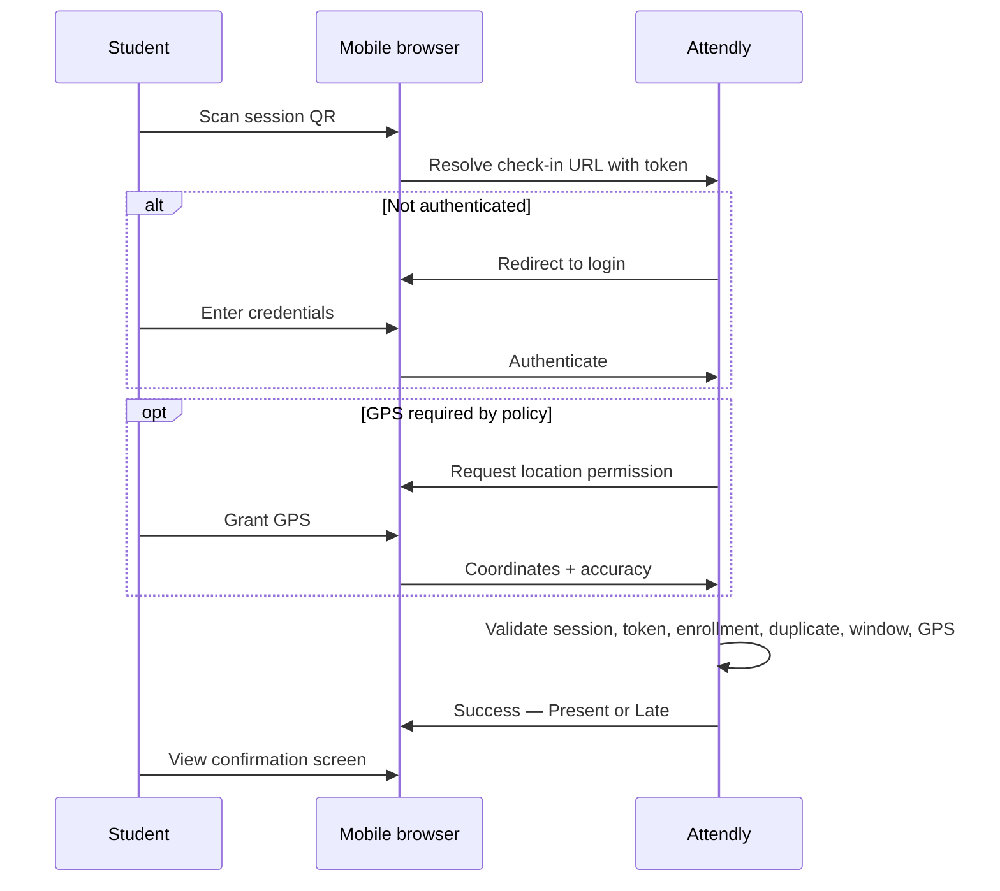
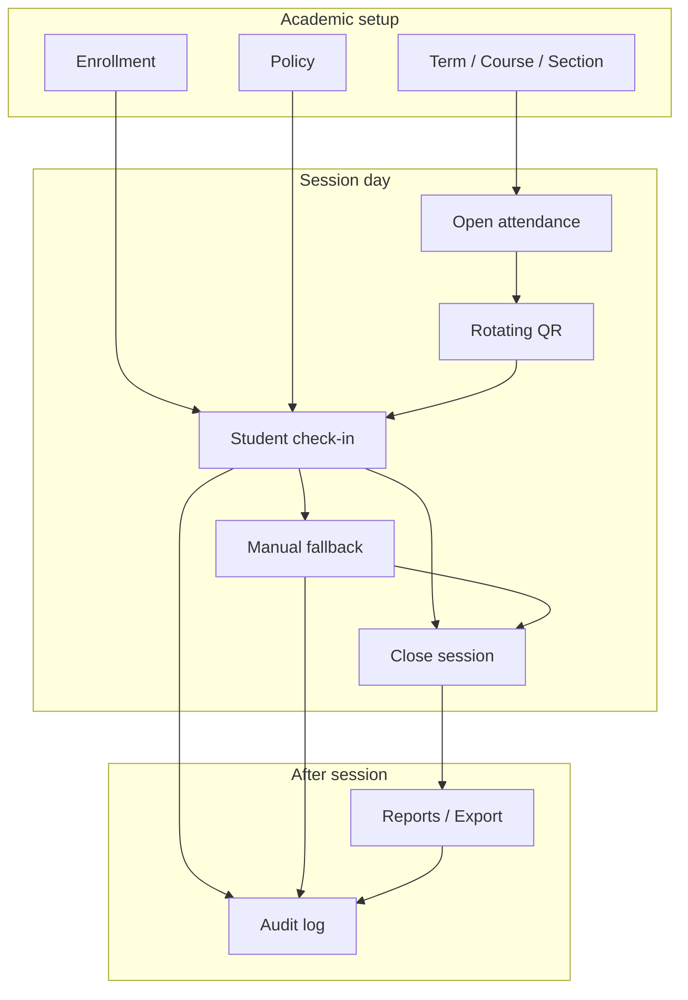

# Attendly — Business Workflow

**Product:** Attendly (*Smart Campus Attendance*)  
**Domain:** Digital campus attendance and class-session check-in for universities and schools  
**Related docs:** [00-project-overview.md](./00-project-overview.md) · [01-stakeholders-scope.md](./01-stakeholders-scope.md) · [03-functional-requirements.md](./03-functional-requirements.md) · [04-business-rules.md](./04-business-rules.md) · [05-state-machine.md](./05-state-machine.md)

---

## 1. Business Workflow

Attendly digitizes attendance for each **class session**—a single scheduled occurrence of a class section. The core business cycle spans academic setup, session operations, student check-in, exception handling, session close, and reporting.

**Primary workflows:**

| Workflow | Primary actor | Outcome |
| --- | --- | --- |
| Academic setup | Academic Admin | Terms, courses, sections, enrollments, and policies ready for sessions |
| Lecturer session operations | Lecturer | Attendance window opened, QR displayed, roster monitored, window closed |
| Student check-in | Student | Successful `Present` or `Late` record, or clear rejection with recovery path |
| Manual fallback | Lecturer / Academic Admin | Legitimate device failures resolved without wrongful absence |
| Reporting and export | Lecturer / Academic Admin | Role-scoped attendance data for compliance and disputes |

**Session attendance window states** (canonical names from [prompt.md](./prompt.md)):

| State | Meaning |
| --- | --- |
| `Scheduled` | Session exists; check-in not yet available |
| `Open` | Lecturer opened attendance; rotating QR active; students may check in |
| `Closed` | Check-in ended; roster frozen except manual edits within policy |
| `Cancelled` | Session will not run or attendance abandoned |

State transitions and edge cases: [05-state-machine.md](./05-state-machine.md). Business rule enforcement: [04-business-rules.md](./04-business-rules.md).

---

## 2. Academic setup workflow

Academic Admin prepares the institution for attendance operations before lecturers open sessions.

### 2.1 Setup sequence

| Step | Actor | Action | System result |
| --- | --- | --- | --- |
| 1 | Academic Admin | Create or activate academic term (semester) | Term record available for sections |
| 2 | Academic Admin | Define courses (subjects) for the term | Course catalog linked to term |
| 3 | Academic Admin | Create class sections with assigned lecturer, room, and schedule template | Section ready for enrollment and sessions |
| 4 | Academic Admin | Import enrolled students per section (CSV for MVP) | `Enrollment` records link students to sections |
| 5 | Academic Admin | Configure room coordinates when GPS policy applies | Room location available for radius checks |
| 6 | Academic Admin | Set or inherit attendance policy (present/late windows, GPS required, edit windows) | Effective policy resolved per section |
| 7 | Academic Admin or system | Generate class sessions from timetable or create sessions manually when schedule changes | `ClassSession` records in `Scheduled` state |

**MVP note:** Deep two-way sync with legacy student information systems is out of scope; CSV import is acceptable. See [01-stakeholders-scope.md](./01-stakeholders-scope.md) §2.3.

### 2.2 Policy inheritance

Attendance policy may be defined at institution, faculty, course, or class-section level. At check-in time, the system resolves the **effective policy** for that session's class section (most specific applicable configuration wins). Policy fields include present window, late window, auto-close, GPS requirement, GPS radius, manual-edit window, and absence thresholds. Details: [03-functional-requirements.md](./03-functional-requirements.md) (`FR-24`–`FR-26`).

---

## 3. Lecturer session workflow

Lecturers operationalize attendance for each class session they teach.

### 3.1 Pre-session

| Step | Actor | Action | System result |
| --- | --- | --- | --- |
| 1 | Lecturer | Sign in to Attendly | Dashboard shows assigned class sections |
| 2 | Lecturer | Select today's session for a section (or upcoming session from list) | Session detail with status `Scheduled` |
| 3 | Lecturer | Confirm room and enrolled count match physical class | Read-only roster preview available |

### 3.2 Open attendance and display QR

| Step | Actor | Action | System result |
| --- | --- | --- | --- |
| 4 | Lecturer | Tap **Open attendance** for the session | Session transitions `Scheduled` → `Open`; attendance window starts |
| 5 | System | Issue short-lived multi-use QR token bound to session (30 s TTL) | QR displayed on lecturer screen; auto-refreshes every 30 seconds |
| 6 | Lecturer | Project or display QR for the class | Students can scan while token is `Valid` |

**QR model (critical):** The session QR is **short-lived multi-use**—many enrolled students may use the same token within its 30-second TTL. The one-time rule applies to each student's **successful** check-in per session, not to the shared QR. See [04-business-rules.md](./04-business-rules.md) (`BR-03`, `BR-07`).

### 3.3 Monitor realtime roster

| Step | Actor | Action | System result |
| --- | --- | --- | --- |
| 7 | Lecturer | View live dashboard during open session | Roster grouped: checked in (`Present`/`Late`), pending, rejected attempts |
| 8 | Lecturer | Review rejected or suspicious attempts | Failure reason codes visible; manual action available per policy |
| 9 | Lecturer | Handle in-class exceptions (device, network, GPS) | Manual fallback per §6 |

Dashboard updates in near realtime as students complete check-in (`FR-19`).

### 3.4 Close session

| Step | Actor | Action | System result |
| --- | --- | --- | --- |
| 10 | Lecturer | Tap **Close attendance** when check-in period ends | Session transitions `Open` → `Closed`; new check-in attempts rejected |
| 11 | System | Apply auto-absent rule if configured | Enrolled students without successful check-in marked `Absent` unless excused/manual override |
| 12 | Lecturer | Review final session roster | Session summary available; manual edits within policy window still allowed |

**Alternative close:** Policy may auto-close the attendance window after the configured late window elapses if the lecturer does not close manually.

### 3.5 Post-session

| Step | Actor | Action | System result |
| --- | --- | --- | --- |
| 13 | Lecturer | Export section attendance CSV if needed | Role-scoped export; audit log entry created |
| 14 | Lecturer | Apply manual corrections within edit window | Status updates with audit trail (`FR-20`) |

---

## 4. Student check-in workflow

Students check in via mobile web without installing a native app.

### 4.1 Happy path

| Step | Actor | Action | System validation | Outcome |
| --- | --- | --- | --- | --- |
| 1 | Student | Arrive at class; scan QR with phone camera | Token parses to session check-in URL | Browser opens check-in flow |
| 2 | Student | Authenticate if not logged in | Valid student session required (`BR-05`) | Proceed to check-in or login error |
| 3 | Student | Grant GPS permission when policy requires | Coordinates and accuracy captured at check-in moment only | GPS result attached to attempt |
| 4 | System | Validate check-in request | Session `Open`; token valid and matches session; student enrolled; no prior successful check-in; within attendance window; GPS pass if required | `Present` or `Late` attendance record |
| 5 | Student | View success screen | — | Confirmation with status and timestamp (Vietnamese UI copy) |

**Timing targets:** Median check-in **< 30 seconds**; majority of class checked in within **5 minutes** per session ([00-project-overview.md](./00-project-overview.md) §3).

### 4.2 Rejection and recovery paths

| Condition | User experience | Recovery |
| --- | --- | --- |
| Session not `Open` | Clear message: attendance not open or already closed | Wait for lecturer; request manual fallback if legitimate |
| QR token expired | Message: scan the current QR on screen | Re-scan refreshed QR (`BR-03`) |
| Wrong session token | Rejection with reason; attempt logged | Scan correct session QR |
| Not enrolled | Rejection; attempt logged (`BR-06`) | Contact admin if enrollment data is wrong |
| Duplicate check-in | Message: already checked in for this session (`BR-07`) | No further action needed |
| GPS denied or out of radius | Rejection with guidance to enable GPS or see lecturer (`BR-08`, `BR-09`) | Lecturer manual fallback after in-person verification |
| Low GPS accuracy | Retry prompt or `Suspicious` flag (`BR-10`) | Retry or lecturer review |

All rejected attempts receive a structured reason code and audit entry (`FR-22`).

### 4.3 Personal attendance history

After check-in, students may view their own attendance history per enrolled section and session—status, timestamp, and method (`QR`, `Manual`, `Admin Correction`). Students cannot export institution-wide data or edit records.

---

## 5. Academic admin operations workflow

Academic Admin maintains structure, policies, and institution-wide oversight.

### 5.1 Ongoing administration

| Activity | Trigger | Steps | Outcome |
| --- | --- | --- | --- |
| Term rollover | New semester starts | Create term → carry forward or recreate courses/sections → import enrollments | New term operational |
| Enrollment correction | Student add/drop | Update enrollment for section | Check-in eligibility reflects current roster |
| Policy update | Regulation change | Edit policy at appropriate level → verify effective dates | New sessions use updated rules |
| Dispute resolution | Student or lecturer appeal | Review audit log and attempts → apply admin correction if lecturer window expired | Corrected record with full audit trail |
| Compliance export | Reporting deadline | Filter by term/section → export CSV | Audit log records export actor and scope |

### 5.2 Exception handling beyond lecturer window

When a lecturer's manual-edit window has expired, Academic Admin (or Department Admin within scope) may correct attendance per policy—typically requiring documented reason and audit log. Admin corrections override lecturer time limits where institution policy allows (`BR-15`, `BR-16`).

---

## 6. Manual fallback workflow

Manual fallback prevents wrongful absence when self-service check-in cannot complete.

### 6.1 When manual fallback applies

| Scenario | Typical verifier | Action |
| --- | --- | --- |
| Student phone dead or no camera | Lecturer | Mark `Manual Present` after visual identity check |
| Campus network failure after retries | Lecturer | Mark `Manual Present` with reason |
| GPS denied or unreliable indoors | Lecturer | Mark `Manual Present` or flag for review |
| Student arrived late after window closed | Lecturer or Admin | Set `Late`, `Manual Present`, or `Excused` per policy |
| Wrongful rejection (system error) | Lecturer or Admin | Correct status with reason in audit log |

**MVP target:** Manual fallback rate **< 5%** of students per session; **≥ 95%** of legitimate exception cases resolvable without wrongful absence ([00-project-overview.md](./00-project-overview.md) §3.1 `OBJ-05`).

### 6.2 Manual correction sequence

| Step | Actor | Action | System result |
| --- | --- | --- | --- |
| 1 | Lecturer / Admin | Open session roster or student attendance row | Current status and attempt history visible |
| 2 | Actor | Select student; choose new status (`Manual Present`, `Excused`, `Late`, etc.) | Form requires reason when policy mandates |
| 3 | Actor | Confirm change | Audit log: actor, timestamp, old value, new value, reason |
| 4 | System | Enforce scope and edit window | Reject if outside assigned sections or expired window without admin role |

---

## 7. Department admin workflow

Department Admin provides faculty-scoped oversight (Should for MVP if schedule allows).

| Activity | Scope | Outcome |
| --- | --- | --- |
| View department attendance reports | Assigned faculty only | Aggregated absence/lateness by section and course |
| Handle section-level exceptions | Sections within department | Corrections per department policy |
| Review absence threshold alerts | Department students and sections | Notification when unexcused absence exceeds policy (e.g., 20%) |

Department Admin cannot modify institution-wide policy or sections outside assigned faculty unless explicitly granted.

---

## 8. System auditor workflow

System Auditor supports dispute resolution and compliance review without mutating academic records (Should for MVP).

| Step | Actor | Action | System result |
| --- | --- | --- | --- |
| 1 | System Auditor | Authenticate with read-only audit grant | Access to audit log search and attendance views |
| 2 | System Auditor | Search by student, session, date range, or actor | Filtered audit entries: check-ins, failures, edits, exports |
| 3 | System Auditor | Correlate check-in attempts with attendance records | Evidence package for complaint investigation |
| 4 | System Auditor | Export audit excerpt if permitted | Export itself logged |

IT Admin operates platform infrastructure separately; System Auditor focuses on academic audit trails ([01-stakeholders-scope.md](./01-stakeholders-scope.md) §1.2).

---

## 9. End-of-session and reporting workflow

### 9.1 Session close processing

When a session moves to `Closed`:

1. Reject new check-in attempts (`BR-02`).
2. Mark remaining enrolled students without successful check-in as `Absent` per auto-absent rule (`BR-13`).
3. Preserve rejected attempts and suspicious flags for review.
4. Freeze QR tokens for the session (all tokens `Expired` or `Invalid`).
5. Enable post-session reporting and bounded manual edits.

### 9.2 Reporting and export

| Report type | Primary consumer | Scope | Format (MVP) |
| --- | --- | --- | --- |
| Session roster | Lecturer | Single session | In-app table + CSV |
| Section attendance | Lecturer | All sessions in section | CSV |
| Term compliance | Academic Admin | Institution or authorized scope | CSV |
| Student history | Student | Self only | In-app view |
| Audit trail | System Auditor | Granted scope | In-app search; export if permitted |

**Target:** Attendance report for class/subject/term scope exportable within **10 minutes** ([00-project-overview.md](./00-project-overview.md) §3.1 `OBJ-04`). Every export action produces an audit log entry (`BR-18`).

---

## 10. Cross-workflow dependencies

| Dependency | Requirement |
| --- | --- |
| Enrollment before check-in | Student must have active `Enrollment` for the section (`BR-06`) |
| Open session before check-in | Session must be `Open` (`BR-01`) |
| Valid token at submission | Token must be `Valid` and match session (`BR-03`, `BR-04`) |
| Policy at check-in time | Present vs `Late` determined by effective policy windows (`BR-11`, `BR-12`) |
| Audit on mutation | All edits and exports logged (`FR-29`, `FR-30`) |

Functional requirements implementing these workflows: [03-functional-requirements.md](./03-functional-requirements.md). Acceptance criteria: [08-acceptance-mvp-future.md](./08-acceptance-mvp-future.md).

---

## 11. Future consideration

Workflow enhancements deferred beyond MVP:

- SSO / campus identity provider with MFA at login
- Automated timetable sync from campus systems
- Per-student one-time check-in challenge tokens after QR scan
- Random in-class verification prompts during open sessions
- Offline check-in queue with deferred sync on reconnect
- Push notifications for absence threshold alerts
- API/webhook export integrations for student information systems
- Native app workflow with richer device signals

Delivery phasing: [08-acceptance-mvp-future.md](./08-acceptance-mvp-future.md).
