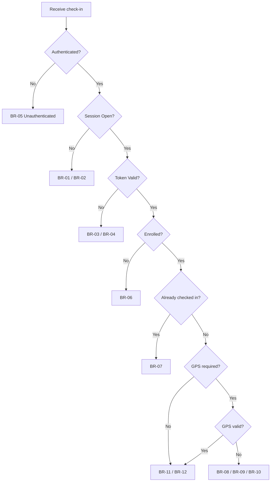

# Attendly — Business Rules

**Product:** Attendly (*Smart Campus Attendance*)  
**Domain:** Digital campus attendance and class-session check-in for universities and schools  
**Related docs:** [02-business-workflow.md](./02-business-workflow.md) · [03-functional-requirements.md](./03-functional-requirements.md) · [05-state-machine.md](./05-state-machine.md) · [06-domain-model.md](./06-domain-model.md) · [08-acceptance-mvp-future.md](./08-acceptance-mvp-future.md)

**Convention:** Each `BR-xx` entry defines **Condition**, **Trigger**, **Outcome**, and **Exception** where applicable. Rules are enforced at check-in, session lifecycle, manual correction, reporting, and policy evaluation. Functional requirements implementing these rules are in [03-functional-requirements.md](./03-functional-requirements.md).

---

## 1. Business Rules Overview

Attendly business rules govern:

| Domain | Rule IDs | Primary enforcement point |
| --- | --- | --- |
| Session attendance window | BR-01, BR-02 | Check-in API; session open/close actions |
| QR session tokens | BR-03, BR-04 | Token validation at check-in submission |
| Student authentication | BR-05 | Check-in URL gate before submission |
| Enrollment eligibility | BR-06 | Roster lookup at check-in |
| Duplicate check-in prevention | BR-07 | Attendance record uniqueness per student per session |
| GPS validation | BR-08, BR-09, BR-10 | Optional policy-driven location check |
| Attendance status assignment | BR-11, BR-12, BR-13 | Successful check-in and session close |
| Manual corrections | BR-14, BR-15, BR-16 | Lecturer and admin roster edits |
| Absence policy | BR-17 | Post-session and rolling calculations |
| Access control and export | BR-18, BR-19 | RBAC on reports and exports |
| Policy resolution | BR-20, BR-21 | Effective policy at session time |
| Audit and data integrity | BR-22, BR-23 | Mutations and sensitive reads |

**MVP defaults** (override via [AttendancePolicy](./06-domain-model.md)):

| Parameter | Default |
| --- | --- |
| QR token TTL | **30 seconds** |
| QR token usage model | **Short-lived multi-use** per class session |
| GPS radius (when enabled) | **100 m** from session room coordinates |
| One successful check-in | **One per student per class session** |

---

## 2. Session Attendance Window Rules

### BR-01 — Reject check-in when session not open

| Field | Value |
| --- | --- |
| **Condition** | Class session attendance window state is `Scheduled`, `Closed`, or `Cancelled` (not `Open`) |
| **Trigger** | Student submits check-in request |
| **Outcome** | Reject check-in; return reason code `SessionNotOpen` or `SessionClosed` as appropriate; persist failed `CheckInAttempt` with structured reason; display Vietnamese message explaining attendance is not open or has ended |
| **Exception** | None for self-service check-in. Lecturer or admin may set attendance manually per BR-14, BR-16 |
| **Trace** | FR-07, FR-08, FR-13; [05-state-machine.md](./05-state-machine.md) §2 |

### BR-02 — Reject new check-in after session closed

| Field | Value |
| --- | --- |
| **Condition** | Class session state is `Closed` |
| **Trigger** | Student submits check-in request after close timestamp |
| **Outcome** | Reject with reason code `SessionClosed`; log failed attempt; instruct student to contact lecturer for manual fallback if legitimate |
| **Exception** | Lecturer or admin may mark `Manual Present`, `Late`, or `Excused` within policy edit window (BR-14, BR-16) |
| **Trace** | FR-08, FR-09 |

---

## 3. QR Session Token Rules

### BR-03 — Reject expired QR token

| Field | Value |
| --- | --- |
| **Condition** | Submitted QR session token state is `Expired` (past **30 s** TTL from issuance) |
| **Trigger** | Student submits check-in with token |
| **Outcome** | Reject with reason code `ExpiredQr`; log attempt; display message instructing student to scan the **current** QR on lecturer screen |
| **Exception** | None. Student must re-scan refreshed QR while session remains `Open` |
| **Trace** | FR-11, FR-12, FR-13; CAP-05 |

**Critical model:** The session QR is **not** globally one-time-use. Multiple enrolled students may use the same `Valid` token within its TTL. Expiry applies to the token, not to individual students.

### BR-04 — Reject token not bound to current session

| Field | Value |
| --- | --- |
| **Condition** | Token is `Invalid`, malformed, revoked, or bound to a different `ClassSession` than the check-in target |
| **Trigger** | Student submits check-in |
| **Outcome** | Reject with reason code equivalent to invalid/wrong-session; log failed attempt; do not create or update `AttendanceRecord` |
| **Exception** | None |
| **Trace** | FR-13 |

---

## 4. Authentication and Enrollment Rules

### BR-05 — Require student login before check-in submission

| Field | Value |
| --- | --- |
| **Condition** | No authenticated student session exists |
| **Trigger** | Student opens check-in URL (from QR scan or deep link) |
| **Outcome** | Redirect to login; after successful authentication, return student to check-in flow with token preserved where technically feasible; reject submission with `Unauthenticated` if login not completed |
| **Exception** | None for self-service check-in |
| **Trace** | FR-15, FR-36 |

### BR-06 — Reject check-in when student not enrolled

| Field | Value |
| --- | --- |
| **Condition** | Submitting student has no active `Enrollment` for the session's `ClassSection` |
| **Trigger** | Student submits check-in |
| **Outcome** | Reject with reason code `NotEnrolled`; log failed attempt; display message to contact academic office if roster is incorrect |
| **Exception** | Academic Admin may correct enrollment data; subsequent check-in allowed only while session is `Open` and other rules pass |
| **Trace** | FR-04, FR-17 |

### BR-07 — One successful check-in per student per session

| Field | Value |
| --- | --- |
| **Condition** | Student already has a successful `AttendanceRecord` (`Present`, `Late`, `Manual Present`, or `Excused` where treated as resolved) for the `ClassSession` |
| **Trigger** | Student submits another check-in for the same session |
| **Outcome** | Reject with reason code `DuplicateCheckIn`; display message that student has already checked in for this session (Vietnamese UI copy); log attempt; do not overwrite existing successful record |
| **Exception** | Lecturer or admin may **change** status via manual correction (BR-14, BR-16)—not via duplicate QR check-in |
| **Trace** | FR-18; CAP-09 |

---

## 5. GPS Validation Rules

GPS rules apply **only** when the effective `AttendancePolicy` for the class section requires GPS (`gpsRequired = true`). Attendly **reduces** remote check-in risk; it does **not** guarantee absolute anti-spoofing on mobile web.

### BR-08 — Reject when GPS required but not provided

| Field | Value |
| --- | --- |
| **Condition** | Policy requires GPS; device does not supply coordinates (permission denied, unavailable, or timeout) |
| **Trigger** | Student submits check-in |
| **Outcome** | Reject self-service check-in with reason code `GpsDisabled` or `GpsRequired`; display guidance to enable location permission; log attempt |
| **Exception** | Lecturer may mark `Manual Present` after in-person verification (BR-14) |
| **Trace** | FR-34, FR-35 |

### BR-09 — Reject or flag when GPS outside allowed radius

| Field | Value |
| --- | --- |
| **Condition** | Policy requires GPS; device coordinates are farther than effective `gpsRadiusMeters` (default **100 m**) from session `Room` location |
| **Trigger** | Student submits check-in |
| **Outcome** | Reject with reason code `OutOfRadius` **or** accept with `Suspicious` flag per institution policy configuration; log distance and validation result; do not store raw coordinates longer than retention policy requires |
| **Exception** | Lecturer or admin may override to `Manual Present` or `Present` after review (BR-14, BR-16) |
| **Trace** | FR-35 |

### BR-10 — Retry or flag low GPS accuracy

| Field | Value |
| --- | --- |
| **Condition** | Policy requires GPS; reported accuracy exceeds configured threshold or readings are inconsistent |
| **Trigger** | Student submits check-in |
| **Outcome** | Prompt student to retry once where UX allows; if still below threshold, reject with `LowAccuracy` or flag attempt as `Suspicious` for lecturer review; log validation metadata |
| **Exception** | Manual fallback after in-person verification (BR-14) |
| **Trace** | FR-35 |

---

## 6. Attendance Status Assignment Rules

### BR-11 — Assign Present on timely successful check-in

| Field | Value |
| --- | --- |
| **Condition** | All prior check-in rules pass; check-in timestamp falls within **present window** relative to session scheduled start per effective policy |
| **Trigger** | Successful check-in processing |
| **Outcome** | Create or update `AttendanceRecord` with status `Present`; set `checkInMethod = QR`; store check-in timestamp; log successful `CheckInAttempt` with outcome `Success` |
| **Exception** | None |
| **Trace** | FR-23 |

### BR-12 — Assign Late on successful check-in after present window

| Field | Value |
| --- | --- |
| **Condition** | All prior check-in rules pass; check-in timestamp is after present window end but before session `Closed` (within late window per policy) |
| **Trigger** | Successful check-in processing |
| **Outcome** | Set `AttendanceRecord` status to `Late`; set `checkInMethod = QR`; store timestamp; log successful attempt |
| **Exception** | Policy may treat late window as absent in strict configurations—effective policy wins (BR-20) |
| **Trace** | FR-23 |

### BR-13 — Assign Absent on session close without successful check-in

| Field | Value |
| --- | --- |
| **Condition** | Session transitions to `Closed`; enrolled student has no successful attendance record and status is not already `Excused` or `Manual Present` |
| **Trigger** | Lecturer close, policy auto-close, or system close job (FR-09) |
| **Outcome** | Create or update `AttendanceRecord` with status `Absent`; do not delete prior rejected attempts |
| **Exception** | Lecturer or admin may later set `Excused`, `Manual Present`, or `Late` per BR-14, BR-16 within edit window |
| **Trace** | FR-09 |

---

## 7. Manual Correction Rules

### BR-14 — Lecturer may correct attendance within scope and edit window

| Field | Value |
| --- | --- |
| **Condition** | Actor is `Lecturer` assigned to the session's class section; correction occurs within `manualEditWindow` from session close per effective policy |
| **Trigger** | Lecturer saves attendance status change on session roster |
| **Outcome** | Update `AttendanceRecord` to allowed status (`Manual Present`, `Excused`, `Late`, `Present`, `Absent` per policy); set `checkInMethod` to `Manual` where applicable; require reason when policy mandates; write `AuditLog` with actor, timestamp, old value, new value, reason |
| **Exception** | Deny if section not assigned to lecturer |
| **Trace** | FR-20, FR-29 |

### BR-15 — Reject or escalate lecturer edit outside edit window

| Field | Value |
| --- | --- |
| **Condition** | Lecturer attempts correction after `manualEditWindow` elapsed |
| **Trigger** | Lecturer saves attendance change |
| **Outcome** | Reject change **or** require Academic Admin approval per `adminApprovalRule` in policy; display message that edit window has expired |
| **Exception** | Academic Admin or Department Admin (within scope) may correct per BR-16 |
| **Trace** | FR-20, FR-21 |

### BR-16 — Admin may correct attendance within authorized scope

| Field | Value |
| --- | --- |
| **Condition** | Actor is `AcademicAdmin` or `DepartmentAdmin` with scope covering the class section; documented reason provided when required |
| **Trigger** | Admin saves attendance correction (including after lecturer window expired) |
| **Outcome** | Update `AttendanceRecord`; set `checkInMethod = Admin Correction` where applicable; write full audit entry; may override BR-15 time limits when institution policy allows |
| **Exception** | Deny if target section outside admin scope |
| **Trace** | FR-21, FR-29 |

---

## 8. Policy and Absence Threshold Rules

### BR-17 — Alert when absence rate exceeds policy threshold

| Field | Value |
| --- | --- |
| **Condition** | Student's unexcused absence rate for a class section exceeds `absenceThresholdPercent` (e.g., **20%**) per effective policy; `Excused` absences excluded when `excusedCountsTowardThreshold = false` |
| **Trigger** | System recalculates after session close or on scheduled job |
| **Outcome** | Generate notification to student, lecturer, and/or academic admin per policy configuration; log alert event |
| **Exception** | None; alert is informational—does not auto-change attendance records |
| **Trace** | FR-26 |

### BR-20 — Resolve effective attendance policy by precedence

| Field | Value |
| --- | --- |
| **Condition** | System needs policy for check-in, close, or edit (present window, late window, GPS, edit window, auto-close) |
| **Trigger** | Check-in validation, session open/close, manual edit authorization |
| **Outcome** | Apply single effective policy: **class section** overrides **course** overrides **faculty** overrides **institution** default; use most specific defined field; fall back to parent level for undefined fields |
| **Exception** | None |
| **Trace** | FR-24, FR-25 |

### BR-21 — Auto-close attendance window per policy

| Field | Value |
| --- | --- |
| **Condition** | Session is `Open`; current time exceeds scheduled start plus late window end (or configured auto-close offset); lecturer has not manually closed |
| **Trigger** | System scheduler or periodic evaluation |
| **Outcome** | Transition session `Open` → `Closed`; apply BR-13 for absent students; invalidate active QR tokens |
| **Exception** | Lecturer may close earlier manually (FR-08) |
| **Trace** | FR-08, FR-09 |

---

## 9. Access Control, Reporting, and Export Rules

### BR-18 — Scope export to actor role

| Field | Value |
| --- | --- |
| **Condition** | User requests attendance CSV export |
| **Trigger** | Export action |
| **Outcome** | `Lecturer`: export only assigned class sections. `AcademicAdmin`: export within authorized institution scope. `DepartmentAdmin`: export within assigned faculty. `Student`: **denied** institution-wide export. Write `AuditLog` for every successful export with actor, timestamp, scope, format |
| **Exception** | None |
| **Trace** | FR-27, FR-30 |

### BR-19 — Deny unauthorized report and export access

| Field | Value |
| --- | --- |
| **Condition** | User lacks permission for requested report scope or export |
| **Trigger** | Access report route or export endpoint |
| **Outcome** | Deny with permission error; do not leak partial data; log privileged denial if institution policy requires |
| **Exception** | `SystemAuditor` read-only views per granted scope (FR-32)—no export unless explicitly permitted |
| **Trace** | FR-27, FR-28, FR-32 |

---

## 10. Audit and Data Integrity Rules

### BR-22 — Audit every attendance mutation

| Field | Value |
| --- | --- |
| **Condition** | Any create, update, or delete of `AttendanceRecord` by human actor or admin correction |
| **Trigger** | Save on roster edit, admin override, or bulk correction |
| **Outcome** | Persist `AuditLog` with actor ID, timestamp, target student and session, previous status, new status, reason, and correlation ID; **100%** coverage required |
| **Exception** | System-assigned `Absent` on close (BR-13) logged as system actor |
| **Trace** | FR-29 |

### BR-23 — Log every check-in attempt with reason code

| Field | Value |
| --- | --- |
| **Condition** | Any check-in submission—success or failure |
| **Trigger** | Check-in API processing |
| **Outcome** | Persist `CheckInAttempt` with outcome code from [03-functional-requirements.md](./03-functional-requirements.md) §12; failed attempts **100%** include structured reason; include token reference, timestamp, optional GPS validation summary |
| **Exception** | None |
| **Trace** | FR-22 |

---

## 11. Rule Interaction Matrix

Check-in evaluation order (short-circuit on first failure unless noted):

| Rule | Blocks self check-in | Manual override path |
| --- | --- | --- |
| BR-01, BR-02 | Yes | BR-14, BR-16 |
| BR-03, BR-04 | Yes | Re-scan QR (BR-03); BR-16 if system error |
| BR-05 | Yes (until login) | N/A |
| BR-06 | Yes | Fix enrollment; BR-16 |
| BR-07 | Yes | BR-14, BR-16 status change |
| BR-08 – BR-10 | Yes | BR-14 manual present |
| BR-11 – BR-12 | — | Success path |
| BR-13 | — | BR-14, BR-16 post-close |

---

## 12. Business Rule Traceability

| Business rule | Functional requirements | Capabilities |
| --- | --- | --- |
| BR-01 – BR-02 | FR-07, FR-08, FR-13 | CAP-04 |
| BR-03 – BR-04 | FR-11, FR-12, FR-13 | CAP-05 |
| BR-05 | FR-15, FR-36 | CAP-07 |
| BR-06 | FR-04, FR-17 | CAP-02, CAP-08 |
| BR-07 | FR-18 | CAP-09 |
| BR-08 – BR-10 | FR-34, FR-35 | CAP-10 |
| BR-11 – BR-13 | FR-09, FR-23 | CAP-13 |
| BR-14 – BR-16 | FR-20, FR-21 | CAP-11 |
| BR-17 | FR-26 | CAP-13 |
| BR-18 – BR-19 | FR-27, FR-28, FR-32 | CAP-14, CAP-15 |
| BR-20 – BR-21 | FR-24, FR-25, FR-08 | CAP-13 |
| BR-22 – BR-23 | FR-22, FR-29, FR-30 | CAP-16 |

State names and transitions: [05-state-machine.md](./05-state-machine.md). Entity definitions: [06-domain-model.md](./06-domain-model.md).

---

## 13. Future consideration

Business rules deferred beyond MVP:

- **BR-F01** — Per-student one-time challenge token after QR scan (additional layer after shared session token)
- **BR-F02** — Device binding: reject check-in from unrecognized device fingerprint
- **BR-F03** — MFA requirement for high-risk sessions or repeat `Suspicious` attempts
- **BR-F04** — Random mid-session reverification prompt for subset of enrolled students
- **BR-F05** — Cross-session fraud scoring (shared IP, velocity, impossible travel)
- **BR-F06** — Admin approval workflow with ticket ID for post-window corrections
- **BR-F07** — WiFi BSSID proximity check where browser APIs permit

Phasing: [08-acceptance-mvp-future.md](./08-acceptance-mvp-future.md).
