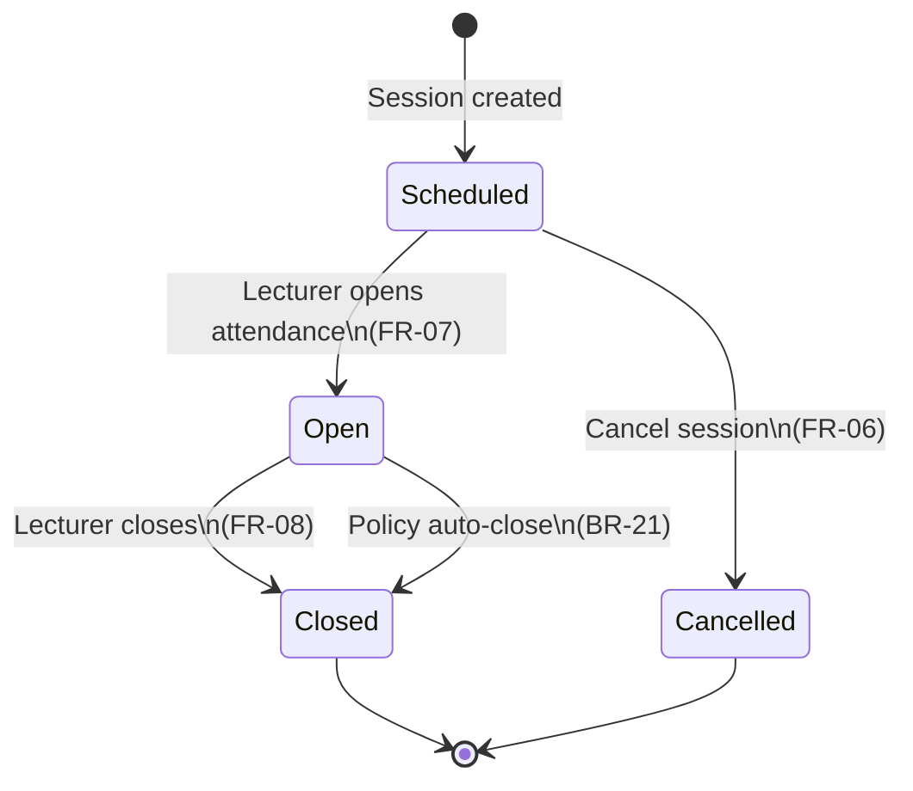
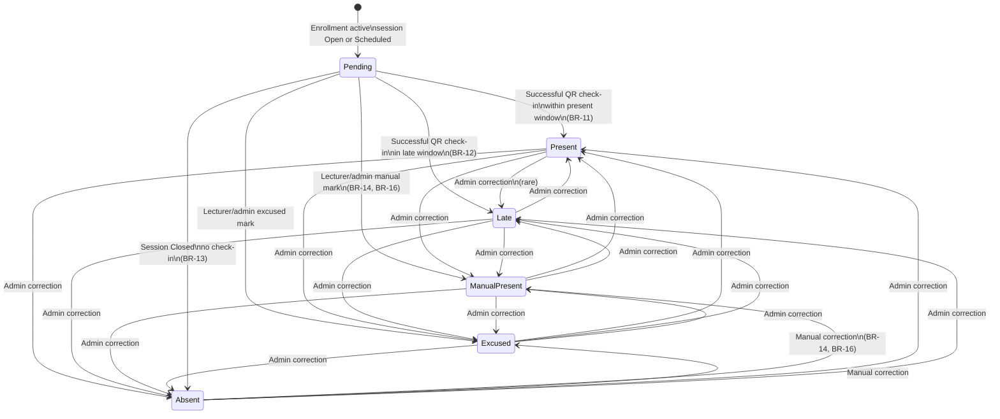
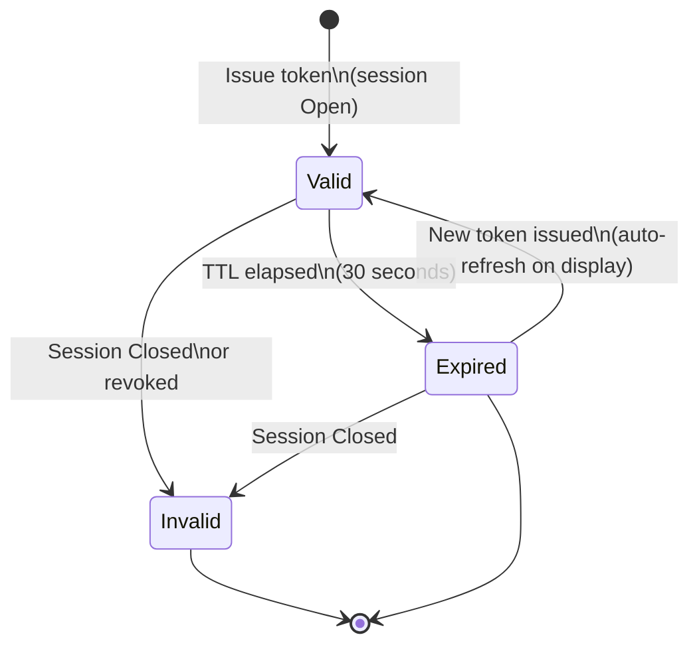
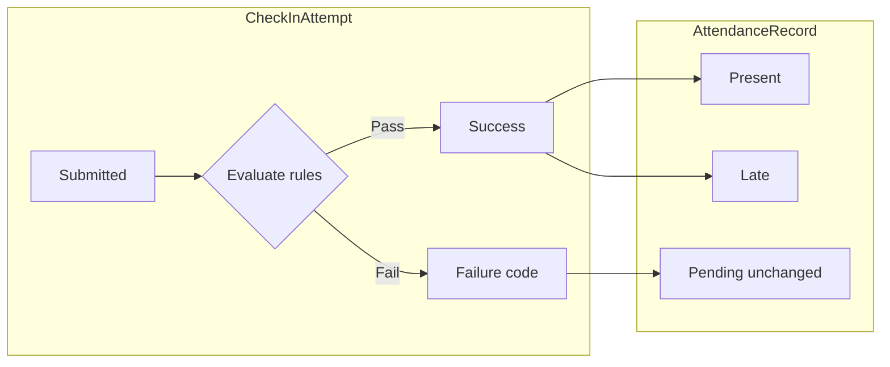
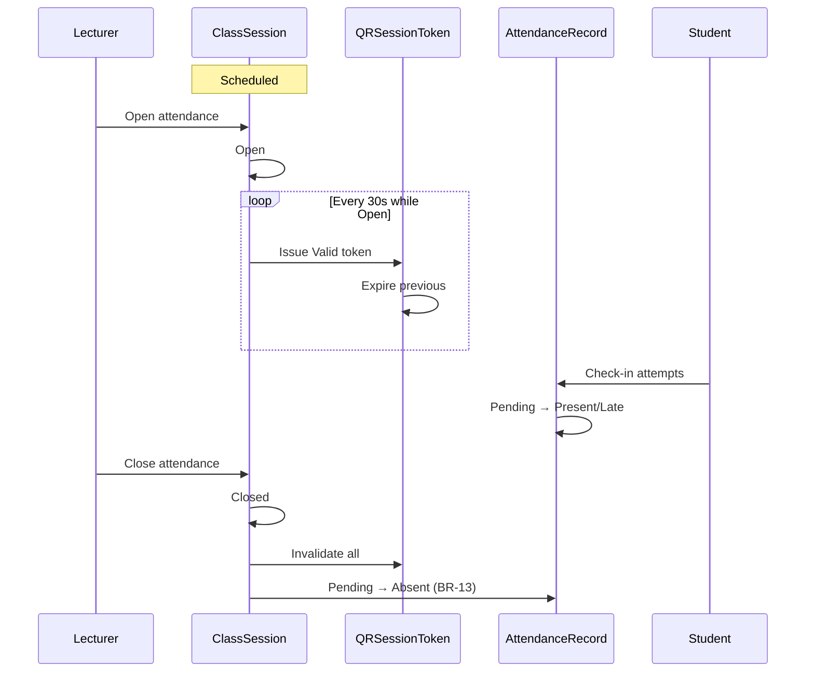

# Attendly — State Machine

**Product:** Attendly (*Smart Campus Attendance*)  
**Domain:** Digital campus attendance and class-session check-in for universities and schools  
**Related docs:** [02-business-workflow.md](./02-business-workflow.md) · [03-functional-requirements.md](./03-functional-requirements.md) · [04-business-rules.md](./04-business-rules.md) · [06-domain-model.md](./06-domain-model.md) · [prompt.md](./prompt.md)

**Convention:** State names in this document are **canonical** for BRD, API, and UI specs. Business rules governing transitions are in [04-business-rules.md](./04-business-rules.md). Entity ownership: [06-domain-model.md](./06-domain-model.md).

---

## 1. State Machine Overview

Attendly defines four coordinated state domains:

| Domain | Entity | States | Lifecycle driver |
| --- | --- | --- | --- |
| Session attendance window | `ClassSession` | `Scheduled`, `Open`, `Closed`, `Cancelled` | Lecturer and policy auto-close |
| Per-student attendance | `AttendanceRecord` | `Pending`, `Present`, `Late`, `Absent`, `Excused`, `Manual Present` | Check-in, close, manual edit |
| Session QR token | `QRSessionToken` | `Valid`, `Expired`, `Invalid` | 30 s TTL and session binding |
| Check-in attempt | `CheckInAttempt` | Outcome codes (not roster state) | Each submission |

**Separation of concerns:**

- **Session state** controls whether check-in is accepted (BR-01, BR-02).
- **QR token state** controls whether a specific scanned code is acceptable (BR-03, BR-04).
- **Attendance record state** is the official roster outcome per student per session.
- **Attempt outcome** is an immutable log entry per submission—including failures that do not change roster state.

---

## 2. Class Session Attendance Window

### 2.1 States

| State | Meaning | Check-in accepted | QR issued |
| --- | --- | --- | --- |
| `Scheduled` | Session exists on timetable; attendance not yet opened | No (`SessionNotOpen`) | No |
| `Open` | Lecturer opened attendance; rotating QR active | Yes (subject to other rules) | Yes (rotating) |
| `Closed` | Check-in window ended; roster finalized except policy edits | No (`SessionClosed`) | No (tokens invalidated) |
| `Cancelled` | Session will not run or attendance abandoned | No | No |

### 2.2 State diagram

### 2.3 Transitions

| From | To | Trigger | Actor | Side effects |
| --- | --- | --- | --- | --- |
| — | `Scheduled` | Session created from timetable or manual entry | Academic Admin, System | Set `scheduledStartAt`, room, section link |
| `Scheduled` | `Open` | Open attendance action | Lecturer | Record `openedAt`, `openedBy`; start QR rotation (FR-11) |
| `Scheduled` | `Cancelled` | Cancel session | Academic Admin, Lecturer (per policy) | No attendance processing |
| `Open` | `Closed` | Close attendance action | Lecturer | Record `closedAt`, `closedBy`; stop QR; run BR-13 auto-absent |
| `Open` | `Closed` | Late window elapsed | System (BR-21) | Same as manual close |
| `Closed` | — | — | — | Terminal for check-in; manual edits per BR-14–BR-16 |
| `Cancelled` | — | — | — | Terminal |

### 2.4 Invalid transitions (rejected)

| Attempted transition | Rejection reason |
| --- | --- |
| `Open` → `Scheduled` | Cannot revert to scheduled after open |
| `Closed` → `Open` | MVP does not support reopening; use manual corrections |
| `Cancelled` → `Open` | Cancelled sessions cannot open attendance |
| `Closed` → `Cancelled` | Terminal state |

### 2.5 Attendance window timing

The **attendance window** is the interval during which session state is `Open`:

- **Opens** when lecturer triggers open (may be constrained by policy `checkInOpeningOffset` before scheduled start).
- **Closes** on lecturer action or policy auto-close when late window ends (BR-21).
- **Present vs Late** for successful check-ins is determined by check-in timestamp relative to scheduled start and policy windows—not by session state alone (BR-11, BR-12).

---

## 3. Attendance Record (Per Student Per Session)

### 3.1 States

| State | Meaning | Counts as attended | Typical method |
| --- | --- | --- | --- |
| `Pending` | Enrolled; no successful check-in while session `Open` | No | — |
| `Present` | Successful check-in within present window | Yes | `QR`, `Manual`, `Admin Correction` |
| `Late` | Successful check-in after present window, before close | Yes (may affect grade policy externally) | `QR`, `Manual`, `Admin Correction` |
| `Absent` | Session closed without successful check-in | No | System (BR-13) |
| `Excused` | Documented excused absence | Policy-dependent | `Manual`, `Admin Correction` |
| `Manual Present` | Lecturer/admin verified presence without QR success | Yes | `Manual`, `Admin Correction` |

**Note:** `Rejected` is **not** a persistent roster state. Failed check-ins are stored on `CheckInAttempt` only. The roster remains `Pending` until success, close, or manual override.

### 3.2 State diagram (per enrolled student)

*Diagram uses `ManualPresent` as single node for `Manual Present` status.*

### 3.3 Transitions

| From | To | Trigger | Conditions |
| --- | --- | --- | --- |
| — | `Pending` | Session `Open` or student enrolled before open | Implicit default for enrolled students |
| `Pending` | `Present` | Successful check-in | BR-11; session `Open` |
| `Pending` | `Late` | Successful check-in | BR-12; session `Open` |
| `Pending` | `Manual Present` | Manual save | BR-14 or BR-16; verifier confirms identity |
| `Pending` | `Excused` | Manual save | BR-14 or BR-16; reason documented |
| `Pending` | `Absent` | Session close | BR-13; no prior success |
| `Absent` | `Manual Present`, `Excused`, `Present`, `Late` | Manual correction | Within edit window or admin override |
| Any resolved | Any allowed | Admin/lecturer correction | BR-14–BR-16; audit logged |

### 3.4 Uniqueness invariant

At most **one** `AttendanceRecord` per (`studentId`, `classSessionId`) pair. Duplicate successful QR check-ins are blocked at attempt layer (BR-07) before state change.

---

## 4. QR Session Token

### 4.1 States

| State | Meaning | Check-in with token |
| --- | --- | --- |
| `Valid` | Issued for a specific `ClassSession`, within **30 s** TTL | Accepted (subject to session `Open` and other rules) |
| `Expired` | Past TTL; superseded by refreshed token | Rejected (`ExpiredQr`) |
| `Invalid` | Wrong session, revoked, malformed, or session not `Open` | Rejected |

### 4.2 Token lifecycle

### 4.3 Multi-use semantics

While `Valid`:

- **Multiple** enrolled students may submit check-in using the **same** token.
- Each student is still limited to **one** successful attendance outcome (BR-07).
- Lecturer display auto-refreshes QR before expiry (FR-11, FR-14).

When session becomes `Closed`, all tokens for that session transition to `Invalid` regardless of TTL.

### 4.4 Token rotation timeline (example)

| Time | Token state | Student action |
| --- | --- | --- |
| T+0 s | `Valid` (token A) | Students scan and submit |
| T+25 s | `Valid` (token A) | Late arrivers still use token A |
| T+30 s | `Expired` (token A) | Submissions with A rejected |
| T+30 s | `Valid` (token B) | Display shows new QR; students scan B |

---

## 5. Check-In Attempt Outcomes

Attempt outcomes are **not** roster states. Each submission creates one `CheckInAttempt` with an outcome code.

### 5.1 Outcome catalog

| Outcome | Meaning | Roster impact | Related rule |
| --- | --- | --- | --- |
| `Success` | Check-in accepted | → `Present` or `Late` | BR-11, BR-12 |
| `ExpiredQr` | Token past TTL | None (`Pending` unchanged) | BR-03 |
| `SessionNotOpen` | Session `Scheduled` | None | BR-01 |
| `SessionClosed` | Session `Closed` | None | BR-02 |
| `NotEnrolled` | Not on section roster | None | BR-06 |
| `DuplicateCheckIn` | Already has success record | None | BR-07 |
| `GpsRequired` | GPS needed but missing | None | BR-08 |
| `GpsDisabled` | Permission denied | None | BR-08 |
| `OutOfRadius` | Outside allowed radius | None (or review queue) | BR-09 |
| `LowAccuracy` | Accuracy below threshold | None | BR-10 |
| `Unauthenticated` | No login | None | BR-05 |
| `Suspicious` | Flagged for review | None until manual resolution | BR-09, BR-10 |

### 5.2 Attempt processing flow

### 5.3 Review labels

| Label | Usage |
| --- | --- |
| `Rejected Attempt` | UI grouping for failed attempts with reason codes |
| `Suspicious` | Attempt or flag requiring lecturer review before manual resolution |

These labels appear on lecturer dashboard (FR-19) and audit views; they do not replace `AttendanceRecord` status.

---

## 6. Composite Session Lifecycle

End-to-end state coordination for one class session:

---

## 7. Policy-Driven Time Windows

Session and attendance states interact with **effective policy** (BR-20) at runtime:

| Policy field | Affects state transition |
| --- | --- |
| `checkInOpeningOffset` | Earliest time `Scheduled` → `Open` allowed |
| `presentWindowMinutes` | `Pending` → `Present` vs `Late` boundary |
| `lateWindowMinutes` | Latest successful QR check-in before implicit close pressure |
| `autoCloseEnabled` | Triggers `Open` → `Closed` (BR-21) |
| `manualEditWindowHours` | Whether BR-14 or BR-15 applies after `Closed` |

Default MVP values are institution-configurable; see [06-domain-model.md](./06-domain-model.md) `AttendancePolicy`.

---

## 8. UI State Mapping

Canonical states map to user-visible badges (Vietnamese copy in UI specs):

| Entity state | Lecturer badge | Student message context |
| --- | --- | --- |
| `Scheduled` | Chưa mở điểm danh | Attendance not open |
| `Open` | Đang điểm danh | Check-in available |
| `Closed` | Đã đóng | Check-in ended |
| `Cancelled` | Đã hủy | Session cancelled |
| `Pending` | Chưa điểm danh | — |
| `Present` | Có mặt | Check-in success |
| `Late` | Đi trễ | Check-in success (late) |
| `Absent` | Vắng | — |
| `Excused` | Vắng có phép | — |
| `Manual Present` | Điểm danh thủ công | Recorded by lecturer |

---

## 9. Invariants and Edge Cases

| Invariant | Description |
| --- | --- |
| INV-01 | Check-in API accepts submissions only when `ClassSession.state = Open` |
| INV-02 | At most one successful attendance outcome per student per session |
| INV-03 | QR token references exactly one `classSessionId` |
| INV-04 | `Expired` token cannot transition to `Valid`—a **new** token record is issued |
| INV-05 | `Cancelled` sessions never issue `Valid` tokens |
| INV-06 | BR-13 runs exactly once per student per session on transition to `Closed` (idempotent) |

| Edge case | Behavior |
| --- | --- |
| Student checks in at T+29 s with token A; token expires at T+30 s | Check-in succeeds if server receives valid request before processing expiry |
| Lecturer closes while students in flight | In-flight requests evaluated against state at processing time; late arrivals rejected or manual fallback |
| Enrollment removed mid-session | Student fails BR-06 on next attempt; existing success record unchanged unless admin corrects |
| Session `Open` without GPS-required policy | BR-08–BR-10 skipped; BR-11/BR-12 apply directly |
| Manual mark while session `Open` | Allowed; sets `Manual Present` without QR success |

---

## 10. Future consideration

State machine extensions deferred beyond MVP:

- **Reopen session** — `Closed` → `Open` with audit and time limit (currently invalid)
- **Paused** session state — freeze check-in without closing (e.g., mid-class break)
- **Per-student challenge token** state — `Issued`, `Consumed`, `Expired` separate from session QR
- **Bulk session cancel** — batch `Scheduled` → `Cancelled` for academic calendar events
- **Attendance dispute** workflow state — `UnderReview`, `Resolved` on correction tickets

Phasing: [08-acceptance-mvp-future.md](./08-acceptance-mvp-future.md).
