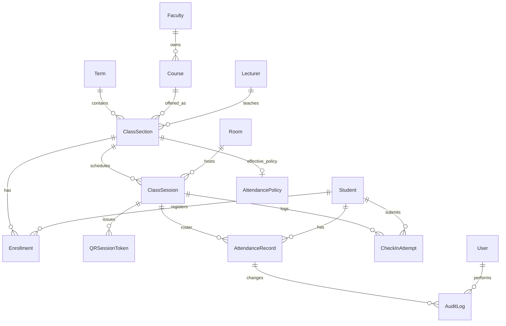

# Attendly — Domain Model

**Product:** Attendly (*Smart Campus Attendance*)  
**Domain:** Digital campus attendance and class-session check-in for universities and schools  
**Related docs:** [03-functional-requirements.md](./03-functional-requirements.md) · [04-business-rules.md](./04-business-rules.md) · [05-state-machine.md](./05-state-machine.md) · [02-business-workflow.md](./02-business-workflow.md)

**Convention:** Entity names and relationships in this document are canonical for data modeling, API design, and persistence. State enums reference [05-state-machine.md](./05-state-machine.md). Business rule enforcement references [04-business-rules.md](./04-business-rules.md).

---

## 1. Domain Model Overview

Attendly's domain centers on **class session attendance**: linking institutional structure (terms, courses, sections), enrolled students, scheduled sessions, QR-mediated check-in, and auditable attendance outcomes.

### 1.1 Bounded context

| Context | Core entities | Purpose |
| --- | --- | --- |
| Identity & access | `User`, role assignments | Authentication and RBAC |
| Academic structure | `Term`, `Course`, `ClassSection`, `Room`, `Faculty` | Organizational hierarchy |
| Enrollment | `Enrollment`, `Student` | Who may check in per section |
| Scheduling | `Timetable`, `ClassSession` | When and where sessions occur |
| Attendance operations | `QRSessionToken`, `CheckInAttempt`, `AttendanceRecord` | Check-in and roster outcomes |
| Policy & compliance | `AttendancePolicy`, `AuditLog` | Rules, alerts, traceability |

### 1.2 Entity relationship diagram

---

## 2. Identity and Access Entities

### 2.1 User

Represents any person with system access. A user may hold one or more application roles.

| Attribute | Type | Required | Description |
| --- | --- | --- | --- |
| `id` | UUID | Yes | Primary key |
| `email` | string | Yes | Login identifier (unique) |
| `displayName` | string | Yes | Full name for UI |
| `studentId` | string | No | External student code (when role includes Student) |
| `lecturerId` | string | No | External staff code (when role includes Lecturer) |
| `facultyId` | UUID | No | Department scope for Department Admin |
| `isActive` | boolean | Yes | Account enabled flag |
| `createdAt` | datetime | Yes | Record creation |
| `updatedAt` | datetime | Yes | Last update |

**Roles** (from [product-meta.json](../product-meta.json)): `Student`, `Lecturer`, `DepartmentAdmin`, `AcademicAdmin`, `ITAdmin`, `SystemAuditor`.

| Relationship | Cardinality | Notes |
| --- | --- | --- |
| User → Student profile | 0..1 | Student role requires link to `Student` or embedded student fields |
| User → Lecturer profile | 0..1 | Lecturer role requires assignment to sections |
| User → AuditLog | 1..* | Actor on mutations and exports |

### 2.2 Student

Academic person who enrolls in class sections and performs check-in.

| Attribute | Type | Required | Description |
| --- | --- | --- | --- |
| `id` | UUID | Yes | Primary key |
| `studentCode` | string | Yes | Institution student ID (unique) |
| `fullName` | string | Yes | Legal or preferred name |
| `email` | string | No | Contact; may match User.email |
| `userId` | UUID | No | Link to `User` for login |
| `isActive` | boolean | Yes | Eligible for enrollment |

| Relationship | Cardinality | Notes |
| --- | --- | --- |
| Student → Enrollment | 1..* | Per section per term |
| Student → AttendanceRecord | 0..* | Per session attended or marked |
| Student → CheckInAttempt | 0..* | All submission history |

### 2.3 Lecturer

Instructor assigned to teach class sections.

| Attribute | Type | Required | Description |
| --- | --- | --- | --- |
| `id` | UUID | Yes | Primary key |
| `staffCode` | string | Yes | Institution staff ID |
| `fullName` | string | Yes | Display name |
| `email` | string | No | Contact |
| `userId` | UUID | No | Link to `User` for login |
| `facultyId` | UUID | No | Home faculty |

| Relationship | Cardinality | Notes |
| --- | --- | --- |
| Lecturer → ClassSection | 1..* | Primary instructor per section (MVP: single lecturer) |

---

## 3. Academic Structure Entities

### 3.1 Faculty

Organizational unit (khoa/ngành) for department-scoped administration.

| Attribute | Type | Required | Description |
| --- | --- | --- | --- |
| `id` | UUID | Yes | Primary key |
| `code` | string | Yes | Short code (e.g., `CNTT`) |
| `name` | string | Yes | Faculty name |
| `isActive` | boolean | Yes | Active flag |

| Relationship | Cardinality | Notes |
| --- | --- | --- |
| Faculty → Course | 1..* | Courses belong to faculty |
| Faculty → AttendancePolicy | 0..1 | Faculty-level policy override |

### 3.2 Term

Academic term or semester.

| Attribute | Type | Required | Description |
| --- | --- | --- | --- |
| `id` | UUID | Yes | Primary key |
| `code` | string | Yes | e.g., `2025-1` |
| `name` | string | Yes | Display name |
| `startDate` | date | Yes | Term start |
| `endDate` | date | Yes | Term end |
| `isActive` | boolean | Yes | Current term flag |

| Relationship | Cardinality | Notes |
| --- | --- | --- |
| Term → ClassSection | 1..* | Sections offered in term |

### 3.3 Course

Subject definition (môn học).

| Attribute | Type | Required | Description |
| --- | --- | --- | --- |
| `id` | UUID | Yes | Primary key |
| `code` | string | Yes | Subject code (e.g., `SE101`) |
| `name` | string | Yes | Subject title |
| `facultyId` | UUID | Yes | Owning faculty |
| `creditUnits` | number | No | Optional credit value |
| `isActive` | boolean | Yes | Catalog active flag |

| Relationship | Cardinality | Notes |
| --- | --- | --- |
| Course → ClassSection | 1..* | Offerings per term |
| Course → AttendancePolicy | 0..1 | Course-level policy override |

### 3.4 ClassSection

Lớp học phần — the primary enrollment and attendance scope.

| Attribute | Type | Required | Description |
| --- | --- | --- | --- |
| `id` | UUID | Yes | Primary key |
| `sectionCode` | string | Yes | Unique within term (e.g., `SE101-01`) |
| `termId` | UUID | Yes | Parent term |
| `courseId` | UUID | Yes | Parent course |
| `lecturerId` | UUID | Yes | Assigned lecturer |
| `defaultRoomId` | UUID | No | Default meeting room |
| `capacity` | number | No | Max enrollment |
| `scheduleTemplate` | string | No | Timetable pattern descriptor |
| `isActive` | boolean | Yes | Section active flag |

| Relationship | Cardinality | Notes |
| --- | --- | --- |
| ClassSection → Enrollment | 1..* | Roster |
| ClassSection → ClassSession | 1..* | Scheduled meetings |
| ClassSection → AttendancePolicy | 0..1 | Section-level policy (highest precedence) |

**Invariant:** A student checks in against a `ClassSession`, which resolves to exactly one `ClassSection` for enrollment validation (BR-06).

### 3.5 Room

Physical or virtual meeting location with optional GPS anchor.

| Attribute | Type | Required | Description |
| --- | --- | --- | --- |
| `id` | UUID | Yes | Primary key |
| `code` | string | Yes | Room code (e.g., `A101`) |
| `building` | string | No | Building name |
| `name` | string | Yes | Display label |
| `latitude` | decimal | No | GPS anchor (required when GPS policy enabled) |
| `longitude` | decimal | No | GPS anchor |
| `isActive` | boolean | Yes | Available for scheduling |

| Relationship | Cardinality | Notes |
| --- | --- | --- |
| Room → ClassSession | 0..* | Session may override section default room |

---

## 4. Enrollment and Scheduling Entities

### 4.1 Enrollment

Links a student to a class section for a term offering.

| Attribute | Type | Required | Description |
| --- | --- | --- | --- |
| `id` | UUID | Yes | Primary key |
| `classSectionId` | UUID | Yes | Section reference |
| `studentId` | UUID | Yes | Student reference |
| `status` | enum | Yes | `Active`, `Dropped`, `Completed` |
| `enrolledAt` | datetime | Yes | Enrollment effective date |
| `droppedAt` | datetime | No | When status became `Dropped` |

| Relationship | Cardinality | Notes |
| --- | --- | --- |
| Enrollment uniqueness | — | Unique (`classSectionId`, `studentId`) |

**Business rule:** Only `Active` enrollment satisfies BR-06 at check-in.

### 4.2 Timetable

Optional template describing recurring session pattern for a class section (MVP may embed in `ClassSection.scheduleTemplate`).

| Attribute | Type | Required | Description |
| --- | --- | --- | --- |
| `id` | UUID | Yes | Primary key |
| `classSectionId` | UUID | Yes | Parent section |
| `dayOfWeek` | enum | Yes | e.g., `Monday` |
| `startTime` | time | Yes | Recurring start |
| `durationMinutes` | number | Yes | Session length |
| `roomId` | UUID | No | Default room for generated sessions |

| Relationship | Cardinality | Notes |
| --- | --- | --- |
| Timetable → ClassSession | 1..* | Generated sessions (FR-06) |

### 4.3 ClassSession

A single scheduled occurrence of a class section — the unit of attendance operations.

| Attribute | Type | Required | Description |
| --- | --- | --- | --- |
| `id` | UUID | Yes | Primary key |
| `classSectionId` | UUID | Yes | Parent section |
| `roomId` | UUID | No | Session room (overrides section default) |
| `scheduledStartAt` | datetime | Yes | Planned start |
| `scheduledEndAt` | datetime | Yes | Planned end |
| `state` | enum | Yes | `Scheduled`, `Open`, `Closed`, `Cancelled` |
| `openedAt` | datetime | No | When attendance opened |
| `openedByUserId` | UUID | No | Lecturer who opened |
| `closedAt` | datetime | No | When attendance closed |
| `closedByUserId` | UUID | No | Actor who closed (or system) |
| `topic` | string | No | Optional session label |

| Relationship | Cardinality | Notes |
| --- | --- | --- |
| ClassSession → QRSessionToken | 0..* | Issued while `Open` |
| ClassSession → AttendanceRecord | 0..* | One per enrolled student (materialized on close or check-in) |
| ClassSession → CheckInAttempt | 0..* | All submissions |

**State machine:** [05-state-machine.md](./05-state-machine.md) §2.

---

## 5. Attendance Operations Entities

### 5.1 QRSessionToken

Short-lived multi-use token bound to one class session.

| Attribute | Type | Required | Description |
| --- | --- | --- | --- |
| `id` | UUID | Yes | Primary key |
| `classSessionId` | UUID | Yes | Bound session |
| `tokenHash` | string | Yes | Opaque token or hash (never store raw in logs) |
| `state` | enum | Yes | `Valid`, `Expired`, `Invalid` |
| `issuedAt` | datetime | Yes | Issuance time |
| `expiresAt` | datetime | Yes | `issuedAt + 30 seconds` (MVP default) |
| `sequenceNumber` | number | No | Rotation index within session |

| Relationship | Cardinality | Notes |
| --- | --- | --- |
| QRSessionToken → CheckInAttempt | 0..* | Referenced on each submission |

**Critical model:** Token is multi-use within TTL; one-time rule applies per student attendance, not per token. See BR-03, BR-07.

### 5.2 CheckInAttempt

Immutable log of each check-in submission (success or failure).

| Attribute | Type | Required | Description |
| --- | --- | --- | --- |
| `id` | UUID | Yes | Primary key |
| `classSessionId` | UUID | Yes | Target session |
| `studentId` | UUID | Yes | Submitting student |
| `qrTokenId` | UUID | No | Token used |
| `submittedAt` | datetime | Yes | Server receipt time |
| `outcome` | enum | Yes | See [03-functional-requirements.md](./03-functional-requirements.md) §12 |
| `clientTimestamp` | datetime | No | Device-reported time |
| `gpsLatitude` | decimal | No | Captured at check-in only if policy requires |
| `gpsLongitude` | decimal | No | Captured at check-in only |
| `gpsAccuracyMeters` | number | No | Device accuracy |
| `gpsValidationResult` | enum | No | `Pass`, `Fail`, `Skipped`, `Suspicious` |
| `distanceFromRoomMeters` | number | No | Computed distance |
| `deviceUserAgent` | string | No | Minimal browser metadata |
| `ipAddress` | string | No | If institution policy permits |
| `rejectionReason` | string | No | Human-readable detail |

**Retention:** Raw GPS coordinates minimized per privacy policy; processed validation results may persist longer for disputes.

### 5.3 AttendanceRecord

Official per-student per-session attendance outcome.

| Attribute | Type | Required | Description |
| --- | --- | --- | --- |
| `id` | UUID | Yes | Primary key |
| `classSessionId` | UUID | Yes | Session reference |
| `classSectionId` | UUID | Yes | Denormalized for reporting |
| `studentId` | UUID | Yes | Student reference |
| `status` | enum | Yes | `Pending`, `Present`, `Late`, `Absent`, `Excused`, `Manual Present` |
| `checkInMethod` | enum | No | `QR`, `Manual`, `Admin Correction` |
| `checkInAt` | datetime | No | Successful check-in or manual mark time |
| `lastModifiedAt` | datetime | Yes | Last status change |
| `lastModifiedByUserId` | UUID | No | Last human editor |
| `modificationReason` | string | No | Required when policy mandates |

| Relationship | Cardinality | Notes |
| --- | --- | --- |
| Uniqueness | — | Unique (`classSessionId`, `studentId`) |
| AttendanceRecord → CheckInAttempt | 0..1 | Link to successful attempt when via QR |

**State machine:** [05-state-machine.md](./05-state-machine.md) §3.

---

## 6. Policy and Compliance Entities

### 6.1 AttendancePolicy

Configurable rules at institution, faculty, course, or class section level.

| Attribute | Type | Required | Description |
| --- | --- | --- | --- |
| `id` | UUID | Yes | Primary key |
| `scopeType` | enum | Yes | `Institution`, `Faculty`, `Course`, `ClassSection` |
| `scopeId` | UUID | No | Null for institution-wide |
| `checkInOpeningOffsetMinutes` | number | No | Minutes before scheduled start lecturer may open |
| `presentWindowMinutes` | number | Yes | Minutes after start counted as `Present` |
| `lateWindowMinutes` | number | Yes | Minutes after present window still accepting `Late` |
| `autoCloseEnabled` | boolean | Yes | Enable BR-21 auto-close |
| `absenceThresholdPercent` | number | No | e.g., 20 for BR-17 |
| `excusedCountsTowardThreshold` | boolean | Yes | Whether `Excused` affects threshold |
| `manualEditWindowHours` | number | Yes | Hours after close lecturer may edit |
| `adminApprovalRequired` | boolean | No | Post-window edits need admin |
| `gpsRequired` | boolean | Yes | Enable BR-08–BR-10 |
| `gpsRadiusMeters` | number | No | Default **100** when GPS enabled |
| `gpsMinAccuracyMeters` | number | No | Minimum acceptable accuracy |
| `effectiveFrom` | date | No | Policy start date |
| `effectiveTo` | date | No | Policy end date |

**Resolution:** BR-20 — most specific scope wins per field.

### 6.2 AuditLog

Append-only record of sensitive actions.

| Attribute | Type | Required | Description |
| --- | --- | --- | --- |
| `id` | UUID | Yes | Primary key |
| `timestamp` | datetime | Yes | Event time |
| `actorUserId` | UUID | No | Null for system actions |
| `actionType` | enum | Yes | `AttendanceUpdate`, `Export`, `SessionOpen`, `SessionClose`, `PolicyChange`, etc. |
| `targetType` | string | Yes | Entity type (e.g., `AttendanceRecord`) |
| `targetId` | UUID | Yes | Entity ID |
| `previousValue` | JSON | No | Snapshot before change |
| `newValue` | JSON | No | Snapshot after change |
| `reason` | string | No | Actor-provided reason |
| `correlationId` | UUID | No | Request trace ID |
| `ipAddress` | string | No | If policy permits |

| Relationship | Cardinality | Notes |
| --- | --- | --- |
| AuditLog → User | *..1 | Actor |

**Coverage:** BR-22, BR-23, FR-29, FR-30 require 100% mutation and export logging.

---

## 7. Aggregate Boundaries

| Aggregate root | Child entities | Consistency boundary |
| --- | --- | --- |
| `ClassSection` | `Enrollment`, section `AttendancePolicy` | Roster changes affect future check-in eligibility |
| `ClassSession` | `QRSessionToken`, `AttendanceRecord`, `CheckInAttempt` | Session open/close and check-in atomic per student |
| `Student` | Linked `User`, personal attendance view | Student identity stable across sections |
| `AttendancePolicy` | — | Resolved read-only snapshot at check-in time recommended |

**Check-in transaction** (conceptual):

1. Load `ClassSession` (must be `Open`).
2. Validate `QRSessionToken` (`Valid`).
3. Verify `Enrollment` (`Active`).
4. Verify no existing successful `AttendanceRecord` (BR-07).
5. Evaluate `AttendancePolicy` (GPS, windows).
6. Insert `CheckInAttempt`.
7. Upsert `AttendanceRecord` on success.
8. Emit realtime dashboard event.

---

## 8. Key Queries and Read Models

| Query | Primary entities | Consumer |
| --- | --- | --- |
| Lecturer today's sessions | `ClassSession`, `ClassSection` | Lecturer dashboard (FR-10) |
| Live session roster | `AttendanceRecord`, `Enrollment`, `CheckInAttempt` | Realtime dashboard (FR-19) |
| Student personal history | `AttendanceRecord`, `ClassSession` | Student (FR-37) |
| Section attendance report | `AttendanceRecord`, `ClassSession`, `Student` | Lecturer, Admin (FR-28) |
| Audit search | `AuditLog`, `CheckInAttempt` | System Auditor (FR-32) |
| Effective policy | `AttendancePolicy`, `ClassSection` | Check-in engine (FR-25) |

---

## 9. Data Volume and MVP Assumptions

| Entity | MVP scale assumption |
| --- | --- |
| `ClassSection` | Tens to hundreds per term |
| `Enrollment` | Up to ~60 students per section typical |
| `ClassSession` | ~15–30 sessions per section per term |
| `CheckInAttempt` | 1–3 per student per session (includes retries) |
| `QRSessionToken` | ~120 tokens per hour per open session (30 s rotation) |

Concurrent check-in peak: multiple sections × enrolled students within 5-minute window ([product-meta.json](../product-meta.json) `mvpScale`).

---

## 10. Entity-to-Requirement Traceability

| Entity | Functional requirements | Business rules |
| --- | --- | --- |
| `Term`, `Course`, `ClassSection` | FR-01 – FR-03 | — |
| `Enrollment` | FR-04 | BR-06 |
| `Room` | FR-05 | BR-09 |
| `ClassSession` | FR-06 – FR-10 | BR-01, BR-02, BR-13, BR-21 |
| `QRSessionToken` | FR-11 – FR-14 | BR-03, BR-04 |
| `CheckInAttempt` | FR-22 | BR-23 |
| `AttendanceRecord` | FR-09, FR-20 – FR-23 | BR-07, BR-11 – BR-16 |
| `AttendancePolicy` | FR-24 – FR-26 | BR-17, BR-20 |
| `AuditLog` | FR-29, FR-30 | BR-22 |
| `User` / roles | FR-31 – FR-33, FR-36 | BR-18, BR-19 |

---

## 11. Future consideration

Domain extensions deferred beyond MVP:

- **Organization** — multi-campus `Campus` entity above `Faculty`
- **Delegate lecturer** — substitute instructor with time-bound assignment
- **Attendance dispute** — `DisputeCase` entity linking attempts, records, and resolution
- **Device fingerprint** — `TrustedDevice` for future device binding
- **Challenge token** — `StudentCheckInChallenge` separate from `QRSessionToken`
- **Webhook subscription** — `IntegrationEndpoint` for academic system sync
- **Soft-delete with archival** — term rollover retention partitions

Phasing: [08-acceptance-mvp-future.md](./08-acceptance-mvp-future.md).
