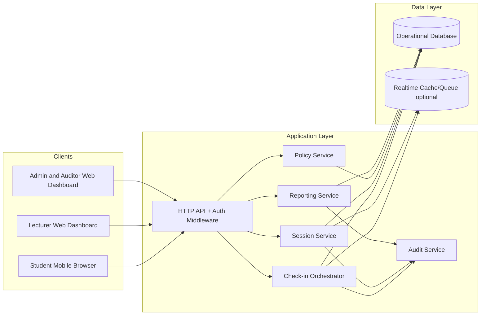
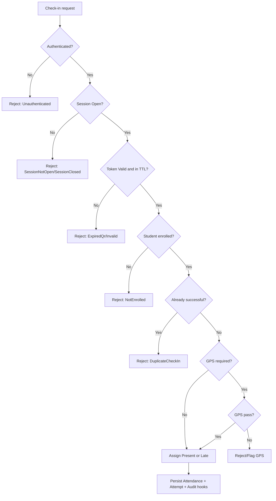

# Attendly — System Overview

**Product:** Attendly (*Smart Campus Attendance*)  
**Domain:** Digital campus attendance and class-session check-in for universities and schools  
**Related docs:** [../brds/00-project-overview.md](../brds/00-project-overview.md) · [../brds/02-business-workflow.md](../brds/02-business-workflow.md) · [../brds/03-functional-requirements.md](../brds/03-functional-requirements.md) · [../brds/04-business-rules.md](../brds/04-business-rules.md) · [01-roles-permissions.md](./01-roles-permissions.md) · [02-module-breakdown.md](./02-module-breakdown.md)

## 1. Purpose and scope

This document defines the technical system overview for Attendly MVP: architecture context, core runtime boundaries, key flows, quality constraints, and traceability to business requirements.

### 1.1 System intent

Attendly digitizes classroom attendance with short-lived rotating QR tokens, student authentication, enrollment validation, optional GPS verification, realtime lecturer monitoring, manual fallback, and auditable reporting.

### 1.2 MVP scope baseline

| Scope | Included in MVP | Trace |
| --- | --- | --- |
| Session operations | Open/close attendance on class sessions; rotating QR every 30 seconds | FR-07, FR-08, FR-11 |
| Student check-in | Mobile web QR flow with login + eligibility validation | FR-15, FR-16, FR-17 |
| Data integrity | One successful attendance record per student per session | FR-18, BR-07 |
| Attendance outcomes | Present, Late, Absent, Manual Present (with policy support for Excused) | FR-23, BR-11, BR-12, BR-13 |
| Exception handling | Lecturer/admin manual correction and audit trail | FR-20, FR-21, FR-29 |
| Reporting | Role-scoped CSV export and report views | FR-27, FR-28, BR-18, BR-19 |

Out-of-scope MVP items are inherited from [../brds/01-stakeholders-scope.md](../brds/01-stakeholders-scope.md) and must not be implemented implicitly in technical decisions.

## 2. System context

### 2.1 Primary actors

- `Student`: consumes mobile check-in flow and personal attendance history.
- `Lecturer`: controls session attendance lifecycle and class roster corrections.
- `AcademicAdmin`: manages academic data, policy, and institution-level exports.
- `DepartmentAdmin` (Should): faculty-scope oversight and exceptions.
- `ITAdmin`: technical operations and platform reliability.
- `SystemAuditor` (Should): read-only compliance and dispute review.

Role details: [01-roles-permissions.md](./01-roles-permissions.md).

### 2.2 External dependencies

| Dependency | Purpose | Failure impact |
| --- | --- | --- |
| Campus identity/login source (local or imported accounts) | Student and staff authentication | Check-in blocked when auth unavailable |
| Enrollment source (CSV/API future) | Determines eligibility for check-in | False rejections when stale/incorrect |
| Room/location metadata | GPS distance validation for policy-enabled classes | GPS policy cannot be enforced without coordinates |
| Campus network and internet | Browser API and backend access | High latency or fallback usage increase |
| Browser platform (iOS Safari, Android Chrome) | Mobile camera + geolocation runtime | Check-in UX degradation on unsupported environments |

## 3. Architecture overview

### 3.1 Logical architecture

Attendly is designed as a web-based system with mobile-first student interactions and role-specific dashboards.

### 3.2 Core domain invariants

| Invariant ID | Rule | Trace |
| --- | --- | --- |
| INV-01 | Check-in only accepted when `ClassSession.state = Open` | BR-01, BR-02 |
| INV-02 | QR token is short-lived multi-use (30s TTL), not global one-time use | FR-11, FR-12, BR-03 |
| INV-03 | One successful attendance per (`studentId`, `classSessionId`) | FR-18, BR-07 |
| INV-04 | Attendance mutations require auditable actor and reason context | FR-29, BR-22 |
| INV-05 | Export output is always role-scoped | FR-27, BR-18, BR-19 |

### 3.3 Runtime priorities

1. Correctness of check-in decisions and idempotency under retry.
2. Low latency under synchronized session-start traffic.
3. Full auditability for failures, edits, and exports.
4. Privacy controls for location data collection and retention.

## 4. Core workflows in system terms

### 4.1 Session lifecycle

| Stage | Trigger | System behavior | Trace |
| --- | --- | --- | --- |
| `Scheduled` -> `Open` | Lecturer opens attendance | Persist open event, start QR rotation, expose realtime roster updates | FR-07, FR-11 |
| `Open` processing | Student submits check-in | Validate auth, session, token, enrollment, duplicate, policy/GPS, then assign status | FR-15 to FR-23 |
| `Open` -> `Closed` | Lecturer close or policy auto-close | Stop QR, reject new self check-ins, finalize absent students | FR-08, FR-09, BR-13, BR-21 |
| Post-close edits | Lecturer/admin correction | Enforce scope + edit window, write audit logs | FR-20, FR-21, BR-14 to BR-16 |

### 4.2 Check-in decision sequence

Business-rule catalog: [../brds/04-business-rules.md](../brds/04-business-rules.md).

## 5. Data ownership overview

### 5.1 Core entities

| Entity | Owned by module | Purpose |
| --- | --- | --- |
| `ClassSession` | Session Lifecycle | Attendance window state and timing |
| `QRSessionToken` | Check-in & QR | Session-bound rotating token |
| `Enrollment` | Academic Structure | Eligibility boundary |
| `AttendanceRecord` | Attendance Ledger | Official per-student session outcome |
| `CheckInAttempt` | Check-in & QR | Immutable attempt trail |
| `AttendancePolicy` | Policy Engine | Effective rules (window/GPS/edit constraints) |
| `AuditLog` | Audit & Compliance | Mutation/export traceability |

Domain model detail: [../brds/06-domain-model.md](../brds/06-domain-model.md).

### 5.2 Write-path principle

Each user action should map to one responsible write path to avoid conflicting side effects:

- Student check-in writes through Check-in Orchestrator.
- Session open/close writes through Session Lifecycle.
- Manual correction writes through Attendance Ledger + Audit.
- Export writes through Reporting + Audit.

## 6. Security, privacy, and compliance posture

### 6.1 Security requirements

| ID | Requirement | Trace |
| --- | --- | --- |
| NFR-SEC-01 | Enforce HTTPS/TLS across all environments except local development | NFR-08 |
| NFR-SEC-02 | RBAC deny-by-default for report/export and mutation endpoints | NFR-09, BR-19 |
| NFR-SEC-03 | Require authenticated actor for privileged actions | FR-15, FR-29 |
| NFR-SEC-04 | Record audit logs for all attendance mutations and exports | FR-29, FR-30, BR-22 |

### 6.2 Privacy requirements

| ID | Requirement | Trace |
| --- | --- | --- |
| NFR-PRI-01 | Collect GPS only at check-in time when policy requires | FR-34, NFR-11 |
| NFR-PRI-02 | Minimize long-term retention of raw coordinates | NFR-12 |
| NFR-PRI-03 | Avoid continuous location tracking entirely in MVP | BRD scope exclusion |

## 7. Performance and reliability baseline

### 7.1 Operational targets

| ID | Metric | Target | Trace |
| --- | --- | --- | --- |
| NFR-PERF-01 | Median check-in latency | < 30 seconds | NFR-01 |
| NFR-PERF-02 | Majority class completion time | < 5 minutes | NFR-02 |
| NFR-PERF-03 | Valid check-in processing success | >= 99% | NFR-03 |
| NFR-PERF-04 | Report generation | < 10 minutes | OBJ-04 |

### 7.2 Reliability controls

- Idempotency for repeated submissions.
- Time-synchronized token expiration handling.
- Explicit rejection reason codes on all failed attempts.
- Manual fallback path when self-service fails.

Controls map to [../brds/07-non-functional-risk.md](../brds/07-non-functional-risk.md).

## 8. Traceability summary

### 8.1 Requirement mapping

| Technical area | FR/BR anchors | Supporting docs |
| --- | --- | --- |
| Session and token orchestration | FR-07 to FR-14, BR-01 to BR-04 | [../brds/03-functional-requirements.md](../brds/03-functional-requirements.md), [../brds/05-state-machine.md](../brds/05-state-machine.md) |
| Eligibility and anti-duplicate checks | FR-17, FR-18, BR-06, BR-07 | [../brds/04-business-rules.md](../brds/04-business-rules.md) |
| GPS policy validation | FR-34, FR-35, BR-08 to BR-10 | [../brds/07-non-functional-risk.md](../brds/07-non-functional-risk.md) |
| Manual correction and governance | FR-20, FR-21, BR-14 to BR-16 | [01-roles-permissions.md](./01-roles-permissions.md) |
| Export and audit | FR-27, FR-29, FR-30, BR-18, BR-22 | [02-module-breakdown.md](./02-module-breakdown.md) |

## 9. Future consideration

Post-MVP technical enhancements:

- Campus SSO/MFA and stronger session security controls.
- Advanced anti-fraud signal aggregation (device binding, anomaly scoring).
- API/webhook integration with student information systems.
- Deeper observability and multi-region resilience options.

Future work remains non-blocking for MVP and must respect in-scope boundaries defined in BRD docs.
