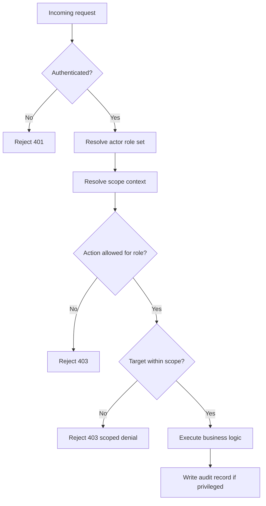

# Attendly — Roles and Permissions

**Product:** Attendly (*Smart Campus Attendance*)  
**Domain:** Digital campus attendance and class-session check-in for universities and schools  
**Related docs:** [../brds/01-stakeholders-scope.md](../brds/01-stakeholders-scope.md) · [../brds/03-functional-requirements.md](../brds/03-functional-requirements.md) · [../brds/04-business-rules.md](../brds/04-business-rules.md) · [00-system-overview.md](./00-system-overview.md) · [02-module-breakdown.md](./02-module-breakdown.md)

## 1. Purpose and access model

This document defines RBAC for Attendly MVP, including role scopes, permission matrix, enforcement rules, and audit requirements.

### 1.1 Actor-to-role mapping

| Role key | Product actor | Default scope |
| --- | --- | --- |
| `Student` | Student | Self-only attendance data |
| `Lecturer` | Lecturer | Assigned class sections only |
| `DepartmentAdmin` | Department Admin | Assigned faculty/department only (Should) |
| `AcademicAdmin` | Academic Admin | Authorized institution scope (typically all) |
| `ITAdmin` | IT Admin | Technical operations scope |
| `SystemAuditor` | System Auditor | Read-only audit and attendance scope (Should) |

### 1.2 RBAC principles

| Principle ID | Principle | Why |
| --- | --- | --- |
| RBAC-01 | Deny by default | Prevent implicit access to sensitive attendance data |
| RBAC-02 | Scope first, action second | A permitted action still fails when target scope is outside role boundary |
| RBAC-03 | Separation of duties | IT operations are separated from academic record mutation |
| RBAC-04 | Audit all privileged reads/writes | Support dispute resolution and compliance |
| RBAC-05 | Least privilege for exports | Export is restricted to role-authorized datasets |

## 2. Resource taxonomy

### 2.1 Protected resources

| Resource | Description |
| --- | --- |
| `SessionControl` | Open/close attendance windows, QR display actions |
| `AttendanceRecord` | Per-student per-session final attendance status |
| `CheckInAttempt` | Attempt outcomes and rejection reasons |
| `Enrollment` | Student eligibility by class section |
| `AttendancePolicy` | Policy configuration and effective rule resolution |
| `ReportView` | Filtered attendance reports in UI |
| `ExportJob` | CSV exports of attendance data |
| `AuditLog` | Immutable event trail for sensitive actions |
| `SystemOps` | Technical health, configuration, and operational tools |

### 2.2 Action vocabulary

- `read`: View resource content.
- `create`: Add new record.
- `update`: Modify existing record.
- `delete`: Remove/deactivate (soft-delete preferred).
- `execute`: Trigger operational action (open session, export, etc.).
- `approve`: Governance action for escalated edits (admin workflows).

## 3. MVP permission matrix

### 3.1 Capability-level matrix

| Capability | Student | Lecturer | DepartmentAdmin | AcademicAdmin | ITAdmin | SystemAuditor |
| --- | --- | --- | --- | --- | --- | --- |
| View own attendance history | Allow (self) | Deny | Deny | Allow | Deny | Read-only (scoped) |
| Submit QR check-in | Allow (self, enrolled) | Deny | Deny | Deny | Deny | Deny |
| Open/close attendance session | Deny | Allow (assigned sections) | Deny | Allow (override) | Deny | Deny |
| View live session roster | Deny | Allow (assigned sections) | Allow (department scope, Should) | Allow | Deny | Read-only (scoped) |
| Manual attendance correction | Deny | Allow (assigned + edit window) | Allow (department scope, policy-based) | Allow | Deny by default | Deny |
| Manage terms/courses/sections | Deny | Deny | Limited (department scope, optional) | Allow | Deny | Deny |
| Manage enrollment import | Deny | Deny | Limited (department scope, optional) | Allow | Deny | Deny |
| Configure attendance policy | Deny | Deny | Limited suggest/review only | Allow | Deny | Deny |
| Run attendance report | Self-only | Allow (assigned sections) | Allow (department scope) | Allow | Deny | Read-only (scoped) |
| Export attendance CSV | Deny institution-wide | Allow (assigned sections) | Allow (department scope) | Allow | Deny | Deny unless explicitly granted |
| View audit logs | Deny | Limited (own section events) | Scoped read | Allow | Allow (technical logs) | Allow read-only |
| Manage infrastructure settings | Deny | Deny | Deny | Limited | Allow | Deny |

### 3.2 Detailed permission matrix

| Resource.Action | Student | Lecturer | DepartmentAdmin | AcademicAdmin | ITAdmin | SystemAuditor |
| --- | --- | --- | --- | --- | --- | --- |
| `SessionControl.execute` | Deny | Allow scoped | Deny | Allow | Deny | Deny |
| `AttendanceRecord.read` | Self-only | Scoped | Scoped | Scoped/global | Deny by default | Scoped read |
| `AttendanceRecord.update` | Deny | Scoped + time window | Scoped + policy | Scoped/global | Deny by default | Deny |
| `CheckInAttempt.read` | Self-attempt summary only | Scoped | Scoped | Scoped/global | Deny by default | Scoped read |
| `Enrollment.read` | Self enrollment | Scoped | Scoped | Scoped/global | Deny | Scoped read optional |
| `Enrollment.create/update` | Deny | Deny | Scoped optional | Allow | Deny | Deny |
| `AttendancePolicy.read` | Deny | Read effective only | Scoped read | Allow | Deny | Read optional |
| `AttendancePolicy.update` | Deny | Deny | Deny | Allow | Deny | Deny |
| `ReportView.read` | Self-only | Scoped | Scoped | Scoped/global | Deny | Scoped read |
| `ExportJob.execute` | Deny | Scoped | Scoped | Scoped/global | Deny | Deny |
| `AuditLog.read` | Deny | Scoped limited | Scoped | Scoped/global | Technical audit only | Scoped/global read-only |
| `SystemOps.execute` | Deny | Deny | Deny | Limited | Allow | Deny |

## 4. Scope enforcement rules

### 4.1 Section and faculty boundaries

| Rule ID | Rule | Trace |
| --- | --- | --- |
| PRM-01 | Lecturer actions are limited to sessions belonging to their assigned class sections | FR-20, BR-14 |
| PRM-02 | DepartmentAdmin actions are limited to sections mapped to assigned faculty | FR-31 |
| PRM-03 | Student can access only own records and own check-in attempts | FR-37 |
| PRM-04 | AcademicAdmin can access configured institution scope; broadest academic authority | FR-21, FR-27 |
| PRM-05 | SystemAuditor has read-only permission and cannot mutate attendance records | FR-32 |

### 4.2 Time-window enforcement

| Rule ID | Rule | Trace |
| --- | --- | --- |
| PRM-06 | Lecturer correction after edit window is rejected or escalated | BR-15 |
| PRM-07 | Admin override may bypass lecturer window with reason and audit | BR-16 |
| PRM-08 | Session control actions enforce session state machine validity | BR-01, BR-02 |

### 4.3 Export and report enforcement

| Rule ID | Rule | Trace |
| --- | --- | --- |
| PRM-09 | Export data must be filtered by role scope before file generation | BR-18 |
| PRM-10 | Unauthorized report or export requests return denial without partial leakage | BR-19 |
| PRM-11 | Every successful export produces immutable audit entry | FR-30, BR-22 |

## 5. Role-specific technical behavior

### 5.1 Student

- Allowed:
  - Authenticate and perform check-in for open sessions.
  - View personal attendance history.
- Denied:
  - Manual corrections, report exports, policy views, audit log browsing.

### 5.2 Lecturer

- Allowed:
  - Open/close session attendance.
  - View realtime roster for assigned sections.
  - Apply manual corrections within allowed window.
  - Export section-scoped reports.
- Denied:
  - Institution-wide policy management or cross-section edits.

### 5.3 DepartmentAdmin (Should)

- Allowed:
  - Department-scoped reports and exception handling.
  - Department-level correction operations where policy permits.
- Denied:
  - Institution-wide policy authority by default.

### 5.4 AcademicAdmin

- Allowed:
  - Manage academic master data and attendance policy.
  - Perform cross-scope correction and export.
  - Resolve escalated disputes.
- Guardrail:
  - Changes must be auditable and reasoned.

### 5.5 ITAdmin

- Allowed:
  - Technical operations, monitoring, service configuration.
- Denied by default:
  - Direct academic attendance edits.
- Exception:
  - Temporary emergency academic access requires explicit elevated grant and audit logging.

### 5.6 SystemAuditor (Should)

- Allowed:
  - Read-only audit and attendance evidence collection.
- Denied:
  - Any attendance or policy mutations.

## 6. Authentication and authorization flow

### 6.1 Request evaluation pipeline

### 6.2 Policy decision inputs

- Actor identity and active role assignments.
- Resource type and intended action.
- Target entities (`classSectionId`, `facultyId`, `studentId`, etc.).
- Effective attendance policy (for time-window and override rules).
- Session state for attendance control operations.

## 7. Audit and compliance requirements

### 7.1 Audit events by role action

| Event | Minimum audit fields |
| --- | --- |
| Manual attendance update | actor, role, target student/session, old/new status, reason, timestamp |
| Export execution | actor, role, scope filter, file format, timestamp |
| Escalated admin override | actor, target, reason, approval context, timestamp |
| Unauthorized privileged attempt (optional policy) | actor, attempted action, target scope, denial reason, timestamp |

### 7.2 Compliance controls

| Control ID | Control | Trace |
| --- | --- | --- |
| CMP-01 | 100% audit coverage for attendance mutations | FR-29, BR-22 |
| CMP-02 | 100% audit coverage for exports | FR-30, BR-18 |
| CMP-03 | Structured reason codes for failed check-in attempts | FR-22, BR-23 |
| CMP-04 | Role-scoped data access for reports and exports | BR-19 |

## 8. Requirement traceability

### 8.1 FR and BR mapping

| Permission area | FR IDs | BR IDs |
| --- | --- | --- |
| Session control | FR-07, FR-08 | BR-01, BR-02 |
| Student check-in access | FR-15, FR-16, FR-17, FR-18 | BR-05, BR-06, BR-07 |
| Manual correction governance | FR-20, FR-21 | BR-14, BR-15, BR-16 |
| Reporting and export scope | FR-27, FR-28 | BR-18, BR-19 |
| Audit and compliance | FR-29, FR-30, FR-32 | BR-22, BR-23 |

### 8.2 Technical cross-links

- System context and architecture: [00-system-overview.md](./00-system-overview.md)
- Module ownership and APIs: [02-module-breakdown.md](./02-module-breakdown.md)

## 9. Future consideration

Potential RBAC extensions after MVP:

- Fine-grained attribute-based policies (ABAC) for dynamic context.
- Delegated lecturer/substitute instructor temporary grants.
- Just-in-time privileged access with approval workflow.
- Audit anomaly detection for unusual access patterns.
