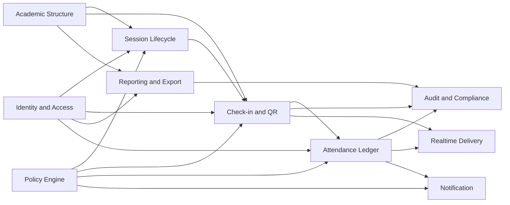

# Attendly — Module Breakdown

**Product:** Attendly (*Smart Campus Attendance*)  
**Domain:** Digital campus attendance and class-session check-in for universities and schools  
**Related docs:** [../brds/03-functional-requirements.md](../brds/03-functional-requirements.md) · [../brds/04-business-rules.md](../brds/04-business-rules.md) · [../brds/05-state-machine.md](../brds/05-state-machine.md) · [../brds/06-domain-model.md](../brds/06-domain-model.md) · [00-system-overview.md](./00-system-overview.md) · [01-roles-permissions.md](./01-roles-permissions.md)

## 1. Purpose and decomposition approach

This document decomposes Attendly MVP into technical modules with clear ownership, interfaces, data boundaries, and requirement traceability.

### 1.1 Decomposition goals

| Goal ID | Goal | Rationale |
| --- | --- | --- |
| MOD-G01 | Isolate check-in critical path | Protect latency and correctness at session start peaks |
| MOD-G02 | Separate policy and authorization concerns | Keep rule changes isolated from core workflow logic |
| MOD-G03 | Preserve auditability by design | Ensure all sensitive writes and exports are traceable |
| MOD-G04 | Support incremental delivery | Enable phased rollout without cross-module rewrites |

## 2. Module map

### 2.1 Top-level modules

| Module ID | Module name | Responsibility |
| --- | --- | --- |
| M01 | Identity and Access | Authentication context and role/scope authorization |
| M02 | Academic Structure | Terms, courses, sections, rooms, enrollment sources |
| M03 | Session Lifecycle | Class session creation, open/close state control |
| M04 | Check-in and QR Orchestrator | Student check-in validation and attendance decision pipeline |
| M05 | Attendance Ledger | Official attendance records and correction workflows |
| M06 | Policy Engine | Effective attendance policy resolution and validation parameters |
| M07 | Reporting and Export | Query models, report filters, CSV generation |
| M08 | Audit and Compliance | Immutable event trail for mutations and exports |
| M09 | Realtime Delivery | Low-latency roster updates for lecturer dashboard |
| M10 | Notification (Should) | Absence threshold alerts and policy-driven notices |

### 2.2 Interaction view

## 3. Module specifications

### 3.1 M01 — Identity and Access

**Responsibilities**

- Resolve authenticated user identity.
- Map actor roles and authorized scope.
- Enforce permission checks at API boundaries.

**Owned concepts**

- User session context.
- Role assignments and scope claims.

**Inbound interfaces**

- Login and token/session middleware hooks.

**Outbound interfaces**

- `authorize(action, resource, scopeContext)` decision API for other modules.

**Requirement trace**

- FR-15, FR-36, FR-31, FR-32, FR-33.
- BR-05, BR-18, BR-19.

### 3.2 M02 — Academic Structure

**Responsibilities**

- Manage terms, courses, class sections, room metadata.
- Maintain enrollment data for eligibility checks.

**Owned entities**

- `Term`, `Course`, `ClassSection`, `Room`, `Enrollment`.

**Inbound interfaces**

- Admin CRUD commands, enrollment import jobs.

**Outbound interfaces**

- `getSectionBySession(sessionId)`.
- `isStudentEnrolled(studentId, classSectionId)`.
- `getRoomLocation(roomId)` for GPS checks.

**Requirement trace**

- FR-01 to FR-06, FR-17.
- BR-06.

### 3.3 M03 — Session Lifecycle

**Responsibilities**

- Create/list class sessions.
- Enforce valid state transitions (`Scheduled`, `Open`, `Closed`, `Cancelled`).
- Trigger QR issuance lifecycle and close-time absent finalization hooks.

**Owned entities**

- `ClassSession`.

**Inbound interfaces**

- Lecturer open/close commands.
- Scheduler/auto-close jobs.

**Outbound interfaces**

- `openSession(sessionId, actor)`.
- `closeSession(sessionId, actor|system)`.
- `getSessionState(sessionId)`.

**Requirement trace**

- FR-07, FR-08, FR-09, FR-10.
- BR-01, BR-02, BR-13, BR-21.

### 3.4 M04 — Check-in and QR Orchestrator

**Responsibilities**

- Issue rotating QR tokens for open sessions.
- Execute check-in decision pipeline in deterministic order.
- Record check-in attempts and outcomes.

**Owned entities**

- `QRSessionToken`, `CheckInAttempt` (write ownership).

**Inbound interfaces**

- Student check-in API call with token and optional GPS payload.
- Session-open event to start token rotation.

**Outbound interfaces**

- `submitCheckIn(...)` result object.
- `issueToken(sessionId)` and token validation.
- Emit attendance decision event to M05 and update stream to M09.

**Requirement trace**

- FR-11 to FR-14, FR-16, FR-18, FR-22, FR-23, FR-34, FR-35.
- BR-03, BR-04, BR-07, BR-08, BR-09, BR-10, BR-11, BR-12, BR-23.

### 3.5 M05 — Attendance Ledger

**Responsibilities**

- Persist official attendance state per student/session.
- Handle manual correction workflows.
- Ensure one-record-per-student-per-session invariant.

**Owned entities**

- `AttendanceRecord`.

**Inbound interfaces**

- Success decision from M04.
- Manual correction commands from lecturer/admin UI.
- Session-close absent-finalization event from M03.

**Outbound interfaces**

- `applyAttendanceOutcome(...)`.
- `correctAttendance(...)`.
- Ledger change event to M08/M09/M10.

**Requirement trace**

- FR-09, FR-20, FR-21, FR-23.
- BR-13, BR-14, BR-15, BR-16.

### 3.6 M06 — Policy Engine

**Responsibilities**

- Resolve effective policy using precedence (section > course > faculty > institution).
- Provide check-in windows, GPS requirements, and edit constraints.

**Owned entities**

- `AttendancePolicy`.

**Inbound interfaces**

- Admin policy configuration requests.
- Runtime policy resolution calls from M03/M04/M05.

**Outbound interfaces**

- `resolveEffectivePolicy(classSectionId, sessionTimestamp)`.

**Requirement trace**

- FR-24, FR-25, FR-26.
- BR-17, BR-20, BR-21.

### 3.7 M07 — Reporting and Export

**Responsibilities**

- Build role-scoped report read models.
- Execute CSV export with scoped filters and stable schemas.

**Owned concepts**

- Report query definitions and export job metadata.

**Inbound interfaces**

- Role-authenticated report and export requests.

**Outbound interfaces**

- Paginated listing results.
- Export file artifact metadata.
- Export audit event to M08.

**Requirement trace**

- FR-27, FR-28, FR-37.
- BR-18, BR-19.

### 3.8 M08 — Audit and Compliance

**Responsibilities**

- Persist immutable audit records for sensitive actions.
- Support query access for auditors/admins with scope restrictions.

**Owned entities**

- `AuditLog`.

**Inbound interfaces**

- Attendance mutation events.
- Export completion events.
- Privileged action events.

**Outbound interfaces**

- `writeAuditEvent(...)`.
- `queryAuditLogs(filters, scope)`.

**Requirement trace**

- FR-29, FR-30, FR-32.
- BR-22, BR-23.

### 3.9 M09 — Realtime Delivery

**Responsibilities**

- Publish low-latency roster updates to lecturer dashboard.
- Keep session summary counts in sync during open sessions.

**Owned concepts**

- Stream channels/topics for session updates.

**Inbound interfaces**

- Attempt and attendance events from M04/M05.

**Outbound interfaces**

- Lecturer dashboard event feed (`checkedIn`, `pending`, `rejected` updates).

**Requirement trace**

- FR-19, FR-14.

### 3.10 M10 — Notification (Should)

**Responsibilities**

- Generate policy alerts when absence thresholds are exceeded.

**Owned concepts**

- Alert state and delivery queue metadata.

**Requirement trace**

- FR-26.
- BR-17.

## 4. Interface contracts and boundaries

### 4.1 Synchronous vs asynchronous operations

| Flow | Preferred pattern | Reason |
| --- | --- | --- |
| Student check-in validation | Synchronous command | Immediate user response required |
| Session open/close | Synchronous command + async side effects | Deterministic state update with non-blocking downstream tasks |
| Attendance mutation audit write | Async event with guaranteed delivery | Keep write path fast while preserving compliance |
| Realtime roster updates | Async publish/subscribe | Near-realtime dashboard refresh |
| Export generation | Async job or streaming response by size | Avoid blocking API under large result sets |

### 4.2 Ownership boundaries

| Boundary | Owned by | Not owned by |
| --- | --- | --- |
| Session state transition validity | M03 | M04, M05 |
| Check-in rejection reason and ordering | M04 | M07 |
| Final attendance status persistence | M05 | M04 |
| Policy precedence rules | M06 | M03, M04, M05 |
| Scope filtering for reports/exports | M01 + M07 | M02 direct raw access by UI |
| Audit immutability | M08 | Business modules mutating past audit entries |

## 5. Data model allocation

### 5.1 Entity-to-module ownership

| Entity | Primary owner | Secondary readers |
| --- | --- | --- |
| `User`/role claims | M01 | All modules (auth context only) |
| `Term`, `Course`, `ClassSection`, `Room`, `Enrollment` | M02 | M03, M04, M06, M07 |
| `ClassSession` | M03 | M04, M05, M07 |
| `QRSessionToken`, `CheckInAttempt` | M04 | M07, M08 |
| `AttendanceRecord` | M05 | M07, M08, M09 |
| `AttendancePolicy` | M06 | M03, M04, M05 |
| `AuditLog` | M08 | M07, M01 scoped readers |

### 5.2 Cross-module consistency rules

| Rule ID | Rule |
| --- | --- |
| CONS-01 | M04 cannot mark success unless M03 reports session `Open` and M02 reports active enrollment |
| CONS-02 | M05 accepts only idempotent attendance outcome commands per student/session |
| CONS-03 | M07 export payload must use policy-aware and scope-aware filters |
| CONS-04 | M08 audit events must include actor and target correlation IDs |

## 6. Non-functional allocation

### 6.1 Performance responsibility by module

| NFR target | Primary module | Supporting modules |
| --- | --- | --- |
| <30s median check-in | M04 | M01, M02, M03, M06, M05 |
| >=99% valid processing success | M04 | M03, M05 |
| <10m report generation | M07 | M01, M02, M05 |
| Peak-time resilience | M03 + M04 | M09, M08 |

### 6.2 Security and compliance responsibility

| Control area | Primary module | Supporting modules |
| --- | --- | --- |
| RBAC enforcement | M01 | M07, M05 |
| GPS minimization | M04 | M06 |
| Audit completeness | M08 | M04, M05, M07 |
| Export scope enforcement | M01 + M07 | M08 |

## 7. Delivery and implementation sequencing

### 7.1 Recommended module rollout (MVP)

| Phase | Modules | Outcome |
| --- | --- | --- |
| Phase A | M01, M02, M03 | Identity, structure, and session state baseline |
| Phase B | M04, M05 | End-to-end check-in and attendance persistence |
| Phase C | M08, M09 | Auditability and realtime lecturer visibility |
| Phase D | M07 | Reports and CSV export with scope controls |
| Phase E (Should) | M06 enhancements, M10 | Full policy hierarchy and alerts |

### 7.2 MVP critical path

`M01 -> M02 -> M03 -> M04 -> M05 -> M08 -> M07`

M09 can be introduced incrementally as polling fallback exists for early testing.

## 8. Requirement traceability matrix

### 8.1 FR mapping by module

| Module | FR IDs |
| --- | --- |
| M01 | FR-15, FR-31, FR-32, FR-33, FR-36 |
| M02 | FR-01, FR-02, FR-03, FR-04, FR-05, FR-06, FR-17 |
| M03 | FR-07, FR-08, FR-09, FR-10 |
| M04 | FR-11, FR-12, FR-13, FR-14, FR-16, FR-18, FR-22, FR-23, FR-34, FR-35 |
| M05 | FR-09, FR-20, FR-21, FR-23 |
| M06 | FR-24, FR-25, FR-26 |
| M07 | FR-27, FR-28, FR-37 |
| M08 | FR-29, FR-30, FR-32 |
| M09 | FR-19 |
| M10 | FR-26 |

### 8.2 BR mapping by module

| Module | BR IDs |
| --- | --- |
| M03 | BR-01, BR-02, BR-13, BR-21 |
| M04 | BR-03, BR-04, BR-05, BR-06, BR-07, BR-08, BR-09, BR-10, BR-11, BR-12, BR-23 |
| M05 | BR-14, BR-15, BR-16 |
| M06 | BR-17, BR-20, BR-21 |
| M07 | BR-18, BR-19 |
| M08 | BR-22, BR-23 |

## 9. Future consideration

Potential post-MVP module extensions:

- Fraud Intelligence module aggregating device and behavior signals.
- Integration Gateway module for SIS APIs and webhook subscriptions.
- Workflow Governance module for approval chains on high-risk corrections.
- Data Lifecycle module for automated retention/deletion compliance operations.
