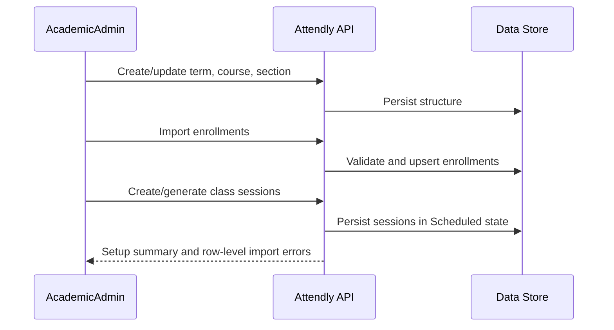
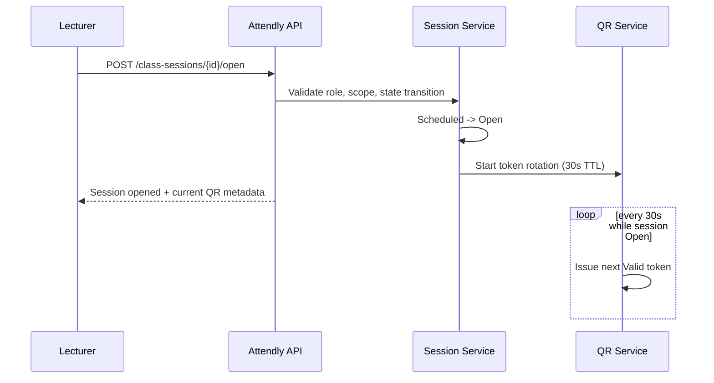
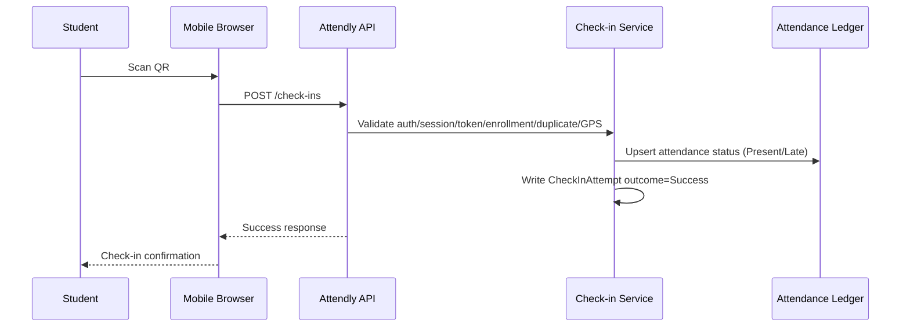
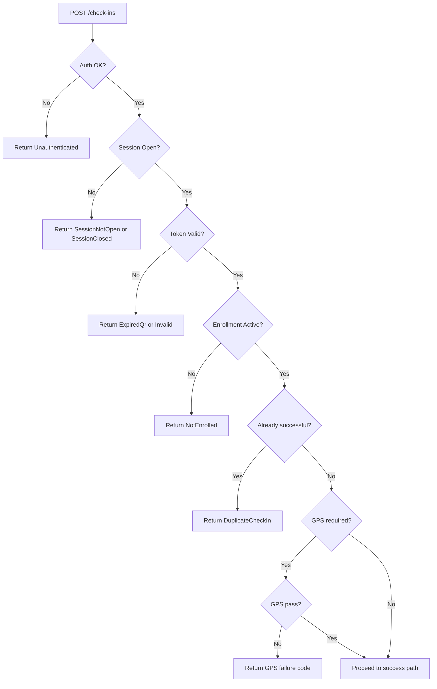
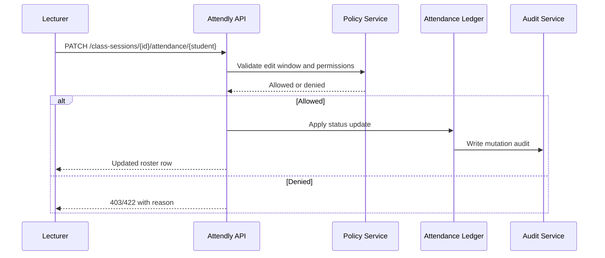
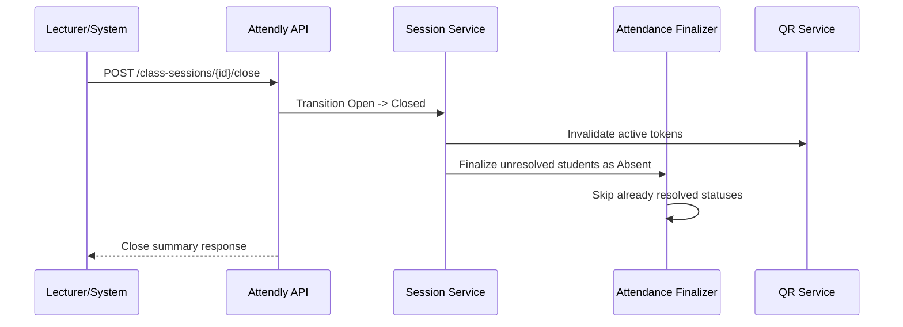
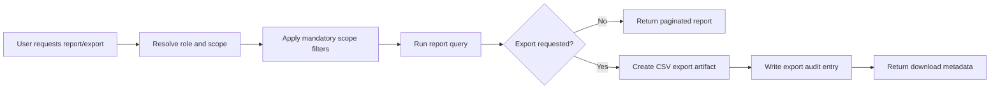

# Attendly — Main Workflows

**Product:** Attendly (*Smart Campus Attendance*)  
**Domain:** Digital campus attendance and class-session check-in for universities and schools  
**Related docs:** [00-system-overview.md](./00-system-overview.md) · [01-roles-permissions.md](./01-roles-permissions.md) · [02-module-breakdown.md](./02-module-breakdown.md) · [05-api-design.md](./05-api-design.md) · [07-state-machines.md](./07-state-machines.md) · [../brds/02-business-workflow.md](../brds/02-business-workflow.md) · [../brds/03-functional-requirements.md](../brds/03-functional-requirements.md) · [../brds/04-business-rules.md](../brds/04-business-rules.md) · [../brds/08-acceptance-mvp-future.md](../brds/08-acceptance-mvp-future.md)

## 1. Purpose and workflow scope

This document translates BRD workflows into technical execution flows: actor actions, API calls, state transitions, data writes, and error/recovery paths for MVP.

### 1.1 Workflow set

| Workflow ID | Workflow | Primary actor |
| --- | --- | --- |
| WF-01 | Academic setup and enrollment import | AcademicAdmin |
| WF-02 | Lecturer opens attendance session and displays rotating QR | Lecturer |
| WF-03 | Student QR check-in (happy path) | Student |
| WF-04 | Student QR check-in (rule failure paths) | Student |
| WF-05 | Lecturer manual fallback and correction | Lecturer |
| WF-06 | Session close and absent finalization | Lecturer / System |
| WF-07 | Report query and CSV export | Lecturer / DepartmentAdmin / AcademicAdmin |
| WF-08 | Audit and dispute review | SystemAuditor / AcademicAdmin |

## 2. Cross-workflow technical guardrails

### 2.1 Guardrails

| Guardrail ID | Rule | Trace |
| --- | --- | --- |
| WG-01 | Check-in accepted only when session state is `Open` | BR-01, BR-02 |
| WG-02 | QR token is short-lived multi-use, not globally one-time | FR-12, BR-03 |
| WG-03 | One successful attendance record per student/session | FR-18, BR-07 |
| WG-04 | All failed attempts, corrections, and exports are auditable | FR-22, FR-29, FR-30 |
| WG-05 | Scope filtering is mandatory before report/export generation | BR-18, BR-19 |

### 2.2 Key workflow dependencies

| Dependency | Needed by | Failure impact |
| --- | --- | --- |
| Active enrollment data | WF-03, WF-04, WF-06 | `NotEnrolled` false negatives/positives |
| Session and token timing | WF-02, WF-03 | `ExpiredQr` and `SessionClosed` spikes |
| Effective policy resolution | WF-03, WF-05, WF-06 | Incorrect `Present`/`Late` and edit-window handling |
| Role/scope resolution | WF-01, WF-05, WF-07, WF-08 | Unauthorized data mutation or leakage |

### 2.3 Shared write and recovery principles

| Principle ID | Principle | Applies to |
| --- | --- | --- |
| WOP-01 | Commands that mutate attendance/session/export state require authenticated actor context and `Idempotency-Key` | WF-02, WF-03, WF-05, WF-06, WF-07 |
| WOP-02 | User-facing failures still produce structured server records where required | WF-04 |
| WOP-03 | Realtime dashboard updates are derived from persisted outcomes, not optimistic browser state | WF-02 to WF-06 |
| WOP-04 | Manual fallback resolves legitimate exceptions without bypassing audit and scope checks | WF-05, WF-08 |
| WOP-05 | Any workflow that reads bulk attendance data applies role scope before query execution | WF-07, WF-08 |

Technical API details are defined in [05-api-design.md](./05-api-design.md). Implementation state transitions are defined in [07-state-machines.md](./07-state-machines.md).

## 3. WF-01 Academic setup and enrollment import

### 3.1 Objective

Prepare class sections, sessions, and eligibility data before attendance operations.

### 3.2 Sequence

### 3.3 Technical steps

| Step | API call | Data impact | Trace |
| --- | --- | --- | --- |
| 1 | `POST /v1/class-sections` | create section and lecturer assignment | FR-03 |
| 2 | `POST /v1/enrollments/import` | upsert enrollment rows (`Active`/`Dropped`) | FR-04, BR-06 |
| 3 | `POST /v1/class-sessions` | create `Scheduled` sessions | FR-06 |
| 4 | `POST /v1/policies` (optional) | set policy override at scope | FR-24, BR-20 |

### 3.4 Validation and failure handling

- Reject malformed imports with row-level details; do not silently ignore invalid rows.
- Preserve successful rows when partial import errors occur.
- Log import events for audit and reconciliation.

### 3.5 Completion criteria

| Criterion | Expected result | Trace |
| --- | --- | --- |
| Section exists with assigned lecturer | Lecturer can see the section and upcoming sessions | FR-03, FR-10 |
| Enrollment import completes | Active enrolled students are eligible for check-in | FR-04, BR-06 |
| Sessions generated | Each meeting starts in `Scheduled` state | FR-06 |
| Optional policy configured | Effective policy can be resolved at check-in time | FR-24, FR-25, BR-20 |

## 4. WF-02 Lecturer opens attendance and displays QR

### 4.1 Objective

Enable real-time student check-in for one class session.

### 4.2 Sequence

### 4.3 Technical checkpoints

| Checkpoint | Rule | Trace |
| --- | --- | --- |
| Assigned lecturer or admin only | role/scope authorization | FR-07, BR-19 |
| Session must be `Scheduled` | valid state transition | BR-01 |
| QR token TTL = 30 seconds | token model | FR-11, BR-03 |
| Projection-ready response payload | UI support | FR-14 |

### 4.4 Failure and recovery paths

| Failure | API behavior | Recovery |
| --- | --- | --- |
| Actor not assigned to section | `403 OutOfScope` | Academic admin corrects lecturer assignment if roster is wrong |
| Session already `Open` | idempotent success with current open metadata | Lecturer continues displaying QR |
| Session `Closed` or `Cancelled` | `409 InvalidSessionTransition` | Use manual correction or create a replacement session per policy |
| QR issuance service error | open command fails before committing `Open`, or records degraded state alert | Lecturer retries; support may use manual fallback if service is unavailable |

Open-session telemetry should record command latency, token issuance success, and initial roster count for `NFR-16`.

## 5. WF-03 Student check-in happy path

### 5.1 Objective

Record a valid `Present` or `Late` outcome for enrolled student during open session.

### 5.2 Sequence

### 5.3 Determination logic

| Decision | Rule |
| --- | --- |
| `Present` | successful check-in within present window |
| `Late` | successful check-in after present window before close |
| `Method` | set to `QR` |

Trace: FR-23, BR-11, BR-12, AC-11.

### 5.4 Write set

On success:
- create `CheckInAttempt` with `outcome=Success`;
- create/update `AttendanceRecord` (`Present` or `Late`);
- emit realtime update for lecturer dashboard;
- emit audit hook where required by policy.

### 5.5 Happy-path acceptance checkpoints

| Checkpoint | Expected behavior | Trace |
| --- | --- | --- |
| Login gate | Unauthenticated QR scan redirects to login and returns to check-in | AC-06 |
| Token sharing | Multiple students can use the same valid displayed QR within TTL | AC-03 |
| Eligibility | Student must have active enrollment in the session section | AC-07 |
| Duplicate prevention | Second successful attempt for same session is rejected | AC-08 |
| Status assignment | `Present` or `Late` is derived from effective policy windows | AC-11 |
| UX latency | Confirmation returns within target mobile check-in time | NFR-01, AC-20 |

## 6. WF-04 Student check-in failure paths

### 6.1 Objective

Return actionable rejection messages while preserving deterministic logs and no unintended roster mutation.

### 6.2 Validation order and failure outcomes

| Validation stage | Failure code | Roster impact | Trace |
| --- | --- | --- | --- |
| Authentication | `Unauthenticated` | none | BR-05 |
| Session state | `SessionNotOpen` / `SessionClosed` | none | BR-01, BR-02 |
| Token validity | `ExpiredQr` / invalid token | none | BR-03, BR-04 |
| Enrollment | `NotEnrolled` | none | BR-06 |
| Duplicate success | `DuplicateCheckIn` | none | BR-07 |
| GPS requirement | `GpsRequired` / `GpsDisabled` | none | BR-08 |
| GPS distance/accuracy | `OutOfRadius` / `LowAccuracy` / `Suspicious` | none | BR-09, BR-10 |

### 6.3 Failure sequence

### 6.4 Logging guarantees

- Every failure produces `CheckInAttempt` with structured `outcome` code.
- No failure path creates a successful attendance state.
- Error code mapping must remain stable for UI localization.

Trace: FR-22, BR-23, AC-18.

### 6.5 Student-facing recovery guidance

| Failure code | Student guidance | Lecturer/admin visibility |
| --- | --- | --- |
| `Unauthenticated` | sign in and continue from preserved check-in link | not shown as roster rejection unless submission reached API |
| `SessionNotOpen` | wait for lecturer to open attendance | visible as failed attempt if submitted |
| `SessionClosed` | contact lecturer for legitimate exception | visible on roster/audit with timestamp |
| `ExpiredQr` | scan the currently displayed QR | count toward QR health metrics |
| `NotEnrolled` | contact academic office if roster is incorrect | flagged for enrollment reconciliation |
| `DuplicateCheckIn` | show existing success status and timestamp | no roster change |
| `GpsDisabled` / `GpsRequired` | enable location or ask lecturer for manual fallback | visible for manual review |
| `OutOfRadius` / `LowAccuracy` | retry in classroom or request verification | visible as rejected/suspicious attempt |

## 7. WF-05 Lecturer manual fallback and correction

### 7.1 Objective

Resolve legitimate exceptions (device/network/GPS issues) without violating scope, policy windows, or audit requirements.

### 7.2 Sequence

### 7.3 Manual correction rules

| Rule | Behavior |
| --- | --- |
| Within lecturer edit window | allow correction with reason if required |
| After edit window | reject or escalate to admin override |
| Out of lecturer section scope | deny |
| Admin override | allowed with explicit reason and audit |

Trace: FR-20, FR-21, BR-14 to BR-16, AC-13, AC-14.

### 7.4 Manual fallback decision record

Manual correction forms should capture enough context for later disputes without expanding MVP into a full dispute-management system.

| Field | Required | Notes |
| --- | --- | --- |
| `status` | Yes | `Manual Present`, `Late`, `Excused`, `Absent`, or policy-allowed status |
| `reason` | Yes when policy requires; recommended always | Short human-readable explanation |
| `sourceAttemptId` | No | Link latest failed attempt when correction resolves a QR/GPS failure |
| `correlationId` | Yes | Ties API response, audit log, and realtime event |

Accepted manual corrections update the live roster immediately and write audit data with old and new status.

## 8. WF-06 Session close and absent finalization

### 8.1 Objective

Close attendance deterministically and finalize unresolved records.

### 8.2 Sequence

### 8.3 Close-time outcomes

| Outcome | Description | Trace |
| --- | --- | --- |
| Session state | `Closed` | FR-08 |
| Token lifecycle | all active tokens become unusable | BR-03, BR-04 |
| Attendance finalization | unresolved enrolled students -> `Absent` | FR-09, BR-13 |
| Audit/event | close action logged | FR-30 |

### 8.4 Idempotent finalization rules

| Rule | Behavior |
| --- | --- |
| Close command retried | return existing `Closed` summary without duplicating side effects |
| Finalizer job retried | upsert only missing `Absent` records for unresolved active enrollments |
| Already resolved record | preserve `Present`, `Late`, `Manual Present`, or `Excused` |
| Token invalidation retried | keep all session tokens unusable; no new valid tokens after close |

These rules satisfy `BR-13`, `BR-21`, and `NFR-07`.

## 9. WF-07 Reporting and CSV export

### 9.1 Objective

Provide role-scoped attendance visibility and export without leaking unauthorized data.

### 9.2 Query + export flow

### 9.3 Scope matrix

| Role | Allowed report/export scope |
| --- | --- |
| Lecturer | assigned class sections |
| DepartmentAdmin | assigned faculty |
| AcademicAdmin | authorized institution scope |
| Student | own attendance history only; no institution export |
| SystemAuditor | read-only audit/report scope; export only if explicitly granted |

Trace: FR-27, FR-28, BR-18, BR-19, AC-15, AC-16, AC-17.

### 9.4 Export workflow details

| Step | Technical behavior | Audit requirement |
| --- | --- | --- |
| Resolve actor scope | Build mandatory `classSectionId`/`facultyId` filters from role claims | Denials may be logged by policy |
| Validate filters | Reject filters outside actor scope before querying | No partial data leakage |
| Generate CSV | Include student identifier, section, session, status, timestamp, method | Export payload schema version recorded |
| Complete export | Return job/download metadata | `AuditLog` records actor, scope, filter summary, format |

MVP exports are CSV only. Scheduled exports, Excel workbooks, and webhooks are future consideration.

## 10. WF-08 Audit and dispute review

### 10.1 Objective

Support dispute handling with immutable evidence from attempts, corrections, and exports.

### 10.2 Evidence workflow

| Step | Action | Data source |
| --- | --- | --- |
| 1 | locate student/session case | attendance records and session metadata |
| 2 | inspect check-in attempts | `CheckInAttempt` outcomes + timestamps |
| 3 | inspect mutation history | `AuditLog` status changes |
| 4 | determine corrective action | policy window and role authority |
| 5 | apply admin correction if needed | attendance patch endpoint + reason |

Trace: FR-21, FR-29, FR-30, FR-32.

### 10.3 Dispute evidence bundle

For each disputed attendance outcome, the reviewer should be able to reconstruct:

| Evidence | Source |
| --- | --- |
| Session lifecycle | `ClassSession.openedAt`, `closedAt`, actor IDs |
| QR/token result | `CheckInAttempt.qrTokenId`, outcome code, submitted timestamp |
| Eligibility | active enrollment record at the time of attempt |
| Policy basis | effective policy or policy snapshot for windows/GPS/edit rules |
| Final attendance | current `AttendanceRecord` status and method |
| Mutation trail | `AuditLog` entries for corrections and exports |

SystemAuditor remains read-only. AcademicAdmin performs any correction through WF-05 with reason and audit.

## 11. Workflow observability and SLO alignment

### 11.1 Workflow metrics

| Metric | Workflow | Target | Trace |
| --- | --- | --- | --- |
| median check-in latency | WF-03, WF-04 | < 30s | NFR-01, AC-20 |
| majority class completion | WF-03 | < 5m | NFR-02, AC-21 |
| valid check-in processing success | WF-03 | >= 99% | NFR-03, AC-22 |
| failed-attempt reason coverage | WF-04 | 100% | FR-22, AC-18 |
| audit coverage on corrections/exports | WF-05, WF-07 | 100% | FR-29, FR-30, AC-17, AC-19 |

### 11.2 Operational alerts

- sudden spikes in `ExpiredQr` or `SessionClosed` within first 2 minutes after open;
- abnormal `NotEnrolled` rate for a section (possible import mismatch);
- elevated GPS failures in specific rooms (calibration issue);
- missing audit events for mutation endpoints (critical compliance defect).

## 12. Future consideration

- scheduled/bulk workflow automation for multi-section operations;
- dispute-case workflow with explicit `UnderReview` and `Resolved` lifecycle;
- webhook integration when exports complete;
- optional per-student challenge workflow after QR scan;
- richer notification workflow for absence-threshold breaches.
