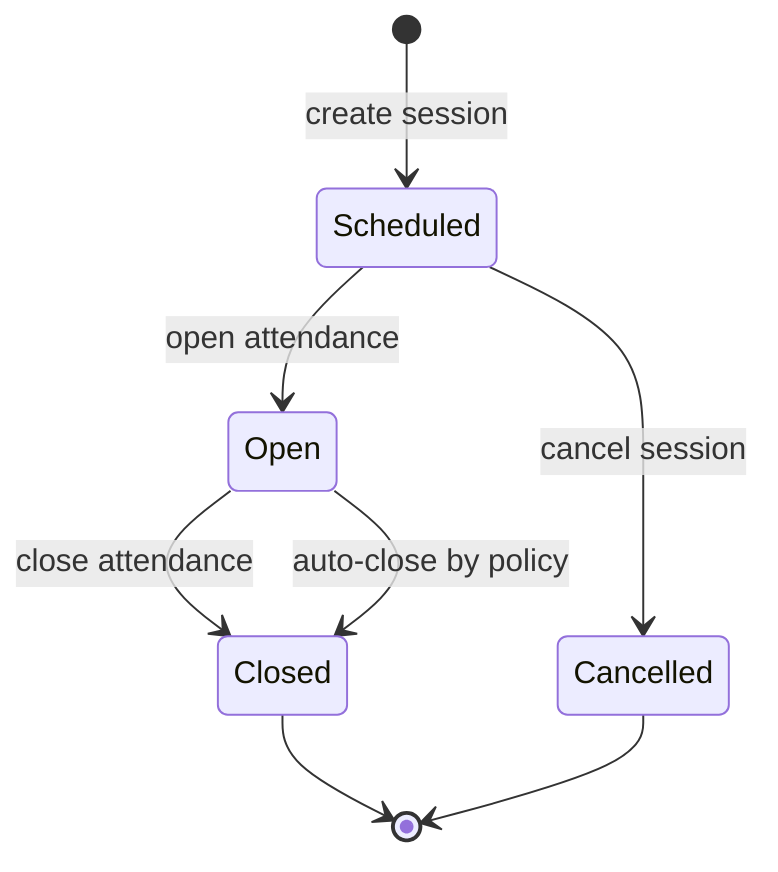
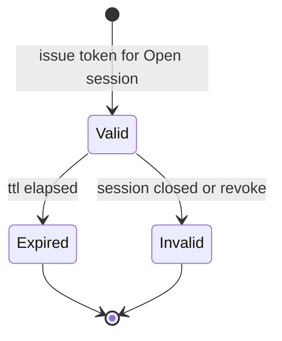
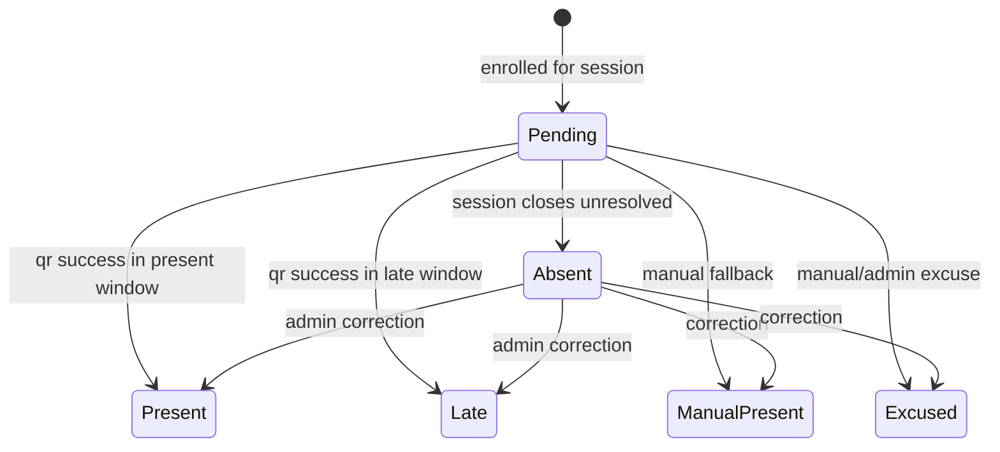
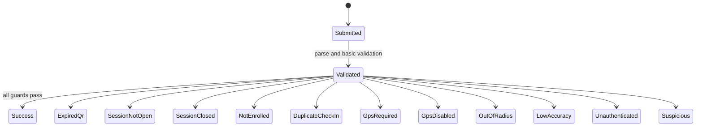
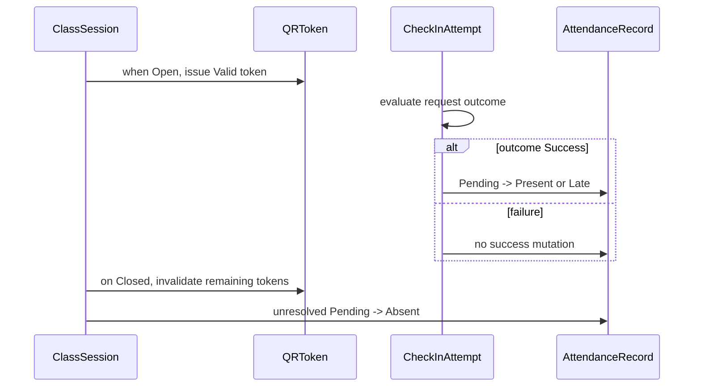

# Attendly — State Machines

**Product:** Attendly (*Smart Campus Attendance*)  
**Domain:** Digital campus attendance and class-session check-in for universities and schools  
**Related docs:** [03-domain-model.md](./03-domain-model.md) · [04-database-design.md](./04-database-design.md) · [05-api-design.md](./05-api-design.md) · [06-main-workflows.md](./06-main-workflows.md) · [../brds/05-state-machine.md](../brds/05-state-machine.md) · [../brds/04-business-rules.md](../brds/04-business-rules.md) · [../brds/08-acceptance-mvp-future.md](../brds/08-acceptance-mvp-future.md)

## 1. Purpose and state-machine scope

This document defines implementation-level state machines for Attendly MVP, including transition guards, side effects, invariants, invalid transitions, and failure semantics.

### 1.1 State-machine domains

| Machine ID | Domain | Entity |
| --- | --- | --- |
| SM-01 | Session attendance window | `ClassSession` |
| SM-02 | Session QR token lifecycle | `QRSessionToken` |
| SM-03 | Student attendance outcome lifecycle | `AttendanceRecord` |
| SM-04 | Check-in attempt processing lifecycle | `CheckInAttempt` (ephemeral flow with terminal outcomes) |

### 1.2 Canonical state naming

State names are canonical and must match:
- API enums in `05-api-design.md`;
- persistence enums in `04-database-design.md`;
- business states in `../brds/05-state-machine.md`.

## 2. SM-01 ClassSession state machine

### 2.1 States

| State | Meaning |
| --- | --- |
| `Scheduled` | session exists, attendance not open |
| `Open` | attendance active, QR rotation running |
| `Closed` | attendance ended, self check-in blocked |
| `Cancelled` | session cancelled, no attendance processing |

### 2.2 Diagram

### 2.3 Transition table

| From | To | Trigger | Guard | Side effects | Trace |
| --- | --- | --- | --- | --- | --- |
| — | `Scheduled` | create session | valid section + schedule | persist session | FR-06 |
| `Scheduled` | `Open` | lecturer/admin open command | actor authorized and in scope | set `openedAt`; issue/rotate QR | FR-07, FR-11 |
| `Scheduled` | `Cancelled` | cancel command | actor authorized | mark cancelled | FR-06 |
| `Open` | `Closed` | close command | actor authorized | set `closedAt`; invalidate tokens; finalize absents | FR-08, FR-09 |
| `Open` | `Closed` | auto-close scheduler | late window elapsed and auto-close enabled | same as manual close | BR-21 |

### 2.4 Invalid transitions

| Attempt | Reason |
| --- | --- |
| `Open -> Scheduled` | not allowed after attendance starts |
| `Closed -> Open` | reopening out of MVP scope |
| `Cancelled -> Open` | cancelled session is terminal |
| `Closed -> Cancelled` | terminal closure semantics |

### 2.5 Invariants

| Invariant ID | Description | Trace |
| --- | --- | --- |
| SMI-01 | check-in accepted only when state is `Open` | BR-01, BR-02 |
| SMI-02 | session close is idempotent | NFR-07 |
| SMI-03 | close transition executes absent finalization once logically | BR-13 |

### 2.6 Implementation notes

| Concern | Required behavior |
| --- | --- |
| Open command | Must atomically set `state=Open`, `openedAt`, and `openedByUserId` before returning QR metadata |
| Close command | Must atomically set `state=Closed`, `closedAt`, and `closedByUserId`; absent finalization may run in the same transaction or an idempotent guaranteed follow-up |
| Auto-close | Scheduler must re-read effective policy and current state before closing |
| Cancel command | Allowed only before attendance opens; no QR tokens are issued for `Cancelled` sessions |

## 3. SM-02 QRSessionToken state machine

### 3.1 States

| State | Meaning |
| --- | --- |
| `Valid` | token may be used for submissions |
| `Expired` | token TTL elapsed |
| `Invalid` | token revoked, malformed, or bound to unusable session |

### 3.2 Diagram

### 3.3 Transition rules

| From | To | Trigger | Guard | Side effects | Trace |
| --- | --- | --- | --- | --- | --- |
| — | `Valid` | token issued | session is `Open` | set `expiresAt = issuedAt + 30s` | FR-11 |
| `Valid` | `Expired` | TTL timer | current time > expiresAt | reject submissions with `ExpiredQr` | BR-03 |
| `Valid` | `Invalid` | session close/revoke | session transitioned out of `Open` or explicit revoke | reject submissions | BR-04 |

### 3.4 Multi-use semantics

- A `Valid` token may be used by multiple students within TTL.
- Token consumption does not transition token state.
- Duplicate prevention occurs in attendance machine (`SM-03`), not in token state.

Trace: FR-12, BR-03, BR-07, AC-03.

### 3.5 Token invariants

| Invariant ID | Description |
| --- | --- |
| TMI-01 | token belongs to exactly one `classSessionId` |
| TMI-02 | token must not remain `Valid` after session closes |
| TMI-03 | token expiry relies on server time, not client time |

### 3.6 Rotation behavior

| Rotation point | Expected state behavior |
| --- | --- |
| Initial open | Issue first `Valid` token after `ClassSession` commits to `Open` |
| Every 30 seconds while open | Issue a new token record; previous token becomes `Expired` by server-time evaluation |
| Lecturer display refresh | Fetch current token metadata; do not mutate token state from the browser |
| Session close | Mark remaining `Valid` tokens `Invalid` or treat them as invalid through session-state guard |

`Expired` tokens are not reactivated. A refreshed QR always represents a new token record or equivalent opaque token version.

## 4. SM-03 AttendanceRecord state machine

### 4.1 States

| State | Meaning |
| --- | --- |
| `Pending` | enrolled student without resolved outcome yet |
| `Present` | successful on-time check-in |
| `Late` | successful check-in in late window |
| `Absent` | unresolved at close |
| `Excused` | approved excused absence |
| `Manual Present` | lecturer/admin manually marked present |

### 4.2 Diagram

*`ManualPresent` in diagram corresponds to `Manual Present` status label.*

### 4.3 Transition rules

| From | To | Trigger | Guard | Trace |
| --- | --- | --- | --- | --- |
| — | `Pending` | enrollment becomes active for session | session exists for section | FR-04, FR-06 |
| `Pending` | `Present` | successful check-in | within present window | BR-11 |
| `Pending` | `Late` | successful check-in | after present, before close | BR-12 |
| `Pending` | `Absent` | session closed | no successful check-in | BR-13 |
| `Pending`/`Absent`/other | `Manual Present` | manual correction | actor in scope + window/override | BR-14 to BR-16 |
| `Pending`/`Absent`/other | `Excused` | manual/admin action | policy allows + reason captured | BR-14 to BR-16 |
| any resolved | another resolved | correction | authorized admin/lecturer | FR-20, FR-21 |

### 4.4 Uniqueness and idempotency constraints

| Constraint | Enforcement |
| --- | --- |
| one record per (`classSessionId`, `studentUserId`) | DB unique index |
| one successful check-in path | conflict detection and `DuplicateCheckIn` |
| repeated manual command with same idempotency key | return prior result |

Trace: BR-07, NFR-07.

### 4.5 Transition side effects

- Every state mutation writes an audit record with old/new values.
- `checkInMethod` updated consistently (`QR`, `Manual`, `Admin Correction`).
- Realtime roster update emitted for lecturer dashboard.

Trace: FR-19, FR-29, BR-22.

### 4.6 Correction permissions by transition

| Transition family | Allowed actor | Guard |
| --- | --- | --- |
| `Pending -> Present` / `Late` via QR | Student self-service through check-in API | Valid attempt outcome `Success` |
| `Pending` / `Absent` / resolved -> `Manual Present` | Lecturer or admin | Scope plus edit window or admin override |
| any -> `Excused` | Lecturer/admin when policy permits | Reason captured and audit logged |
| any resolved -> another resolved status | Lecturer/admin | Scope, policy, and reason requirements |

Students cannot directly mutate `AttendanceRecord` after a successful or failed attempt. Their recovery path is retry (when allowed) or manual fallback.

## 5. SM-04 CheckInAttempt processing machine

### 5.1 Purpose

Represent single request lifecycle from submission to terminal outcome.

### 5.2 States

| State | Type |
| --- | --- |
| `Submitted` | transient |
| `Validated` | transient |
| terminal outcomes (`Success`, `ExpiredQr`, etc.) | terminal |

### 5.3 Diagram

### 5.4 Evaluation order

Terminal outcomes must be chosen in fixed order:

1. `Unauthenticated`
2. `SessionNotOpen` / `SessionClosed`
3. token errors (`ExpiredQr` or invalid)
4. `NotEnrolled`
5. `DuplicateCheckIn`
6. GPS-related outcomes
7. `Success`

Trace: BR-05 to BR-12, FR-22, AC-18.

### 5.5 Attempt invariants

| Invariant ID | Description |
| --- | --- |
| AMI-01 | every submitted request yields exactly one terminal outcome |
| AMI-02 | failure outcomes do not mutate successful attendance status |
| AMI-03 | outcome code persisted for 100% of failed attempts |

### 5.6 Terminal outcome side effects

| Outcome group | Persist `CheckInAttempt` | Mutate `AttendanceRecord` | Realtime update |
| --- | --- | --- | --- |
| `Success` | Yes, `outcome=Success` | Yes, to `Present` or `Late` | checked-in count and row update |
| business failure | Yes, structured outcome code | No | rejected-attempt count and latest reason |
| `Unauthenticated` before actor resolution | Persist only if a student actor can be resolved safely; otherwise return auth error without roster context | No | No |
| `Suspicious` | Yes, with GPS/device metadata allowed by policy | No unless policy explicitly accepts with flag | review indicator |

## 6. Cross-machine coordination

### 6.1 Composite flow

### 6.2 Synchronization rules

| Rule ID | Coordination rule | Trace |
| --- | --- | --- |
| SYNC-01 | `SM-02` token `Valid` requires `SM-01` session `Open` | FR-11 |
| SYNC-02 | `SM-03` success transitions require `SM-04` outcome `Success` | BR-11, BR-12 |
| SYNC-03 | `SM-03` `Absent` assignment triggered by `SM-01` close | BR-13 |
| SYNC-04 | `SM-04` `DuplicateCheckIn` triggered by `SM-03` resolved success | BR-07 |

### 6.3 State ownership boundaries

| State machine | Write owner | Other machines may |
| --- | --- | --- |
| SM-01 `ClassSession` | Session Lifecycle service | read state for validation |
| SM-02 `QRSessionToken` | Check-in and QR service | receive session-close invalidation command |
| SM-03 `AttendanceRecord` | Attendance Ledger service | receive success/finalization/correction commands |
| SM-04 `CheckInAttempt` | Check-in service | publish terminal outcome events |

Services must communicate through commands/events described in [02-module-breakdown.md](./02-module-breakdown.md); direct cross-owner state mutation is not allowed.

## 7. Concurrency, failure, and recovery semantics

### 7.1 Concurrency model

Attendly expects short, synchronized bursts when many students scan the same rotating QR. Concurrency handling must preserve correctness before optimizing latency.

| Scenario | Required control | Trace |
| --- | --- | --- |
| Many students use same token | Token remains multi-use; each student evaluated independently | FR-12, AC-03 |
| Same student submits twice | Unique attendance key and idempotency logic allow one success only | BR-07, NFR-07 |
| Token expires during request | Server evaluates against authoritative receive/processing time policy; response is deterministic | BR-03 |
| Close overlaps check-in | Committed session state at validation determines `Success` or `SessionClosed` | BR-02 |
| Auto-close and lecturer close overlap | First committed close wins; later command returns idempotent closed result | BR-21, NFR-07 |

### 7.2 Locking and transaction guidance

| Operation | Recommended consistency behavior |
| --- | --- |
| Check-in success path | Use unique constraint on (`classSessionId`, `studentUserId`) plus conflict handling; avoid table-wide locks |
| Session open/close | Update session row conditionally by current state (`WHERE state = ...`) |
| Absent finalization | Bulk upsert unresolved active enrollments; make job repeat-safe |
| Token validation | Validate token hash, TTL, and bound session in one read path using server time |
| Manual correction | Read old attendance row, update status, and write audit entry within one command boundary |

### 7.3 Race and retry scenarios

| Scenario | Expected behavior |
| --- | --- |
| student submits near token expiry | server decision uses receive-time and token state snapshot |
| simultaneous duplicate submissions | first success wins, later returns `DuplicateCheckIn` |
| lecturer closes while requests in-flight | requests processed against committed session state at evaluation |
| close command retried | idempotent result with already-closed metadata |

### 7.4 Recovery actions

- stale `Pending` records after close reprocessed by idempotent finalizer job;
- missing audit write treated as critical incident and replayed from event log;
- policy misconfiguration causing mass GPS failures escalated to admin and temporary policy override.

## 8. Persistence mapping

### 8.1 State-to-column mapping

| Machine | Table | State column |
| --- | --- | --- |
| SM-01 | `class_sessions` | `state` |
| SM-02 | `qr_session_tokens` | `state` |
| SM-03 | `attendance_records` | `status` |
| SM-04 | `check_in_attempts` | `outcome` |

### 8.2 Transition metadata columns

| Transition type | Columns updated |
| --- | --- |
| session open/close | `opened_at`, `opened_by_user_id`, `closed_at`, `closed_by_user_id` |
| token issue | `issued_at`, `expires_at`, `sequence_number` |
| attendance mutation | `last_modified_at`, `last_modified_by_user_id`, `modification_reason`, `check_in_method` |
| attempt terminalization | `submitted_at`, `outcome`, optional GPS fields |

## 9. Acceptance and traceability matrix

| Machine | FR | BR | AC | NFR |
| --- | --- | --- | --- | --- |
| SM-01 ClassSession | FR-06, FR-07, FR-08, FR-09 | BR-01, BR-02, BR-13, BR-21 | AC-01, AC-05, AC-12 | NFR-06 |
| SM-02 QRToken | FR-11, FR-12, FR-13, FR-14 | BR-03, BR-04 | AC-02, AC-03, AC-04 | NFR-01 |
| SM-03 AttendanceRecord | FR-18, FR-20, FR-21, FR-23 | BR-07, BR-11 to BR-16 | AC-08, AC-11, AC-13, AC-14 | NFR-07 |
| SM-04 CheckInAttempt | FR-22, FR-34, FR-35 | BR-05 to BR-10, BR-23 | AC-06, AC-07, AC-09, AC-10, AC-18 | NFR-13 |

## 10. Future consideration

- explicit `Reopened` session state with strict audit controls;
- token hardening with per-student challenge state machine;
- dispute-case state machine (`Submitted`, `UnderReview`, `Resolved`);
- asynchronous compensating transitions for partial downstream failures;
- richer suspicious-attempt review workflow integrated with risk scoring.
