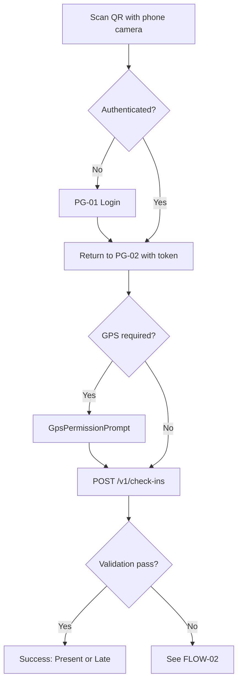

# Attendly — User Flows

**Product:** Attendly (*Smart Campus Attendance*)  
**Domain:** Digital campus attendance and class-session check-in for universities and schools  
**Authoritative visual spec:** [DESIGN.md](./DESIGN.md)  
**Related docs:** [09-page-list.md](./09-page-list.md) · [11-wireframes.md](./11-wireframes.md) · [12-ui-states.md](./12-ui-states.md) · [07-domain-specific-components.md](./07-domain-specific-components.md) · [../brds/02-business-workflow.md](../brds/02-business-workflow.md) · [../brds/08-acceptance-mvp-future.md](../brds/08-acceptance-mvp-future.md) · [../technical/06-main-workflows.md](../technical/06-main-workflows.md)

## 1. Purpose and scope

This document defines **end-to-end user flows** for Attendly MVP: actor intent, step sequence, decision branches, linked routes (PG-xx from [09-page-list.md](./09-page-list.md)), and acceptance traceability. Flows are implementation-ready for engineers and designers; wireframe layouts are in [11-wireframes.md](./11-wireframes.md); per-surface UI states are in [12-ui-states.md](./12-ui-states.md).

### 1.1 Flow conventions

| Element | Convention |
| --- | --- |
| Flow ID | `FLOW-xx` — unique within this document |
| Primary actor | One accountable role per flow |
| Route reference | PG-xx from [09-page-list.md](./09-page-list.md) |
| Requirement trace | `FR-xx`, `BR-xx`, `AC-xx`, `NFR-xx` |
| Failure path | Every flow includes explicit rejection/recovery branches where applicable |

### 1.2 Flow inventory

| ID | Flow name | Primary actor | Entry route | Trace |
| --- | --- | --- | --- | --- |
| FLOW-01 | Student QR check-in (happy path) | Student | PG-02 | `FR-15`–`FR-18`, `FR-23`, `AC-06`–`AC-08`, `AC-11` |
| FLOW-02 | Student check-in rejection and recovery | Student | PG-02 | `FR-13`, `FR-22`, `AC-04`, `AC-05`, `AC-18` |
| FLOW-03 | Student GPS-gated check-in | Student | PG-02 | `FR-34`, `FR-35`, `AC-09`, `AC-10` |
| FLOW-04 | Student attendance history | Student | PG-03 | `FR-37` |
| FLOW-05 | Lecturer open session and display QR | Lecturer | PG-04 → PG-05 | `FR-07`, `FR-11`, `FR-14`, `AC-01`, `AC-02`, `AC-03` |
| FLOW-06 | Lecturer monitor live roster | Lecturer | PG-06 | `FR-19`, `AC-UI-05` |
| FLOW-07 | Lecturer close session | Lecturer | PG-05 | `FR-08`, `FR-09`, `AC-05`, `AC-12` |
| FLOW-08 | Lecturer manual correction | Lecturer | PG-06 | `FR-20`, `BR-14`, `AC-13`, `AC-14` |
| FLOW-09 | Academic admin term/course/section setup | Academic Admin | PG-07–PG-09 | `FR-01`–`FR-03` |
| FLOW-10 | Enrollment CSV import | Academic Admin | PG-10 | `FR-04`, `BR-06` |
| FLOW-11 | Attendance policy configuration | Academic Admin | PG-12 | `FR-24`, `FR-25` |
| FLOW-12 | Attendance report and export | Lecturer / Admin | PG-13 → PG-14 | `FR-27`, `FR-28`, `AC-15`, `AC-16`, `AC-17` |
| FLOW-13 | Audit log review | System Auditor / IT Admin | PG-15 | `FR-29`, `FR-30`, `FR-32` |
| FLOW-14 | Staff authentication | All staff roles | PG-01 | `FR-15`, `FR-36` |

---

## 2. Student flows

### 2.1 FLOW-01 — Student QR check-in (happy path)

**Goal:** Enrolled student completes check-in and receives `Present` or `Late` status.  
**Layout:** `LAY-01` ([06-app-layout-components.md](./06-app-layout-components.md))  
**Components:** `GpsPermissionPrompt` (optional), `CheckInResultScreen` (DC-04)

| Step | Actor action | System behavior | UI state |
| --- | --- | --- | --- |
| 1 | Scan classroom QR | Browser opens `/check-in?token=...` (PG-02) | `loading` |
| 2 | — | If no session cookie, redirect to PG-01; preserve return URL (`AC-06`) | `authenticating` |
| 3 | Enter credentials on PG-01 | `POST /v1/auth/login`; on success return to PG-02 | `submitting` → `default` |
| 4 | Grant GPS if prompted | Capture coordinates once (`FR-34`) | `gps-prompt` |
| 5 | — | Validate session `Open`, token `Valid`, enrollment, no duplicate (`AC-07`, `AC-08`) | `submitting` |
| 6 | View result | Render `CheckInResultScreen` with status + timestamp (`AC-11`, `AC-UI-03`) | `success-present` or `success-late` |

**Timing target:** Median completion under 30 seconds (`AC-20`, `NFR-01`).

### 2.2 FLOW-02 — Student check-in rejection and recovery

**Goal:** Every failed attempt shows structured reason and a recoverable next action (`FR-UI-03`, `AC-18`).

| Condition | Outcome code | UI treatment | Recovery action |
| --- | --- | --- | --- |
| Token past 30 s TTL | `ExpiredQr` | Danger alert + retry CTA | Re-scan current QR on projector (`AC-04`) |
| Session not yet open | `SessionNotOpen` | Danger alert | Wait for lecturer to open (`AC-01`) |
| Session already closed | `SessionClosed` | Danger alert | Request manual fallback (`AC-05`) |
| Wrong session token | `Invalid` / malformed | Danger alert | Scan correct session QR (`AC-04`) |
| Not enrolled | `NotEnrolled` | Danger alert, no retry | Contact admin (`AC-07`) |
| Already checked in | `DuplicateCheckIn` | Info alert | No further action (`AC-08`) |
| Not logged in | `Unauthenticated` | Redirect to PG-01 | Login and return (`AC-06`) |

All failures log a `CheckInAttempt` with reason code (`FR-22`, `AC-18`). Copy is concise Vietnamese per [08-forms-validation-ux.md](./08-forms-validation-ux.md) §5.

### 2.3 FLOW-03 — Student GPS-gated check-in

**Goal:** When effective policy requires GPS, collect location once and apply radius/accuracy rules (`AC-09`, `AC-10`).

| Step | Action | Branch |
| --- | --- | --- |
| 1 | `GpsPermissionPrompt` explains why location is needed (risk-reduction framing, `BR-08`) | — |
| 2 | Browser permission prompt | Granted → proceed; Denied → `GpsDisabled` |
| 3 | Submit coordinates | Within radius → continue validation; Outside → `OutOfRadius` |
| 4 | Accuracy check | Below threshold → `LowAccuracy` or `Suspicious` per policy (`BR-10`) |
| 5 | Rejection | Show recovery: enable GPS, move closer, or see lecturer for manual fallback (`AC-09`) |

GPS is never tracked continuously (`NFR-11`, `AC-24`).

### 2.4 FLOW-04 — Student attendance history

**Goal:** Student views own records only (`FR-37`, `PRM-03`).

| Step | Route | Action |
| --- | --- | --- |
| 1 | PG-03 `/me/attendance` | Load self-scoped list via `GET /v1/reports/attendance` |
| 2 | — | Filter by term, section, status ([14-listing-pages-search-filter-sort.md](./14-listing-pages-search-filter-sort.md) §0) |
| 3 | Row tap (optional) | View session detail: status, timestamp, method (`QR`, `Manual`, `Admin Correction`) |

No export affordance; unauthorized scope returns empty set, not other students' data (`BR-19`).

---

## 3. Lecturer flows

### 3.1 FLOW-05 — Open session and display QR

**Goal:** Lecturer opens attendance and projects rotating QR for the class (`AC-01`, `AC-02`, `AC-03`).

| Step | Route | Action | Result |
| --- | --- | --- | --- |
| 1 | PG-04 | Select today's session from list | Navigate to PG-05 |
| 2 | PG-05 | Review `SessionControlBar`: section, room, `Scheduled` badge | `scheduled` state |
| 3 | PG-05 | Tap **Open attendance** | `POST .../open`; session → `Open` (`AC-01`) |
| 4 | PG-05 | `QrDisplayPanel` renders QR; `QrCountdownRing` shows 30 s TTL | Auto-refresh before expiry (`AC-02`) |
| 5 | PG-05 | Optional: open PG-06 roster in split view | Live updates begin (`FLOW-06`) |

Invalid transitions (e.g. open on `Cancelled`) show disabled control or `InvalidSessionTransition` alert — never a silent failure.

### 3.2 FLOW-06 — Monitor live roster

**Goal:** Lecturer sees realtime check-in progress during `Open` session (`FR-19`).

| Step | Route | Behavior |
| --- | --- | --- |
| 1 | PG-06 | `LiveRosterPanel` loads enrolled students with status chips |
| 2 | — | WebSocket/poll updates rows without full-page reload (`NFR-UI-06`) |
| 3 | — | Summary chips: present, late, pending, rejected attempts |
| 4 | Row review | Rejected attempts show reason badge + tooltip (`AC-UI-05`) |
| 5 | Row action | Open `ManualCorrectionDialog` for exceptions (`FLOW-08`) |

### 3.3 FLOW-07 — Close session

**Goal:** End attendance window and finalize roster (`AC-05`, `AC-12`).

| Step | Action | System result |
| --- | --- | --- |
| 1 | Tap **Close attendance** on PG-05 | `ConfirmActionModal` warns about auto-absent (`FR-09`) |
| 2 | Confirm close | `POST .../close`; session → `Closed` |
| 3 | — | QR hidden; tokens invalidated |
| 4 | — | Enrolled students without successful check-in → `Absent` unless `Excused`/`Manual Present` (`AC-12`) |
| 5 | PG-06 | Final roster review; manual edits still allowed within policy window |

Alternative: policy auto-close when late window elapses (`BR-21`) — UI reflects `Closed` without lecturer action.

### 3.4 FLOW-08 — Lecturer manual correction

**Goal:** Resolve legitimate check-in failures without audit gaps (`AC-13`, `AC-14`).

| Step | Action | Guard |
| --- | --- | --- |
| 1 | Select student row on PG-06 | Read-only identity + current status |
| 2 | Open `ManualCorrectionDialog` | Status dropdown limited by policy |
| 3 | Enter reason (required when mandated) | Inline validation per FRM-08 |
| 4 | Confirm | `PATCH .../attendance/{studentUserId}` |
| 5 | Success | Row updates; audit entry written (`AC-19`) |
| 6 | Edit window expired | `409 EditWindowExpired` → escalation guidance to admin (`AC-14`) |

---

## 4. Admin and governance flows

### 4.1 FLOW-09 — Academic structure setup

**Goal:** Prepare terms, courses, and class sections for attendance operations (`FR-01`–`FR-03`).

Each list page uses `TableToolbar` + `DataTable` per [05-common-ui-components.md](./05-common-ui-components.md). Create actions open modal or side form (FRM-02–FRM-04).

### 4.2 FLOW-10 — Enrollment CSV import

**Goal:** Bulk enroll students with row-level error reporting (`FR-04`).

| Step | Action | UX |
| --- | --- | --- |
| 1 | PG-10 | Upload `.csv` via FRM-06 file zone |
| 2 | Client pre-check | Required columns validated before submit |
| 3 | Submit | `POST /v1/enrollments/import`; loading state |
| 4 | Result | Show `acceptedRows` count + row-level error table — no silent skips |
| 5 | Fix and re-import | User corrects source file and retries |

### 4.3 FLOW-11 — Attendance policy configuration

**Goal:** Configure and preview effective policy (`FR-24`, `FR-25`).

| Step | Route | Action |
| --- | --- | --- |
| 1 | PG-12 | List policies with scope filters |
| 2 | Create/edit | FRM-07: windows, GPS, edit rules, absence threshold |
| 3 | Preview | `PolicyResolutionSummary` shows precedence resolution |
| 4 | Save | Server persists; new sessions use updated effective policy |

### 4.4 FLOW-12 — Attendance report and export

**Goal:** Role-scoped reporting with export audit trail (`AC-15`, `AC-16`, `AC-17`).

| Step | Route | Action |
| --- | --- | --- |
| 1 | PG-13 | Apply filters via `TableToolbar` (term, section, status, date range) |
| 2 | PG-13 | Review in-app table with `AttendanceStatusCell` |
| 3 | Export dialog (PG-14) | `ExportScopeSummary` confirms scope before `POST /v1/exports/attendance` |
| 4 | Success | Download CSV; audit log entry created (`AC-17`) |
| 5 | Unauthorized scope | Permission feedback without data leakage (`AC-16`, `AC-UI-09`) |

### 4.5 FLOW-13 — Audit log review

**Goal:** Investigate check-in attempts, edits, and exports (`FR-29`, `FR-30`, `FR-32`).

| Step | Route | Action |
| --- | --- | --- |
| 1 | PG-15 | Filter by actor, target, action type, date range |
| 2 | Row select | `AuditEntryRow` expands old → new values, reason, timestamp |
| 3 | Correlate | Link to related session/student context (read-only) |
| 4 | Export excerpt | If permitted, export logged as sensitive read (`FR-30`) |

`SystemAuditor` has read-only access; no mutation affordances (`PRM-05`).

### 4.6 FLOW-14 — Staff authentication

**Goal:** All staff roles sign in before privileged routes (`FR-15`, `FR-36`).

| Step | Route | Behavior |
| --- | --- | --- |
| 1 | PG-01 | FRM-01: identifier + password |
| 2 | Submit | `POST /v1/auth/login` |
| 3 | Failure | Throttle message; no account enumeration |
| 4 | Success | Redirect to role-appropriate landing (PG-04 for Lecturer, PG-07 for Academic Admin) |

---

## 5. Cross-flow dependencies

| Dependency | Affected flows | Rule |
| --- | --- | --- |
| Enrollment before check-in | FLOW-01, FLOW-02 | `BR-06` — `NotEnrolled` if no active enrollment |
| Open session before check-in | FLOW-01, FLOW-02 | `BR-01` — `SessionNotOpen` when not `Open` |
| Valid token at submit | FLOW-01, FLOW-02 | `BR-03`, `BR-04` — 30 s TTL multi-use QR |
| Policy at check-in | FLOW-01, FLOW-03, FLOW-07 | Present vs `Late` vs auto-absent (`BR-11`–`BR-13`) |
| Audit on mutation | FLOW-08, FLOW-12, FLOW-13 | `FR-29`, `FR-30` — 100% coverage |

---

## 6. Acceptance traceability

| Flow group | Primary AC coverage |
| --- | --- |
| Student check-in (FLOW-01–03) | `AC-01` through `AC-11`, `AC-18`, `AC-20` |
| Lecturer operations (FLOW-05–08) | `AC-01`, `AC-02`, `AC-05`, `AC-12`–`AC-14`, `AC-25` |
| Reporting/governance (FLOW-12–13) | `AC-15`–`AC-19`, `AC-23` |
| UI-specific gates | `AC-UI-01` through `AC-UI-09` ([00-production-ui-quality-bar.md](./00-production-ui-quality-bar.md)) |

---

## 7. Future consideration

- Per-student challenge-token step after QR scan (post-MVP anti-fraud).
- Offline check-in queue with deferred sync on reconnect.
- Push-notification flows for absence threshold alerts.
- SSO/MFA authentication flow replacing local credentials.
