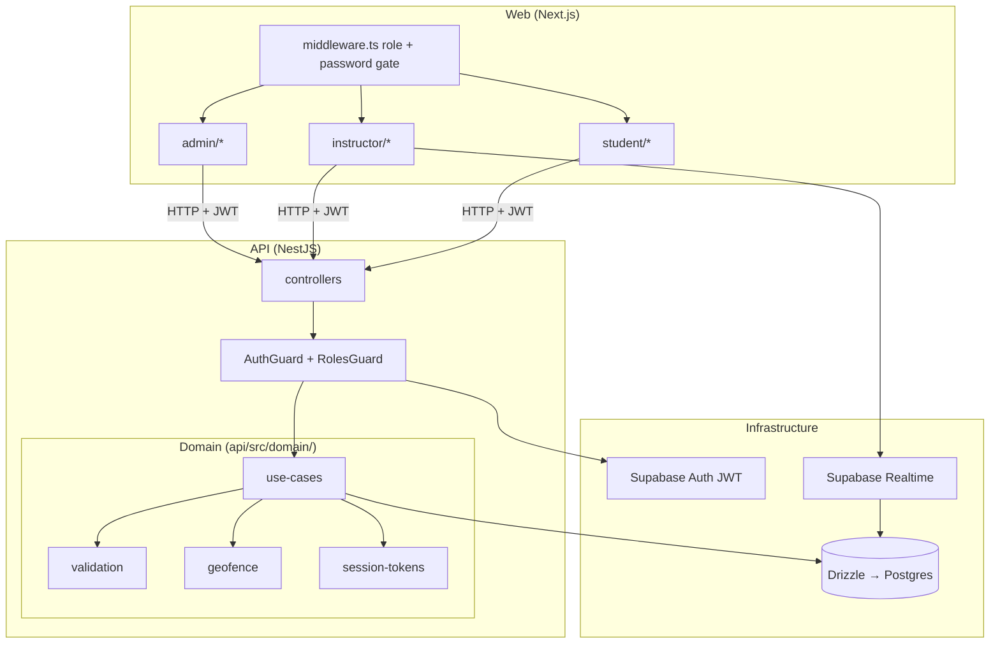

# 1. Design Paradigm

**Split-stack monorepo:** Next.js web (UI adapters + Supabase SSR auth + Realtime subscribe) and **NestJS API** (domain + REST). One repo, two deployable units. Business rules live only in `api/src/domain/`; web never mutates domain tables.

**Dependency rule:** `web/` → HTTP → `api/` controllers → `api/src/domain/` → `api/src/infra/` → external SDKs. Domain never imports from `web/`. Web may read via RSC using Supabase client (RLS); domain writes only through API.
