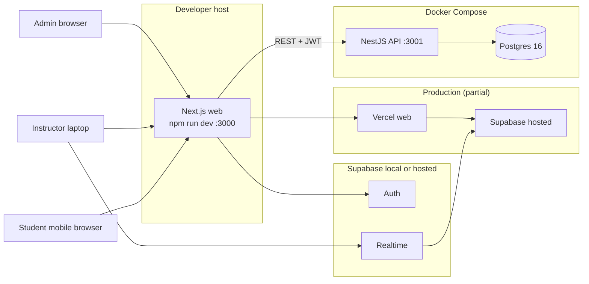
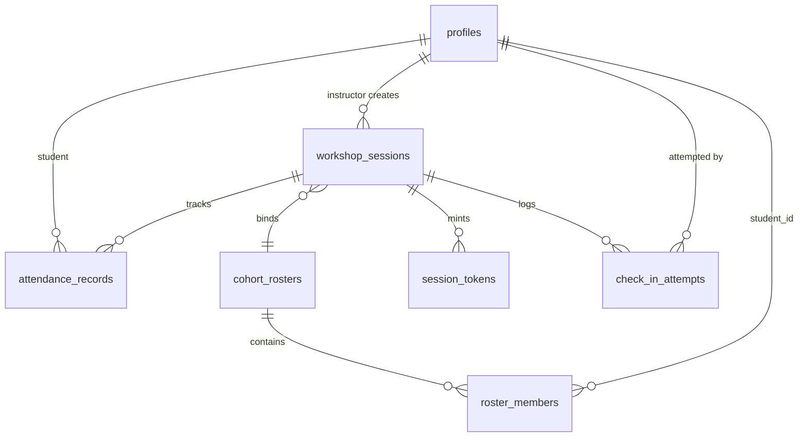
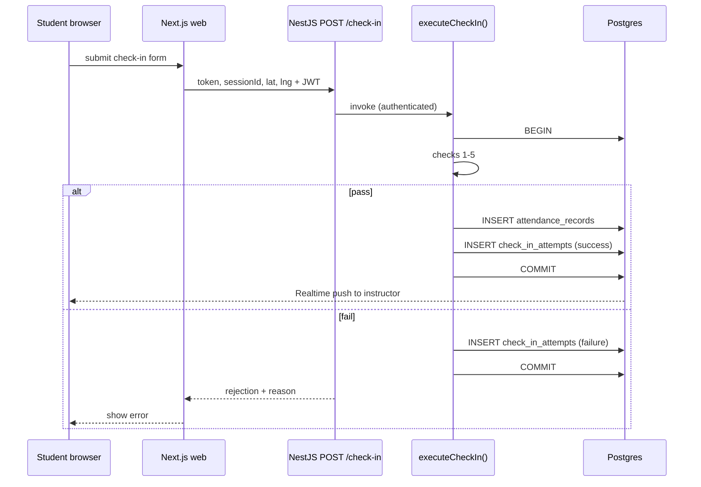

# 9. Structural Seed

## Deployment topology



## Core entity model



Key columns (seed — code owns detail):

| Table | Purpose |
| --- | --- |
| `profiles` | `id` (= auth.users.id), `role`, `student_id?`, `full_name`, `must_change_password` |
| `cohort_rosters` | Named roster for session binding |
| `roster_members` | `(roster_id, student_id)` membership |
| `workshop_sessions` | `title`, `scheduled_at`, `status`, `roster_id`, `geofence_lat/lng`, `radius_m`, `instructor_id` |
| `session_tokens` | `session_id`, `token`, `expires_at` |
| `attendance_records` | `session_id`, `student_id`, `status`, `checked_in_at`, `source` |
| `check_in_attempts` | Append-only audit of all attempts |

## Source tree

```text
hesd-attendance/                    # repo root
  app/                              # Next.js web (AD-7 role routes)
    (admin)/
    (instructor)/
    (student)/
    auth/
  api/                              # NestJS API (AD-15)
    src/
      domain/
        check-in/execute-check-in.ts   # AD-5 orchestrator
        check-in/mint-session-token.ts
        check-in/geofence.ts           # AD-10 haversine
        accounts/
        rosters/
        sessions/
        attendance/manual-override.ts
        export/csv-export.ts
      infra/
        db/schema.ts                   # Drizzle schema
        db/client.ts
      modules/                         # NestJS modules → controllers
      guards/                          # AuthGuard, RolesGuard
    drizzle.config.ts
  lib/supabase/                       # web-only Supabase clients
  components/
  middleware.ts
  supabase/
    migrations/                       # drizzle-kit output
    seed.sql                          # AD-12 bootstrap admin
  docker-compose.yml                  # AD-14 profiles local + integration
  .env / .env.local
```

## Check-in sequence


