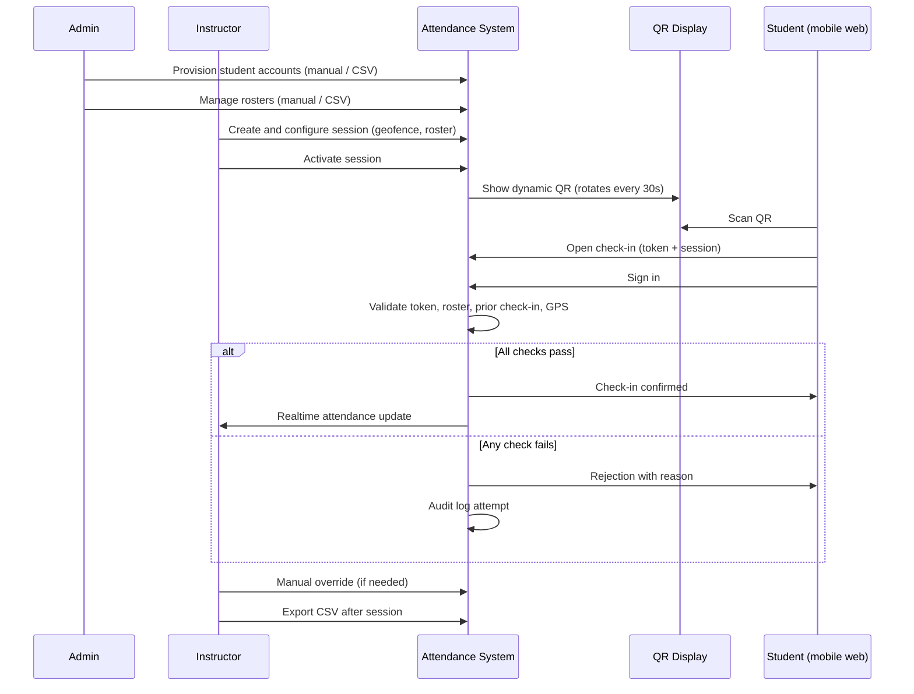

# Architecture Diagrams

## Primary check-in flow

```mermaid
sequenceDiagram
    participant Admin as Admin
    participant Instructor as Instructor
    participant System as Attendance System
    participant Display as QR Display
    participant Student as Student (mobile web)

    Admin->>System: Provision student accounts (manual / CSV)
    Admin->>System: Manage rosters (manual / CSV)
    Instructor->>System: Create and configure session (geofence, roster)
    Instructor->>System: Activate session
    System->>Display: Show dynamic QR (rotates every 30s)
    Student->>Display: Scan QR
    Student->>System: Open check-in (token + session)
    Student->>System: Sign in
    System->>System: Validate token, roster, prior check-in, GPS
    alt All checks pass
        System->>Student: Check-in confirmed
        System->>Instructor: Realtime attendance update
    else Any check fails
        System->>Student: Rejection with reason
        System->>System: Audit log attempt
    end
    Instructor->>System: Manual override (if needed)
    Instructor->>System: Export CSV after session
```
