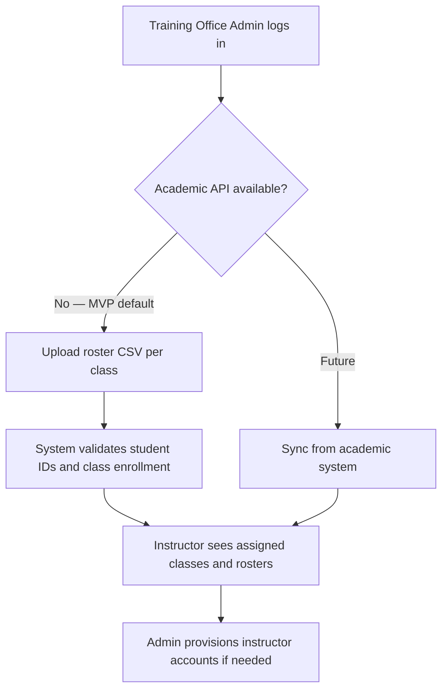
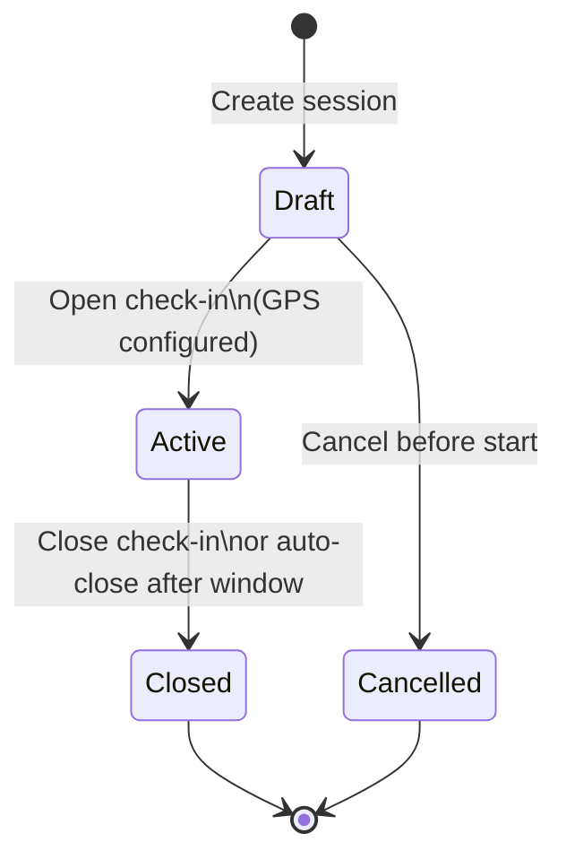
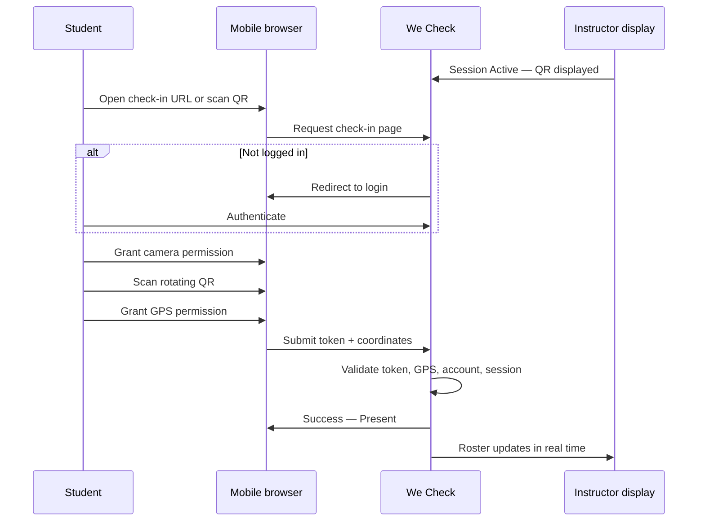
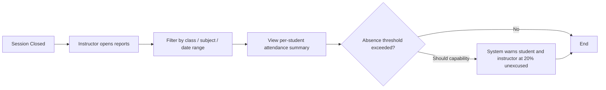

# We Check — Business Workflow

End-to-end business flows for **We Check**, the digital attendance and session check-in system for HESD workshop cohorts (100–150 participants per session). Describes who does what, in what order, and how exceptions are handled before implementation detail in technical and UI documents.

**Related documents:** [Project overview](./00-project-overview.md) · [Stakeholders and scope](./01-stakeholders-scope.md) · [Functional requirements](./03-functional-requirements.md) · [Business rules](./04-business-rules.md) · [State machine](./05-state-machine.md) · [MVP BRD prompt](./prompt.md)

---

## 1. Business Workflow Overview

We Check replaces manual roll call with four primary business processes:

| Process | Primary actor | Trigger | Outcome |
| --- | --- | --- | --- |
| System setup and roster preparation | `TrainingOfficeAdmin` | New cohort or term start | Users provisioned; class rosters available for instructors |
| Session preparation and live check-in | `Instructor` | Scheduled workshop session | Session moves `Draft` → `Active` → `Closed`; attendance recorded |
| Student mobile check-in | `Student` | Instructor opens live session | Student attendance moves `Pending` → `Present` (or rejection outcome) |
| Reporting and export | `Instructor`, `TrainingOfficeAdmin` | Session closed or periodic review | Attendance visible by class/subject; CSV exported for academic systems |

All flows assume authenticated users except the login step itself. Unauthenticated access to check-in is redirected to login per [FR-02](./03-functional-requirements.md).

---

## 2. Actors and Touchpoints

| Actor | Touchpoints in MVP | System surfaces |
| --- | --- | --- |
| `Student` | Login; grant camera/GPS; scan QR; view personal attendance history | Mobile web check-in page; student attendance history |
| `Instructor` | Create session; set room GPS; open/close session; display QR; monitor roster; manual corrections; class reports | Instructor dashboard; session detail; projection-friendly QR view |
| `TrainingOfficeAdmin` | User provisioning; roster import; policy configuration; institution-wide reports; CSV export | Admin console |
| `ITOperations` | Hosting, monitoring, incident response | Operational runbooks only — no in-app business UI in MVP |

Cross-reference: stakeholder responsibilities in [01-stakeholders-scope.md](./01-stakeholders-scope.md).

---

## 3. Pre-Session Setup Workflow

Training office and instructors prepare data before the first live check-in of a cohort.

### 3.1 User and roster provisioning

| Step | Actor | Action | Business rule / requirement |
| --- | --- | --- | --- |
| 1 | `TrainingOfficeAdmin` | Creates or imports student and instructor accounts | [FR-01](./03-functional-requirements.md) |
| 2 | `TrainingOfficeAdmin` | Uploads roster CSV (student ID, name, class, subject) when API unavailable | [FR-03](./03-functional-requirements.md) |
| 3 | System | Validates duplicate IDs and enrollment mapping | [FR-03](./03-functional-requirements.md) |
| 4 | `Instructor` | Confirms roster for assigned class before first session | [FR-04](./03-functional-requirements.md) |

**Completion criteria:** Every enrolled student appears on the class roster; instructor can create a session linked to that class and subject.

### 3.2 Room and session preparation

| Step | Actor | Action | Notes |
| --- | --- | --- | --- |
| 1 | `Instructor` | Creates session in `Draft` state linked to class, subject, scheduled start time | Session cannot go `Active` without room GPS ([BR-07](./04-business-rules.md)) |
| 2 | `Instructor` | Enters room GPS coordinates (latitude, longitude) | May use map picker or known venue coordinates |
| 3 | `Instructor` | Optionally overrides GPS radius (default **100 m**) | Wider radius for large halls; narrower for small rooms |
| 4 | `Instructor` | Reviews enrolled roster count (100–150 expected) | Confirms headcount matches physical cohort |

---

## 4. Live Session Workflow

The core workshop flow: instructor opens check-in, students scan rotating QR, system records attendance in real time.

### 4.1 Session lifecycle (instructor)

| Step | Actor | Action | System behavior |
| --- | --- | --- | --- |
| 1 | `Instructor` | Opens session (`Draft` → `Active`) | Server begins issuing 30-second QR tokens; attendance window starts |
| 2 | `Instructor` | Displays QR on projector or shared screen | QR image refreshes every 30 seconds; countdown visible |
| 3 | `Instructor` | Monitors live roster (who is `Present` vs `Pending`) | Should-capability dashboard if schedule allows ([01-stakeholders-scope.md](./01-stakeholders-scope.md) §2.1.2) |
| 4 | `Instructor` | Handles exceptions via manual status edit | Audit log records change ([FR-11](./03-functional-requirements.md)) |
| 5 | `Instructor` | Closes session (`Active` → `Closed`) | Check-in window ends; roster frozen except manual edits within policy |
| 6 | System | Auto-marks remaining `Pending` as `Absent` when window closes | Late scans after window rejected unless instructor extends ([BR-01](./04-business-rules.md)) |

**Attendance window:** From session open until **10 minutes** after scheduled start time. Scans after that mark `Absent` unless instructor manually extends the window or corrects status.

### 4.2 Student check-in (happy path)

| Step | Actor | Action | Validation |
| --- | --- | --- | --- |
| 1 | `Student` | Opens mobile browser to check-in entry point | Responsive web; iOS 15+ Safari, Android 10+ Chrome |
| 2 | `Student` | Logs in if session not established | [FR-02](./03-functional-requirements.md) |
| 3 | `Student` | Grants camera access and scans current QR | Token must be `Valid` (within 30 s) |
| 4 | `Student` | Grants GPS access; device sends coordinates | Compared to room point within configured radius |
| 5 | System | Records `Present`; consumes QR token | One check-in per account per session; token one-time-use |
| 6 | `Student` | Sees confirmation in Vietnamese | Target: under 30 seconds per person |

### 4.3 Check-in rejection paths

When validation fails, the student receives an actionable message in Vietnamese. Instructor may intervene manually.

| Outcome | Typical cause | Student message (concept) | Instructor action |
| --- | --- | --- | --- |
| `ExpiredQr` | Scan after 30 s token lifetime | QR expired — scan the new code on screen | Wait for QR refresh; retry |
| `OutOfRadius` | GPS outside session radius | Outside allowed area — move closer to room | Verify room coordinates; adjust radius if legitimate |
| `GpsDisabled` | Permission denied or GPS off | Enable GPS and location permission | Manual attendance if device cannot comply |
| `DuplicateCheckIn` | Second attempt same session | Already checked in | None — expected |
| `Unauthenticated` | No valid session | Redirect to login | None |
| `SessionNotActive` | Session `Closed` or `Draft` | Check-in not open | Confirm session is `Active` |
| `SpoofSuspected` | Mock location or anomaly flags | Check-in blocked — see instructor | Review log; manual override to `Present` if legitimate |

Detailed state transitions: [05-state-machine.md](./05-state-machine.md). Enforcement rules: [04-business-rules.md](./04-business-rules.md).

### 4.4 Anti-proxy and anti-spoofing (business view)

| Control | Business intent | Workflow effect |
| --- | --- | --- |
| Rotating 30 s QR | Prevents screenshot sharing across time | Student must scan live code displayed in room |
| One-time-use token | Prevents two students using same scan | Second scan of same token rejected; logged |
| One check-in per account | Prevents credential sharing | Duplicate account attempt returns conflict |
| GPS radius check | Proves physical presence in venue | Out-of-radius rejected; coordinates not stored after success |
| Spoof baseline | Deters obvious fake GPS | Suspicious attempts flagged; instructor may override |

Cross-reference: [FR-06](./03-functional-requirements.md), [FR-07](./03-functional-requirements.md), [FR-08](./03-functional-requirements.md).

---

## 5. Exception and Manual Correction Workflow

Instructors resolve edge cases without breaking audit integrity.

### 5.1 Manual attendance correction

| Condition | Actor | Action | Constraint |
| --- | --- | --- | --- |
| Student lacks smartphone or battery dead | `Instructor` | Sets status to `Present` or `Excused` manually | Audit log: actor, timestamp, old → new status |
| GPS failure in valid on-site student | `Instructor` | Overrides `Rejected` → `Present` | Document reason in optional note field |
| Late arrival within policy | `Instructor` | Extends window or changes `Absent` → `Present` | Within 24 hours of session close for instructor |
| Correction after 24 hours | `TrainingOfficeAdmin` | Admin override on attendance record | Audit log required |

Manual edits apply to statuses: `Present`, `Absent`, `Excused`, `Rejected` → as permitted by role. See [FR-11](./03-functional-requirements.md) and [BR-10](./04-business-rules.md).

### 5.2 Network retry (student)

| Step | Behavior |
| --- | --- |
| 1 | Client retries failed check-in API call up to **3 times** within **30 seconds** |
| 2 | If still failing, student sees network error with retry guidance |
| 3 | Instructor may record manual `Present` if student is on-site |

Offline queue is out of MVP scope; network retry only ([01-stakeholders-scope.md](./01-stakeholders-scope.md) §2.2).

---

## 6. Post-Session Reporting Workflow

### 6.1 Instructor class and subject reports

| Step | Actor | Action | Output |
| --- | --- | --- | --- |
| 1 | `Instructor` | Navigates to attendance reports for owned classes | Per-session and aggregate views |
| 2 | `Instructor` | Reviews `Present` / `Absent` / `Excused` counts | Supports sponsor and internal review |
| 3 | System | Computes unexcused absence rate per subject | Excused absences excluded from threshold ([BR-05](./04-business-rules.md)) |

Target: report available within **10 minutes** of session close ([OBJ-03](./00-project-overview.md)).

### 6.2 Training office export

| Step | Actor | Action | Constraint |
| --- | --- | --- | --- |
| 1 | `TrainingOfficeAdmin` | Opens institution-wide attendance reports | Full read across cohorts |
| 2 | `TrainingOfficeAdmin` | Selects export scope (class, subject, date range) | Filters match on-screen report |
| 3 | `TrainingOfficeAdmin` | Downloads CSV | **Training office admin only** ([BR-09](./04-business-rules.md), [FR-13](./03-functional-requirements.md)) |
| 4 | `TrainingOfficeAdmin` | Imports CSV into downstream academic system | Manual process in MVP |

---

## 7. Operational and Escalation Workflow

| Situation | First responder | Escalation |
| --- | --- | --- |
| Individual check-in failure (expired QR, GPS) | `Instructor` at session | Manual correction if needed |
| Widespread check-in failure (many students rejected) | `Instructor` pauses; checks room GPS and radius | `ITOperations` if system error suspected |
| System unavailable during live session | `Instructor` uses manual attendance fallback | `ITOperations` incident response — target **0 minutes** unplanned downtime ([SM-02](./00-project-overview.md)) |
| Data dispute or policy exception | `TrainingOfficeAdmin` | Training office leadership |
| Privacy or consent question | `TrainingOfficeAdmin` | Legal review with `ITOperations` support |

`ITOperations` does not use in-app business screens in MVP; monitoring and runbooks are defined in [07-non-functional-risk.md](./07-non-functional-risk.md).

---

## 8. Workflow Summary Matrix

| Workflow | Start state | End state | Key FR references |
| --- | --- | --- | --- |
| Roster import | Empty class | Populated roster | FR-01, FR-03 |
| Session open | `Draft` | `Active` | FR-04, FR-05 |
| Student check-in | `Pending` | `Present` or rejection | FR-02, FR-06, FR-07, FR-08 |
| Session close | `Active` | `Closed` | FR-05 |
| Manual correction | Any attendance status | Updated status + audit | FR-11 |
| Instructor report | `Closed` session | Report viewed | FR-12 |
| CSV export | Report filtered | CSV file downloaded | FR-13 |

---

## 9. Future Consideration

The following workflow enhancements are deferred from MVP:

| Item | Impact on workflow |
| --- | --- |
| SSO / campus identity | Removes separate login; changes setup workflow |
| PIN-based fallback | Alternative path when student device unavailable |
| WiFi BSSID verification | Additional step in check-in validation for indoor accuracy |
| Academic API sync | Replaces manual CSV roster import |
| Offline check-in queue | Student workflow continues without immediate connectivity |

See [01-stakeholders-scope.md](./01-stakeholders-scope.md) §2.3 for full list and triggers.
