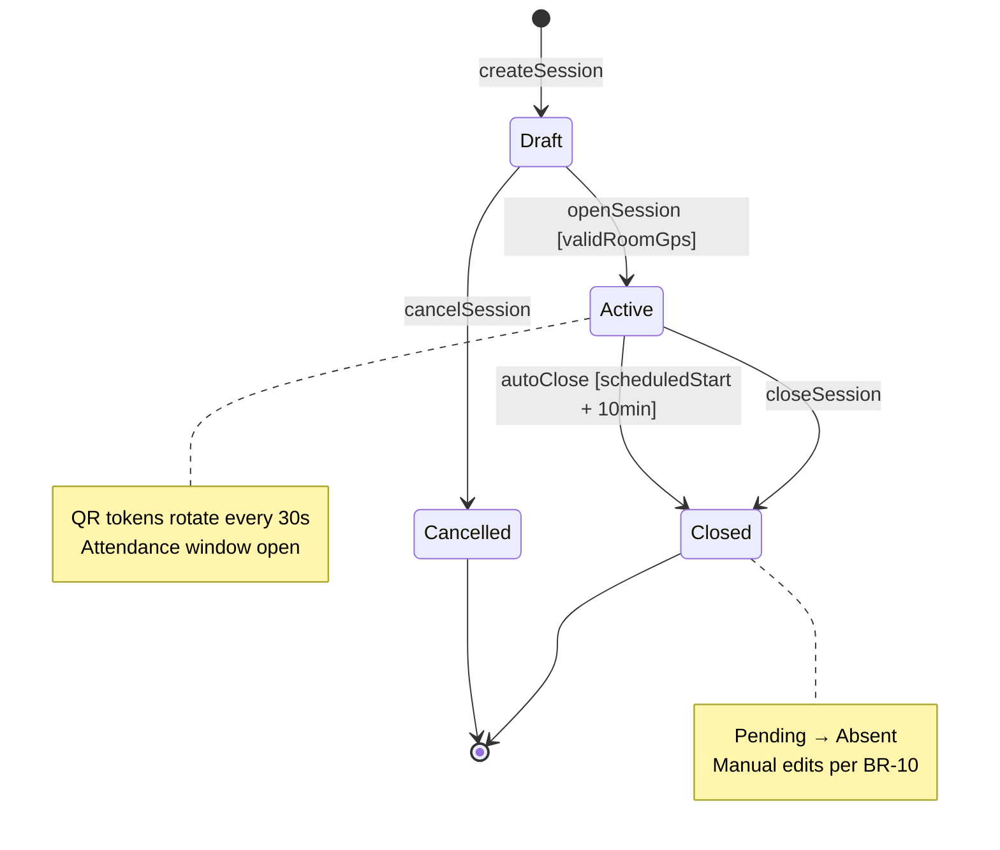
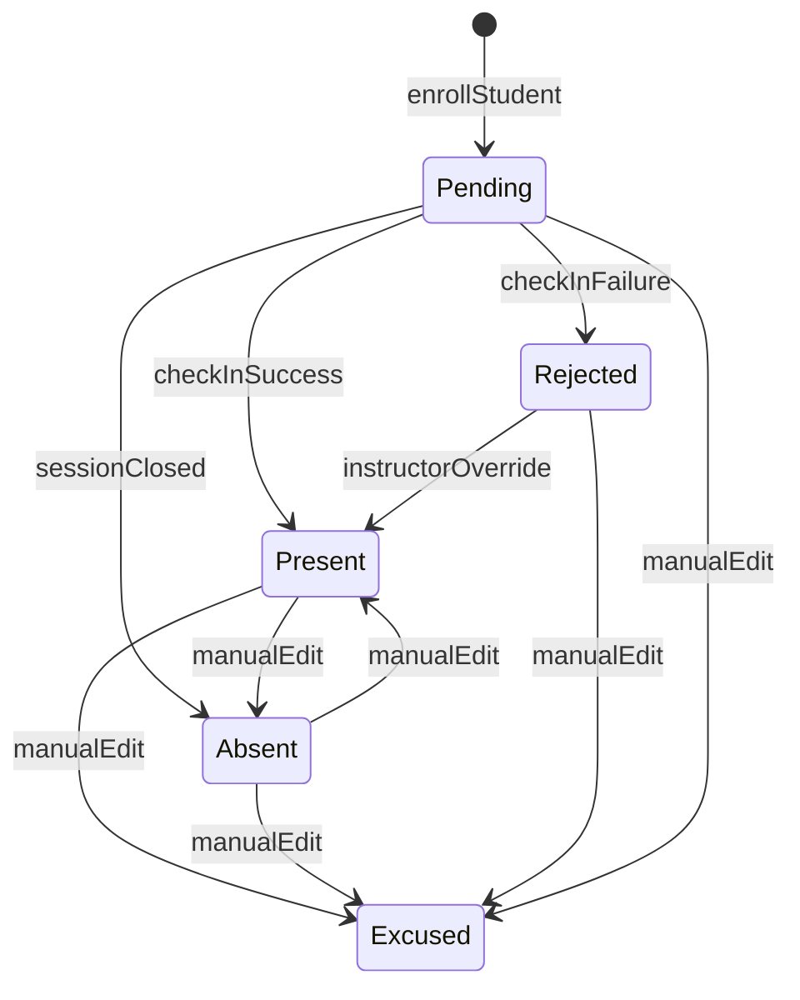
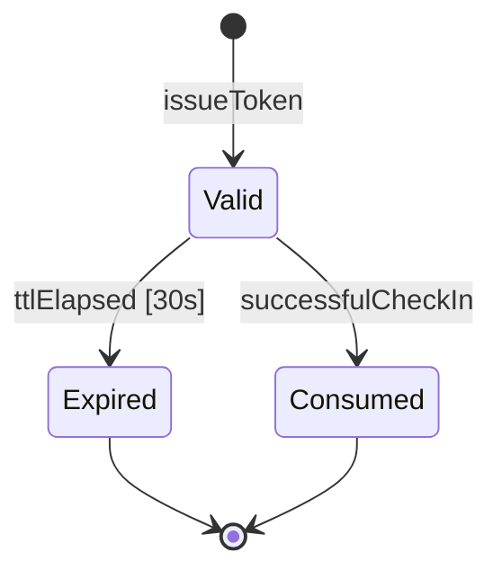
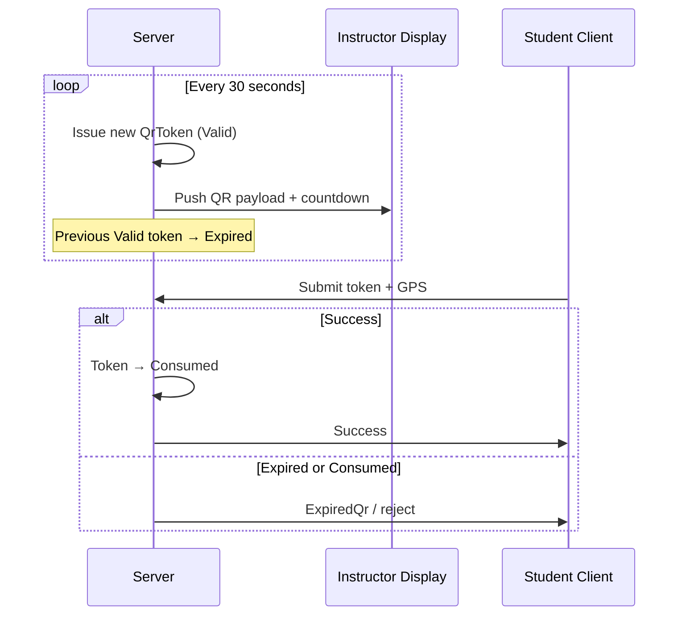
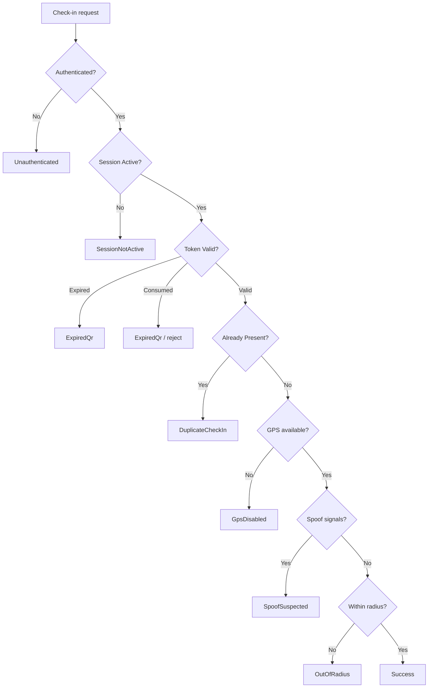

# We Check — State Machine

Canonical state definitions and allowed transitions for **We Check** MVP. State names match [prompt.md](./prompt.md) §4 and are enforced by business rules in [04-business-rules.md](./04-business-rules.md).

**Related documents:** [Business workflow](./02-business-workflow.md) · [Functional requirements](./03-functional-requirements.md) · [Business rules](./04-business-rules.md) · [Domain model](./06-domain-model.md)

---

## 1. State Machine Overview

We Check maintains four independent state domains:

| Domain | Entity | States | Terminal states |
| --- | --- | --- | --- |
| Session lifecycle | `Session` | `Draft`, `Active`, `Closed`, `Cancelled` | `Closed`, `Cancelled` |
| Per-student attendance | `AttendanceRecord` | `Pending`, `Present`, `Absent`, `Excused`, `Rejected` | None (editable per [BR-10](./04-business-rules.md#br-10--manual-attendance-edit-window)) |
| Rotating QR token | `QrToken` | `Valid`, `Expired`, `Consumed` | `Expired`, `Consumed` |
| Check-in API outcome | `CheckInAttempt` | Ephemeral result codes | N/A (not persisted as long-lived state) |

---

## 2. Session Lifecycle State Machine

### 2.1 States and meanings

| State | Meaning | Entry condition |
| --- | --- | --- |
| `Draft` | Session created with class, subject, schedule, and room GPS configured; check-in not yet open | Instructor creates session ([FR-04](./03-functional-requirements.md)) |
| `Active` | QR tokens issued; students may check in within attendance window | Instructor opens session; [BR-07](./04-business-rules.md#br-07--session-activation-requires-room-gps) satisfied |
| `Closed` | Check-in window ended; roster frozen except manual edits | Instructor closes or auto-close per [BR-01](./04-business-rules.md#br-01--attendance-window-and-auto-close) |
| `Cancelled` | Session abandoned before meaningful attendance | Instructor cancels from `Draft` (or policy allows cancel from `Active` before first check-in — MVP: cancel from `Draft` only) |

### 2.2 Transition diagram

### 2.3 Transition table

| From | Event / trigger | Guard | To | Side effects |
| --- | --- | --- | --- | --- |
| — | `createSession` | Valid class, subject, schedule | `Draft` | Create `Pending` attendance per enrolled student |
| `Draft` | `openSession` | Room GPS valid ([BR-07](./04-business-rules.md#br-07--session-activation-requires-room-gps)) | `Active` | Set `openedAt`; start QR issuance; attendance window starts |
| `Draft` | `cancelSession` | Instructor owns session | `Cancelled` | No attendance finalization |
| `Active` | `closeSession` | Instructor action | `Closed` | Set `closedAt`; finalize `Pending` → `Absent` |
| `Active` | `autoClose` | `now` ≥ `scheduledStart` + 10 min | `Closed` | Same as manual close |
| `Closed` | — | MVP | `Closed` | Terminal — no reopen in MVP |
| `Cancelled` | — | — | `Cancelled` | Terminal |

**Attendance window:** Open from `openedAt` until `min(manualClosedAt, scheduledStart + 10 minutes)`.

---

## 3. Attendance Record State Machine

### 3.1 States and meanings

| State | Meaning |
| --- | --- |
| `Pending` | Student enrolled; no successful check-in while session is `Active` |
| `Present` | Successful QR + GPS + auth verification, or instructor manual mark |
| `Absent` | Window closed without successful check-in |
| `Excused` | Instructor or admin marked excused absence; excluded from [BR-05](./04-business-rules.md#br-05--automatic-absence-threshold-warning-should) numerator |
| `Rejected` | Failed automated check-in (expired QR, out of radius, spoof suspected); may be overridden to `Present` |

### 3.2 Transition diagram

### 3.3 Transition table

| From | Event | Guard | To | Actor / system |
| --- | --- | --- | --- | --- |
| — | `enrollStudent` | Student on class roster | `Pending` | System on session create |
| `Pending` | `checkInSuccess` | All check-in rules pass | `Present` | System |
| `Pending` | `checkInFailure` | Any rule fails (logged) | `Rejected` or remain `Pending` | System — policy: failed attempts logged; status `Rejected` when attempt is final for that failure class |
| `Pending` | `sessionClosed` | Session → `Closed` | `Absent` | System ([BR-01](./04-business-rules.md#br-01--attendance-window-and-auto-close)) |
| `Rejected` | `instructorOverride` | Physical verification | `Present` | `Instructor` ([FR-10](./03-functional-requirements.md)) |
| Any | `manualEdit` | [BR-10](./04-business-rules.md#br-10--manual-attendance-edit-window) window | Target status | `Instructor`, `TrainingOfficeAdmin` |

**Note:** While session is `Active`, a failed check-in does not always change `Pending` to `Rejected` immediately if the student may retry (e.g., `ExpiredQr`). After session `Closed`, only manual edits change status.

---

## 4. QR Token State Machine

### 4.1 States and meanings

| State | Meaning |
| --- | --- |
| `Valid` | Issued, within 30-second window, not yet consumed |
| `Expired` | Past 30 seconds from `issuedAt`; rejected on scan |
| `Consumed` | Used for exactly one successful check-in |

### 4.2 Transition diagram

### 4.3 Token rotation (while session `Active`)

| From | Event | Guard | To |
| --- | --- | --- | --- |
| — | `issueToken` | Session `Active` | `Valid` |
| `Valid` | `ttlElapsed` | `now` > `issuedAt` + 30 s | `Expired` |
| `Valid` | `successfulCheckIn` | Student passes all rules | `Consumed` |
| `Valid` | `failedCheckIn` | Non-success outcome | `Valid` (token remains usable by another student until consumed or expired) |

Only one successful consumption per token ([BR-11](./04-business-rules.md#br-11--one-time-use-qr-token-consumption)).

---

## 5. Check-In Attempt Outcomes

Ephemeral result codes returned to the client and logged in `CheckInAttempt`. Not a persisted entity state machine, but a deterministic outcome enum.

| Outcome | Condition | HTTP semantics (API) | User-facing action |
| --- | --- | --- | --- |
| `Success` | All rules pass | 200 | Show confirmation |
| `ExpiredQr` | [BR-03](./04-business-rules.md#br-03--qr-token-30-second-validity) | 400 | Scan fresh QR |
| `OutOfRadius` | [BR-02](./04-business-rules.md#br-02--gps-radius-verification) | 400 | Move within range or ask instructor |
| `DuplicateCheckIn` | [BR-04](./04-business-rules.md#br-04--one-successful-check-in-per-student-per-session) | 409 | None — already checked in |
| `GpsDisabled` | [BR-12](./04-business-rules.md#br-12--gps-permission-required) | 400 | Enable GPS permission |
| `Unauthenticated` | [BR-06](./04-business-rules.md#br-06--authentication-required-before-check-in) | 401 | Login |
| `SessionNotActive` | Session not `Active` or outside window | 403 | Wait for instructor or session ended |
| `SpoofSuspected` | [FR-10](./03-functional-requirements.md) mock-location signals | 400 | See instructor for manual verify |

### 5.1 Outcome flow

---

## 6. Cross-Domain Coordination

| Session state | QR issuance | Student check-in | Attendance default on close |
| --- | --- | --- | --- |
| `Draft` | None | Blocked (`SessionNotActive`) | N/A |
| `Active` | Rotating `Valid` tokens | Allowed per rules | N/A |
| `Closed` | Stopped | Blocked | `Pending` → `Absent` |
| `Cancelled` | None | Blocked | No finalize — records may be deleted or left `Pending` per admin policy; MVP: leave `Pending`, exclude from reports |

---

## 7. Future Consideration

| Enhancement | State impact |
| --- | --- |
| Session reopen after `Closed` | New transition `Closed` → `Active` with audit — not in MVP |
| Offline check-in queue | New `CheckInAttempt` sub-states: `Queued`, `Synced` |
| Multi-factor step before `Present` | Additional guard on `Pending` → `Present` |
| Token pause during network outage | Instructor-controlled freeze of `Expired` transitions |
