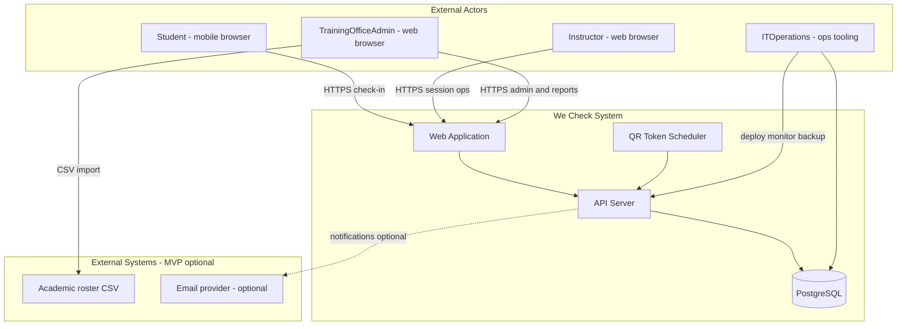
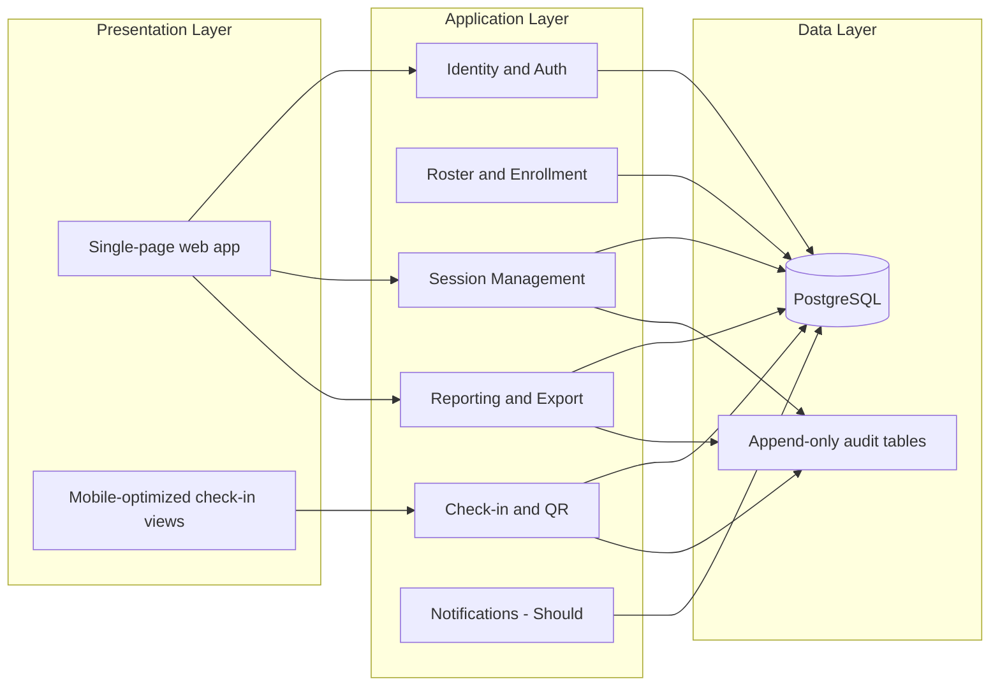

# We Check — System Overview

Technical system overview for **We Check**, a digital attendance and session check-in platform for the Harness Engineering for Software Development (HESD) workshop program and institutional training office operations. This document describes system context, logical architecture, runtime boundaries, and cross-cutting concerns for MVP implementation.

**Related documents:** [BRD prompt](../brds/prompt.md) · [Functional requirements](../brds/03-functional-requirements.md) · [Domain model (BRD)](../brds/06-domain-model.md) · [Roles and permissions](./01-roles-permissions.md) · [Module breakdown](./02-module-breakdown.md) · [Non-functional requirements](../brds/07-non-functional-risk.md)

---

## 1. System Overview

**We Check** is a responsive web application that replaces manual roll call with rotating QR check-in, GPS verification, and auditable attendance reporting for cohorts of **100–150 participants per session**. Students check in via mobile browser (no native app install). Instructors create and operate live sessions. Training office administrators provision users, configure policy, and export CSV data.

| Attribute | Value |
| --- | --- |
| Product name | We Check |
| Domain | Digital attendance and session check-in for educational workshops and classes |
| Organization context | HESD workshop program and Phòng Đào Tạo (training office) |
| Primary locale | Vietnamese (`vi-VN`) for user-facing copy; English for technical identifiers |
| MVP cohort size | 100–150 attendees per session |
| Check-in completion target | Entire cohort within **5 minutes** ([NFR-01](../brds/07-non-functional-risk.md)) |
| Report availability target | Within **10 minutes** after session close ([FR-12](../brds/03-functional-requirements.md)) |
| Session downtime target | **0 minutes** during live workshops |
| Delivery platform | Responsive web; mobile web for student check-in |

### 1.1 Problem and solution summary

Manual attendance consumes 15–30 minutes per session, interrupts teaching, lacks identity verification, and enables proxy check-in. We Check centralizes session lifecycle, issues **30-second** rotating QR tokens, validates device GPS against room coordinates (default **100 m** radius, instructor-adjustable), enforces one check-in per student account per session ([BR-04](../brds/04-business-rules.md)), and produces class/subject reports with admin-only CSV export ([BR-09](../brds/04-business-rules.md)).

### 1.2 Primary actors and system boundary

| Actor | System interaction | In-app access (MVP) |
| --- | --- | --- |
| `Student` | Mobile web check-in, personal attendance history | Yes |
| `Instructor` | Session management, QR display, live monitor, manual edits, assigned reports | Yes |
| `TrainingOfficeAdmin` | User/roster admin, institution-wide reports, CSV export, policy config | Yes |
| `ITOperations` | Hosting, monitoring, incident response | No business UI; operational runbooks only |

Authorization model: [01-roles-permissions.md](./01-roles-permissions.md).

### 1.3 Core capabilities mapped to functional requirements

| Capability | FR references | Business rules |
| --- | --- | --- |
| Identity and authentication | FR-01, FR-02 | BR-06 |
| Roster import and enrollment | FR-03 | — |
| Session lifecycle | FR-04, FR-05 | BR-01, BR-07 |
| Rotating QR and check-in | FR-06, FR-07, FR-08, FR-09 | BR-02, BR-03, BR-04, BR-11, BR-12 |
| Anti-spoofing baseline | FR-10 | — |
| Manual attendance correction | FR-11 | BR-10 |
| Reporting and export | FR-12, FR-13, FR-14 | BR-08, BR-09 |
| Should enhancements | FR-15, FR-16 | BR-05 |

### 1.4 System context diagram

### 1.5 Key runtime flows (summary)

**Session open:** Instructor transitions session `Draft` → `Active` ([FR-05](../brds/03-functional-requirements.md)). Server validates room GPS ([BR-07](../brds/04-business-rules.md)), creates `Pending` attendance records for enrolled students, and starts QR token issuance every **30 seconds** ([FR-06](../brds/03-functional-requirements.md)).

**Student check-in:** Authenticated student scans QR via mobile camera ([FR-07](../brds/03-functional-requirements.md)), client submits token plus device coordinates ([FR-08](../brds/03-functional-requirements.md)). Server validates token state, radius, duplicate rules ([FR-09](../brds/03-functional-requirements.md)), and spoof signals ([FR-10](../brds/03-functional-requirements.md)). On success, attendance becomes `Present` in a single transaction with token consumption ([BR-11](../brds/04-business-rules.md)).

**Session close:** Instructor or auto-close at scheduled start + **10 minutes** ([BR-01](../brds/04-business-rules.md)) sets session `Closed` and remaining `Pending` records to `Absent`. Reports become available per [FR-12](../brds/03-functional-requirements.md).

Detailed workflows: [06-main-workflows.md](./06-main-workflows.md) (phase 2).

---

## 2. Architecture

### 2.1 Logical architecture

We Check MVP follows a **modular monolith** or **single API service with separate web client** pattern suitable for pilot scale (100–150 concurrent check-ins per session, multiple sessions possible). Components are logically separated for clear ownership and future extraction if load grows.

Module responsibilities and dependencies: [02-module-breakdown.md](./02-module-breakdown.md).

### 2.2 Deployment view (MVP)

| Tier | Responsibility | Notes |
| --- | --- | --- |
| Web client | Static assets + SPA; camera/GPS via browser APIs | Served over HTTPS; no native wrappers |
| API server | REST (or REST-like) JSON API; session auth; business logic | Stateless; horizontal scale behind load balancer |
| Database | Primary persistence for users, sessions, attendance, audit | PostgreSQL recommended; Vietnam-region hosting |
| Background worker (optional) | QR expiry cleanup, absence threshold jobs ([FR-16](../brds/03-functional-requirements.md)) | May run in-process for MVP |

IT Operations owns deployment topology, TLS termination, backups, and monitoring. No in-app IT dashboard in MVP.

### 2.3 Data and privacy architecture

| Data class | Retention (MVP) | Rationale |
| --- | --- | --- |
| User profile and enrollment | Term of program + audit period | FR-01, FR-03 |
| Session and attendance records | Academic reporting lifecycle | FR-12, FR-13 |
| Raw GPS coordinates from client | **Not persisted** after successful validation | FR-08, BR-02, BR-12 |
| Check-in attempt metadata | Security/support window; distance and spoof flags only | FR-10 |
| Audit logs (attendance edits, exports) | Append-only; minimum 1 academic year | BR-09, BR-10 |

Compliance baseline aligns with Vietnam personal data protection (NĐ 13/2023) per [07-non-functional-risk.md](../brds/07-non-functional-risk.md).

### 2.4 Integration boundaries

| Integration | MVP behavior | Future consideration |
| --- | --- | --- |
| Academic student information system | CSV roster import when API unavailable ([FR-03](../brds/03-functional-requirements.md)) | Real-time API sync |
| Campus SSO / IdP | Email/password authentication ([FR-02](../brds/03-functional-requirements.md)) | SSO federation |
| Email notifications | In-app notifications for absence warnings ([FR-16](../brds/03-functional-requirements.md)) | Optional email delivery |
| Downstream academic systems | CSV export by training office admin ([FR-13](../brds/03-functional-requirements.md)) | Automated push integration |

### 2.5 Cross-cutting concerns

| Concern | Approach | References |
| --- | --- | --- |
| Authentication | Server-side session; 8-hour inactivity expiry ([FR-02](../brds/03-functional-requirements.md)) | [01-roles-permissions.md](./01-roles-permissions.md) |
| Authorization | Role-based access control at API and UI route level | BR-08, BR-09 |
| Concurrency | Database transactions for check-in; optimistic locking on attendance records | BR-04, BR-11 |
| Localization | `vi-VN` UI strings; stable English API error codes | product-meta locale |
| Observability | Structured logs for check-in outcomes; export and edit audit trails | NFR docs |
| Resilience | Client retry on transient network failure; no offline queue in MVP | prompt.md §2.3 |

### 2.6 Technology stack (summary)

Detailed stack selection: [12-backend-frontend-tech-stack.md](./12-backend-frontend-tech-stack.md) (phase 2). MVP constraints:

- Responsive web targeting iOS 15+ Safari and Android 10+ Chrome for check-in.
- HTTPS/TLS 1.2+ for all client-server traffic.
- Primary data store in Vietnam-region infrastructure per organizational policy.

### 2.7 Out of scope (MVP)

| Excluded | Rationale |
| --- | --- |
| Native iOS/Android apps | Mobile web only ([prompt.md](../brds/prompt.md) §2.3) |
| Facial recognition, tuition, exam scheduling | Unrelated domains |
| Offline check-in queue | Network retry only |
| In-app IT operations console | IT uses external tooling |

---

## 3. Future Consideration

| Enhancement | Architectural impact |
| --- | --- |
| SSO / campus IdP | External auth broker; federated identity on `User` |
| WiFi BSSID verification | Additional check-in validation signal in `CheckInAttempt` |
| Microservices split | Extract check-in hot path if load exceeds monolith capacity |
| Real-time WebSocket dashboard | Push updates for [FR-15](../brds/03-functional-requirements.md) instead of polling |
| Multi-region active-active | Beyond pilot; single-region sufficient for MVP |
| CDN for QR images | If projection display latency becomes an issue at scale |
