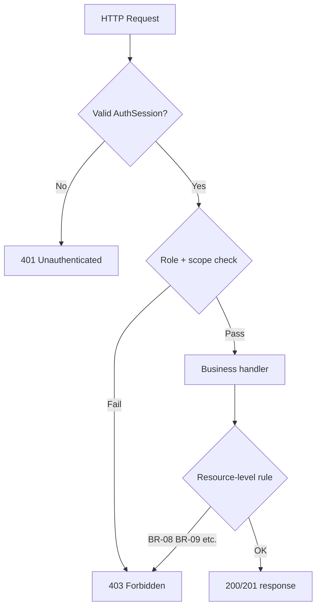

# We Check — Roles and Permissions

Role-based access control (RBAC) specification for **We Check** MVP. Defines actors, permission vocabulary, enforcement points, and traceability to functional requirements and business rules. Implementation must deny by default when a permission is not explicitly granted.

**Related documents:** [BRD prompt](../brds/prompt.md) · [Stakeholders and scope](../brds/01-stakeholders-scope.md) · [Functional requirements](../brds/03-functional-requirements.md) · [Business rules](../brds/04-business-rules.md) · [System overview](./00-system-overview.md) · [Module breakdown](./02-module-breakdown.md)

---

## 1. Roles

### 1.1 Role catalog

MVP assigns **exactly one role per user account**. Role is stored on the `User` entity and evaluated on every authenticated API request ([06-domain-model.md](../brds/06-domain-model.md) §3.1).

| Role enum | Actor label | Description | In-app UI (MVP) |
| --- | --- | --- | --- |
| `Student` | Student | Enrolled participant who checks in via mobile web and views own attendance history | Check-in flow, personal history |
| `Instructor` | Instructor / Facilitator | Assigned teacher who creates and operates sessions for owned class-subject pairs | Session management, QR display, live monitor, manual edits, scoped reports |
| `TrainingOfficeAdmin` | Training Office Admin | Institution administrator with system-wide visibility and data export authority | User admin, roster import, all reports, CSV export, policy config |
| `ITOperations` | IT Operations | Infrastructure operator | **No in-app business UI**; external ops runbooks only |

`ITOperations` is an organizational actor for hosting and incident response ([01-stakeholders-scope.md](../brds/01-stakeholders-scope.md) §1.1). MVP does not provision `ITOperations` user accounts in the application unless required for break-glass admin; operational access uses infrastructure credentials outside the app.

### 1.2 Role assignment rules

| Rule | Specification | FR reference |
| --- | --- | --- |
| Single role per account | A user has one `role` enum value; no multi-role accounts in MVP | FR-01 |
| Active flag required | `active = false` users cannot authenticate or check in | FR-01 |
| Instructor assignment | Instructor report and session scope derives from `ClassAssignment` records linking instructor to class and subject | BR-08 |
| Student enrollment | Check-in allowed only when `Enrollment` exists for session's class and subject | FR-03 |
| Admin provisioning | Only `TrainingOfficeAdmin` creates, updates, and deactivates user accounts | FR-01 |

### 1.3 Scoped ownership model

Authorization combines **role** with **resource scope**:

| Scope type | Applies to | Resolution |
| --- | --- | --- |
| Self | Student attendance history, own check-in attempts | `userId` matches authenticated user |
| Class-subject assignment | Instructor sessions and reports | `ClassAssignment` matches session `classId` + `subjectId` |
| Institution-wide | Admin reports, user admin, CSV export | `TrainingOfficeAdmin` role only |
| Session creator | Instructor who created session | `Session.instructorId` matches authenticated user |

Instructors may only open, close, display QR for, and edit attendance on sessions they created **or** that belong to a class-subject pair in their `ClassAssignment` (implementation may require creator match for MVP simplicity — see §3.2).

### 1.4 Authentication prerequisites

All in-app permissions except public login page require a valid `AuthSession` ([FR-02](../brds/03-functional-requirements.md), [BR-06](../brds/04-business-rules.md)).

| Condition | Behavior |
| --- | --- |
| No session | Redirect to login; API returns `401 Unauthenticated` |
| Expired session (default 8 h inactivity) | Force re-login |
| Deactivated user | Login rejected; existing sessions invalidated |
| Wrong role for route | `403 Forbidden` with localized message |

Check-in deep links preserve return URL after login ([FR-02](../brds/03-functional-requirements.md)).

---

## 2. Permissions

### 2.1 Permission vocabulary

Permissions use the pattern `resource:action`. API middleware and UI route guards evaluate the same permission set.

| Permission | Description |
| --- | --- |
| `user:read` | View user profile (self or admin list) |
| `user:write` | Create, update, deactivate users |
| `roster:read` | View enrollment roster for assigned or all classes |
| `roster:write` | Import CSV and maintain enrollments |
| `session:read` | View session details and state |
| `session:write` | Create, update, open, close, cancel sessions |
| `qr:display` | Access instructor QR display for active session |
| `checkin:submit` | Submit check-in attempt (student only) |
| `attendance:read` | View attendance records in scope |
| `attendance:write` | Manual attendance status edit |
| `report:read` | View attendance reports in scope |
| `report:export` | Download CSV export |
| `audit:read` | View attendance edit and export audit logs (admin) |
| `notification:read` | View in-app notifications (self) |
| `policy:write` | Configure absence threshold and related policy (admin) |

### 2.2 Role-to-permission matrix

| Permission | Student | Instructor | TrainingOfficeAdmin |
| --- | :---: | :---: | :---: |
| `user:read` (self) | ✓ | ✓ | ✓ |
| `user:read` (all) | | | ✓ |
| `user:write` | | | ✓ |
| `roster:read` (assigned) | | ✓ | ✓ |
| `roster:read` (all) | | | ✓ |
| `roster:write` | | | ✓ |
| `session:read` (scoped) | | ✓ | ✓ |
| `session:write` (scoped) | | ✓ | ✓ |
| `qr:display` (own active session) | | ✓ | |
| `checkin:submit` | ✓ | | |
| `attendance:read` (self) | ✓ | | |
| `attendance:read` (session roster) | | ✓ | ✓ |
| `attendance:write` (instructor window) | | ✓ | |
| `attendance:write` (post-24h) | | | ✓ |
| `report:read` (assigned classes) | | ✓ | |
| `report:read` (institution-wide) | | | ✓ |
| `report:export` | | | ✓ |
| `audit:read` | | | ✓ |
| `notification:read` (self) | ✓ | ✓ | ✓ |
| `policy:write` | | | ✓ |

Empty cells indicate **denied**. Students never receive `report:read` for cohort or institution aggregates ([FR-14](../brds/03-functional-requirements.md)).

### 2.3 Permission rules by functional area

#### Identity and users ([FR-01](../brds/03-functional-requirements.md))

- `TrainingOfficeAdmin` holds `user:write` and `user:read` (all).
- `Student` and `Instructor` hold `user:read` (self) only.

#### Roster ([FR-03](../brds/03-functional-requirements.md))

- `TrainingOfficeAdmin` holds `roster:write` and `roster:read` (all).
- `Instructor` holds `roster:read` for `ClassAssignment` scope only; no write.

#### Sessions and QR ([FR-04](../brds/03-functional-requirements.md), [FR-05](../brds/03-functional-requirements.md), [FR-06](../brds/03-functional-requirements.md))

- `Instructor` with matching assignment holds `session:write`, `session:read`, `qr:display` for owned sessions.
- `Student` has no session management permissions.
- `TrainingOfficeAdmin` has `session:read` institution-wide for support; no default `session:write` unless product policy extends admin override (out of MVP default).

#### Check-in ([FR-07](../brds/03-functional-requirements.md) – [FR-10](../brds/03-functional-requirements.md))

- `Student` with active enrollment holds `checkin:submit` only while session is `Active` and attendance window open ([BR-01](../brds/04-business-rules.md)).
- Unauthenticated callers denied per [BR-06](../brds/04-business-rules.md).

#### Manual attendance ([FR-11](../brds/03-functional-requirements.md), [BR-10](../brds/04-business-rules.md))

| Editor role | Time window | Allowed target statuses |
| --- | --- | --- |
| `Instructor` (assigned) | During `Active` or within **24 hours** of `closedAt` | `Present`, `Absent`, `Excused`, `Rejected` |
| `TrainingOfficeAdmin` | Any time | Same statuses; overrides instructor lockout after 24 h |

Every `attendance:write` creates an `AttendanceAuditLog` entry.

#### Reporting and export ([FR-12](../brds/03-functional-requirements.md), [FR-13](../brds/03-functional-requirements.md), [BR-08](../brds/04-business-rules.md), [BR-09](../brds/04-business-rules.md))

- `Instructor` holds `report:read` only for class-subject pairs in `ClassAssignment`. Cross-instructor access returns `403` with message per BR-08.
- `TrainingOfficeAdmin` holds `report:read` (institution-wide) and exclusive `report:export`.
- `Student` holds `attendance:read` (self) for personal history ([FR-14](../brds/03-functional-requirements.md)); no `report:read`.

### 2.4 Enforcement architecture

| Layer | Responsibility |
| --- | --- |
| API gateway / middleware | Authenticate session; attach `userId` and `role` to request context |
| Permission guard | Map route + method to required permission; evaluate role matrix |
| Domain service | Enforce resource scope (enrollment, class assignment, session ownership) |
| UI route guard | Mirror API permissions; hide unauthorized navigation entries |

Deny by default: if permission is not granted in §2.2, return `403` with Vietnamese user message and English `errorCode` for clients.

### 2.5 Error responses for authorization failures

| Scenario | HTTP status | User message (vi-VN) | errorCode |
| --- | --- | --- | --- |
| Not logged in | 401 | Vui lòng đăng nhập để tiếp tục | `Unauthenticated` |
| Wrong role or scope | 403 | Bạn không có quyền thực hiện thao tác này | `Forbidden` |
| Report access denied | 403 | Bạn không có quyền xem báo cáo này | `ReportAccessDenied` |
| CSV export denied | 403 | Chỉ phòng đào tạo mới có quyền xuất dữ liệu | `ExportNotAllowed` |
| Manual edit after window | 403 | Đã hết thời hạn chỉnh sửa điểm danh | `EditWindowClosed` |

### 2.6 Audit and sensitive operations

The following actions always write audit records regardless of role:

| Action | Audit entity | Viewer |
| --- | --- | --- |
| Manual attendance edit | `AttendanceAuditLog` | Admin; instructor for own session edits |
| CSV export | `ExportAuditLog` | Admin only |
| Failed export attempt | Security log | Admin, IT ops tooling |

---

## 3. Requirement traceability

| FR / BR | Permission enforcement |
| --- | --- |
| FR-01 | `user:write`, `user:read` |
| FR-02, BR-06 | Auth middleware; `checkin:submit` requires session |
| FR-03 | `roster:read`, `roster:write` |
| FR-04, FR-05 | `session:write`, `session:read` |
| FR-06 | `qr:display` |
| FR-07 – FR-10 | `checkin:submit` + enrollment scope |
| FR-11, BR-10 | `attendance:write` with time window |
| FR-12, BR-08 | `report:read` with assignment scope |
| FR-13, BR-09 | `report:export` admin only |
| FR-14 | `attendance:read` (self) |
| FR-16, BR-05 | `notification:read` (self); `policy:write` for threshold config |

---

## 4. Future Consideration

| Enhancement | RBAC impact |
| --- | --- |
| SSO / IdP groups | Map external groups to roles; possible multi-role via IdP claims |
| Delegated instructor substitute | Time-bound `session:write` grant for another instructor |
| Read-only auditor role | New role with `report:read` and `audit:read` without write |
| Break-glass IT admin | Separate elevated role with full read for incident response |
| Two-factor authentication | Step-up auth for `report:export` and `user:write` |
| Fine-grained ABAC | Attribute rules beyond class-subject assignment (campus, faculty) |
