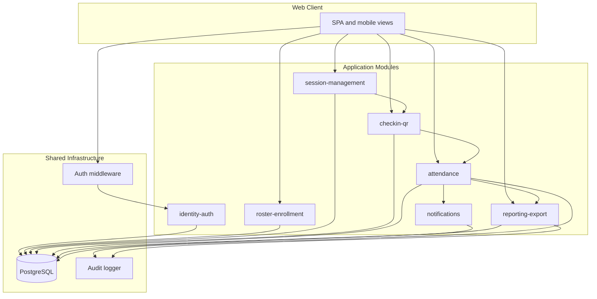

# We Check — Module Breakdown

Logical module decomposition for **We Check** MVP. Each module maps to a bounded area of responsibility, primary entities, exposed interfaces, and functional requirement ownership. Physical deployment may colocate modules in a single API service for pilot scale.

**Related documents:** [System overview](./00-system-overview.md) · [Roles and permissions](./01-roles-permissions.md) · [Domain model (BRD)](../brds/06-domain-model.md) · [Functional requirements](../brds/03-functional-requirements.md) · [Technical domain model](./03-domain-model.md) (phase 2) · [API design](./05-api-design.md) (phase 2)

---

## 1. Module Overview

We Check MVP comprises **seven application modules** plus shared infrastructure. Modules communicate through internal service interfaces within the API process; no inter-module network calls in the monolith deployment.

| Module ID | Name | MVP priority | Primary actors |
| --- | --- | --- | --- |
| `identity-auth` | Identity and Authentication | Must | All authenticated roles |
| `roster-enrollment` | Roster and Enrollment | Must | `TrainingOfficeAdmin`, `Instructor` (read) |
| `session-management` | Session Management | Must | `Instructor` |
| `checkin-qr` | Check-in and QR Tokens | Must | `Instructor`, `Student` |
| `attendance` | Attendance Records and Manual Edits | Must | `Instructor`, `TrainingOfficeAdmin`, `Student` (read self) |
| `reporting-export` | Reporting and CSV Export | Must | `Instructor`, `TrainingOfficeAdmin` |
| `notifications` | Policy Notifications | Should | `Student`, `Instructor` |

---

## 2. Module Specifications

### 2.1 Module: `identity-auth`

**Purpose:** User account lifecycle, credential authentication, and session management.

| Aspect | Detail |
| --- | --- |
| **Owns entities** | `User`, `AuthSession` |
| **FR ownership** | FR-01, FR-02 |
| **BR references** | BR-06 |
| **Permissions** | `user:read`, `user:write` ([01-roles-permissions.md](./01-roles-permissions.md)) |

**Responsibilities:**

- Create, update, deactivate user accounts with institutional ID, email, display name, role, active flag.
- Authenticate email/password; issue and revoke `AuthSession` with 8-hour inactivity expiry.
- Reject login and invalidate sessions for deactivated users.
- Provide `/me` profile for authenticated callers.

**Dependencies:** None (foundational). All other modules depend on auth middleware.

**Key interfaces (internal):**

- `AuthService.authenticate(credentials) → AuthSession`
- `AuthService.requireUser(sessionId) → User`
- `UserService.provision(userDto)` — admin only

---

### 2.2 Module: `roster-enrollment`

**Purpose:** Academic structure and student enrollment for attendance eligibility.

| Aspect | Detail |
| --- | --- |
| **Owns entities** | `Class`, `Subject`, `Enrollment`, `ClassAssignment` |
| **FR ownership** | FR-03 |
| **Permissions** | `roster:read`, `roster:write` |

**Responsibilities:**

- Maintain class and subject reference data.
- Import enrollments via CSV with row-level validation (student ID, name, class code, subject code).
- Link instructors to class-subject pairs via `ClassAssignment` for authorization scope.
- Expose enrolled student list for a class-subject pair to session and check-in modules.

**Dependencies:** `identity-auth` (user records for students and instructors).

**Key interfaces:**

- `RosterService.importCsv(file) → ImportSummary`
- `RosterService.getEnrollments(classId, subjectId) → Enrollment[]`
- `RosterService.getInstructorAssignments(instructorId) → ClassAssignment[]`

---

### 2.3 Module: `session-management`

**Purpose:** Session lifecycle from draft through active to closed or cancelled.

| Aspect | Detail |
| --- | --- |
| **Owns entities** | `Session` (aggregate root) |
| **FR ownership** | FR-04, FR-05 |
| **BR references** | BR-01, BR-07 |
| **Permissions** | `session:read`, `session:write`, `qr:display` |

**Responsibilities:**

- Create session in `Draft` with class, subject, schedule, room name, GPS coordinates, optional radius (default 100 m, range 20–500 m).
- Validate coordinates before `Draft` → `Active` transition ([BR-07](../brds/04-business-rules.md)).
- Open session: set `openedAt`, trigger attendance record initialization via `attendance` module.
- Close session manually or auto-close at scheduled start + 10 minutes ([BR-01](../brds/04-business-rules.md)).
- Cancel `Draft` sessions (`Cancelled` terminal state).
- Signal `checkin-qr` to start/stop token issuance on state transitions.

**Dependencies:** `identity-auth`, `roster-enrollment`, `attendance` (record bootstrap on open).

**Key interfaces:**

- `SessionService.create(dto) → Session`
- `SessionService.open(sessionId) → Session`
- `SessionService.close(sessionId) → Session`
- `SessionService.getActiveQrContext(sessionId) → SessionContext`

**Domain events emitted:** `SessionOpened`, `SessionClosed` ([06-domain-model.md](../brds/06-domain-model.md) §6).

---

### 2.4 Module: `checkin-qr`

**Purpose:** Rotating QR token issuance and student check-in validation pipeline.

| Aspect | Detail |
| --- | --- |
| **Owns entities** | `QrToken`, `CheckInAttempt` |
| **FR ownership** | FR-06, FR-07, FR-08, FR-09, FR-10 |
| **BR references** | BR-02, BR-03, BR-04, BR-11, BR-12 |
| **Permissions** | `qr:display`, `checkin:submit` |

**Responsibilities:**

- Issue new `QrToken` every **30 seconds** while session is `Active`; mark expired tokens.
- Render QR payload (token ID or signed deep link) for instructor display with countdown.
- Accept check-in submission: authenticated student, token, client coordinates, spoof metadata.
- Validate token state (`Valid` / not `Consumed` / not `Expired`), GPS radius, duplicate student, spoof signals.
- Atomically consume token and update attendance on success (delegate to `attendance`).
- Log every attempt in `CheckInAttempt` with outcome enum ([05-state-machine.md](../brds/05-state-machine.md) §5).
- Do **not** persist raw client latitude/longitude after validation ([FR-08](../brds/03-functional-requirements.md)).

**Dependencies:** `session-management`, `attendance`, `roster-enrollment` (enrollment check), `identity-auth`.

**Key interfaces:**

- `QrService.getCurrentToken(sessionId) → QrTokenDisplay`
- `QrService.rotateTokens(sessionId)` — scheduler callback
- `CheckInService.submit(tokenId, locationPayload, studentId) → CheckInResult`

**Concurrency:** Single database transaction for token consumption + attendance update ([06-domain-model.md](../brds/06-domain-model.md) §5.2).

---

### 2.5 Module: `attendance`

**Purpose:** Per-student attendance state per session and manual corrections.

| Aspect | Detail |
| --- | --- |
| **Owns entities** | `AttendanceRecord`, `AttendanceAuditLog` |
| **FR ownership** | FR-11, FR-14; cooperates on FR-07–FR-09 |
| **BR references** | BR-04, BR-10 |
| **Permissions** | `attendance:read`, `attendance:write` |

**Responsibilities:**

- Create `Pending` records for all enrolled students when session opens.
- Transition to `Present` on successful check-in; bulk `Pending` → `Absent` on session close.
- Support manual status changes among `Present`, `Absent`, `Excused`, `Rejected` with audit log.
- Enforce instructor 24-hour edit window; admin override after window ([BR-10](../brds/04-business-rules.md)).
- Serve student personal attendance history (paginated, self-scope only).

**Dependencies:** `roster-enrollment`, `session-management`, `identity-auth`.

**Key interfaces:**

- `AttendanceService.initializeForSession(sessionId)`
- `AttendanceService.markPresent(sessionId, studentId, checkedInAt)`
- `AttendanceService.finalizeOnClose(sessionId)`
- `AttendanceService.manualEdit(recordId, newStatus, editorId, note)`
- `AttendanceService.getStudentHistory(studentId, filters)`

---

### 2.6 Module: `reporting-export`

**Purpose:** Attendance reports and admin CSV export.

| Aspect | Detail |
| --- | --- |
| **Owns entities** | `ExportAuditLog`; read models over `AttendanceRecord`, `Session` |
| **FR ownership** | FR-12, FR-13 |
| **BR references** | BR-08, BR-09 |
| **Permissions** | `report:read`, `report:export` |

**Responsibilities:**

- Session roster report: per-student status for one session.
- Class-subject summary: aggregation over date range with present/absent/excused counts.
- Enforce instructor assignment scope ([BR-08](../brds/04-business-rules.md)); admin sees institution-wide.
- Generate CSV with columns: institutionalId, displayName, classCode, subjectCode, sessionDate, attendanceStatus, checkedInAt ([06-domain-model.md](../brds/06-domain-model.md) §7).
- Log every export in `ExportAuditLog`; reject non-admin export ([BR-09](../brds/04-business-rules.md)).
- Target report availability within 10 minutes of session close ([FR-12](../brds/03-functional-requirements.md)).

**Dependencies:** `attendance`, `session-management`, `roster-enrollment`, `identity-auth`.

**Key interfaces:**

- `ReportService.getSessionRoster(sessionId, requesterId) → ReportDto`
- `ReportService.getClassSubjectSummary(filters, requesterId) → SummaryDto`
- `ExportService.exportCsv(filters, adminId) → FileStream`

---

### 2.7 Module: `notifications` (Should)

**Purpose:** In-app policy alerts such as absence threshold warnings.

| Aspect | Detail |
| --- | --- |
| **Owns entities** | `Notification` |
| **FR ownership** | FR-16 |
| **BR references** | BR-05 |
| **Permissions** | `notification:read`, `policy:write` |

**Responsibilities:**

- After session close, recalculate unexcused absence rate per student per subject.
- When rate exceeds **20%** threshold, create notifications for student and assigned instructor.
- Exclude `Excused` absences from numerator ([BR-05](../brds/04-business-rules.md)).
- Admin configures threshold via policy settings.

**Dependencies:** `attendance`, `roster-enrollment`, `session-management`.

**Key interfaces:**

- `NotificationService.evaluateAbsenceThresholds(sessionId)`
- `NotificationService.listForUser(userId) → Notification[]`
- `PolicyService.setAbsenceThreshold(percent)`

Ship in MVP only if schedule allows; core Must modules take priority per [01-stakeholders-scope.md](../brds/01-stakeholders-scope.md) §2.1.2.

---

## 3. Module Dependency Matrix

| Module | Depends on |
| --- | --- |
| `identity-auth` | — |
| `roster-enrollment` | `identity-auth` |
| `session-management` | `identity-auth`, `roster-enrollment`, `attendance` |
| `checkin-qr` | `identity-auth`, `roster-enrollment`, `session-management`, `attendance` |
| `attendance` | `identity-auth`, `roster-enrollment`, `session-management` |
| `reporting-export` | `identity-auth`, `roster-enrollment`, `session-management`, `attendance` |
| `notifications` | `attendance`, `roster-enrollment`, `session-management` |

Circular dependency note: `session-management` calls `attendance` on open; `attendance` reads session state. Resolve via domain events or unidirectional orchestration from session module as aggregate owner.

---

## 4. Client Application Surfaces by Module

| UI surface | Modules consumed | Primary actor |
| --- | --- | --- |
| Login / profile | `identity-auth` | All |
| Admin user management | `identity-auth` | `TrainingOfficeAdmin` |
| Roster import | `roster-enrollment` | `TrainingOfficeAdmin` |
| Session list and editor | `session-management` | `Instructor` |
| QR projection display | `checkin-qr`, `session-management` | `Instructor` |
| Live attendance monitor ([FR-15](../brds/03-functional-requirements.md)) | `attendance`, `checkin-qr` | `Instructor` |
| Mobile check-in flow | `checkin-qr`, `identity-auth` | `Student` |
| Personal attendance history | `attendance` | `Student` |
| Manual attendance grid | `attendance` | `Instructor`, `TrainingOfficeAdmin` |
| Reports and CSV export | `reporting-export` | `Instructor`, `TrainingOfficeAdmin` |
| Notification inbox | `notifications` | `Student`, `Instructor` |

Page-level mapping: [09-page-list.md](../ui-ux/09-page-list.md) (phase 3).

---

## 5. FR-to-Module Traceability

| FR ID | Primary module | Supporting modules |
| --- | --- | --- |
| FR-01 | `identity-auth` | — |
| FR-02 | `identity-auth` | — |
| FR-03 | `roster-enrollment` | `identity-auth` |
| FR-04 | `session-management` | `roster-enrollment` |
| FR-05 | `session-management` | `attendance` |
| FR-06 | `checkin-qr` | `session-management` |
| FR-07 | `checkin-qr` | `identity-auth` |
| FR-08 | `checkin-qr` | `session-management` |
| FR-09 | `checkin-qr` | `attendance` |
| FR-10 | `checkin-qr` | `attendance` |
| FR-11 | `attendance` | `session-management` |
| FR-12 | `reporting-export` | `attendance` |
| FR-13 | `reporting-export` | `attendance` |
| FR-14 | `attendance` | — |
| FR-15 | `attendance` | `checkin-qr` |
| FR-16 | `notifications` | `attendance` |

---

## 6. Shared Cross-Cutting Components

| Component | Used by | Responsibility |
| --- | --- | --- |
| Auth middleware | All API routes | Session validation; attach user context |
| Permission guard | All protected routes | RBAC per [01-roles-permissions.md](./01-roles-permissions.md) |
| Audit logger | `attendance`, `reporting-export` | Append-only audit writes |
| QR scheduler | `checkin-qr` | 30-second token rotation for active sessions |
| Auto-close scheduler | `session-management` | BR-01 attendance window enforcement |
| Localization | Web client | `vi-VN` copy; API error code mapping |

---

## 7. Future Consideration

| Enhancement | Module impact |
| --- | --- |
| Academic API sync | New `roster-sync` job module or extension of `roster-enrollment` |
| SSO / IdP | Extend `identity-auth` with federation adapter |
| WiFi BSSID verification | Extend `checkin-qr` validation pipeline |
| WebSocket live dashboard | New real-time channel from `attendance` + `checkin-qr` |
| Extract check-in hot path | Deploy `checkin-qr` as separate service behind same API gateway |
| Device fingerprint store | New entity in `checkin-qr`; privacy review required |
| Room location templates | New `room-catalog` submodule under `session-management` |
