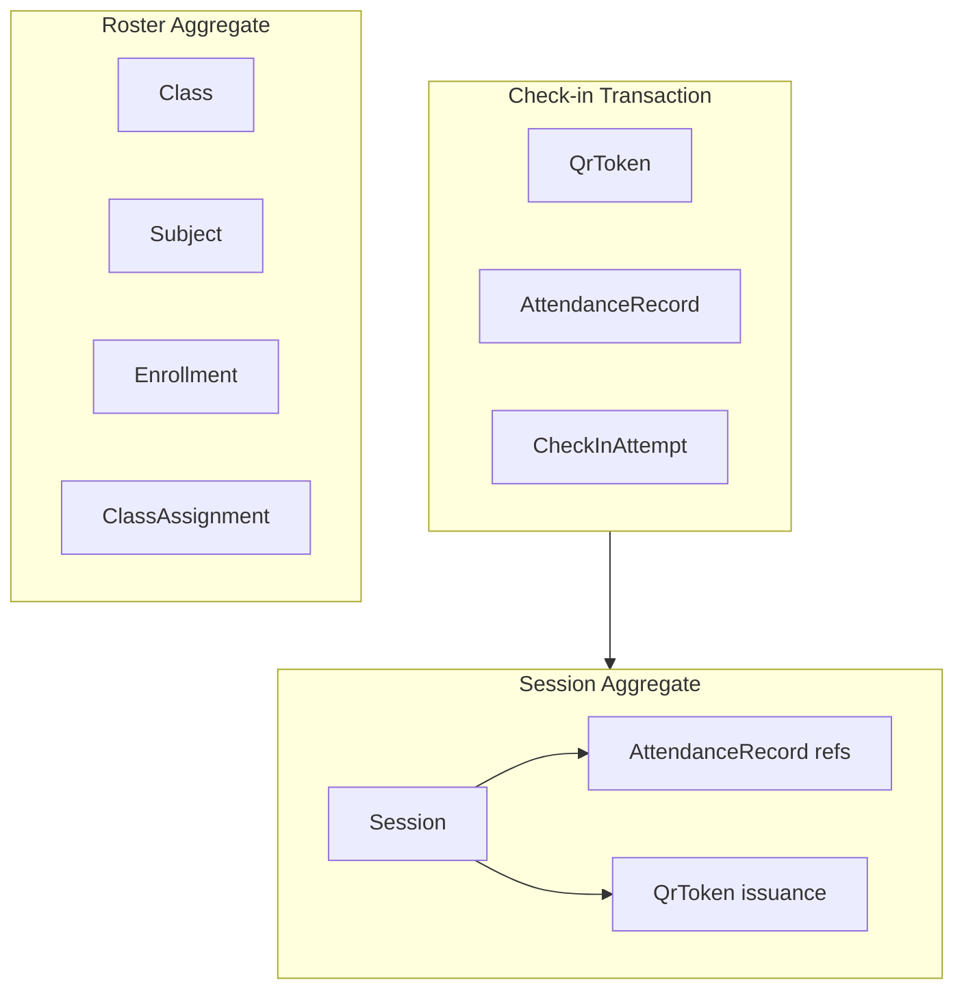

# We Check — Technical Domain Model

Implementation-oriented domain model for **We Check** MVP. Maps the conceptual model in [Domain model (BRD)](../brds/06-domain-model.md) to typed entities, aggregates, invariants, and module ownership used by the API server and PostgreSQL persistence layer defined in [Database design](./04-database-design.md).

**Related documents:** [Module breakdown](./02-module-breakdown.md) · [Roles and permissions](./01-roles-permissions.md) · [Business rules](../brds/04-business-rules.md) · [State machine](../brds/05-state-machine.md) · [Functional requirements](../brds/03-functional-requirements.md) · [Database design](./04-database-design.md) · [API design](./05-api-design.md) (phase 2)

---

## 1. Overview

We Check implements a **modular monolith** domain layer: seven application modules ([02-module-breakdown.md](./02-module-breakdown.md)) share a single PostgreSQL database but enforce ownership boundaries through package structure and repository interfaces. Entities use **UUID v4** primary keys, **UTC** timestamps (`timestamptz`), and **snake_case** column names at persistence; application code may use camelCase DTOs with explicit mapping.

| Principle | Implementation choice |
| --- | --- |
| Identity | UUID primary keys; institutional ID as business unique key |
| Time | All persisted datetimes in UTC; client displays `vi-VN` locale |
| GPS privacy | Raw client coordinates used only in request handler; persist `distance_meters` and `spoof_flags` only ([BR-02](../brds/04-business-rules.md), [FR-08](../brds/03-functional-requirements.md)) |
| Concurrency | Optimistic locking on hot rows where needed; check-in uses serializable transaction |
| Auth | Email/password MVP; `password_hash` on `User`; `AuthSession` server-side ([FR-02](../brds/03-functional-requirements.md), [NFR-17](../brds/07-non-functional-risk.md)) |

---

## 2. BRD-to-Implementation Mapping

| BRD entity | Implementation entity | Table | Owning module |
| --- | --- | --- | --- |
| `User` | `User` | `users` | `identity-auth` |
| `AuthSession` | `AuthSession` | `auth_sessions` | `identity-auth` |
| `Class` | `Class` | `classes` | `roster-enrollment` |
| `Subject` | `Subject` | `subjects` | `roster-enrollment` |
| `Enrollment` | `Enrollment` | `enrollments` | `roster-enrollment` |
| `ClassAssignment` | `ClassAssignment` | `class_assignments` | `roster-enrollment` |
| `Session` | `Session` | `sessions` | `session-management` |
| `AttendanceRecord` | `AttendanceRecord` | `attendance_records` | `attendance` |
| `QrToken` | `QrToken` | `qr_tokens` | `checkin-qr` |
| `CheckInAttempt` | `CheckInAttempt` | `check_in_attempts` | `checkin-qr` |
| `AttendanceAuditLog` | `AttendanceAuditLog` | `attendance_audit_logs` | `attendance` |
| `ExportAuditLog` | `ExportAuditLog` | `export_audit_logs` | `reporting-export` |
| `Notification` | `Notification` | `notifications` | `notifications` |
| — | `PolicySetting` | `policy_settings` | `notifications` |
| — | `RosterImportBatch` | `roster_import_batches` | `roster-enrollment` |

Reporting views from [06-domain-model.md](../brds/06-domain-model.md) §7 are **SQL queries**, not persisted entities.

---

## 3. Shared Enumerations

All enums are implemented as PostgreSQL `ENUM` types (see [04-database-design.md](./04-database-design.md) §4) and mirrored in application code.

### 3.1 `UserRole`

| Value | Description |
| --- | --- |
| `Student` | Check-in and self-service attendance history |
| `Instructor` | Session operations, assigned reports, manual edits |
| `TrainingOfficeAdmin` | Institution-wide admin, CSV export, policy config |

Single role per account in MVP ([FR-01](../brds/03-functional-requirements.md)).

### 3.2 `SessionStatus`

| Value | Terminal | Description |
| --- | --- | --- |
| `Draft` | No | Created; not yet accepting check-ins |
| `Active` | No | QR rotation running; check-ins allowed |
| `Closed` | Yes | Window ended; roster finalized |
| `Cancelled` | Yes | Abandoned from `Draft`; excluded from reports |

State transitions: [05-state-machine.md](../brds/05-state-machine.md) §2.

### 3.3 `AttendanceStatus`

| Value | Description |
| --- | --- |
| `Pending` | Enrolled; no successful check-in |
| `Present` | Successful automated or manual check-in |
| `Absent` | No check-in when session closed |
| `Excused` | Manual excused absence; excluded from [BR-05](../brds/04-business-rules.md) numerator |
| `Rejected` | Failed check-in; may be overridden to `Present` ([FR-10](../brds/03-functional-requirements.md)) |

### 3.4 `QrTokenStatus`

| Value | Description |
| --- | --- |
| `Valid` | Issued and within 30-second window |
| `Expired` | Past `expires_at` without consumption |
| `Consumed` | Used for successful check-in |

### 3.5 `CheckInOutcome`

Ephemeral API result logged on every attempt ([05-state-machine.md](../brds/05-state-machine.md) §5):

`Success`, `ExpiredQr`, `OutOfRadius`, `DuplicateCheckIn`, `GpsDisabled`, `Unauthenticated`, `SessionNotActive`, `SpoofSuspected`, `NotEnrolled`, `TokenNotFound`

`NotEnrolled` and `TokenNotFound` are implementation guard outcomes not listed in the BRD but required for complete API behavior.

### 3.6 `NotificationType`

| Value | Description |
| --- | --- |
| `AbsenceThresholdWarning` | Student or instructor alert when unexcused rate exceeds policy ([FR-16](../brds/03-functional-requirements.md)) |

### 3.7 `RosterImportStatus`

| Value | Description |
| --- | --- |
| `Processing` | Import in progress |
| `Completed` | All rows processed |
| `Failed` | Unrecoverable error; partial rows may exist |

---

## 4. Entity Specifications

Types below use TypeScript notation for clarity. Nullable fields marked with `| null`.

### 4.1 `User`

**Module:** `identity-auth` · **Table:** `users`

```typescript
interface User {
  id: string;                    // UUID
  institutionalId: string;       // unique, e.g. student/staff ID
  displayName: string;
  email: string;                 // unique; login identifier
  passwordHash: string;          // bcrypt or argon2 ([NFR-17](../brds/07-non-functional-risk.md))
  role: UserRole;
  active: boolean;               // default true
  createdAt: Date;
  updatedAt: Date;
}
```

**Invariants:**

- Deactivated user (`active = false`) cannot authenticate or hold valid `AuthSession` ([FR-01](../brds/03-functional-requirements.md), [BR-06](../brds/04-business-rules.md)).
- `email` and `institutionalId` unique across all users.
- Role immutable by self-service; only `TrainingOfficeAdmin` may change role via admin API.

### 4.2 `AuthSession`

**Module:** `identity-auth` · **Table:** `auth_sessions`

```typescript
interface AuthSession {
  id: string;
  userId: string;
  expiresAt: Date;               // sliding 8-hour inactivity ([FR-02](../brds/03-functional-requirements.md))
  lastActivityAt: Date;
  createdAt: Date;
  revokedAt: Date | null;        // explicit logout or admin revoke
}
```

**Invariants:**

- Session invalid when `revokedAt` is set, `expiresAt` passed, or linked user inactive.
- One session may serve multiple requests; refresh `lastActivityAt` on authenticated calls.

### 4.3 `Class`

**Module:** `roster-enrollment` · **Table:** `classes`

```typescript
interface Class {
  id: string;
  code: string;                  // unique, e.g. "HESD-2026-A"
  name: string;
  term: string | null;
  createdAt: Date;
  updatedAt: Date;
}
```

### 4.4 `Subject`

**Module:** `roster-enrollment` · **Table:** `subjects`

```typescript
interface Subject {
  id: string;
  code: string;                  // unique
  name: string;
  createdAt: Date;
  updatedAt: Date;
}
```

### 4.5 `Enrollment`

**Module:** `roster-enrollment` · **Table:** `enrollments`

```typescript
interface Enrollment {
  id: string;
  studentId: string;             // FK → User where role = Student
  classId: string;
  subjectId: string;
  enrolledAt: Date;
}
```

**Invariants:**

- Unique triple (`studentId`, `classId`, `subjectId`).
- `studentId` must reference active `Student` user.
- Source: CSV import ([FR-03](../brds/03-functional-requirements.md)).

### 4.6 `ClassAssignment`

**Module:** `roster-enrollment` · **Table:** `class_assignments`

```typescript
interface ClassAssignment {
  id: string;
  instructorId: string;          // FK → User where role = Instructor
  classId: string;
  subjectId: string;
  assignedAt: Date;
}
```

**Invariants:**

- Unique triple (`instructorId`, `classId`, `subjectId`).
- Drives report authorization scope ([BR-08](../brds/04-business-rules.md)).

### 4.7 `Session`

**Module:** `session-management` · **Table:** `sessions` · **Aggregate root**

```typescript
interface Session {
  id: string;
  classId: string;
  subjectId: string;
  instructorId: string;
  title: string;
  roomName: string;
  roomLatitude: number | null;   // required before Active; −90..90
  roomLongitude: number | null;  // required before Active; −180..180
  gpsRadiusMeters: number;       // default 100; range 20–500
  scheduledStart: Date;
  openedAt: Date | null;
  closedAt: Date | null;
  status: SessionStatus;
  createdAt: Date;
  updatedAt: Date;
}
```

**Invariants:**

- Transition `Draft` → `Active` blocked without valid `roomLatitude` and `roomLongitude` ([BR-07](../brds/04-business-rules.md)).
- `gpsRadiusMeters` between 20 and 500 inclusive.
- On `Closed`, attendance window ends at `scheduledStart + 10 minutes` unless earlier manual `closedAt` ([BR-01](../brds/04-business-rules.md)).
- MVP cancel allowed only from `Draft` → `Cancelled`.
- `instructorId` must have `ClassAssignment` for session class-subject pair (enforced at create).

### 4.8 `AttendanceRecord`

**Module:** `attendance` · **Table:** `attendance_records`

```typescript
interface AttendanceRecord {
  id: string;
  sessionId: string;
  studentId: string;
  status: AttendanceStatus;
  checkedInAt: Date | null;      // set when status → Present via check-in
  lastUpdatedAt: Date;
  version: number;               // optimistic lock for concurrent edits
}
```

**Invariants:**

- Unique (`sessionId`, `studentId`).
- At most one automated transition to `Present` per student per session ([BR-04](../brds/04-business-rules.md)).
- Created as `Pending` for each enrolled student when session opens ([FR-05](../brds/03-functional-requirements.md)).
- Bulk `Pending` → `Absent` on session close.

### 4.9 `QrToken`

**Module:** `checkin-qr` · **Table:** `qr_tokens`

```typescript
interface QrToken {
  id: string;
  sessionId: string;
  status: QrTokenStatus;
  issuedAt: Date;
  expiresAt: Date;               // issuedAt + 30 seconds ([BR-03](../brds/04-business-rules.md))
  consumedAt: Date | null;
  consumedByStudentId: string | null;
}
```

**Invariants:**

- Issued only while parent session `Active`.
- At most one successful consumption per token ([BR-11](../brds/04-business-rules.md)).
- QR payload encodes token `id` (signed URL optional in API layer).

### 4.10 `CheckInAttempt`

**Module:** `checkin-qr` · **Table:** `check_in_attempts` · **Append-only**

```typescript
interface CheckInAttempt {
  id: string;
  sessionId: string;
  studentId: string;
  qrTokenId: string | null;
  outcome: CheckInOutcome;
  attemptedAt: Date;
  distanceMeters: number | null; // haversine from room coords; no raw lat/lng stored
  spoofFlags: SpoofFlags | null; // JSONB
  clientUserAgent: string | null;
}

interface SpoofFlags {
  mockLocationDetected?: boolean;
  accuracyMeters?: number;
  platform?: 'ios' | 'android' | 'other';
}
```

**Privacy:** Request handler receives client latitude/longitude, computes `distanceMeters`, discards coordinates before response completes ([FR-08](../brds/03-functional-requirements.md)).

### 4.11 `AttendanceAuditLog`

**Module:** `attendance` · **Table:** `attendance_audit_logs` · **Append-only**

```typescript
interface AttendanceAuditLog {
  id: string;
  attendanceRecordId: string;
  editorId: string;
  previousStatus: AttendanceStatus;
  newStatus: AttendanceStatus;
  note: string | null;
  editedAt: Date;
}
```

Written on every manual edit ([BR-10](../brds/04-business-rules.md), [FR-11](../brds/03-functional-requirements.md)).

### 4.12 `ExportAuditLog`

**Module:** `reporting-export` · **Table:** `export_audit_logs` · **Append-only**

```typescript
interface ExportAuditLog {
  id: string;
  adminId: string;
  filterSummary: ExportFilterSummary; // JSONB
  exportedAt: Date;
  rowCount: number;
}

interface ExportFilterSummary {
  classCode?: string;
  subjectCode?: string;
  dateFrom?: string;
  dateTo?: string;
}
```

Admin-only CSV export ([BR-09](../brds/04-business-rules.md), [FR-13](../brds/03-functional-requirements.md)).

### 4.13 `Notification`

**Module:** `notifications` · **Table:** `notifications`

```typescript
interface Notification {
  id: string;
  userId: string;
  type: NotificationType;
  payload: NotificationPayload;  // JSONB
  readAt: Date | null;
  createdAt: Date;
}

interface NotificationPayload {
  subjectCode: string;
  subjectName: string;
  absenceRate: number;           // 0..1 fraction
  threshold: number;             // policy value, e.g. 0.20
  sessionCount: number;
  unexcusedAbsenceCount: number;
}
```

### 4.14 `PolicySetting`

**Module:** `notifications` · **Table:** `policy_settings`

```typescript
interface PolicySetting {
  id: string;
  key: string;                   // e.g. 'absence_threshold_percent'
  value: string;                 // serialized; '20' for 20%
  updatedById: string | null;
  updatedAt: Date;
}
```

MVP stores institution-wide absence threshold (default **20%**, [BR-05](../brds/04-business-rules.md)). Admin updates via `policy:write` permission.

### 4.15 `RosterImportBatch`

**Module:** `roster-enrollment` · **Table:** `roster_import_batches`

```typescript
interface RosterImportBatch {
  id: string;
  uploadedById: string;
  fileName: string;
  status: RosterImportStatus;
  totalRows: number;
  successRows: number;
  errorRows: number;
  errorDetails: ImportError[] | null; // JSONB array
  startedAt: Date;
  completedAt: Date | null;
}

interface ImportError {
  rowNumber: number;
  field: string;
  message: string;
}
```

Supports idempotent roster import audit ([FR-03](../brds/03-functional-requirements.md)).

---

## 5. Aggregate Boundaries



### 5.1 Session aggregate

**Root:** `Session` (`session-management`)

**Consistency:**

- `open()`: validate GPS → set `Active` and `openedAt` → call `AttendanceService.initializeForSession` → signal QR scheduler.
- `close()`: set `Closed` and `closedAt` → bulk update `Pending` → `Absent` → stop QR scheduler.
- External modules read session status but mutate only through `SessionService`.

### 5.2 Check-in transaction

**Participants:** `QrToken`, `AttendanceRecord`, `CheckInAttempt`

**Single database transaction** ([06-domain-model.md](../brds/06-domain-model.md) §5.2):

1. Lock `QrToken` row (`SELECT … FOR UPDATE`).
2. Validate token, session, enrollment, GPS, spoof, duplicate.
3. Insert `CheckInAttempt`.
4. On `Success`: update token → `Consumed`; update attendance → `Present` with `checkedInAt`.
5. Commit or rollback atomically.

Failure after validation logs attempt without consuming token (except `DuplicateCheckIn` where token stays valid for others).

### 5.3 Roster aggregate

**Root:** `Class` + `Subject` with `Enrollment` and `ClassAssignment` children.

**Consistency:** CSV import validates rows, upserts users/enrollments in one batch transaction per file chunk; failures recorded in `RosterImportBatch.errorDetails`.

### 5.4 Identity aggregate

**Root:** `User` with `AuthSession` children.

Password changes invalidate other sessions optionally (MVP: keep existing sessions; document in security review).

---

## 6. Repository Interfaces

Each module exposes repositories behind its service layer. Example contracts:

```typescript
// identity-auth
interface UserRepository {
  findById(id: string): Promise<User | null>;
  findByEmail(email: string): Promise<User | null>;
  save(user: User): Promise<User>;
}

interface AuthSessionRepository {
  findById(id: string): Promise<AuthSession | null>;
  save(session: AuthSession): Promise<AuthSession>;
  revokeByUserId(userId: string): Promise<void>;
}

// session-management
interface SessionRepository {
  findById(id: string): Promise<Session | null>;
  findActiveByInstructor(instructorId: string): Promise<Session[]>;
  save(session: Session): Promise<Session>;
}

// checkin-qr
interface QrTokenRepository {
  findByIdForUpdate(id: string): Promise<QrToken | null>;
  findCurrentValid(sessionId: string): Promise<QrToken | null>;
  insert(token: QrToken): Promise<QrToken>;
  update(token: QrToken): Promise<QrToken>;
}

// attendance
interface AttendanceRecordRepository {
  findBySessionAndStudent(sessionId: string, studentId: string): Promise<AttendanceRecord | null>;
  findBySession(sessionId: string): Promise<AttendanceRecord[]>;
  bulkInsert(records: AttendanceRecord[]): Promise<void>;
  bulkUpdateStatus(sessionId: string, from: AttendanceStatus, to: AttendanceStatus): Promise<number>;
  save(record: AttendanceRecord): Promise<AttendanceRecord>;
}
```

Implementations use parameterized SQL or an ORM; schema details in [04-database-design.md](./04-database-design.md).

---

## 7. Domain Services

| Service | Module | Responsibility |
| --- | --- | --- |
| `AuthService` | `identity-auth` | Credential verification, session issue/revoke |
| `UserService` | `identity-auth` | Admin provisioning, deactivation |
| `RosterService` | `roster-enrollment` | CSV parse/validate, enrollment upsert |
| `SessionService` | `session-management` | Lifecycle transitions, GPS validation |
| `QrService` | `checkin-qr` | Token rotation, display payload |
| `CheckInService` | `checkin-qr` | Full validation pipeline, transaction orchestration |
| `GeoVerificationService` | `checkin-qr` | Haversine distance; spoof heuristics ([FR-10](../brds/03-functional-requirements.md)) |
| `AttendanceService` | `attendance` | Bootstrap, mark present, finalize, manual edit |
| `ReportService` | `reporting-export` | Authorized read queries |
| `ExportService` | `reporting-export` | CSV generation + audit |
| `NotificationService` | `notifications` | Threshold evaluation, inbox |
| `PolicyService` | `notifications` | Read/write `PolicySetting` |

### 7.1 `GeoVerificationService`

```typescript
interface GeoVerificationResult {
  distanceMeters: number;
  withinRadius: boolean;
  spoofSuspected: boolean;
  spoofFlags: SpoofFlags;
}

function verifyLocation(
  roomLat: number,
  roomLng: number,
  clientLat: number,
  clientLng: number,
  radiusMeters: number,
  clientMetadata: ClientGeoMetadata
): GeoVerificationResult;
```

Uses room coordinates from `Session`; client coordinates exist only in memory during the call.

### 7.2 Manual edit window

`AttendanceService.manualEdit` enforces [BR-10](../brds/04-business-rules.md):

- `Instructor`: allowed within **24 hours** after session `closedAt`.
- `TrainingOfficeAdmin`: allowed anytime.
- Always writes `AttendanceAuditLog`.

---

## 8. Domain Events

Events are emitted in-process for MVP (no message broker). Handlers may run synchronously or via lightweight job queue.

| Event | Producer | Payload | Consumers |
| --- | --- | --- | --- |
| `SessionOpened` | `session-management` | `sessionId`, `openedAt` | `checkin-qr` (start QR scheduler), `attendance` (confirm bootstrap) |
| `SessionClosed` | `session-management` | `sessionId`, `closedAt` | `checkin-qr` (stop scheduler), `attendance` (finalize), `notifications` (threshold job) |
| `CheckInSucceeded` | `checkin-qr` | `sessionId`, `studentId`, `tokenId`, `checkedInAt` | Live dashboard refresh ([FR-15](../brds/03-functional-requirements.md)) |
| `AttendanceManuallyEdited` | `attendance` | `attendanceRecordId`, `editorId`, `previousStatus`, `newStatus` | `notifications` (recalculate rates) |
| `AbsenceThresholdExceeded` | `notifications` | `studentId`, `subjectId`, `rate` | Create `Notification` rows |

---

## 9. Value Objects and DTOs

| Name | Fields | Usage |
| --- | --- | --- |
| `RoomLocation` | `latitude`, `longitude`, `radiusMeters` | Session activation validation |
| `QrDisplayPayload` | `tokenId`, `sessionId`, `expiresAt`, `secondsRemaining` | Instructor QR projection |
| `CheckInRequest` | `tokenId`, `latitude`, `longitude`, `spoofMetadata` | Transient; not persisted |
| `CheckInResult` | `outcome`, `message`, `attendanceStatus?` | API response |
| `SessionRosterRow` | `student`, `status`, `checkedInAt` | Live monitor and reports |
| `CsvExportRow` | `institutionalId`, `displayName`, `classCode`, `subjectCode`, `sessionDate`, `attendanceStatus`, `checkedInAt` | Export ([FR-13](../brds/03-functional-requirements.md)) |

---

## 10. Invariant Enforcement Matrix

| Invariant | Enforcement layer | Failure mode |
| --- | --- | --- |
| Deactivated user cannot check in | `AuthService` middleware | 401 `Unauthenticated` |
| Session GPS required for Active | `SessionService.open` | 422 validation error |
| One Present per student per session | DB unique + `CheckInService` | 409 `DuplicateCheckIn` |
| One token consumption | Row lock + status check | 400 `ExpiredQr` for second consumer |
| GPS radius | `GeoVerificationService` | 400 `OutOfRadius` |
| Instructor report scope | `ReportService` + `ClassAssignment` query | 403 forbidden |
| Admin-only CSV | `ExportService` role guard | 403 forbidden |
| 24-hour instructor edit window | `AttendanceService.manualEdit` | 403 forbidden |
| No raw GPS persistence | `CheckInService` handler | Coordinates never written to DB |

---

## 11. Module Entity Ownership Summary

| Module | Entities | FR references |
| --- | --- | --- |
| `identity-auth` | `User`, `AuthSession` | FR-01, FR-02 |
| `roster-enrollment` | `Class`, `Subject`, `Enrollment`, `ClassAssignment`, `RosterImportBatch` | FR-03 |
| `session-management` | `Session` | FR-04, FR-05 |
| `checkin-qr` | `QrToken`, `CheckInAttempt` | FR-06–FR-10 |
| `attendance` | `AttendanceRecord`, `AttendanceAuditLog` | FR-11, FR-14, FR-15 |
| `reporting-export` | `ExportAuditLog` (+ read models) | FR-12, FR-13 |
| `notifications` | `Notification`, `PolicySetting` | FR-16 |

Full module specs: [02-module-breakdown.md](./02-module-breakdown.md).

---

## 12. Entity-to-Requirement Traceability

| Entity | FR | BR | NFR |
| --- | --- | --- | --- |
| `User` | FR-01, FR-02 | BR-06 | NFR-17 |
| `Enrollment` | FR-03 | — | — |
| `Session` | FR-04, FR-05 | BR-01, BR-07 | NFR-01 |
| `QrToken` | FR-06 | BR-03, BR-11 | — |
| `AttendanceRecord` | FR-07, FR-11, FR-14, FR-15 | BR-04, BR-10 | — |
| `CheckInAttempt` | FR-08, FR-09, FR-10 | BR-02, BR-12 | NFR-13 |
| `AttendanceAuditLog` | FR-11 | BR-10 | NFR-14 |
| `ExportAuditLog` | FR-13 | BR-09 | NFR-14 |
| `Notification` | FR-16 | BR-05 | — |

---

## 13. Future Consideration

| Enhancement | Domain impact |
| --- | --- |
| Academic API sync | `Enrollment.externalSourceId`; sync job entity |
| SSO / IdP | Remove `passwordHash`; add `federatedSubjectId` on `User` |
| WiFi BSSID | `Session.expectedBssids[]`; extend `SpoofFlags` |
| Device fingerprint | `DeviceProfile` linked to `CheckInAttempt` |
| Room templates | `RoomLocation` entity referenced by `Session` |
| Soft-delete sessions | `Session.deletedAt`; filter reports |
| Event bus | Replace in-process events with outbox pattern |
| Multi-role users | Junction table `user_roles` replacing single `role` enum |
