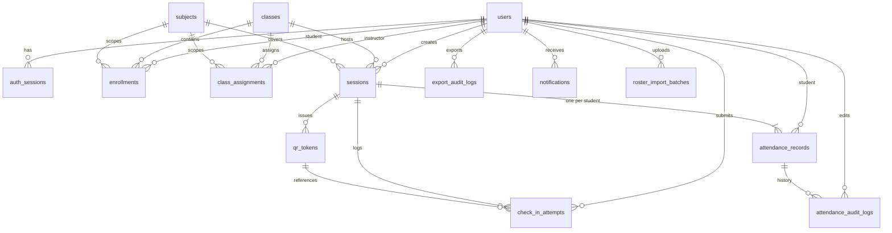

# We Check — Database Design

PostgreSQL schema design for **We Check** MVP. Persists the entities defined in [Technical domain model](./03-domain-model.md) and supports module access patterns from [Module breakdown](./02-module-breakdown.md). Target deployment: single PostgreSQL 15+ instance co-located with the API in Vietnam-region infrastructure ([NFR-11](../brds/07-non-functional-risk.md)).

**Related documents:** [Technical domain model](./03-domain-model.md) · [System overview](./00-system-overview.md) · [Domain model (BRD)](../brds/06-domain-model.md) · [Business rules](../brds/04-business-rules.md) · [Non-functional requirements](../brds/07-non-functional-risk.md)

---

## 1. Overview

| Attribute | Value |
| --- | --- |
| Database engine | PostgreSQL 15+ |
| Character set | UTF-8 (`UTF8`) |
| Collation | `en_US.UTF-8` (identifiers English; user content supports Vietnamese) |
| Primary key type | `UUID` (`gen_random_uuid()` via `pgcrypto`) |
| Timestamp type | `TIMESTAMPTZ` stored in UTC |
| Money / geo | `NUMERIC` for coordinates and distances; no PostGIS required for MVP |
| JSON columns | `JSONB` for semi-structured audit and notification payloads |
| Connection pool | 20–50 connections per API instance; PgBouncer optional at pilot scale |
| Expected MVP volume | ~500 users, ~50 sessions/week, ~75k attendance rows/semester, ~500k check-in attempts/semester |

---

## 2. Naming and Conventions

| Rule | Example |
| --- | --- |
| Table names | Plural snake_case: `attendance_records` |
| Column names | snake_case: `checked_in_at` |
| Primary keys | `id UUID PRIMARY KEY DEFAULT gen_random_uuid()` |
| Foreign keys | `{referenced_table_singular}_id` |
| Timestamps | `created_at`, `updated_at` with `DEFAULT NOW()` |
| Soft delete | Not used in MVP (hard rows; `Cancelled` session status instead) |
| Migrations | Sequential versioned SQL files (e.g. Flyway, Liquibase, or Prisma migrate) |

All tables live in schema `public` for MVP. Application roles:

| Role | Purpose |
| --- | --- |
| `wecheck_app` | Runtime CRUD used by API |
| `wecheck_migrate` | DDL during deployments |
| `wecheck_readonly` | Reporting/analytics read replica (optional) |

---

## 3. Schema Diagram



---

## 4. PostgreSQL Enum Types

```sql
CREATE TYPE user_role AS ENUM (
  'Student', 'Instructor', 'TrainingOfficeAdmin'
);

CREATE TYPE session_status AS ENUM (
  'Draft', 'Active', 'Closed', 'Cancelled'
);

CREATE TYPE attendance_status AS ENUM (
  'Pending', 'Present', 'Absent', 'Excused', 'Rejected'
);

CREATE TYPE qr_token_status AS ENUM (
  'Valid', 'Expired', 'Consumed'
);

CREATE TYPE check_in_outcome AS ENUM (
  'Success',
  'ExpiredQr',
  'OutOfRadius',
  'DuplicateCheckIn',
  'GpsDisabled',
  'Unauthenticated',
  'SessionNotActive',
  'SpoofSuspected',
  'NotEnrolled',
  'TokenNotFound'
);

CREATE TYPE notification_type AS ENUM (
  'AbsenceThresholdWarning'
);

CREATE TYPE roster_import_status AS ENUM (
  'Processing', 'Completed', 'Failed'
);
```

---

## 5. Table Definitions

### 5.1 `users`

**Module:** `identity-auth` · **FR:** FR-01, FR-02

| Column | Type | Constraints | Notes |
| --- | --- | --- | --- |
| `id` | `UUID` | PK, default `gen_random_uuid()` | |
| `institutional_id` | `VARCHAR(64)` | NOT NULL, UNIQUE | Student/staff ID |
| `display_name` | `VARCHAR(255)` | NOT NULL | |
| `email` | `VARCHAR(255)` | NOT NULL, UNIQUE | Login identifier |
| `password_hash` | `VARCHAR(255)` | NOT NULL | bcrypt/argon2 ([NFR-17](../brds/07-non-functional-risk.md)) |
| `role` | `user_role` | NOT NULL | Single role MVP |
| `active` | `BOOLEAN` | NOT NULL, DEFAULT `TRUE` | |
| `created_at` | `TIMESTAMPTZ` | NOT NULL, DEFAULT `NOW()` | |
| `updated_at` | `TIMESTAMPTZ` | NOT NULL, DEFAULT `NOW()` | |

**Indexes:**

- `users_email_key` — UNIQUE on `email`
- `users_institutional_id_key` — UNIQUE on `institutional_id`
- `users_role_active_idx` — `(role, active)` for roster queries

### 5.2 `auth_sessions`

**Module:** `identity-auth` · **FR:** FR-02

| Column | Type | Constraints | Notes |
| --- | --- | --- | --- |
| `id` | `UUID` | PK | Session token reference |
| `user_id` | `UUID` | NOT NULL, FK → `users(id)` ON DELETE CASCADE | |
| `expires_at` | `TIMESTAMPTZ` | NOT NULL | 8-hour inactivity window |
| `last_activity_at` | `TIMESTAMPTZ` | NOT NULL, DEFAULT `NOW()` | |
| `created_at` | `TIMESTAMPTZ` | NOT NULL, DEFAULT `NOW()` | |
| `revoked_at` | `TIMESTAMPTZ` | NULL | Logout / admin revoke |

**Indexes:**

- `auth_sessions_user_id_idx` — `(user_id)`
- `auth_sessions_expires_at_idx` — `(expires_at)` for cleanup job

### 5.3 `classes`

**Module:** `roster-enrollment`

| Column | Type | Constraints |
| --- | --- | --- |
| `id` | `UUID` | PK |
| `code` | `VARCHAR(32)` | NOT NULL, UNIQUE |
| `name` | `VARCHAR(255)` | NOT NULL |
| `term` | `VARCHAR(64)` | NULL |
| `created_at` | `TIMESTAMPTZ` | NOT NULL, DEFAULT `NOW()` |
| `updated_at` | `TIMESTAMPTZ` | NOT NULL, DEFAULT `NOW()` |

### 5.4 `subjects`

**Module:** `roster-enrollment`

| Column | Type | Constraints |
| --- | --- | --- |
| `id` | `UUID` | PK |
| `code` | `VARCHAR(32)` | NOT NULL, UNIQUE |
| `name` | `VARCHAR(255)` | NOT NULL |
| `created_at` | `TIMESTAMPTZ` | NOT NULL, DEFAULT `NOW()` |
| `updated_at` | `TIMESTAMPTZ` | NOT NULL, DEFAULT `NOW()` |

### 5.5 `enrollments`

**Module:** `roster-enrollment` · **FR:** FR-03

| Column | Type | Constraints |
| --- | --- | --- |
| `id` | `UUID` | PK |
| `student_id` | `UUID` | NOT NULL, FK → `users(id)` |
| `class_id` | `UUID` | NOT NULL, FK → `classes(id)` |
| `subject_id` | `UUID` | NOT NULL, FK → `subjects(id)` |
| `enrolled_at` | `TIMESTAMPTZ` | NOT NULL, DEFAULT `NOW()` |

**Constraints:**

- `enrollments_student_class_subject_key` — UNIQUE (`student_id`, `class_id`, `subject_id`)

**Indexes:**

- `enrollments_class_subject_idx` — `(class_id, subject_id)` for session bootstrap
- `enrollments_student_id_idx` — `(student_id)` for student history joins

### 5.6 `class_assignments`

**Module:** `roster-enrollment` · **BR:** BR-08

| Column | Type | Constraints |
| --- | --- | --- |
| `id` | `UUID` | PK |
| `instructor_id` | `UUID` | NOT NULL, FK → `users(id)` |
| `class_id` | `UUID` | NOT NULL, FK → `classes(id)` |
| `subject_id` | `UUID` | NOT NULL, FK → `subjects(id)` |
| `assigned_at` | `TIMESTAMPTZ` | NOT NULL, DEFAULT `NOW()` |

**Constraints:**

- `class_assignments_instructor_class_subject_key` — UNIQUE (`instructor_id`, `class_id`, `subject_id`)

**Indexes:**

- `class_assignments_instructor_id_idx` — `(instructor_id)` for authorization checks

### 5.7 `sessions`

**Module:** `session-management` · **FR:** FR-04, FR-05 · **BR:** BR-01, BR-07

| Column | Type | Constraints | Notes |
| --- | --- | --- | --- |
| `id` | `UUID` | PK | |
| `class_id` | `UUID` | NOT NULL, FK → `classes(id)` | |
| `subject_id` | `UUID` | NOT NULL, FK → `subjects(id)` | |
| `instructor_id` | `UUID` | NOT NULL, FK → `users(id)` | |
| `title` | `VARCHAR(255)` | NOT NULL | |
| `room_name` | `VARCHAR(255)` | NOT NULL | |
| `room_latitude` | `NUMERIC(9,6)` | NULL | Required before Active |
| `room_longitude` | `NUMERIC(9,6)` | NULL | Required before Active |
| `gps_radius_meters` | `INTEGER` | NOT NULL, DEFAULT 100 | CHECK 20–500 |
| `scheduled_start` | `TIMESTAMPTZ` | NOT NULL | |
| `opened_at` | `TIMESTAMPTZ` | NULL | Set on Active |
| `closed_at` | `TIMESTAMPTZ` | NULL | Set on Closed |
| `status` | `session_status` | NOT NULL, DEFAULT `'Draft'` | |
| `created_at` | `TIMESTAMPTZ` | NOT NULL, DEFAULT `NOW()` | |
| `updated_at` | `TIMESTAMPTZ` | NOT NULL, DEFAULT `NOW()` | |

**Check constraints:**

```sql
ALTER TABLE sessions ADD CONSTRAINT sessions_gps_radius_range
  CHECK (gps_radius_meters BETWEEN 20 AND 500);

ALTER TABLE sessions ADD CONSTRAINT sessions_latitude_range
  CHECK (room_latitude IS NULL OR (room_latitude >= -90 AND room_latitude <= 90));

ALTER TABLE sessions ADD CONSTRAINT sessions_longitude_range
  CHECK (room_longitude IS NULL OR (room_longitude >= -180 AND room_longitude <= 180));
```

**Indexes:**

- `sessions_instructor_status_idx` — `(instructor_id, status)`
- `sessions_class_subject_idx` — `(class_id, subject_id)`
- `sessions_scheduled_start_idx` — `(scheduled_start)` for date-range reports
- `sessions_status_active_idx` — partial `(id) WHERE status = 'Active'` for scheduler

### 5.8 `attendance_records`

**Module:** `attendance` · **FR:** FR-07, FR-11, FR-14 · **BR:** BR-04

| Column | Type | Constraints | Notes |
| --- | --- | --- | --- |
| `id` | `UUID` | PK | |
| `session_id` | `UUID` | NOT NULL, FK → `sessions(id)` ON DELETE RESTRICT | |
| `student_id` | `UUID` | NOT NULL, FK → `users(id)` | |
| `status` | `attendance_status` | NOT NULL, DEFAULT `'Pending'` | |
| `checked_in_at` | `TIMESTAMPTZ` | NULL | Set on Present via check-in |
| `last_updated_at` | `TIMESTAMPTZ` | NOT NULL, DEFAULT `NOW()` | |
| `version` | `INTEGER` | NOT NULL, DEFAULT 1 | Optimistic locking |

**Constraints:**

- `attendance_records_session_student_key` — UNIQUE (`session_id`, `student_id`)

**Indexes:**

- `attendance_records_session_id_idx` — `(session_id)` for roster and live monitor
- `attendance_records_student_id_idx` — `(student_id)` for student history ([FR-14](../brds/03-functional-requirements.md))
- `attendance_records_session_status_idx` — `(session_id, status)` for finalize query

### 5.9 `qr_tokens`

**Module:** `checkin-qr` · **FR:** FR-06 · **BR:** BR-03, BR-11

| Column | Type | Constraints | Notes |
| --- | --- | --- | --- |
| `id` | `UUID` | PK | Encoded in QR payload |
| `session_id` | `UUID` | NOT NULL, FK → `sessions(id)` ON DELETE RESTRICT | |
| `status` | `qr_token_status` | NOT NULL, DEFAULT `'Valid'` | |
| `issued_at` | `TIMESTAMPTZ` | NOT NULL, DEFAULT `NOW()` | |
| `expires_at` | `TIMESTAMPTZ` | NOT NULL | `issued_at + 30 seconds` |
| `consumed_at` | `TIMESTAMPTZ` | NULL | |
| `consumed_by_student_id` | `UUID` | NULL, FK → `users(id)` | |

**Indexes:**

- `qr_tokens_session_issued_idx` — `(session_id, issued_at DESC)` for current token lookup
- `qr_tokens_session_status_idx` — `(session_id, status)` for expiry sweeper
- `qr_tokens_expires_at_idx` — `(expires_at) WHERE status = 'Valid'` for batch expiry job

**Volume note:** Active session generates ~120 tokens/hour. Retain tokens for audit **90 days**, then archive or purge via scheduled job.

### 5.10 `check_in_attempts`

**Module:** `checkin-qr` · **FR:** FR-08, FR-09, FR-10 · **BR:** BR-02, BR-12

| Column | Type | Constraints | Notes |
| --- | --- | --- | --- |
| `id` | `UUID` | PK | |
| `session_id` | `UUID` | NOT NULL, FK → `sessions(id)` | |
| `student_id` | `UUID` | NOT NULL, FK → `users(id)` | |
| `qr_token_id` | `UUID` | NULL, FK → `qr_tokens(id)` | Null for malformed token |
| `outcome` | `check_in_outcome` | NOT NULL | |
| `attempted_at` | `TIMESTAMPTZ` | NOT NULL, DEFAULT `NOW()` | |
| `distance_meters` | `NUMERIC(8,2)` | NULL | No raw lat/lng ([FR-08](../brds/03-functional-requirements.md)) |
| `spoof_flags` | `JSONB` | NULL | Platform hints only |
| `client_user_agent` | `VARCHAR(512)` | NULL | Support diagnostics |

**Indexes:**

- `check_in_attempts_session_id_idx` — `(session_id, attempted_at DESC)`
- `check_in_attempts_student_session_idx` — `(student_id, session_id)`
- `check_in_attempts_outcome_idx` — `(outcome, attempted_at)` for fraud review

**Partitioning (future):** Range partition by `attempted_at` month when row count exceeds 10M.

### 5.11 `attendance_audit_logs`

**Module:** `attendance` · **FR:** FR-11 · **BR:** BR-10

| Column | Type | Constraints |
| --- | --- | --- |
| `id` | `UUID` | PK |
| `attendance_record_id` | `UUID` | NOT NULL, FK → `attendance_records(id)` |
| `editor_id` | `UUID` | NOT NULL, FK → `users(id)` |
| `previous_status` | `attendance_status` | NOT NULL |
| `new_status` | `attendance_status` | NOT NULL |
| `note` | `VARCHAR(500)` | NULL |
| `edited_at` | `TIMESTAMPTZ` | NOT NULL, DEFAULT `NOW()` |

**Indexes:**

- `attendance_audit_logs_record_id_idx` — `(attendance_record_id, edited_at DESC)`

Append-only: no UPDATE or DELETE in application code.

### 5.12 `export_audit_logs`

**Module:** `reporting-export` · **FR:** FR-13 · **BR:** BR-09

| Column | Type | Constraints |
| --- | --- | --- |
| `id` | `UUID` | PK |
| `admin_id` | `UUID` | NOT NULL, FK → `users(id)` |
| `filter_summary` | `JSONB` | NOT NULL |
| `exported_at` | `TIMESTAMPTZ` | NOT NULL, DEFAULT `NOW()` |
| `row_count` | `INTEGER` | NOT NULL, CHECK `row_count >= 0` |

**Indexes:**

- `export_audit_logs_admin_id_idx` — `(admin_id, exported_at DESC)`

### 5.13 `notifications`

**Module:** `notifications` · **FR:** FR-16 · **BR:** BR-05

| Column | Type | Constraints |
| --- | --- | --- |
| `id` | `UUID` | PK |
| `user_id` | `UUID` | NOT NULL, FK → `users(id)` ON DELETE CASCADE |
| `type` | `notification_type` | NOT NULL |
| `payload` | `JSONB` | NOT NULL |
| `read_at` | `TIMESTAMPTZ` | NULL |
| `created_at` | `TIMESTAMPTZ` | NOT NULL, DEFAULT `NOW()` |

**Indexes:**

- `notifications_user_unread_idx` — `(user_id, created_at DESC) WHERE read_at IS NULL`

### 5.14 `policy_settings`

**Module:** `notifications`

| Column | Type | Constraints |
| --- | --- | --- |
| `id` | `UUID` | PK |
| `key` | `VARCHAR(64)` | NOT NULL, UNIQUE |
| `value` | `VARCHAR(255)` | NOT NULL |
| `updated_by_id` | `UUID` | NULL, FK → `users(id)` |
| `updated_at` | `TIMESTAMPTZ` | NOT NULL, DEFAULT `NOW()` |

**Seed row:** `('absence_threshold_percent', '20')` — see §10.

### 5.15 `roster_import_batches`

**Module:** `roster-enrollment` · **FR:** FR-03

| Column | Type | Constraints |
| --- | --- | --- |
| `id` | `UUID` | PK |
| `uploaded_by_id` | `UUID` | NOT NULL, FK → `users(id)` |
| `file_name` | `VARCHAR(255)` | NOT NULL |
| `status` | `roster_import_status` | NOT NULL, DEFAULT `'Processing'` |
| `total_rows` | `INTEGER` | NOT NULL, DEFAULT 0 |
| `success_rows` | `INTEGER` | NOT NULL, DEFAULT 0 |
| `error_rows` | `INTEGER` | NOT NULL, DEFAULT 0 |
| `error_details` | `JSONB` | NULL |
| `started_at` | `TIMESTAMPTZ` | NOT NULL, DEFAULT `NOW()` |
| `completed_at` | `TIMESTAMPTZ` | NULL |

---

## 6. Foreign Key Summary

| Child table | Column | Parent | ON DELETE |
| --- | --- | --- | --- |
| `auth_sessions` | `user_id` | `users` | CASCADE |
| `enrollments` | `student_id` | `users` | RESTRICT |
| `enrollments` | `class_id` | `classes` | RESTRICT |
| `enrollments` | `subject_id` | `subjects` | RESTRICT |
| `class_assignments` | `instructor_id` | `users` | RESTRICT |
| `sessions` | `instructor_id` | `users` | RESTRICT |
| `attendance_records` | `session_id` | `sessions` | RESTRICT |
| `attendance_records` | `student_id` | `users` | RESTRICT |
| `qr_tokens` | `session_id` | `sessions` | RESTRICT |
| `check_in_attempts` | `session_id` | `sessions` | RESTRICT |
| `attendance_audit_logs` | `attendance_record_id` | `attendance_records` | RESTRICT |

RESTRICT on attendance-related FKs prevents accidental cascade deletion of audit trail.

---

## 7. Critical Transaction Boundaries

### 7.1 Check-in transaction

Isolation level: **`READ COMMITTED`** minimum; recommend **`SERIALIZABLE`** or explicit row locks for token consumption.

```sql
BEGIN;

SELECT * FROM qr_tokens WHERE id = $1 FOR UPDATE;

-- application validates session, enrollment, GPS in memory

INSERT INTO check_in_attempts (...) VALUES (...);

UPDATE qr_tokens
  SET status = 'Consumed', consumed_at = NOW(), consumed_by_student_id = $student_id
  WHERE id = $1 AND status = 'Valid';

UPDATE attendance_records
  SET status = 'Present', checked_in_at = NOW(), last_updated_at = NOW(), version = version + 1
  WHERE session_id = $session_id AND student_id = $student_id AND status IN ('Pending', 'Rejected');

COMMIT;
```

If `qr_tokens` update affects 0 rows (already consumed), rollback and return `ExpiredQr`.

### 7.2 Session open

```sql
BEGIN;

UPDATE sessions SET status = 'Active', opened_at = NOW(), updated_at = NOW()
  WHERE id = $1 AND status = 'Draft'
    AND room_latitude IS NOT NULL AND room_longitude IS NOT NULL;

INSERT INTO attendance_records (session_id, student_id, status)
SELECT $session_id, e.student_id, 'Pending'
FROM enrollments e
JOIN sessions s ON s.class_id = e.class_id AND s.subject_id = e.subject_id
WHERE s.id = $session_id
ON CONFLICT (session_id, student_id) DO NOTHING;

COMMIT;
```

### 7.3 Session close

```sql
BEGIN;

UPDATE sessions SET status = 'Closed', closed_at = NOW(), updated_at = NOW()
  WHERE id = $1 AND status = 'Active';

UPDATE attendance_records
  SET status = 'Absent', last_updated_at = NOW(), version = version + 1
  WHERE session_id = $1 AND status = 'Pending';

COMMIT;
```

---

## 8. Query Patterns

### 8.1 Live session roster ([FR-15](../brds/03-functional-requirements.md))

```sql
SELECT u.institutional_id, u.display_name, ar.status, ar.checked_in_at
FROM attendance_records ar
JOIN users u ON u.id = ar.student_id
WHERE ar.session_id = $1
ORDER BY u.display_name;
```

Uses `attendance_records_session_id_idx`.

### 8.2 Class-subject summary report ([FR-12](../brds/03-functional-requirements.md))

```sql
SELECT
  c.code AS class_code,
  sub.code AS subject_code,
  s.scheduled_start::date AS session_date,
  COUNT(*) FILTER (WHERE ar.status = 'Present') AS present_count,
  COUNT(*) FILTER (WHERE ar.status = 'Absent') AS absent_count,
  COUNT(*) FILTER (WHERE ar.status = 'Excused') AS excused_count
FROM sessions s
JOIN classes c ON c.id = s.class_id
JOIN subjects sub ON sub.id = s.subject_id
JOIN attendance_records ar ON ar.session_id = s.id
WHERE s.status = 'Closed'
  AND c.code = $class_code
  AND sub.code = $subject_code
  AND s.scheduled_start BETWEEN $from AND $to
GROUP BY c.code, sub.code, s.scheduled_start::date
ORDER BY session_date;
```

Instructor scope: add `EXISTS` subquery on `class_assignments` for requester.

### 8.3 CSV export row set ([FR-13](../brds/03-functional-requirements.md))

```sql
SELECT
  u.institutional_id,
  u.display_name,
  c.code AS class_code,
  sub.code AS subject_code,
  s.scheduled_start::date AS session_date,
  ar.status AS attendance_status,
  ar.checked_in_at
FROM attendance_records ar
JOIN sessions s ON s.id = ar.session_id
JOIN users u ON u.id = ar.student_id
JOIN classes c ON c.id = s.class_id
JOIN subjects sub ON sub.id = s.subject_id
WHERE s.status IN ('Closed', 'Cancelled')  -- exclude Cancelled in app filter for MVP reports
  AND s.status = 'Closed'
  AND s.scheduled_start BETWEEN $from AND $to
  AND ($class_code IS NULL OR c.code = $class_code)
  AND ($subject_code IS NULL OR sub.code = $subject_code)
ORDER BY session_date, c.code, sub.code, u.display_name;
```

### 8.4 Student personal history ([FR-14](../brds/03-functional-requirements.md))

```sql
SELECT s.title, sub.name AS subject_name, s.scheduled_start, ar.status, ar.checked_in_at
FROM attendance_records ar
JOIN sessions s ON s.id = ar.session_id
JOIN subjects sub ON sub.id = s.subject_id
WHERE ar.student_id = $authenticated_student_id
  AND s.status = 'Closed'
ORDER BY s.scheduled_start DESC
LIMIT $limit OFFSET $offset;
```

### 8.5 Absence threshold evaluation ([FR-16](../brds/03-functional-requirements.md), [BR-05](../brds/04-business-rules.md))

```sql
SELECT
  e.student_id,
  e.subject_id,
  COUNT(*) FILTER (WHERE ar.status = 'Absent') AS unexcused_absences,
  COUNT(*) FILTER (WHERE ar.status IN ('Present', 'Absent', 'Excused', 'Rejected')) AS total_sessions
FROM enrollments e
JOIN sessions s ON s.class_id = e.class_id AND s.subject_id = e.subject_id
JOIN attendance_records ar ON ar.session_id = s.id AND ar.student_id = e.student_id
WHERE s.status = 'Closed'
  AND e.subject_id = $subject_id
GROUP BY e.student_id, e.subject_id
HAVING COUNT(*) FILTER (WHERE ar.status = 'Absent')::float
     / NULLIF(COUNT(*) FILTER (WHERE ar.status IN ('Present', 'Absent', 'Excused', 'Rejected')), 0)
     > ($threshold_percent / 100.0);
```

`Excused` excluded from numerator; included in denominator only when counted as attended session occurrence.

### 8.6 Current valid QR token

```sql
SELECT id, issued_at, expires_at
FROM qr_tokens
WHERE session_id = $1 AND status = 'Valid' AND expires_at > NOW()
ORDER BY issued_at DESC
LIMIT 1;
```

---

## 9. Index and Performance Notes

| Scenario | Target | Mitigation |
| --- | --- | --- |
| 150 concurrent check-ins in 5 minutes | < 200 ms p95 write | Connection pool; index on `qr_tokens(id)` PK; row-level lock only on token |
| Live roster refresh | < 500 ms | Index on `attendance_records(session_id)`; poll every 3–5 s |
| Report after session close | < 10 minutes ([FR-12](../brds/03-functional-requirements.md)) | Pre-indexed date/class/subject columns; no heavy aggregation cache needed at MVP scale |
| QR token table growth | ~120 rows/hour/session | Scheduled purge of tokens older than 90 days |
| Auth session cleanup | Hourly job | `DELETE FROM auth_sessions WHERE expires_at < NOW() OR revoked_at IS NOT NULL` batched |

Load test target: **500 concurrent users** ([NFR-02](../brds/07-non-functional-risk.md)) before pilot.

---

## 10. Migration and Seed Strategy

### 10.1 Migration order

1. Enable extension: `CREATE EXTENSION IF NOT EXISTS pgcrypto;`
2. Create enum types (§4)
3. Create tables in dependency order: `users` → reference tables → join tables → `sessions` → attendance/check-in → audit/logs
4. Create indexes and check constraints
5. Apply grants to `wecheck_app`

### 10.2 Seed data (development and pilot)

| Entity | Seed content |
| --- | --- |
| `policy_settings` | `absence_threshold_percent = 20` |
| `users` | One admin, two instructors, twenty students (test passwords) |
| `classes` | `HESD-2026-PILOT` |
| `subjects` | `HESD-WSD` (Workshop Software Development) |
| `enrollments` | All test students enrolled in pilot class-subject |
| `class_assignments` | Both instructors assigned to pilot class-subject |

Seed scripts must not run in production automatically; pilot data loaded via controlled migration profile.

---

## 11. Data Retention and Privacy

| Data | Retention | Rationale |
| --- | --- | --- |
| Raw client GPS coordinates | **Not stored** | [FR-08](../brds/03-functional-requirements.md), [NFR-13](../brds/07-non-functional-risk.md) |
| `distance_meters`, `spoof_flags` | Life of `check_in_attempts` row | Fraud investigation |
| `check_in_attempts` | 1 year default | Ops support; configurable purge |
| `qr_tokens` | 90 days after session close | Audit then purge |
| `attendance_records`, `sessions` | Indefinite (academic record) | Reporting requirement |
| `auth_sessions` | Until expiry + 7 days | Security hygiene |
| `export_audit_logs`, `attendance_audit_logs` | Indefinite | Compliance ([NFR-14](../brds/07-non-functional-risk.md)) |

Encryption: TLS in transit; PostgreSQL volume encryption at rest (AES-256) per [NFR-12](../brds/07-non-functional-risk.md).

---

## 12. Backup and Recovery

| Policy | MVP target |
| --- | --- |
| Full backup | Daily automated snapshot |
| WAL / point-in-time | 7-day retention |
| Recovery time objective | < 4 hours for pilot |
| Recovery point objective | < 1 hour |

IT Operations owns runbooks; schema documented here supports restore validation via row counts on `sessions` and `attendance_records`.

---

## 13. Entity-to-Table Traceability

| Domain entity | Table | Module |
| --- | --- | --- |
| `User` | `users` | `identity-auth` |
| `AuthSession` | `auth_sessions` | `identity-auth` |
| `Class` | `classes` | `roster-enrollment` |
| `Subject` | `subjects` | `roster-enrollment` |
| `Enrollment` | `enrollments` | `roster-enrollment` |
| `ClassAssignment` | `class_assignments` | `roster-enrollment` |
| `Session` | `sessions` | `session-management` |
| `AttendanceRecord` | `attendance_records` | `attendance` |
| `QrToken` | `qr_tokens` | `checkin-qr` |
| `CheckInAttempt` | `check_in_attempts` | `checkin-qr` |
| `AttendanceAuditLog` | `attendance_audit_logs` | `attendance` |
| `ExportAuditLog` | `export_audit_logs` | `reporting-export` |
| `Notification` | `notifications` | `notifications` |
| `PolicySetting` | `policy_settings` | `notifications` |
| `RosterImportBatch` | `roster_import_batches` | `roster-enrollment` |

---

## 14. Future Consideration

| Enhancement | Schema impact |
| --- | --- |
| Read replicas | Route report queries to `wecheck_readonly` |
| Table partitioning | Partition `check_in_attempts` by month |
| PostGIS | Replace haversine in app with `GEOGRAPHY` column for room only |
| Outbox table | `domain_events(id, type, payload, published_at)` for async handlers |
| SSO | `users.password_hash` nullable; add `federated_subject_id` |
| Multi-tenant | `organization_id` on all tenant-scoped tables |
| Materialized views | Pre-aggregate class-subject summaries for large histories |
| Full-text search | `GIN` index on `users.display_name` for admin user search |
