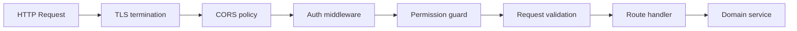

# We Check — API Design

REST API specification for **We Check** MVP. Defines HTTP resources, request and response contracts, authentication, authorization hooks, and error semantics for the modular monolith described in [Module breakdown](./02-module-breakdown.md). Implementation maps one route group per application module; all persistence aligns with [Technical domain model](./03-domain-model.md) and [Database design](./04-database-design.md).

**Related documents:** [Roles and permissions](./01-roles-permissions.md) · [Functional requirements](../brds/03-functional-requirements.md) · [Business rules](../brds/04-business-rules.md) · [Main workflows](./06-main-workflows.md) · [State machines](./07-state-machines.md) · [Error handling](./09-error-handling.md) (phase 2)

---

## 1. API Overview

| Attribute | Value |
| --- | --- |
| Base URL (local) | `http://localhost:3000/api/v1` |
| Protocol | HTTPS only in non-local environments ([NFR-17](../brds/07-non-functional-risk.md)) |
| Content type | `application/json` for request and response bodies |
| Charset | UTF-8 (Vietnamese user messages in `message` fields) |
| API style | REST; resource-oriented nouns; action sub-resources for state transitions |
| Versioning | URL prefix `/api/v1`; breaking changes require `/api/v2` |
| Idempotency | `POST` check-in is not idempotent by design; duplicate attempts return `409 DuplicateCheckIn` ([BR-04](../brds/04-business-rules.md)) |
| Pagination | Cursor-based (`cursor`, `limit`) for list endpoints; default `limit=50`, max `limit=200` |
| Timestamps | ISO 8601 UTC strings in JSON (e.g. `2026-06-28T08:30:00.000Z`) |

### 1.1 Module-to-route mapping

| Module | Route prefix | Primary FR references |
| --- | --- | --- |
| `identity-auth` | `/auth`, `/users`, `/setup` | FR-01, FR-02, FR-17 |
| `roster-enrollment` | `/classes`, `/subjects`, `/enrollments`, `/roster` | FR-03 |
| `session-management` | `/sessions` | FR-04, FR-05 |
| `checkin-qr` | `/sessions/:id/qr`, `/check-in`, `/check-in/tokens/:tokenId/preflight` | FR-06–FR-10, BR-15 |
| `attendance` | `/sessions/:id/attendance`, `/attendance` | FR-11, FR-14, FR-15 |
| `reporting-export` | `/reports` | FR-12, FR-13 |
| `notifications` | `/notifications`, `/policy` | FR-16 |

### 1.2 Cross-cutting middleware stack



Every protected route runs through authentication and permission evaluation per [01-roles-permissions.md](./01-roles-permissions.md) §2.4. Domain services enforce resource scope ([BR-08](../brds/04-business-rules.md), [BR-09](../brds/04-business-rules.md)).

---

## 2. Authentication and Session

### 2.0 Setup (bootstrap)

Public endpoints for first-deploy bootstrap ([FR-17](../brds/03-functional-requirements.md), [BR-13](../brds/04-business-rules.md)).

#### `GET /setup/status`

| Field | Specification |
| --- | --- |
| Permission | Public |
| FR | FR-17 |

**Response `200`:**

```json
{ "needsSetup": true }
```

When `User.count > 0`, returns `{ "needsSetup": false }`.

#### `POST /setup/first-admin`

| Field | Specification |
| --- | --- |
| Permission | Public only when `needsSetup: true` |
| FR | FR-17 |

**Request body:**

```json
{
  "institutionalId": "ADMIN001",
  "displayName": "Nguyễn Văn Admin",
  "email": "admin@example.edu.vn",
  "password": "string"
}
```

**Response `201`:** Created user + session cookie (same as login). **Response `403`:** `SetupAlreadyComplete` when users already exist.

### 2.1 Session model

MVP uses **server-side sessions** stored in `auth_sessions` ([FR-02](../brds/03-functional-requirements.md)). The client holds a session identifier via:

| Mechanism | Header / cookie | Usage |
| --- | --- | --- |
| HTTP-only cookie | `wecheck_session=<uuid>` | Primary for browser SPA |
| Bearer token | `Authorization: Bearer <sessionId>` | Optional for API clients and mobile web fetch |

Session expires after **8 hours** of inactivity (`lastActivityAt` sliding window). Deactivated users cannot obtain or retain valid sessions ([FR-01](../brds/03-functional-requirements.md), [BR-06](../brds/04-business-rules.md)).

### 2.2 `POST /auth/login`

Authenticates credentials and issues a session.

| Field | Specification |
| --- | --- |
| Permission | Public (no auth required) |
| FR | FR-02 |

**Request body:**

```json
{
  "email": "student@example.edu.vn",
  "password": "string",
  "returnUrl": "/check-in?token=optional-deep-link"
}
```

| Field | Type | Required | Validation |
| --- | --- | --- | --- |
| `email` | string | Yes | Valid email format |
| `password` | string | Yes | Non-empty |
| `returnUrl` | string | No | Relative path only; used after login redirect |

**Response `200 OK`:**

```json
{
  "user": {
    "id": "uuid",
    "institutionalId": "SV2026001",
    "displayName": "Nguyễn Văn A",
    "email": "student@example.edu.vn",
    "role": "Student"
  },
  "session": {
    "id": "uuid",
    "expiresAt": "2026-06-28T16:30:00.000Z"
  },
  "redirectTo": "/check-in?token=optional-deep-link"
}
```

Sets `Set-Cookie: wecheck_session=<id>; HttpOnly; Secure; SameSite=Lax`.

**Error responses:**

| Status | errorCode | Condition |
| --- | --- | --- |
| 401 | `InvalidCredentials` | Wrong email or password |
| 403 | `AccountDeactivated` | `active = false` |

### 2.3 `POST /auth/logout`

Revokes current session. Permission: authenticated. Response `204 No Content`.

**Client expectations:**

- Response clears the `SESSION_COOKIE_NAME` HTTP-only session cookie via `Set-Cookie`.
- Subsequent `GET /auth/me` or any protected route returns **401** `Unauthenticated` with the revoked cookie.
- Web client calls with `credentials: 'include'`; on success redirects to `/login` (no `returnUrl`). See [12-backend-frontend-tech-stack.md](./12-backend-frontend-tech-stack.md) §4.5 and [10-user-flows.md](../ui-ux/10-user-flows.md) §14.

### 2.4 `GET /auth/me`

Returns authenticated user profile. Permission: `user:read` (self). Response `200` with `User` DTO (no `passwordHash`).

---

## 3. Users (Admin)

All routes require `TrainingOfficeAdmin` role unless noted.

### 3.1 `GET /users`

List users with optional filters: `role`, `active`, `search` (email or institutional ID). Permission: `user:read` (all). FR-01.

**Response `200`:**

```json
{
  "items": [
    {
      "id": "uuid",
      "institutionalId": "GV2026001",
      "displayName": "Trần Thị B",
      "email": "instructor@example.edu.vn",
      "role": "Instructor",
      "active": true,
      "createdAt": "2026-06-01T00:00:00.000Z"
    }
  ],
  "nextCursor": "opaque-cursor-or-null"
}
```

### 3.2 `POST /users`

Create user account. Permission: `user:write`. FR-01.

**Request body:**

```json
{
  "institutionalId": "SV2026150",
  "displayName": "Lê Văn C",
  "email": "lec@example.edu.vn",
  "password": "initial-password",
  "role": "Student"
}
```

**Response `201 Created`** with created `User` DTO.

**Validation errors `422`:** duplicate `email` or `institutionalId`, invalid `role` enum.

### 3.2a `POST /users/import`

Bulk user CSV import with upsert by `institutional_id`. Permission: `user:write`. FR-01, [AC-01d](../brds/08-acceptance-mvp-future.md).

Multipart form upload: `file` (CSV), optional `dryRun` (boolean).

**CSV required columns:** `institutional_id`, `display_name`, `email`, `role`, `active`

| Column | Validation |
| --- | --- |
| `institutional_id` | VAL-05; upsert match key |
| `display_name` | VAL-04 |
| `email` | VAL-02; unique except when updating same `institutional_id` |
| `role` | One of: `Student`, `Instructor`, `TrainingOfficeAdmin` |
| `active` | Boolean (`true`/`false` or `1`/`0`); defaults `true` if omitted |

**Upsert semantics:** Create when `institutional_id` not found (random initial password generated, not returned). Update `display_name`, `email`, `role`, `active` when ID exists; password and sessions unchanged.

**Response `202 Accepted`:**

```json
{
  "batchId": "uuid",
  "status": "Processing",
  "message": "Đang xử lý file người dùng..."
}
```

### 3.2b `GET /users/imports/:batchId`

Poll user import status. Returns `UserImportBatch` with `totalRows`, `successRows`, `errorRows`, `createdCount`, `updatedCount`, `errorDetails`.

**Example completed summary:**

```json
{
  "id": "uuid",
  "status": "Completed",
  "totalRows": 1200,
  "successRows": 1198,
  "errorRows": 2,
  "createdCount": 1150,
  "updatedCount": 48,
  "errorDetails": [
    { "rowNumber": 42, "field": "email", "message": "DuplicateEmail" }
  ]
}
```

### 3.3 `PATCH /users/:userId`

Update display name, email, role, or `active` flag. Permission: `user:write`. Deactivating a user revokes all `AuthSession` rows for that user.

---

## 4. Roster and Enrollment

### 4.1 `GET /classes` and `GET /subjects`

Reference data catalog lists. Permission: `roster:read` (scoped). Instructor sees only classes/subjects tied to `ClassAssignment`; admin sees all.

**Query parameters:** `q` (search code/name), `sort` (default `code` asc), `offset`, `limit` (default **25**).

**Response `200`:**

```json
{
  "items": [
    { "id": "uuid", "code": "HESD-03", "name": "HESD Cohort 03" }
  ],
  "total": 42,
  "offset": 0,
  "limit": 25
}
```

Used by admin catalog pages `/admin/classes` and `/admin/subjects` ([AC-03i](../brds/08-acceptance-mvp-future.md)).

### 4.1a `POST /classes` and `POST /subjects`

Create reference records. Permission: `roster:write`. FR-03, [AC-03d](../brds/08-acceptance-mvp-future.md).

**Request body (`POST /classes`):**

```json
{ "code": "HESD-03", "name": "HESD Cohort 03" }
```

**Request body (`POST /subjects`):**

```json
{ "code": "SWE-102", "name": "Software Engineering 102" }
```

| Validation | Rule |
| --- | --- |
| `code` | Uppercase alphanumeric + hyphen; unique; max length per [08-validation-rules.md](./08-validation-rules.md) |
| Duplicate | `400` with `DuplicateClassCode` or `DuplicateSubjectCode` |

MVP: create-only — no delete endpoints.

### 4.2 `GET /enrollments`

Query parameters: `classId`, `subjectId` (both required). Returns enrolled students for class-subject pair. Permission: `roster:read`. FR-03.

**Response `200`:**

```json
{
  "class": { "id": "uuid", "code": "HESD-2026-A", "name": "HESD Cohort A" },
  "subject": { "id": "uuid", "code": "HESD-W01", "name": "Workshop 01" },
  "enrollments": [
    {
      "enrollmentId": "uuid",
      "student": {
        "id": "uuid",
        "institutionalId": "SV2026001",
        "displayName": "Nguyễn Văn A"
      },
      "enrolledAt": "2026-06-01T00:00:00.000Z"
    }
  ],
  "totalCount": 142
}
```

### 4.3 `POST /roster/import`

Multipart form upload: `file` (CSV), optional `dryRun` (boolean). Permission: `roster:write`. FR-03.

**CSV required columns:** `institutional_id`, `display_name`, `class_code`, `subject_code`

**Response `202 Accepted`:**

```json
{
  "batchId": "uuid",
  "status": "Processing",
  "message": "Đang xử lý file danh sách..."
}
```

### 4.4 `GET /roster/imports/:batchId`

Poll import status. Returns `RosterImportBatch` with `successRows`, `errorRows`, `errorDetails`.

---

## 5. Sessions

Session lifecycle transitions: [07-state-machines.md](./07-state-machines.md) §2.

### 5.1 `GET /sessions`

Query: `status`, `classId`, `subjectId`, `from`, `to`, `instructorId` (admin only). Permission: `session:read` (scoped). Instructor sees own sessions and assigned class-subject scope.

### 5.2 `POST /sessions`

Create session in `Draft`. Permission: `session:write`. FR-04, [BR-07](../brds/04-business-rules.md).

**Request body:**

```json
{
  "classId": "uuid",
  "subjectId": "uuid",
  "title": "Buổi 3 — Kiến trúc hệ thống",
  "roomName": "Phòng A201",
  "roomLatitude": 10.762622,
  "roomLongitude": 106.660172,
  "gpsRadiusMeters": 100,
  "scheduledStart": "2026-06-28T08:00:00.000Z"
}
```

| Field | Validation |
| --- | --- |
| `roomLatitude` | −90 to 90; may be null in `Draft` but required before open |
| `roomLongitude` | −180 to 180 |
| `gpsRadiusMeters` | 20–500; default 100 |
| `scheduledStart` | Future or same-day; not in distant past |

**Response `201`** with `Session` DTO including `status: "Draft"`.

**Guard:** Instructor must have `ClassAssignment` for `classId` + `subjectId`.

### 5.3 `PATCH /sessions/:sessionId`

Update `Draft` session fields. Blocked when `status` is `Active`, `Closed`, or `Cancelled`.

### 5.4 `POST /sessions/:sessionId/open`

Transition `Draft` → `Active`. Permission: `session:write`. FR-05, [BR-07](../brds/04-business-rules.md).

**Preconditions:**

- Valid `roomLatitude` and `roomLongitude` present
- Session owned by caller or within assignment scope

**Side effects:**

- Set `openedAt` to current UTC time
- Initialize `Pending` attendance records for all enrolled students ([FR-05](../brds/03-functional-requirements.md))
- Start QR token scheduler ([FR-06](../brds/03-functional-requirements.md))
- Emit `SessionOpened` domain event

**Response `200`** with updated `Session` DTO (`status: "Active"`).

**Errors:**

| Status | errorCode | Condition |
| --- | --- | --- |
| 422 | `RoomGpsRequired` | Missing or invalid coordinates |
| 409 | `InvalidSessionState` | Status not `Draft` |

### 5.5 `POST /sessions/:sessionId/close`

Transition `Active` → `Closed`. Permission: `session:write`. FR-05, [BR-01](../brds/04-business-rules.md).

**Side effects:**

- Set `closedAt`
- Bulk `Pending` → `Absent` via `AttendanceService.finalizeOnClose`
- Stop QR scheduler
- Emit `SessionClosed`; trigger absence threshold evaluation ([FR-16](../brds/03-functional-requirements.md))

### 5.6 `POST /sessions/:sessionId/cancel`

Transition `Draft` → `Cancelled` only (MVP). Permission: `session:write`. Response `200` with `status: "Cancelled"`.

### 5.7 `GET /sessions/:sessionId`

Single session detail including `status`, timestamps, room GPS, enrollment count.

---

## 6. QR Display and Check-In

### 6.1 `GET /sessions/:sessionId/qr/current`

Returns current valid QR payload for instructor display. Permission: `qr:display`. FR-06.

**Preconditions:** Session `Active`.

**Response `200`:**

```json
{
  "sessionId": "uuid",
  "tokenId": "uuid",
  "qrPayload": "wecheck://check-in?token=uuid&session=uuid",
  "issuedAt": "2026-06-28T08:05:00.000Z",
  "expiresAt": "2026-06-28T08:05:30.000Z",
  "secondsRemaining": 22,
  "attendanceWindowClosesAt": "2026-06-28T08:10:00.000Z"
}
```

Client polls every **5 seconds** or uses Server-Sent Events in future; MVP polling interval 5 s is sufficient for countdown UI.

QR encodes deep link consumed by student mobile web check-in page ([FR-07](../brds/03-functional-requirements.md)).

### 6.2 `GET /check-in/tokens/:tokenId/preflight`

Read-only token validation **before** client advances from scan to GPS capture ([BR-15](../brds/04-business-rules.md), [FR-07](../brds/03-functional-requirements.md)). Permission: `checkin:submit` (authenticated Student).

**Query parameters (optional):**

| Param | Purpose |
| --- | --- |
| `sessionId` | Deep-link session id for `SessionMismatch` check when QR payload includes session |

**Preflight chain (server-side, no writes):**

1. Token exists and parses
2. Token status `Valid` (not `Expired`, `Consumed`)
3. Parent session `Active`
4. Authenticated student has `Enrollment` for session's class-subject pair

**Response `200 OK` (pass):**

```json
{
  "outcome": "Valid",
  "tokenId": "uuid",
  "sessionId": "uuid",
  "session": {
    "classCode": "HESD-01",
    "subjectCode": "SWE-101",
    "roomName": "Phòng A201",
    "status": "Active"
  }
}
```

**Response `403` / `404` (fail):**

| errorCode | HTTP | User message (vi-VN) |
| --- | --- | --- |
| `TokenNotFound` | 404 | *Không nhận diện được mã QR* |
| `ExpiredQr` | 403 | *Mã QR đã hết hạn, vui lòng quét mã mới* |
| `SessionNotActive` | 403 | Existing session-not-active copy |
| `NotEnrolled` | 403 | *Bạn không thuộc danh sách lớp của buổi học này* |
| `TokenAlreadyUsed` | 403 | Token reuse copy ([BR-11](../brds/04-business-rules.md)) |
| `SessionMismatch` | 403 | QR session id does not match token's bound session |

Client must not mount `GpsCaptureStep` until preflight returns `200` with `outcome: "Valid"`.

### 6.3 `POST /check-in`

Student check-in submission. Permission: `checkin:submit` (Student role). FR-07–FR-10.

**Request body:**

```json
{
  "tokenId": "uuid",
  "latitude": 10.762700,
  "longitude": 106.660200,
  "spoofMetadata": {
    "mockLocationDetected": false,
    "accuracyMeters": 12.5,
    "platform": "android"
  }
}
```

| Field | Required | Notes |
| --- | --- | --- |
| `tokenId` | Yes | From scanned QR |
| `latitude`, `longitude` | Yes for check-in | Discarded after validation; not persisted ([FR-08](../brds/03-functional-requirements.md)) |
| `spoofMetadata` | No | Used by `GeoVerificationService` ([FR-10](../brds/03-functional-requirements.md)) |

**Processing:** Single serializable database transaction per [03-domain-model.md](./03-domain-model.md) §5.2.

**Response `200` (success):**

```json
{
  "outcome": "Success",
  "message": "Điểm danh thành công",
  "attendance": {
    "status": "Present",
    "checkedInAt": "2026-06-28T08:05:12.000Z"
  }
}
```

**Response `4xx` (failure):**

```json
{
  "outcome": "OutOfRadius",
  "message": "Bạn đang ngoài phạm vi phòng học. Vui lòng di chuyển gần hơn hoặc liên hệ giảng viên.",
  "errorCode": "OutOfRadius"
}
```

### 6.3 Check-in outcome to HTTP status mapping

Canonical mapping from [State machine (BRD)](../brds/05-state-machine.md) §5:

| outcome | HTTP | errorCode | BR / FR |
| --- | --- | --- | --- |
| `Success` | 200 | — | FR-07 |
| `ExpiredQr` | 400 | `ExpiredQr` | BR-03 |
| `OutOfRadius` | 400 | `OutOfRadius` | BR-02 |
| `DuplicateCheckIn` | 409 | `DuplicateCheckIn` | BR-04 |
| `GpsDisabled` | 400 | `GpsDisabled` | BR-12 |
| `Unauthenticated` | 401 | `Unauthenticated` | BR-06 |
| `SessionNotActive` | 403 | `SessionNotActive` | BR-01 |
| `SpoofSuspected` | 400 | `SpoofSuspected` | FR-10 |
| `NotEnrolled` | 403 | `NotEnrolled` | FR-03 |
| `TokenNotFound` | 404 | `TokenNotFound` | — |
| `SessionMismatch` | 400 | `SessionMismatch` | FR-07 preflight |

Every attempt inserts a `CheckInAttempt` row regardless of outcome ([FR-09](../brds/03-functional-requirements.md)).

---

## 7. Attendance

### 7.1 `GET /sessions/:sessionId/attendance`

Live roster for instructor monitor. Permission: `attendance:read` (session scope). FR-15 (Should).

**Response `200`:**

```json
{
  "sessionId": "uuid",
  "summary": {
    "enrolled": 142,
    "present": 128,
    "pending": 10,
    "absent": 2,
    "excused": 1,
    "rejected": 1
  },
  "records": [
    {
      "id": "uuid",
      "student": {
        "institutionalId": "SV2026001",
        "displayName": "Nguyễn Văn A"
      },
      "status": "Present",
      "checkedInAt": "2026-06-28T08:05:12.000Z"
    }
  ]
}
```

Supports `status` filter and `sort` (`displayName`, `checkedInAt`, `status`).

### 7.2 `PATCH /attendance/:recordId`

Manual status edit. Permission: `attendance:write`. FR-11, [BR-10](../brds/04-business-rules.md).

**Request body:**

```json
{
  "status": "Present",
  "note": "Xác minh trực tiếp — GPS nghi ngờ giả mạo"
}
```

Allowed `status` values: `Present`, `Absent`, `Excused`, `Rejected`.

**Guards:**

- Instructor: within 24 hours of session `closedAt`
- Admin: no time restriction
- Session must be `Active` or `Closed`

**Response `200`** with updated record. Writes `AttendanceAuditLog`.

**Error `403`:** `EditWindowExpired` when instructor exceeds 24-hour window.

### 7.3 `GET /attendance/me/history`

Student personal history. Permission: `attendance:read` (self). FR-14.

Query: `subjectId`, `from`, `to`, `cursor`, `limit`.

---

## 8. Reports and Export

### 8.1 `GET /reports/session/:sessionId`

Per-session roster report. Permission: `report:read` (scoped). FR-12, [BR-08](../brds/04-business-rules.md).

### 8.2 `GET /reports/summary`

Class-subject aggregation over date range. Query: `classCode`, `subjectCode`, `from`, `to`. Permission: `report:read`. Instructor scoped to assignments; admin institution-wide.

**Response `200`:**

```json
{
  "classCode": "HESD-2026-A",
  "subjectCode": "HESD-W01",
  "dateFrom": "2026-06-01",
  "dateTo": "2026-06-30",
  "sessionsHeld": 8,
  "students": [
    {
      "institutionalId": "SV2026001",
      "displayName": "Nguyễn Văn A",
      "presentCount": 7,
      "absentCount": 1,
      "excusedCount": 0,
      "attendanceRate": 0.875
    }
  ]
}
```

### 8.3 `POST /reports/export`

CSV export from report pages or dedicated export UI. FR-13, [BR-09](../brds/04-business-rules.md).

**Permissions:**

| Role | Permission | Scope enforcement |
| --- | --- | --- |
| `TrainingOfficeAdmin` | `report:export` | Institution-wide within request filters |
| `Instructor` | `report:read` + assignment check | Same class-subject scope as `GET /reports/summary` ([BR-08](../brds/04-business-rules.md)) |
| `Student` | — | **403** `ExportNotAllowed` |

**Request body:** same filter fields as summary report (mirrors active `ReportFilterBar` / inline **Xuất CSV** state per [14-listing-pages-search-filter-sort.md](../ui-ux/14-listing-pages-search-filter-sort.md) §10).

**Response `200`:** `Content-Type: text/csv; charset=utf-8` with `Content-Disposition: attachment; filename="attendance-export-2026-06-28.csv"`.

**CSV columns:** `institutional_id`, `display_name`, `class_code`, `subject_code`, `session_date`, `attendance_status`, `checked_in_at`

Writes `ExportAuditLog` on success. Denied attempts (student, out-of-scope instructor) write security audit per [NFR-15](../brds/07-non-functional-risk.md).

---

## 9. Notifications and Policy

### 9.1 `GET /notifications`

In-app notifications for authenticated user. Permission: `notification:read`. FR-16.

### 9.2 `PATCH /notifications/:notificationId/read`

Mark notification read. Response `204`.

### 9.3 `GET /policy/absence-threshold` and `PUT /policy/absence-threshold`

Admin policy configuration. Permission: `policy:write`. [BR-05](../brds/04-business-rules.md).

**PUT body:**

```json
{
  "thresholdPercent": 20
}
```

Default **20%** unexcused absence rate before warning.

---

## 10. Standard Response Envelope

### 10.1 Success list response

```json
{
  "items": [],
  "nextCursor": null,
  "totalCount": 0
}
```

### 10.2 Error response

```json
{
  "errorCode": "ValidationFailed",
  "message": "Tọa độ phòng học không hợp lệ",
  "details": [
    { "field": "roomLatitude", "code": "OutOfRange", "message": "Giá trị phải từ -90 đến 90" }
  ],
  "requestId": "uuid"
}
```

| HTTP status | Usage |
| --- | --- |
| 400 | Client error, check-in rejection, malformed JSON |
| 401 | Missing or invalid session ([BR-06](../brds/04-business-rules.md)) |
| 403 | Permission denied or session not active |
| 404 | Resource not found |
| 409 | Conflict (`DuplicateCheckIn`, invalid state transition) |
| 422 | Validation failure |
| 429 | Rate limit exceeded ([NFR-01](../brds/07-non-functional-risk.md)) |
| 500 | Unexpected server error |

User-facing `message` fields use Vietnamese (`vi-VN`). `errorCode` values are English stable identifiers for client logic.

### 10.3 Rate limiting

| Endpoint group | Limit | Window |
| --- | --- | --- |
| `POST /check-in` | 10 requests per student per session | 10 minutes |
| `POST /auth/login` | 5 attempts per email | 15 minutes |
| `GET /sessions/:id/qr/current` | 60 requests per session | 1 minute |
| General authenticated API | 300 requests per user | 1 minute |

Exceeded limits return `429` with `Retry-After` header.

---

## 11. Webhooks and Real-Time (MVP)

MVP does not expose outbound webhooks. Instructor live dashboard uses **short polling** on `GET /sessions/:sessionId/attendance` every **5 seconds** while session is `Active` ([FR-15](../brds/03-functional-requirements.md)). Future: WebSocket or SSE channel documented in [06-main-workflows.md](./06-main-workflows.md) §7.

---

## 12. OpenAPI and Contract Testing

Implementation must publish `openapi.yaml` at `/api/v1/openapi.json` generated from route decorators or maintained by hand. Contract tests validate:

- All `CheckInOutcome` values map to documented HTTP statuses
- Session transition endpoints reject illegal state changes
- Permission matrix from [01-roles-permissions.md](./01-roles-permissions.md) §2.2

Acceptance criteria cross-reference: [08-acceptance-mvp-future.md](../brds/08-acceptance-mvp-future.md) (`AC-xx`).

---

## 13. FR and BR Traceability

| Endpoint | FR | BR |
| --- | --- | --- |
| `POST /auth/login` | FR-02 | BR-06 |
| `POST /users` | FR-01 | — |
| `POST /roster/import` | FR-03 | — |
| `POST /sessions` | FR-04 | BR-07 |
| `POST /sessions/:id/open` | FR-05, FR-06 | BR-01, BR-07 |
| `POST /sessions/:id/close` | FR-05 | BR-01 |
| `GET /sessions/:id/qr/current` | FR-06 | BR-03 |
| `POST /check-in` | FR-07–FR-10 | BR-02–BR-04, BR-11, BR-12 |
| `PATCH /attendance/:id` | FR-11 | BR-10 |
| `GET /reports/*` | FR-12 | BR-08 |
| `POST /reports/export` | FR-13 | BR-09 |
| `GET /attendance/me/history` | FR-14 | — |
| `GET /sessions/:id/attendance` | FR-15 | — |
| `GET /notifications` | FR-16 | BR-05 |

---

## 14. Future Consideration

| Enhancement | API impact |
| --- | --- |
| WebSocket live roster | `WS /sessions/:id/attendance/stream` |
| SSO / OIDC | `GET /auth/oidc/callback`; deprecate password login |
| Offline check-in queue | `POST /check-in/queue` with sync endpoint |
| API versioning headers | `Accept: application/vnd.wecheck.v2+json` |
| Bulk session creation | `POST /sessions/bulk` for recurring workshops |
| HATEOAS links | `_links` on `Session` for `open`, `close`, `qr` actions |
| OpenAPI client SDK | Generated TypeScript client for web SPA |
