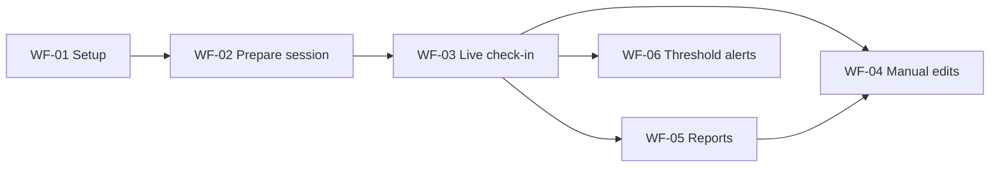
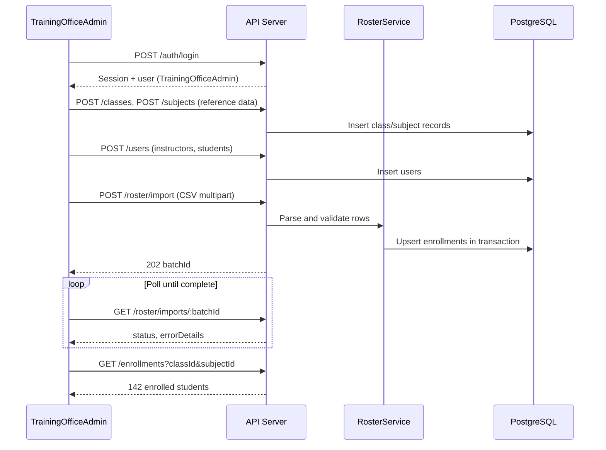
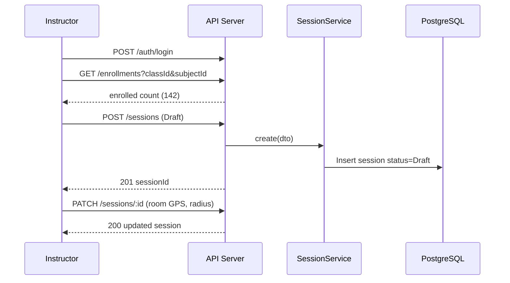
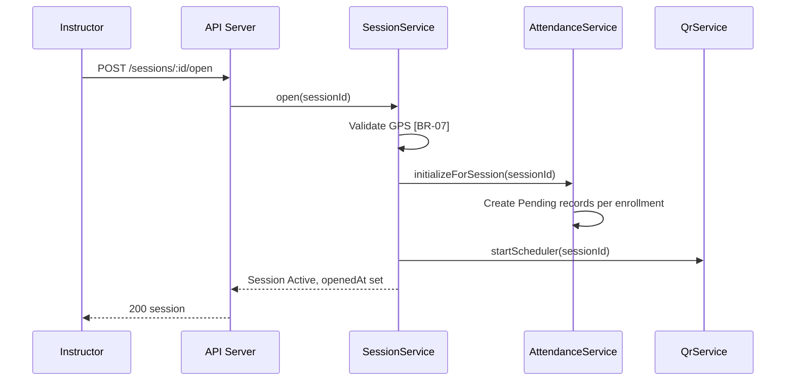
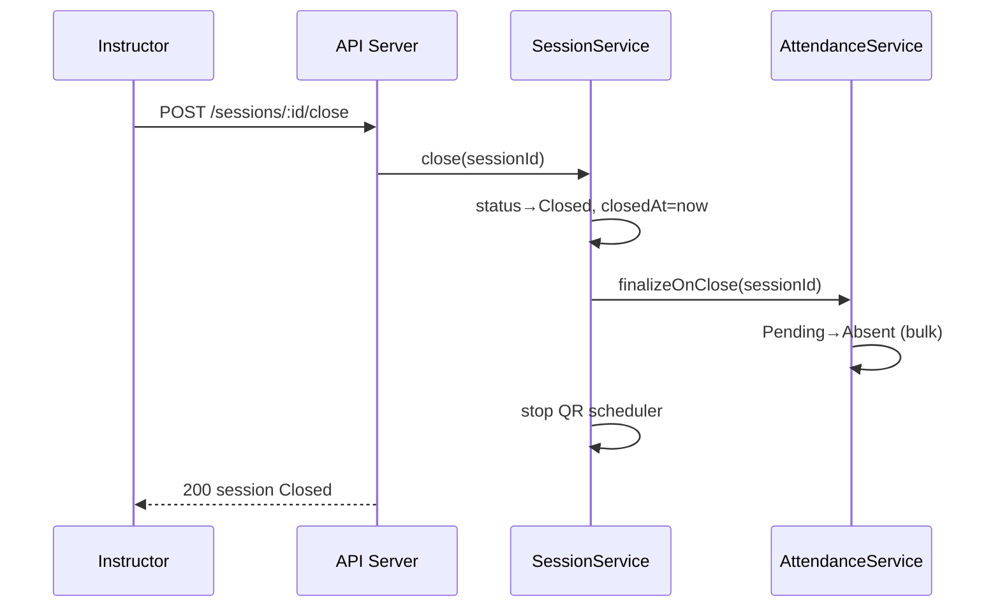
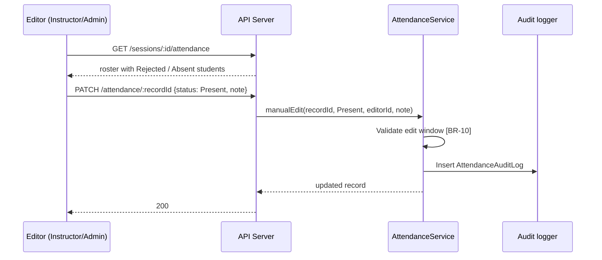
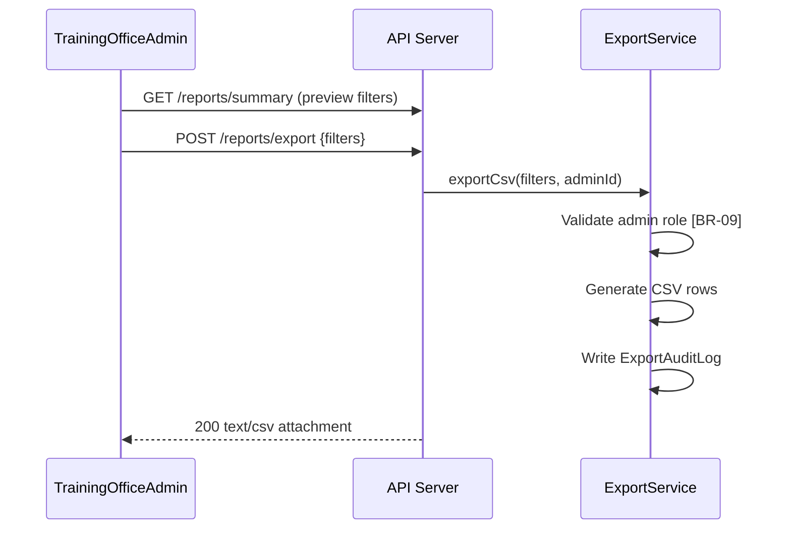

# We Check — Main Workflows

End-to-end implementation workflows for **We Check** MVP. Each workflow maps business processes from [Business workflow (BRD)](../brds/02-business-workflow.md) to concrete API calls, domain service orchestration, and client responsibilities. State transitions reference [State machines](./07-state-machines.md); HTTP contracts reference [API design](./05-api-design.md).

**Related documents:** [Module breakdown](./02-module-breakdown.md) · [Technical domain model](./03-domain-model.md) · [Functional requirements](../brds/03-functional-requirements.md) · [Business rules](../brds/04-business-rules.md) · [Roles and permissions](./01-roles-permissions.md)

---

## 1. Workflow Overview

| Workflow ID | Name | Primary actor | Entry trigger | Terminal outcome |
| --- | --- | --- | --- | --- |
| WF-01 | System setup and roster preparation | `TrainingOfficeAdmin` | New cohort term | Roster imported; users provisioned |
| WF-02 | Session preparation | `Instructor` | Before scheduled workshop | Session in `Draft` with room GPS |
| WF-03 | Live session and check-in | `Instructor`, `Student` | Instructor opens session | Session `Closed`; attendance recorded |
| WF-04 | Manual attendance correction | `Instructor`, `TrainingOfficeAdmin` | Exception during or after session | Attendance status corrected with audit |
| WF-05 | Reporting and CSV export | `Instructor`, `TrainingOfficeAdmin` | Session closed or periodic review | Reports viewed; CSV exported (admin) |
| WF-06 | Absence threshold notification | System | Session close | In-app warnings when rate exceeds policy |



MVP target: complete WF-03 for 100–150 students within **5 minutes** ([NFR-01](../brds/07-non-functional-risk.md)).

---

## 2. WF-01 — System Setup and Roster Preparation

**Actors:** `TrainingOfficeAdmin`, Unauthenticated visitor (bootstrap), System  
**FR:** FR-01, FR-03, FR-17  
**Modules:** `identity-auth`, `roster-enrollment`

### 2.0 Fresh deployment bootstrap (optional)

When `SEED_ENABLED=false` and `User.count = 0`:

| Step | Action | API / service |
| --- | --- | --- |
| 0 | Visitor opens app | `GET /setup/status` → `needsSetup: true` |
| 1 | Complete `/setup` form | `POST /setup/first-admin` |
| 2 | Land on `/admin` hub | Session established |

### 2.1 Sequence



### 2.2 Step specification

| Step | Action | API / service | Validation |
| --- | --- | --- | --- |
| 1 | Admin authenticates (or completes bootstrap) | `POST /auth/login` or `POST /setup/first-admin` | Valid credentials; `active = true` |
| 2 | Create class and subject reference records | `POST /classes`, `POST /subjects`; verify via `GET /classes`, `GET /subjects` | Unique codes; independent catalogs; required before CSV import ([AC-03d](../brds/08-acceptance-mvp-future.md)–[AC-03f](../brds/08-acceptance-mvp-future.md)) |
| 3 | Provision instructor accounts | `POST /users` or user CSV import | Unique `institutionalId`, `email`; role `Instructor` |
| 4 | Bulk provision student accounts | `POST /users/import` | Preferred for large cohorts; upsert by `institutional_id` ([AC-01d](../brds/08-acceptance-mvp-future.md)) |
| 5 | Upload roster CSV | `POST /roster/import` | Columns: `institutional_id`, `display_name`, `class_code`, `subject_code`; links enrollments to existing users by ID |
| 6 | System validates rows | `RosterService.importCsv` | Reject duplicate enrollment triple; row-level errors in `errorDetails`; may update `display_name` on existing user only |
| 7 | Assign instructors to class-subject | `ClassAssignment` records | Required before instructor can create sessions ([BR-08](../brds/04-business-rules.md)) |
| 8 | Verify roster | `GET /enrollments` | Headcount matches expected cohort size (100–150) |

### 2.3 Completion criteria

- Every student in physical cohort has `Enrollment` for class-subject pair.
- At least one `Instructor` has `ClassAssignment` for the workshop class.
- Import batch `status = Completed` with `errorRows = 0` (or errors resolved manually).

### 2.4 Failure handling

| Failure | System behavior | Admin action |
| --- | --- | --- |
| Duplicate student ID in CSV | Row rejected; counted in `errorRows` | Fix CSV and re-import |
| Unknown class or subject code | Row rejected | Create class/subject first via admin tooling |
| Partial import failure | Batch `status = Completed` with mixed results | Review `errorDetails`; fix and re-import failed rows |

---

## 3. WF-02 — Session Preparation

**Actors:** `Instructor`  
**FR:** FR-04  
**Modules:** `session-management`, `roster-enrollment`  
**State:** Session created in `Draft`

### 3.1 Sequence



### 3.2 Step specification

| Step | Action | Details |
| --- | --- | --- |
| 1 | Instructor logs in | `POST /auth/login` |
| 2 | Review roster count | `GET /enrollments` — confirm 100–150 students |
| 3 | Create session | `POST /sessions` with class, subject, schedule, room name |
| 4 | Set room GPS | `PATCH /sessions/:id` with `roomLatitude`, `roomLongitude` |
| 5 | Optional radius override | Default 100 m; range 20–500 m per room size |
| 6 | Pre-open validation | Client disables "Open session" until GPS fields valid ([BR-07](../brds/04-business-rules.md)) |

### 3.3 Completion criteria

Session exists in `Draft` with valid GPS coordinates and `scheduledStart` aligned to workshop timetable. Instructor ready to open check-in at session start.

---

## 4. WF-03 — Live Session and Check-In

**Actors:** `Instructor`, `Student`, System  
**FR:** FR-05, FR-06, FR-07, FR-08, FR-09, FR-10, FR-15  
**Modules:** `session-management`, `checkin-qr`, `attendance`  
**State machines:** Session `Draft` → `Active` → `Closed`; Attendance `Pending` → `Present`

### 4.1 Instructor open session



**Auto-close scheduler:** Background job closes session at `scheduledStart + 10 minutes` if instructor has not closed manually ([BR-01](../brds/04-business-rules.md)).

### 4.2 QR display loop

| Step | Actor | API call | Interval |
| --- | --- | --- | --- |
| 1 | Instructor opens QR projection page | Navigate to `/sessions/:id/qr` (UI) | Once |
| 2 | Client polls current token | `GET /sessions/:id/qr/current` | Every 5 s |
| 3 | Server rotates tokens | `QrService.rotateTokens` (scheduler) | Every 30 s |
| 4 | UI renders QR image + countdown | Client-side from `qrPayload`, `secondsRemaining` | Continuous |

Token state transitions: [07-state-machines.md](./07-state-machines.md) §4.

### 4.3 Student check-in (happy path)

```mermaid
sequenceDiagram
    participant S as Student
    participant B as Mobile browser
    participant API as API Server
    participant CI as CheckInService
    participant GEO as GeoVerificationService

    S->>B: Scan QR (camera)
    B->>B: Extract tokenId from payload
    alt Not authenticated
        B->>API: GET /check-in page
        API-->>B: Redirect /login?returnUrl=...
        S->>API: POST /auth/login
    end
    B->>API: GET /check-in/tokens/:tokenId/preflight
    alt Preflight fails
        API-->>B: 4xx outcome (ExpiredQr, NotEnrolled, etc.)
        B->>B: Stay on scan step or show outcome — no GPS step
    end
    B->>B: Request geolocation permission
    B->>API: POST /check-in {tokenId, lat, lng, spoofMetadata}
    API->>CI: submit(...)
    CI->>CI: Lock QrToken FOR UPDATE
    CI->>GEO: verifyLocation(room, client, radius)
    GEO-->>CI: withinRadius=true
    CI->>CI: Token→Consumed; Attendance→Present
    CI-->>API: outcome Success
    API-->>B: 200 confirmation (vi-VN)
```

**Target latency:** Confirmation within **2 seconds** under normal network ([FR-07](../brds/03-functional-requirements.md)).

### 4.4 Student check-in (failure paths)

| Condition | outcome | HTTP | Student action |
| --- | --- | --- | --- |
| QR older than 30 s | `ExpiredQr` | 400 | Scan fresh QR on screen |
| Outside GPS radius | `OutOfRadius` | 400 | Move closer or ask instructor |
| Already checked in | `DuplicateCheckIn` | 409 | None — show confirmation |
| GPS permission denied | `GpsDisabled` | 400 | Enable location in browser settings |
| Mock location detected | `SpoofSuspected` | 400 | See instructor for manual verify ([FR-10](../brds/03-functional-requirements.md)) |
| Session closed or window ended | `SessionNotActive` | 403 | Contact instructor |
| Not on roster | `NotEnrolled` | 403 | Contact training office |

Failed attempts log `CheckInAttempt`; `Pending` may remain until session close unless policy sets `Rejected` ([07-state-machines.md](./07-state-machines.md) §3).

### 4.5 Instructor live monitor

| Step | Action | API |
| --- | --- | --- |
| 1 | Open live attendance view | UI route `/sessions/:id/monitor` |
| 2 | Poll roster | `GET /sessions/:id/attendance` every 5 s |
| 3 | Display summary counts | `summary.present` / `summary.enrolled` |
| 4 | Highlight `Rejected` and recent check-ins | Sort by `checkedInAt` desc |

FR-15 (Should): ship if schedule allows; polling satisfies MVP without WebSocket.

### 4.6 Instructor close session



Alternatively, auto-close job triggers same path at `scheduledStart + 10 min` ([BR-01](../brds/04-business-rules.md)).

### 4.7 WF-03 completion criteria

- Session `status = Closed`.
- All enrolled students have terminal attendance status (`Present`, `Absent`, `Excused`, or `Rejected`).
- No `Pending` records remain after finalize.
- Check-in window closed; late `POST /check-in` returns `SessionNotActive`.

---

## 5. WF-04 — Manual Attendance Correction

**Actors:** `Instructor`, `TrainingOfficeAdmin`  
**FR:** FR-11  
**BR:** BR-10  
**Module:** `attendance`

### 5.1 Sequence



### 5.2 Edit window rules

| Editor | Allowed window | API error if violated |
| --- | --- | --- |
| `Instructor` | During `Active` or within 24 h of `closedAt` | `403 EditWindowExpired` |
| `TrainingOfficeAdmin` | Any time | — |

### 5.3 Common correction scenarios

| Scenario | From status | To status | Note example |
| --- | --- | --- | --- |
| GPS spoof false positive | `Rejected` | `Present` | "Xác minh trực tiếp tại lớp" |
| Student device failure | `Absent` | `Present` | "Không có điện thoại — điểm danh thủ công" |
| Excused absence | `Absent` | `Excused` | "Nghỉ có phép — giấy xác nhận" |
| Proxy suspicion confirmed | `Present` | `Absent` | "Phát hiện điểm danh hộ" |

Every edit creates immutable `AttendanceAuditLog` ([FR-11](../brds/03-functional-requirements.md), [NFR-14](../brds/07-non-functional-risk.md)).

---

## 6. WF-05 — Reporting and CSV Export

**Actors:** `Instructor`, `TrainingOfficeAdmin`  
**FR:** FR-12, FR-13  
**BR:** BR-08, BR-09  
**Module:** `reporting-export`

### 6.1 Instructor session report

| Step | Action | API |
| --- | --- | --- |
| 1 | Select class and subject | UI filters |
| 2 | View session roster report | `GET /reports/session/:sessionId` |
| 3 | View date-range summary | `GET /reports/summary?classCode&subjectCode&from&to` |

**Scope guard:** Instructor requests filtered to `ClassAssignment` scope; cross-instructor access returns `403` ([BR-08](../brds/04-business-rules.md)).

### 6.2 Admin CSV export



**Report availability target:** Data available within **10 minutes** of session close ([FR-12](../brds/03-functional-requirements.md)).

### 6.3 Student personal history (WF-05 sub-flow)

| Step | Action | API |
| --- | --- | --- |
| 1 | Student opens history page | UI `/attendance/history` |
| 2 | Load paginated records | `GET /attendance/me/history` |
| 3 | Display status per session | Self-scope only ([FR-14](../brds/03-functional-requirements.md)) |

---

## 7. WF-06 — Absence Threshold Notification

**Actors:** System, `Student`, `Instructor`  
**FR:** FR-16 (Should)  
**BR:** BR-05  
**Module:** `notifications`

### 7.1 Trigger

On `SessionClosed` domain event, `NotificationService.evaluateAbsenceThresholds(sessionId)` runs asynchronously.

### 7.2 Processing steps

| Step | Service action | Rule |
| --- | --- | --- |
| 1 | Load closed sessions for subject | Count completed sessions per student |
| 2 | Calculate unexcused absence rate | `Excused` excluded from numerator ([BR-05](../brds/04-business-rules.md)) |
| 3 | Compare to policy threshold | Default 20% from `PolicySetting` |
| 4 | Create `Notification` rows | One per affected student; one per assigned instructor |
| 5 | Users poll inbox | `GET /notifications` |

### 7.3 Notification payload

Includes `subjectCode`, `absenceRate`, `threshold`, `unexcusedAbsenceCount`, `sessionCount` per [03-domain-model.md](./03-domain-model.md) §4.13.

Ship in MVP only if schedule allows per [02-module-breakdown.md](./02-module-breakdown.md) §2.7.

---

## 8. Cross-Workflow Domain Events

| Event | Emitted after | Consumers |
| --- | --- | --- |
| `SessionOpened` | `POST /sessions/:id/open` | QR scheduler, attendance bootstrap |
| `SessionClosed` | `POST /sessions/:id/close` or auto-close | QR stop, attendance finalize, threshold job |
| `CheckInSucceeded` | `POST /check-in` success | Live monitor cache invalidation |
| `AttendanceManuallyEdited` | `PATCH /attendance/:id` | Threshold recalculation |
| `AbsenceThresholdExceeded` | Threshold job | Notification creation |

Events are in-process for MVP ([03-domain-model.md](./03-domain-model.md) §8).

---

## 9. Concurrency and Load Considerations

| Scenario | Mitigation | NFR |
| --- | --- | --- |
| 150 simultaneous check-ins | Serializable transaction on hot `QrToken` row; connection pool 20–50 | NFR-01 |
| QR poll from projector + 150 students | CDN not required; token endpoint cached 1 s max | — |
| Auto-close vs manual close race | Optimistic lock on `Session.version`; first close wins | — |
| Instructor poll during check-in storm | Read replica optional; primary sufficient at MVP scale | — |

Load test target: **500 concurrent users** before pilot ([NFR-01](../brds/07-non-functional-risk.md)).

---

## 10. Workflow-to-Requirement Traceability

| Workflow | FR | BR | AC reference |
| --- | --- | --- | --- |
| WF-01 | FR-01, FR-03 | — | [08-acceptance-mvp-future.md](../brds/08-acceptance-mvp-future.md) |
| WF-02 | FR-04 | BR-07 | — |
| WF-03 | FR-05–FR-10, FR-15 | BR-01–BR-04, BR-11, BR-12 | AC check-in scenarios |
| WF-04 | FR-11 | BR-10 | AC manual edit |
| WF-05 | FR-12–FR-14 | BR-08, BR-09 | AC export |
| WF-06 | FR-16 | BR-05 | AC notification (Should) |

---

## 11. Future Consideration

| Enhancement | Workflow impact |
| --- | --- |
| WebSocket live monitor | WF-03 replaces attendance polling with push updates |
| Offline check-in queue | WF-03 adds retry/sync sub-flow for poor network |
| Session reopen | WF-03 adds `Closed` → `Active` branch with audit |
| Academic API roster sync | WF-01 replaces CSV path with scheduled sync job |
| Instructor window extension | WF-03 adds explicit extend-window API before auto-close |
| Email notifications | WF-06 adds email dispatch alongside in-app inbox |
| Multi-session parallel check-in | WF-03 documents isolation per `sessionId` token namespace |
