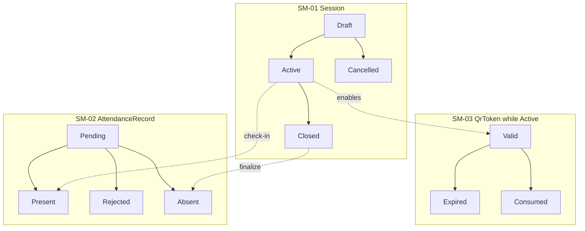
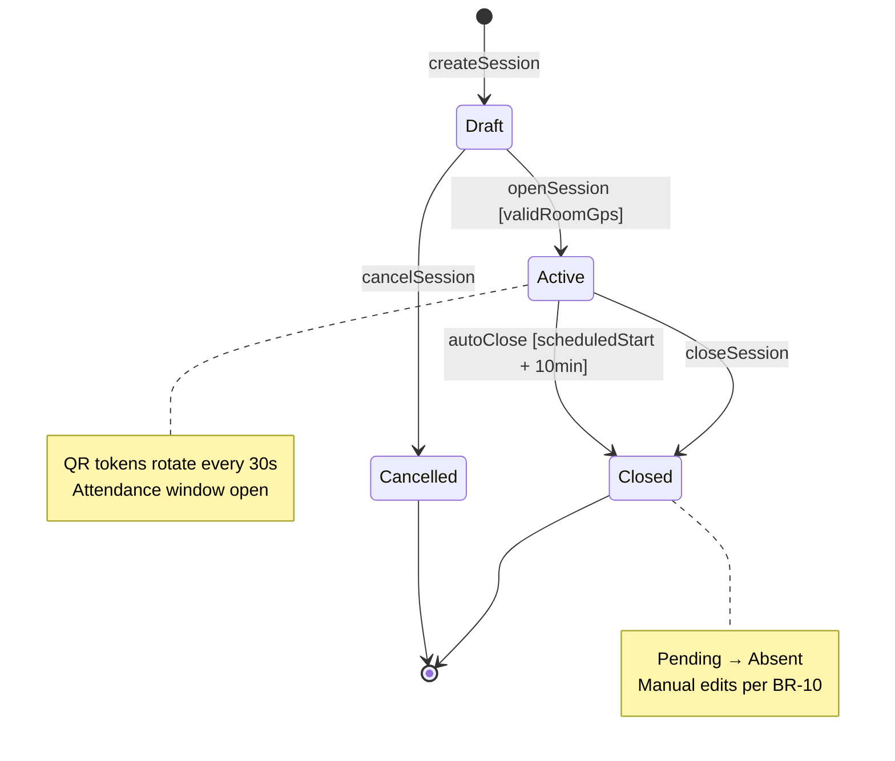
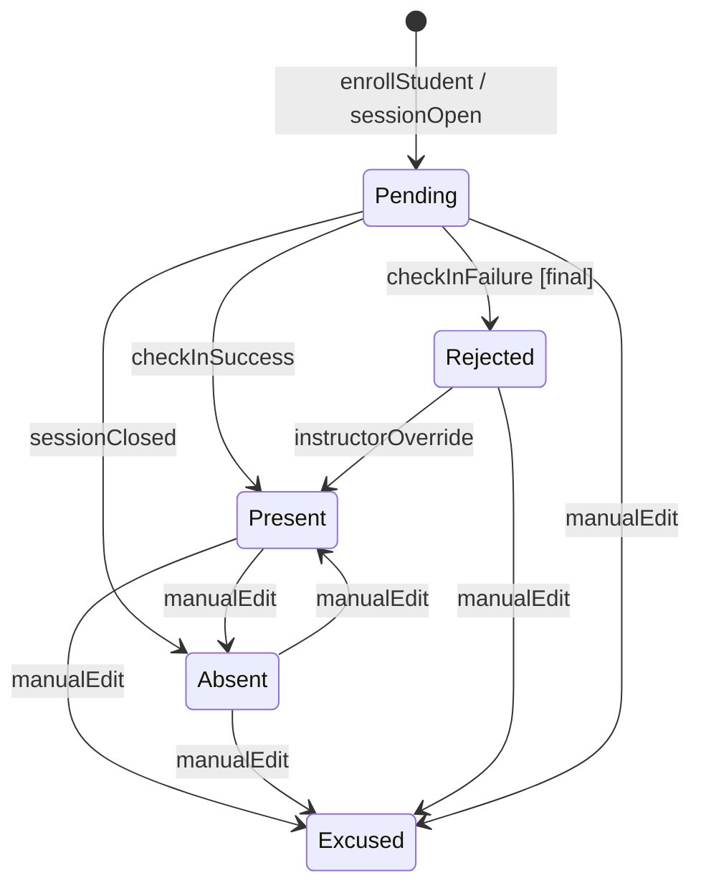
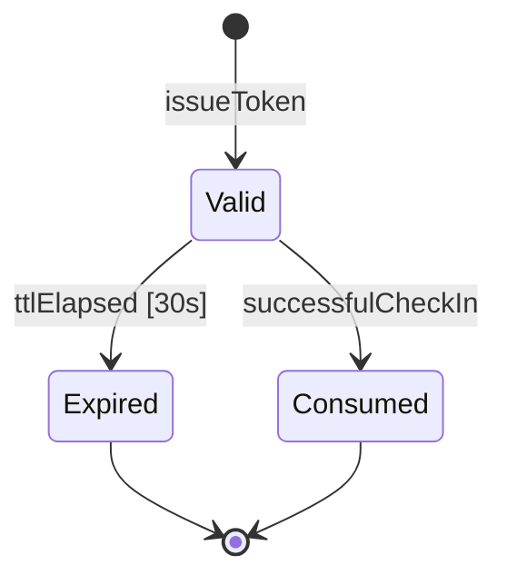
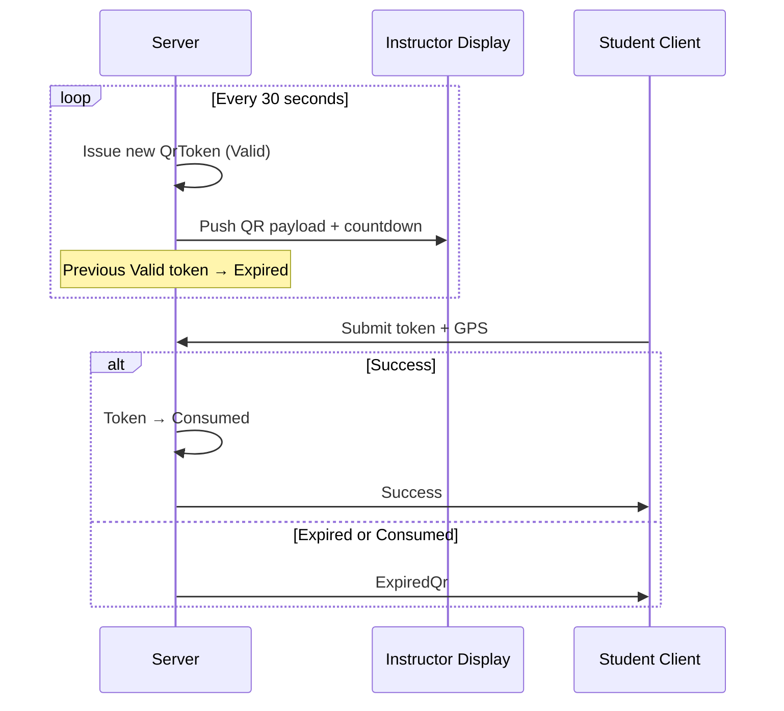
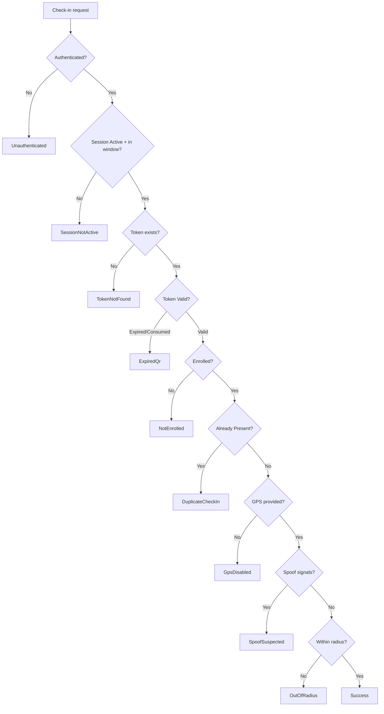

# We Check — State Machines

Implementation specification for state domains in **We Check** MVP. Translates canonical definitions from [State machine (BRD)](../brds/05-state-machine.md) into enforceable application logic, database constraints, and API guards. State names are **exact string enums** in PostgreSQL and application code per [Technical domain model](./03-domain-model.md) §3.

**Related documents:** [API design](./05-api-design.md) · [Main workflows](./06-main-workflows.md) · [Business rules](../brds/04-business-rules.md) · [Module breakdown](./02-module-breakdown.md)

---

## 1. State Machine Overview

We Check enforces **four persisted state domains** plus one ephemeral outcome enum:

| Domain ID | Entity | Enum type | States | Terminal states | Owning module |
| --- | --- | --- | --- | --- | --- |
| SM-01 | `Session` | `SessionStatus` | `Draft`, `Active`, `Closed`, `Cancelled` | `Closed`, `Cancelled` | `session-management` |
| SM-02 | `AttendanceRecord` | `AttendanceStatus` | `Pending`, `Present`, `Absent`, `Excused`, `Rejected` | None (editable per [BR-10](../brds/04-business-rules.md)) | `attendance` |
| SM-03 | `QrToken` | `QrTokenStatus` | `Valid`, `Expired`, `Consumed` | `Expired`, `Consumed` | `checkin-qr` |
| SM-04 | `CheckInAttempt` | `CheckInOutcome` | Ephemeral result codes | N/A | `checkin-qr` |

Cross-domain coordination matrix: [State machine (BRD)](../brds/05-state-machine.md) §6.



---

## 2. SM-01 — Session Lifecycle

### 2.1 State definitions

| State | DB value | Meaning | Entry condition |
| --- | --- | --- | --- |
| `Draft` | `Draft` | Session configured; check-in not open | `SessionService.create` ([FR-04](../brds/03-functional-requirements.md)) |
| `Active` | `Active` | QR rotation running; check-in allowed | `SessionService.open` with valid GPS ([BR-07](../brds/04-business-rules.md)) |
| `Closed` | `Closed` | Window ended; roster finalized | Manual close or auto-close ([BR-01](../brds/04-business-rules.md)) |
| `Cancelled` | `Cancelled` | Abandoned before attendance | `cancel` from `Draft` only in MVP |

### 2.2 Transition diagram



### 2.3 Transition table

| From | Event / API | Guard | To | Side effects | Actor |
| --- | --- | --- | --- | --- | --- |
| — | `createSession` / `POST /sessions` | Valid class, subject, assignment | `Draft` | Insert session row | `Instructor` |
| `Draft` | `openSession` / `POST .../open` | `roomLatitude` and `roomLongitude` valid ([BR-07](../brds/04-business-rules.md)) | `Active` | Set `openedAt`; bootstrap attendance; start QR scheduler | `Instructor` |
| `Draft` | `cancelSession` / `POST .../cancel` | Instructor owns session | `Cancelled` | No attendance finalize | `Instructor` |
| `Active` | `closeSession` / `POST .../close` | — | `Closed` | Set `closedAt`; `Pending`→`Absent`; stop QR | `Instructor` |
| `Active` | `autoClose` (scheduler) | `now ≥ scheduledStart + 10 min` | `Closed` | Same as manual close | System |
| `Closed` | — | MVP: no reopen | `Closed` | Terminal | — |
| `Cancelled` | — | — | `Cancelled` | Terminal; excluded from reports | — |

### 2.4 Attendance window calculation

```
windowStart = session.openedAt
windowEnd   = min(session.closedAt ?? ∞, session.scheduledStart + 10 minutes)
```

Check-in allowed only when `session.status = Active` **and** `windowStart ≤ now ≤ windowEnd` ([BR-01](../brds/04-business-rules.md)). Violations return `CheckInOutcome.SessionNotActive` ([API design](./05-api-design.md) §6.3).

### 2.5 Implementation enforcement

| Layer | Mechanism |
| --- | --- |
| Domain service | `SessionService` validates transition matrix; throws `InvalidSessionState` on illegal transition |
| Database | `sessions.status` CHECK constraint on enum values |
| API | Transition endpoints (`open`, `close`, `cancel`) — no generic `PATCH status` |
| Scheduler | `AutoCloseScheduler` queries `Active` sessions past window |

---

## 3. SM-02 — Attendance Record

### 3.1 State definitions

| State | Meaning | Typical entry |
| --- | --- | --- |
| `Pending` | Enrolled; no successful check-in | Session open bootstrap |
| `Present` | Successful check-in or manual mark | `CheckInService` success or manual edit |
| `Absent` | No check-in when session closed | `finalizeOnClose` bulk update |
| `Excused` | Excused absence; excluded from [BR-05](../brds/04-business-rules.md) numerator | Manual edit |
| `Rejected` | Failed automated check-in | Check-in failure policy or manual edit |

### 3.2 Transition diagram



### 3.3 Transition table

| From | Event | Guard | To | Actor / system |
| --- | --- | --- | --- | --- |
| — | `enrollStudent` / session open | Student on roster | `Pending` | System ([FR-05](../brds/03-functional-requirements.md)) |
| `Pending` | `checkInSuccess` | All check-in rules pass | `Present` | `CheckInService` |
| `Pending` | `checkInFailure` | Final failure (e.g. session closing) | `Rejected` or remain `Pending` | System — retriable failures keep `Pending` |
| `Pending` | `sessionClosed` | Session → `Closed` | `Absent` | `AttendanceService.finalizeOnClose` |
| `Rejected` | `instructorOverride` | Physical verification | `Present` | `Instructor` ([FR-10](../brds/03-functional-requirements.md)) |
| Any | `manualEdit` | [BR-10](../brds/04-business-rules.md) edit window | Target status | `Instructor`, `TrainingOfficeAdmin` |

### 3.4 Retry vs rejected policy

While session is `Active`:

| Check-in outcome | Attendance status change |
| --- | --- |
| `ExpiredQr`, `OutOfRadius`, `GpsDisabled`, `SpoofSuspected` | Remain `Pending` (student may retry) |
| `DuplicateCheckIn` | No change (`Present` already) |
| `Success` | `Pending` → `Present` |
| `SessionNotActive`, `NotEnrolled` | No change |

Optional: after N failed attempts, set `Rejected` — **not in MVP**; instructor uses manual edit instead.

### 3.5 Implementation enforcement

| Invariant | Enforcement |
| --- | --- |
| One `Present` per student per session | Unique (`session_id`, `student_id`); `CheckInService` checks before update ([BR-04](../brds/04-business-rules.md)) |
| `checkedInAt` set only on `Present` | Domain service clears on transition away from `Present` |
| Manual edit audit | Append-only `AttendanceAuditLog` on every `manualEdit` |
| Optimistic concurrency | `AttendanceRecord.version` incremented on update |

---

## 4. SM-03 — QR Token

### 4.1 State definitions

| State | Meaning |
| --- | --- |
| `Valid` | Issued within 30-second window; not consumed |
| `Expired` | Past `expires_at` without consumption |
| `Consumed` | Exactly one successful check-in recorded |

### 4.2 Transition diagram



### 4.3 Transition table

| From | Event | Guard | To | Notes |
| --- | --- | --- | --- | --- |
| — | `issueToken` | Session `Active` | `Valid` | Scheduler every 30 s ([BR-03](../brds/04-business-rules.md)) |
| `Valid` | `ttlElapsed` | `now > expires_at` | `Expired` | Background job or lazy check on read |
| `Valid` | `successfulCheckIn` | Student passes all rules | `Consumed` | Set `consumed_at`, `consumed_by_student_id` |
| `Valid` | `failedCheckIn` | Non-success outcome | `Valid` | Token remains for other students until expired ([BR-11](../brds/04-business-rules.md)) |

### 4.4 Token rotation sequence



### 4.5 Implementation enforcement

| Concern | Implementation |
| --- | --- |
| One consumption per token | `SELECT ... FOR UPDATE` on `qr_tokens` row in check-in transaction |
| Concurrent scans same token | Second success attempt sees `Consumed` → `ExpiredQr` response |
| Issuance only when Active | `QrService.rotateTokens` no-ops if session not `Active` |
| Expiry | `expires_at = issued_at + interval '30 seconds'` |

---

## 5. SM-04 — Check-In Attempt Outcomes

Ephemeral enum returned by `POST /check-in` and persisted on `check_in_attempts.outcome`. Not a long-lived entity state machine.

### 5.1 Outcome catalog

| Outcome | Condition | HTTP | User-facing action (vi-VN) |
| --- | --- | --- | --- |
| `Success` | All rules pass | 200 | Show confirmation |
| `ExpiredQr` | Token `Expired` or `Consumed` | 400 | Scan fresh QR |
| `OutOfRadius` | Distance > `gpsRadiusMeters` | 400 | Move within range |
| `DuplicateCheckIn` | Student already `Present` | 409 | Already checked in |
| `GpsDisabled` | Missing coordinates | 400 | Enable GPS permission |
| `Unauthenticated` | No valid session | 401 | Login |
| `SessionNotActive` | Session not `Active` or outside window | 403 | Wait or session ended |
| `SpoofSuspected` | Mock-location signals | 400 | See instructor |
| `NotEnrolled` | No enrollment for class-subject | 403 | Contact training office |
| `TokenNotFound` | Unknown `tokenId` | 404 | Rescan QR |

### 5.2 Evaluation order (deterministic)



Implementation: `CheckInService.submit` evaluates guards in this order; short-circuits on first failure; always inserts `CheckInAttempt` before returning.

### 5.3 BR and FR mapping

| Outcome | BR | FR |
| --- | --- | --- |
| `ExpiredQr` | BR-03 | FR-06 |
| `OutOfRadius` | BR-02 | FR-08 |
| `DuplicateCheckIn` | BR-04 | FR-09 |
| `GpsDisabled` | BR-12 | FR-08 |
| `Unauthenticated` | BR-06 | FR-02 |
| `SpoofSuspected` | — | FR-10 |
| `Success` | BR-11 | FR-07 |

---

## 6. Cross-Domain Coordination

| Session status | QR issuance | Student check-in | Attendance on close |
| --- | --- | --- | --- |
| `Draft` | None | Blocked (`SessionNotActive`) | N/A |
| `Active` | Rotating `Valid` tokens | Allowed per SM-04 | N/A |
| `Closed` | Stopped | Blocked | `Pending` → `Absent` |
| `Cancelled` | None | Blocked | Records remain `Pending`; excluded from reports |

### 6.1 Session open orchestration

```
SessionService.open():
  1. ASSERT status == Draft AND valid GPS
  2. UPDATE sessions SET status=Active, opened_at=now()
  3. AttendanceService.initializeForSession() → N × Pending
  4. QrService.startScheduler(sessionId)
  5. EMIT SessionOpened
```

### 6.2 Session close orchestration

```
SessionService.close():
  1. ASSERT status == Active
  2. UPDATE sessions SET status=Closed, closed_at=now()
  3. QrService.stopScheduler(sessionId)
  4. AttendanceService.finalizeOnClose() → Pending → Absent
  5. EMIT SessionClosed
  6. NotificationService.evaluateAbsenceThresholds() [async, FR-16]
```

### 6.3 Check-in transaction (atomic)

Single serializable transaction ([03-domain-model.md](./03-domain-model.md) §5.2):

1. Lock `QrToken` row.
2. Run SM-04 evaluation through radius check.
3. Insert `CheckInAttempt`.
4. On `Success` only: token → `Consumed`; attendance → `Present`.
5. Commit.

---

## 7. State Persistence and Testing

### 7.1 Database constraints

| Table | Constraint |
| --- | --- |
| `sessions` | `status` enum; `opened_at` NOT NULL when `Active` or `Closed` |
| `attendance_records` | `status` enum; UNIQUE (`session_id`, `student_id`) |
| `qr_tokens` | `status` enum; `expires_at > issued_at` |
| `check_in_attempts` | `outcome` enum; append-only (no UPDATE) |

### 7.2 State machine test cases

| Test ID | Scenario | Expected final state |
| --- | --- | --- |
| ST-01 | Create session | Session `Draft` |
| ST-02 | Open without GPS | 422; remains `Draft` |
| ST-03 | Open with GPS | Session `Active`; N `Pending` attendance |
| ST-04 | Successful check-in | Token `Consumed`; attendance `Present` |
| ST-05 | Expired token scan | `ExpiredQr`; attendance unchanged |
| ST-06 | Duplicate check-in | `DuplicateCheckIn`; attendance `Present` |
| ST-07 | Close session | Session `Closed`; remaining `Pending` → `Absent` |
| ST-08 | Cancel draft | Session `Cancelled` |
| ST-09 | Manual override Rejected → Present | Attendance `Present`; audit log written |
| ST-10 | Auto-close at T+10min | Session `Closed` without instructor action |

Map to acceptance criteria in [08-acceptance-mvp-future.md](../brds/08-acceptance-mvp-future.md) (`AC-xx`).

---

## 8. State-to-Module Responsibility

| State domain | Service owner | API surface |
| --- | --- | --- |
| SM-01 Session | `SessionService` | `/sessions/:id/open`, `/close`, `/cancel` |
| SM-02 Attendance | `AttendanceService` | `/check-in`, `/attendance/:id` |
| SM-03 QrToken | `QrService`, `CheckInService` | `/sessions/:id/qr/current` |
| SM-04 Outcome | `CheckInService` | `POST /check-in` response body |

---

## 9. Future Consideration

| Enhancement | State impact |
| --- | --- |
| Session reopen `Closed` → `Active` | New transition with audit; re-enable QR scheduler |
| Offline check-in queue | New attempt sub-status `Queued`, `Synced` on client |
| Multi-factor before `Present` | Additional guard on `Pending` → `Present` |
| Token pause during outage | Instructor freeze prevents `Valid` → `Expired` |
| `Rejected` auto-escalation | Policy-driven transition after N failures |
| Session `Paused` state | Halt QR rotation without closing window |
| Distributed token issuance | Leader election for QR scheduler per session |
