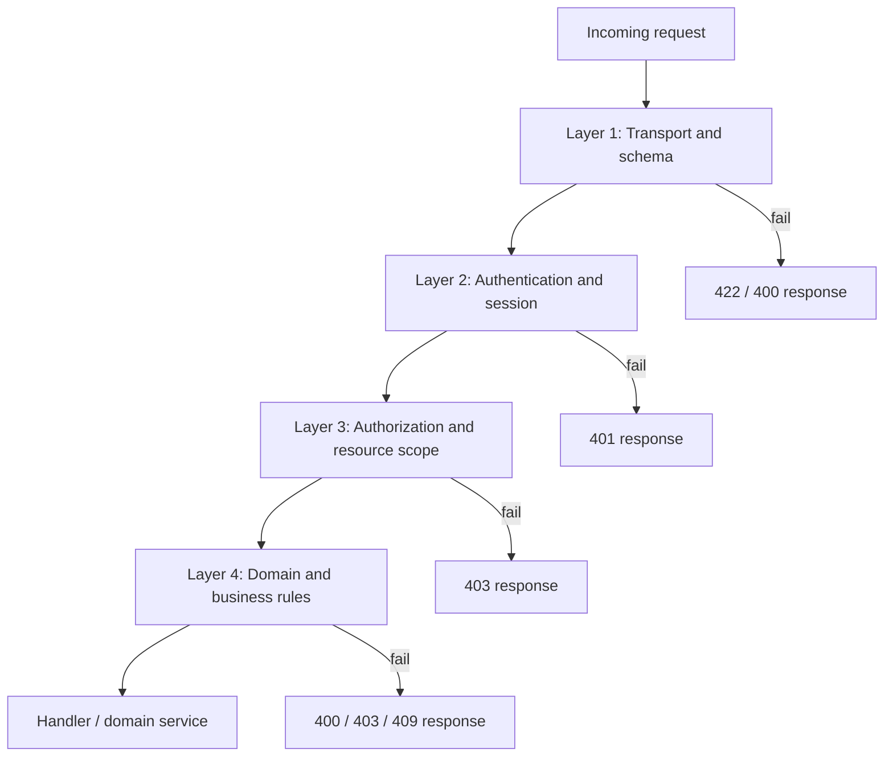

# We Check — Validation Rules

Input validation, authorization guards, and domain rule enforcement for **We Check** MVP. Defines where validation runs, field-level constraints per API resource, business-rule evaluation order, and failure codes consumed by [Error handling](./09-error-handling.md). All rules trace to functional requirements (`FR-xx`) and business rules (`BR-xx`) in the BRD set.

**Related documents:** [API design](./05-api-design.md) · [Business rules](../brds/04-business-rules.md) · [Technical domain model](./03-domain-model.md) · [State machines](./07-state-machines.md) · [Roles and permissions](./01-roles-permissions.md) · [Error handling](./09-error-handling.md)

---

## 1. Validation Strategy

Validation executes in **four layers** on every mutating API request. Layers short-circuit on first failure; earlier layers never skip later domain checks on success path.



| Layer | Responsibility | Typical HTTP status | Implementation location |
| --- | --- | --- | --- |
| 1 — Transport and schema | JSON shape, types, ranges, required fields, enum values | `400`, `422` | Route schema (Zod or Fastify schema) |
| 2 — Authentication | Valid session cookie or bearer token; active user | `401` | Auth middleware ([FR-02](../brds/03-functional-requirements.md), [BR-06](../brds/04-business-rules.md)) |
| 3 — Authorization and scope | Role permission; class/subject assignment scope | `403` | Permission guard ([BR-08](../brds/04-business-rules.md), [BR-09](../brds/04-business-rules.md)) |
| 4 — Domain and business rules | State transitions, check-in outcomes, uniqueness | `400`, `403`, `409` | Domain services |

**Determinism:** Rule evaluation order within Layer 4 is fixed and documented per operation (§5). Same inputs produce the same outcome and `errorCode` ([NFR-02](../brds/07-non-functional-risk.md)).

**Localization:** Field-level validation messages and user-facing outcomes use Vietnamese (`vi-VN`). Stable English `errorCode` values are for client logic only ([NFR-17](../brds/07-non-functional-risk.md)).

---

## 2. Shared Field Validation Baselines

Applies to all endpoints unless overridden in §3.

| Rule ID | Field / parameter | Constraint | Failure code | Notes |
| --- | --- | --- | --- | --- |
| VAL-01 | UUID identifiers (`id`, `sessionId`, `userId`, `tokenId`) | RFC 4122 UUID v4 format | `InvalidFormat` | Path and body IDs |
| VAL-02 | Email | RFC 5322 simplified; max 254 chars; lowercase normalized on persist | `InvalidEmail` | [FR-01](../brds/03-functional-requirements.md) |
| VAL-03 | Password (create/change) | Min length **8**; max 128; non-empty | `PasswordTooShort` | [NFR-14](../brds/07-non-functional-risk.md) |
| VAL-04 | Display name | Trimmed; length 1–200 UTF-8 | `InvalidLength` | Vietnamese diacritics allowed |
| VAL-05 | Institutional ID | Trimmed; pattern `^[A-Za-z0-9\-]{3,32}$` | `InvalidInstitutionalId` | Unique per institution |
| VAL-06 | ISO 8601 timestamps | UTC `timestamptz`; parseable; finite | `InvalidTimestamp` | API JSON uses `...Z` suffix |
| VAL-07 | Cursor pagination `limit` | Integer 1–200; default 50 | `InvalidPagination` | [05-api-design.md](./05-api-design.md) §1 |
| VAL-08 | Cursor pagination `cursor` | Opaque base64 or null | `InvalidPagination` | Server rejects malformed cursor |
| VAL-09 | Relative URL `returnUrl` | Must start with `/`; no `//`; max 512 chars | `InvalidReturnUrl` | Prevents open redirect |
| VAL-10 | Free-text `note` (attendance edit) | Trimmed; max 500 chars | `InvalidLength` | [FR-11](../brds/03-functional-requirements.md) |
| VAL-11 | Enum fields | Must match PostgreSQL enum / application enum exactly | `InvalidEnum` | Case-sensitive string enums |
| VAL-12 | CSV upload `file` | `text/csv` or `application/csv`; max **5 MB**; UTF-8 | `InvalidFile` | [FR-03](../brds/03-functional-requirements.md) |

---

## 3. Resource-Level Validation Catalog

### 3.1 Authentication — `POST /auth/login`

| Field | Required | Validation | FR |
| --- | --- | --- | --- |
| `email` | Yes | VAL-02 | FR-02 |
| `password` | Yes | Non-empty string | FR-02 |
| `returnUrl` | No | VAL-09 | FR-02 |

Domain checks after schema: user exists and password verifies → else `InvalidCredentials`; `active = false` → `AccountDeactivated` ([AC-01c](../brds/08-acceptance-mvp-future.md)).

### 3.1a Setup — `POST /setup/first-admin`

| Field | Required | Validation | FR |
| --- | --- | --- | --- |
| `institutionalId` | Yes | VAL-05; unique | FR-17 |
| `displayName` | Yes | VAL-04 | FR-17 |
| `email` | Yes | VAL-02; unique | FR-17 |
| `password` | Yes | VAL-03 | FR-17 |

Domain checks: `User.count = 0` → else `SetupAlreadyComplete` ([BR-13](../brds/04-business-rules.md)).

### 3.2 Users — `POST /users`, `PATCH /users/:userId`

| Field | Create | Update | Validation |
| --- | --- | --- | --- |
| `institutionalId` | Required | Optional | VAL-05; unique |
| `displayName` | Required | Optional | VAL-04 |
| `email` | Required | Optional | VAL-02; unique |
| `password` | Required on create | Optional | VAL-03 |
| `role` | Required | Optional | One of: `Student`, `Instructor`, `TrainingOfficeAdmin` |
| `active` | Default `true` | Optional | Boolean |

Duplicate `email` or `institutionalId` → `422` with field details ([AC-01b](../brds/08-acceptance-mvp-future.md)).

### 3.2a Class and subject — `POST /classes`, `POST /subjects`

| Field | Required | Validation | FR |
| --- | --- | --- | --- |
| `code` | Yes | Uppercase alphanumeric + hyphen (`^[A-Z0-9\-]{2,16}$`); unique | FR-03 |
| `name` | Yes | VAL-04 | FR-03 |

Duplicate `code` → `DuplicateClassCode` or `DuplicateSubjectCode` ([AC-03e](../brds/08-acceptance-mvp-future.md)).

### 3.3 Roster import — `POST /roster/import`

| Check | Rule | Outcome |
| --- | --- | --- |
| File present | Multipart field `file` required | `InvalidFile` |
| Required CSV columns | `institutional_id`, `display_name`, `class_code`, `subject_code` | Row rejected in batch summary |
| Row-level ID | VAL-05 per row | Row error `InvalidInstitutionalId` |
| Class/subject codes | Must match existing reference data | Row error `UnknownClassCode` / `UnknownSubjectCode` |
| Duplicate enrollment | Same student + class + subject | Row error `DuplicateEnrollment` ([AC-03b](../brds/08-acceptance-mvp-future.md)) |
| `dryRun=true` | Validate only; no persist | Summary counts only |

### 3.4 Sessions — `POST /sessions`, `PATCH /sessions/:sessionId`

| Field | Validation | Notes |
| --- | --- | --- |
| `classId`, `subjectId` | VAL-01; must exist | Instructor must have `ClassAssignment` ([BR-07](../brds/04-business-rules.md)) |
| `title` | 1–200 chars | |
| `roomName` | 1–100 chars | |
| `roomLatitude` | −90 to 90 or null in `Draft` | Required before open ([AC-04b](../brds/08-acceptance-mvp-future.md)) |
| `roomLongitude` | −180 to 180 or null in `Draft` | |
| `gpsRadiusMeters` | Integer 20–500; default **100** | [FR-04](../brds/03-functional-requirements.md), [BR-02](../brds/04-business-rules.md) |
| `scheduledStart` | VAL-06; not more than 7 days in past on create | Future or same-day preferred |

**Patch guard:** Rejected when session `status` ∈ `{ Active, Closed, Cancelled }` → `InvalidSessionState`.

### 3.5 Session transitions

| Endpoint | Preconditions (Layer 4) | errorCode | BR / FR |
| --- | --- | --- | --- |
| `POST .../open` | Status `Draft`; valid room GPS; instructor scoped | `RoomGpsRequired`, `InvalidSessionState` | BR-07, FR-05 |
| `POST .../close` | Status `Active` | `InvalidSessionState` | BR-01, FR-05 |
| `POST .../cancel` | Status `Draft` only (MVP) | `InvalidSessionState` | FR-04 |

### 3.6 Check-in — `POST /check-in`

| Field | Required | Validation |
| --- | --- | --- |
| `tokenId` | Yes | VAL-01 |
| `latitude` | Yes | −90 to 90 finite number |
| `longitude` | Yes | −180 to 180 finite number |
| `spoofMetadata.mockLocationDetected` | No | Boolean |
| `spoofMetadata.accuracyMeters` | No | Number ≥ 0 |
| `spoofMetadata.platform` | No | `ios` \| `android` \| `other` |

Coordinates are validated then **discarded** after radius check; not persisted on success ([FR-08](../brds/03-functional-requirements.md), [NFR-12](../brds/07-non-functional-risk.md)).

### 3.6a Preflight — `GET /check-in/tokens/:tokenId/preflight`

Read-only chain evaluated before GPS step ([BR-15](../brds/04-business-rules.md)):

| Order | Check | Failure outcome |
| --- | --- | --- |
| 1 | Token exists | `TokenNotFound` |
| 2 | Optional `session` query param matches token's bound session | `SessionMismatch` |
| 3 | Token status `Valid` (not `Expired` / `Consumed`) | `ExpiredQr` or `TokenAlreadyUsed` |
| 4 | Parent session `Active` and within attendance window | `SessionNotActive` |
| 5 | Student enrolled in session class-subject | `NotEnrolled` |
| 6 | — | `200` with session summary |

### 3.7 Attendance manual edit — `PATCH /attendance/:recordId`

| Field | Validation |
| --- | --- |
| `status` | One of: `Present`, `Absent`, `Excused`, `Rejected` |
| `note` | Optional; VAL-10 |

Guards: session `Active` or `Closed`; instructor within 24 h of `closedAt` ([BR-10](../brds/04-business-rules.md)) → else `EditWindowExpired`.

### 3.8 Reports — `GET /reports/*`, `POST /reports/export`

| Parameter | Validation |
| --- | --- |
| `classCode`, `subjectCode` | Non-empty; match reference data |
| `from`, `to` | ISO date `YYYY-MM-DD`; `from` ≤ `to`; max range 366 days |
| Export permission | Caller role `TrainingOfficeAdmin` only ([BR-09](../brds/04-business-rules.md)) |

### 3.9 Policy — `PUT /policy/absence-threshold`

| Field | Validation |
| --- | --- |
| `thresholdPercent` | Integer 1–100; default **20** ([BR-05](../brds/04-business-rules.md)) |

---

## 4. Business Rule Validation Catalog

Domain Layer 4 rules mapped from [Business rules](../brds/04-business-rules.md). These run inside domain services after schema and auth pass.

| Rule ID | Validation rule | Trigger | Outcome on fail | HTTP | errorCode |
| --- | --- | --- | --- | --- | --- |
| BR-01 | Check-in only while session `Active` and within attendance window (`scheduledStart` + 10 min) | `POST /check-in`; scheduler auto-close | Reject late check-in | 403 | `SessionNotActive` |
| BR-02 | Haversine distance ≤ session `gpsRadiusMeters` | `POST /check-in` | Reject; log distance | 400 | `OutOfRadius` |
| BR-03 | Token age ≤ 30 seconds | `POST /check-in` | Reject expired token | 400 | `ExpiredQr` |
| BR-04 | No existing `Present` for student in session | `POST /check-in` | Reject duplicate | 409 | `DuplicateCheckIn` |
| BR-05 | Absence rate threshold evaluation | Post-session job | Notification only | — | — |
| BR-06 | Valid authenticated session | All protected routes | Redirect / reject | 401 | `Unauthenticated` |
| BR-07 | Room GPS configured before open | `POST .../open` | Block transition | 422 | `RoomGpsRequired` |
| BR-08 | Report scope matches assignment or admin | `GET /reports/*` | Deny access | 403 | `Forbidden` |
| BR-09 | CSV export admin-only | `POST /reports/export` | Deny export | 403 | `Forbidden` |
| BR-10 | Instructor edit within 24 h of close | `PATCH /attendance/:id` | Deny edit | 403 | `EditWindowExpired` |
| BR-11 | QR token not already `Consumed` | `POST /check-in` | Reject; security log | 400 | `TokenAlreadyUsed` |
| BR-12 | Client GPS available (not disabled/denied) | `POST /check-in` | Reject before server radius check | 400 | `GpsDisabled` |

Additional domain outcomes:

| Condition | errorCode | HTTP |
| --- | --- | --- |
| Student not enrolled in session class-subject | `NotEnrolled` | 403 |
| Token ID not found | `TokenNotFound` | 404 |
| Mock location or spoof heuristics positive | `SpoofSuspected` | 400 |
| Rate limit exceeded | `RateLimitExceeded` | 429 |

Full HTTP mapping: [05-api-design.md](./05-api-design.md) §6.3, §10.2.

---

## 5. Validation Pipelines by Operation

### 5.1 Check-in submission (critical path)

Fixed evaluation order — do not reorder without updating tests ([AC-09c](../brds/08-acceptance-mvp-future.md)):

1. Schema validation (`tokenId`, coordinates, spoof metadata).
2. Authentication ([BR-06](../brds/04-business-rules.md)).
3. Permission `checkin:submit` (Student role).
4. Load token; if missing → `TokenNotFound`.
5. Load session from token; if not `Active` → `SessionNotActive` ([BR-01](../brds/04-business-rules.md)).
6. Attendance window check (`now` ≤ `scheduledStart` + 10 min) → `SessionNotActive`.
7. Token expiry (`now` ≤ `issuedAt` + 30 s) → `ExpiredQr` ([BR-03](../brds/04-business-rules.md)).
8. Token consumption state → `TokenAlreadyUsed` if `Consumed` ([BR-11](../brds/04-business-rules.md)).
9. Enrollment check → `NotEnrolled`.
10. Duplicate attendance → `DuplicateCheckIn` ([BR-04](../brds/04-business-rules.md)).
11. Client GPS flag / missing coords → `GpsDisabled` ([BR-12](../brds/04-business-rules.md)).
12. Spoof heuristics ([FR-10](../brds/03-functional-requirements.md)) → `SpoofSuspected`.
13. Radius check ([BR-02](../brds/04-business-rules.md)) → `OutOfRadius`.
14. **Serializable transaction:** insert `CheckInAttempt`, set attendance `Present`, consume token, discard raw coordinates.

Steps 4–13 execute inside one database transaction with row-level lock on attendance record ([NFR-02](../brds/07-non-functional-risk.md)).

### 5.2 Session open

1. Schema / auth / `session:write`.
2. Session status `Draft`.
3. Instructor assignment scope for class + subject.
4. Valid finite `roomLatitude` and `roomLongitude` ([BR-07](../brds/04-business-rules.md)).
5. Transaction: transition to `Active`, seed `Pending` attendance rows, start QR scheduler.

### 5.3 Roster CSV import

1. File validation (VAL-12).
2. Parse rows; validate columns per row.
3. If `dryRun`, return summary without commit.
4. Else batch insert with row-level error collection; no partial silent failure ([AC-03a](../brds/08-acceptance-mvp-future.md)).

### 5.4 Manual attendance edit

1. Schema / auth / `attendance:write`.
2. Session status `Active` or `Closed`.
3. Instructor scope or admin role.
4. [BR-10](../brds/04-business-rules.md) time window for instructors.
5. Valid status enum transition.
6. Append `AttendanceAuditLog`.

---

## 6. Client-Side Validation (Web SPA)

Client validation **mirrors** server rules for immediate UX feedback but is not authoritative. Server response always wins.

| Surface | Client checks | Server must re-validate |
| --- | --- | --- |
| Login form | Email format, non-empty password | Yes |
| Session create form | GPS range, radius 20–500, required fields | Yes |
| Check-in page | GPS permission granted; coords present | Yes |
| Attendance edit modal | Status enum, note length | Yes |
| Report filters | Date order, required class/subject | Yes |

Mobile check-in: if browser GPS unavailable or permission denied within **15 seconds**, show `GpsDisabled` UX copy without calling API ([AC-08c](../brds/08-acceptance-mvp-future.md), [NFR-19](../brds/07-non-functional-risk.md)).

---

## 7. Rate Limit Validation

Enforced at API gateway or middleware before handler ([05-api-design.md](./05-api-design.md) §10.3):

| Endpoint group | Limit | Window | errorCode |
| --- | --- | --- | --- |
| `POST /check-in` | 10 per student per session | 10 minutes | `RateLimitExceeded` |
| `POST /auth/login` | 5 per email | 15 minutes | `RateLimitExceeded` |
| `GET /sessions/:id/qr/current` | 60 per session | 1 minute | `RateLimitExceeded` |
| General authenticated API | 300 per user | 1 minute | `RateLimitExceeded` |

Response includes `Retry-After` header (seconds).

---

## 8. Validation Error Response Shape

Schema failures use standard envelope from [09-error-handling.md](./09-error-handling.md):

```json
{
  "errorCode": "ValidationFailed",
  "message": "Dữ liệu không hợp lệ",
  "details": [
    {
      "field": "gpsRadiusMeters",
      "code": "OutOfRange",
      "message": "Giá trị phải từ 20 đến 500 mét"
    }
  ],
  "requestId": "550e8400-e29b-41d4-a716-446655440000"
}
```

Check-in domain failures may use simplified body with `outcome` field per [05-api-design.md](./05-api-design.md) §6.2.

---

## 9. Traceability Matrix

| Validation area | FR | BR | AC | NFR |
| --- | --- | --- | --- | --- |
| Auth and session | FR-02 | BR-06 | AC-02 | NFR-10, NFR-14, NFR-16 |
| User provisioning | FR-01 | — | AC-01 | — |
| Roster import | FR-03 | — | AC-03 | — |
| Session lifecycle | FR-04, FR-05 | BR-01, BR-07 | AC-04, AC-05 | — |
| QR and check-in | FR-06–FR-10 | BR-02–BR-04, BR-11, BR-12 | AC-06–AC-10 | NFR-02, NFR-04, NFR-06, NFR-12 |
| Manual attendance | FR-11 | BR-10 | AC-11 | NFR-15 |
| Reports and export | FR-12, FR-13 | BR-08, BR-09 | AC-12, AC-13 | NFR-11 |
| Localization | — | — | — | NFR-17 |

---

## 10. Future Consideration

| Enhancement | Validation impact |
| --- | --- |
| Campus SSO | Replace password rules with IdP assertion validation |
| WiFi BSSID check | Additional Layer 4 step in check-in pipeline |
| OpenAPI request validation codegen | Auto-sync Zod schemas from `openapi.yaml` |
| Server-side geofence polygons | Replace circle radius with polygon inclusion test |
| Strong password policy | Extend VAL-03 with complexity rules |
