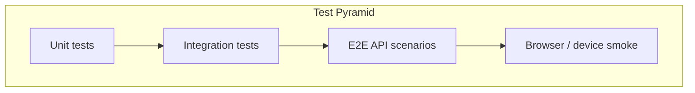

# We Check — Testing Plan

Layered test strategy for **We Check** MVP. Prioritizes correctness of attendance invariants, check-in concurrency, GPS/QR business rules, and role-based access over cosmetic UI coverage. Maps test scenarios to acceptance criteria (`AC-xx`), functional requirements (`FR-xx`), business rules (`BR-xx`), and non-functional requirements (`NFR-xx`).

**Related documents:** [Acceptance criteria](../brds/08-acceptance-mvp-future.md) · [Validation rules](./08-validation-rules.md) · [Error handling](./09-error-handling.md) · [Local development setup](./10-local-development-setup.md) · [Non-functional requirements](../brds/07-non-functional-risk.md)

---

## 1. Test Strategy

| Principle | Specification |
| --- | --- |
| Server authority | API owns attendance state; UI tests never bypass domain layer |
| Real PostgreSQL | Integration and E2E tests use Compose Postgres — no in-memory DB ([NFR-02](../brds/07-non-functional-risk.md)) |
| Deterministic time | Injectable clock for QR expiry and attendance window tests |
| Traceability | Every automated scenario tags at least one `AC-xx` or `BR-xx` |
| Pilot readiness | Load test baseline before production pilot ([NFR-23](../brds/07-non-functional-risk.md)) |

**Priority order:** (1) check-in integrity and concurrency, (2) auth/RBAC, (3) session lifecycle, (4) reporting/export, (5) Should-capability dashboard and notifications.

---

## 2. Test Pyramid

| Layer | Target share | Tooling | Scope |
| --- | --- | --- | --- |
| Unit | ~60% | Node.js built-in test runner or Vitest | Validators, geo distance, state guards, error mapping |
| Integration | ~30% | Node test runner + real Postgres | Transactions, repositories, module services |
| End-to-end (API) | ~10% | `tests/e2e` workspace | Full HTTP workflows against running API |
| Browser / device | Ad hoc + gate | Playwright; physical devices for GPS/camera | Mobile check-in, QR scan, projector QR readability |



---

## 3. Core Scenario Matrix

| Scenario ID | Scenario | Expected result | Traceability |
| --- | --- | --- | --- |
| TS-01 | Admin creates student account | Account persisted; login succeeds | AC-01a, FR-01 |
| TS-02 | Duplicate institutional ID | `422 ValidationFailed`; no duplicate row | AC-01b |
| TS-03 | Deactivated user login | `403 AccountDeactivated` | AC-01c, BR-06 |
| TS-04 | Unauthenticated check-in API call | `401 Unauthenticated` | AC-02a, BR-06 |
| TS-05 | Login redirect preserves check-in deep link | Session established; redirect to check-in | AC-02b |
| TS-06 | Session idle > 8 h | `401 SessionExpired` on check-in | AC-02c, NFR-16 |
| TS-07 | CSV roster import valid rows | Enrollments created; summary counts | AC-03a, FR-03 |
| TS-08 | CSV duplicate enrollment row | Row rejected; valid rows import | AC-03b |
| TS-09 | Instructor views unassigned roster | `403 Forbidden` | AC-03c, BR-08 |
| TS-10 | Create session with GPS in Draft | Session saved with coordinates | AC-04a, FR-04 |
| TS-11 | Open session without GPS | `422 RoomGpsRequired` | AC-04b, BR-07 |
| TS-12 | Cancel Draft session | Status `Cancelled` | AC-04c |
| TS-13 | Open Draft → Active | QR scheduler starts; Pending rows created | AC-05a, FR-05 |
| TS-14 | Check-in within 10 min window | Evaluated per rule matrix | AC-05b, BR-01 |
| TS-15 | Auto-close after window | `Closed`; Pending → Absent | AC-05c |
| TS-16 | Check-in after close | `SessionNotActive` | AC-05d |
| TS-17 | QR refresh every 30 s | New token; countdown accurate ±1 s | AC-06a, NFR-06 |
| TS-18 | Scan at T + 31 s | `ExpiredQr` | AC-06b, BR-03 |
| TS-19 | QR request when not Active | No valid token | AC-06c |
| TS-20 | Successful mobile check-in | `Present` within 2 s p95 | AC-07a, NFR-04 |
| TS-21 | Not enrolled student check-in | Rejected; no Present | AC-07b |
| TS-22 | GPS within radius | Radius pass; success if all rules pass | AC-08a, BR-02 |
| TS-23 | GPS outside radius | `OutOfRadius` | AC-08b |
| TS-24 | GPS disabled / permission denied | `GpsDisabled` | AC-08c, BR-12 |
| TS-25 | No raw coords persisted post-success | DB columns empty/null | AC-08d, NFR-12 |
| TS-26 | Duplicate check-in same student | `409 DuplicateCheckIn` | AC-09a, BR-04 |
| TS-27 | Same token second student | Rejected; security log | AC-09b, BR-11 |
| TS-28 | Parallel duplicate requests | Exactly one Present | AC-09c, NFR-02 |
| TS-29 | Mock location flagged | `SpoofSuspected` | AC-10, FR-10 |
| TS-30 | Instructor manual edit within 24 h | Status updated; audit log | AC-11, BR-10, NFR-15 |
| TS-31 | Instructor report scoped to assignment | Data returned | AC-12, BR-08 |
| TS-32 | Non-admin CSV export | `403 Forbidden` | AC-13, BR-09 |
| TS-33 | Admin CSV export | UTF-8 CSV; audit log | AC-13, FR-13 |
| TS-34 | Student attendance history | Self-scoped records only | AC-14, FR-14 |
| TS-35 | Live dashboard update ≤ 5 s | Count updates on poll | AC-17, NFR-08 |
| TS-36 | Absence threshold notification | Notification after session close | AC-16, BR-05, FR-16 |

---

## 4. Unit Test Coverage Targets

| Component | Test cases | BR / FR |
| --- | --- | --- |
| `HaversineDistance` | Same point = 0; boundary at radius; antipodal edge | BR-02 |
| `QrTokenExpiry` | 29 s valid; 31 s expired | BR-03 |
| `AttendanceWindow` | Before, at, after scheduledStart + 10 min | BR-01 |
| `CheckInPipeline ordering` | Mock each step; verify short-circuit order | [08-validation-rules.md](./08-validation-rules.md) §5.1 |
| `SessionStateGuard` | Illegal transitions rejected | [07-state-machines.md](./07-state-machines.md) |
| `EditWindowPolicy` | Instructor 24 h; admin unlimited | BR-10 |
| `ErrorMapper` | Domain exception → HTTP + errorCode | [09-error-handling.md](./09-error-handling.md) |
| `CsvRowValidator` | Missing columns, invalid IDs | FR-03 |
| `SpoofHeuristics` | mockLocation=true → flag | FR-10 |
| `PasswordValidator` | Min length 8 | NFR-14 |

**Coverage target:** ≥ **80%** line coverage on `packages/domain` and check-in/session services.

---

## 5. Integration Test Coverage Targets

| Suite | Behavior under test | NFR |
| --- | --- | --- |
| `CheckInTransaction` | Present + token consumed atomically | NFR-02 |
| `ConcurrentCheckIn` | 150 parallel submissions, unique students | NFR-02, NFR-05 |
| `DuplicateRace` | Same student parallel → one success | AC-09c |
| `SessionOpenSeed` | Pending rows = enrollment count | FR-05 |
| `SessionCloseFinalize` | Pending → Absent bulk update | BR-01 |
| `GpsNotPersisted` | No lat/long in attendance after success | NFR-12 |
| `AuditOnManualEdit` | Audit row with before/after | NFR-15 |
| `ExportAuditLog` | Export creates audit entry | FR-13 |
| `RbacNegativeMatrix` | Each role denied out-of-scope endpoints | NFR-11 |
| `SessionRevokeOnDeactivate` | Deactivate user kills sessions | FR-01 |
| `RateLimitCheckIn` | 11th attempt in window → 429 | [05-api-design.md](./05-api-design.md) §10.3 |

Each integration test resets DB or rolls back transaction. Use fixed clock fixture.

---

## 6. End-to-End API Flows

### Flow A — Happy path workshop check-in

1. Admin seeds roster (or import CSV).
2. Instructor creates session with GPS → opens session.
3. Poll `GET /sessions/:id/qr/current` until token received.
4. Student logs in → `POST /check-in` with valid coords.
5. Instructor `GET /sessions/:id/attendance` shows Present count incremented.
6. Instructor closes session.
7. Admin exports CSV.

**Tags:** AC-04a, AC-05a, AC-07a, AC-13, FR-07, FR-12, FR-13

### Flow B — Anti-fraud rejection paths

1. Active session with valid QR.
2. Student A checks in successfully.
3. Student A retries → `DuplicateCheckIn`.
4. Student B uses same token → rejected + security log.
5. Student C outside radius → `OutOfRadius`.
6. Expired token submission → `ExpiredQr`.

**Tags:** AC-09, AC-08b, AC-06b, BR-04, BR-11

### Flow C — Manual fallback and audit

1. Close session with Pending students.
2. Instructor marks student Present with note within 24 h.
3. Verify audit log actor and timestamps.
4. Instructor attempt at 25 h → `EditWindowExpired`.
5. Admin edit succeeds.

**Tags:** AC-11, BR-10, NFR-15

### Flow D — Reporting authorization

1. Instructor A views assigned class report → 200.
2. Instructor A views unassigned class → 403.
3. Instructor attempts CSV export → 403.
4. Admin export → 200 with audit.

**Tags:** AC-12, AC-13, BR-08, BR-09

---

## 7. Load and Performance Tests

Execute before pilot sign-off ([NFR-23](../brds/07-non-functional-risk.md)).

| Test | Configuration | Pass criteria |
| --- | --- | --- |
| Peak concurrent check-in | 150 virtual users, staggered 0–5 min | p95 ≤ **2 s**; error rate < **0.1%** | NFR-04 |
| Multi-session stress | 500 concurrent users across 4 sessions | p95 ≤ **3 s**; error rate < **0.1%** | NFR-23 |
| QR poll load | 60 req/min/session × 10 sessions | No 5xx; p95 ≤ 500 ms | [05-api-design.md](./05-api-design.md) §10.3 |
| Cohort completion | 150 check-ins within 5 min wall clock | 99% Present within window | NFR-05 |
| Report after close | Measure time to full report | ≤ **10 minutes** | NFR-07 |

Tooling: k6, Artillery, or equivalent. Report stored in `docs/test-reports/load-test-YYYY-MM-DD.md`.

---

## 8. Validation and Guardrail Gates (Local / CI)

Minimum pre-merge gates (enforced by `npm run aih:check` / harness `run-checks.sh`):

| Gate | Command | Requires |
| --- | --- | --- |
| Type safety | `npm run typecheck` | — |
| Lint | `npm run lint` | — |
| Unit tests | `npm run test:unit` | — |
| Integration tests | `npm run test:integration` | `npm run aih:dev:db:up` |
| E2E API | `npm run test:e2e` | API + DB running |
| Build | `npm run build` | — |
| OpenAPI contract | Contract tests vs `openapi.json` | [05-api-design.md](./05-api-design.md) §12 |
| State enum drift | Lint script vs [07-state-machines.md](./07-state-machines.md) | — |

**Browser gate (frontend slices):** Playwright smoke for login, session open, QR display. Mobile device matrix on ≥ **4** devices before pilot ([NFR-18](../brds/07-non-functional-risk.md)).

**Should-capability gate:** FR-15 live dashboard and FR-16 notifications tested in separate track; failure does not block Must MVP release.

---

## 9. Device and Field Test Matrix

| Device class | OS / browser | Tests | NFR |
| --- | --- | --- | --- |
| iPhone 12+ | iOS 15+ Safari | QR scan, GPS, permission denial UX | NFR-18, NFR-19 |
| Android mid-range | Android 10+ Chrome | QR scan, GPS, mock location detection | NFR-18, FR-10 |
| Instructor laptop | Chrome / Edge | QR projector display, 1280×720 | NFR-20 |
| Admin desktop | Chrome | CSV import/export, user admin | FR-01, FR-13 |

Field tests in ≥ **2** pilot classrooms for QR scannability at 5 m ([NFR-20](../brds/07-non-functional-risk.md)).

---

## 10. Harness-Generated Test Case Catalog

Test cases organized by requirement tag from `ai-harness/whole-app-backlog.json`:

| Artifact | Location |
| --- | --- |
| Doc resolution rules | `ai-harness/config/testgen-docs-map.json` |
| Generation index | `ai-harness/test-case-index.json` |
| Per-tag cases | `docs/test-cases/items/<tag>.json` |

Authority order: acceptance criteria ([08-acceptance-mvp-future.md](../brds/08-acceptance-mvp-future.md)) → this document → module specs. Harness testgen agent reads mapped docs per tag.

---

## 11. Deterministic Test Controls

| Control | Implementation |
| --- | --- |
| Fixed clock | `TestClock` injected in API; env `CLOCK_FIXED_AT` |
| UUID seed | Deterministic UUID v4 from counter in test mode |
| DB isolation | Transaction rollback wrapper or `TRUNCATE ... CASCADE` between suites |
| Geo fixtures | Room at (10.762622, 106.660172); inside/outside test coords documented |
| QR token factory | Helper creates token with controlled `issuedAt` |

---

## 12. Defect Severity Model

| Severity | Definition | Examples |
| --- | --- | --- |
| **P0** | Data integrity or auth bypass | Double Present under concurrency; check-in without auth; capacity-style data corruption |
| **P1** | Core Must flow broken | QR not rotating; GPS check skipped; export by non-admin |
| **P2** | Should-capability or messaging | Dashboard poll slow; typo in Vietnamese message |
| **P3** | Cosmetic / non-blocking | Layout misalignment on admin table |

P0 blocks pilot. P1 blocks merge to main.

---

## 13. Test Reporting Template

Each CI or manual run produces:

```markdown
## We Check Test Run — YYYY-MM-DD

- **Commit:** <sha>
- **Environment:** local | CI
- **DB:** PostgreSQL 15 (Compose)

| Layer | Passed | Failed | Skipped |
| --- | --- | --- | --- |
| Unit | | | |
| Integration | | | |
| E2E | | | |

### Failed traceability tags
- AC-xx / BR-xx: <description>

### Load test (if run)
- 150 VU p95: X ms — PASS/FAIL
- 500 VU p95: X ms — PASS/FAIL

### Notes
```

---

## 14. Traceability Summary

| Test layer | Primary FR | Primary BR | Primary AC | Primary NFR |
| --- | --- | --- | --- | --- |
| Unit | FR-04–FR-10 | BR-01–BR-04 | AC-06–AC-09 | NFR-14 |
| Integration | FR-05, FR-09 | BR-04, BR-11 | AC-09c | NFR-02, NFR-12 |
| E2E | FR-01–FR-14 | BR-06–BR-10 | AC-01–AC-14 | NFR-10, NFR-11 |
| Load | FR-07 | — | AC-07 | NFR-04, NFR-05, NFR-23 |
| Device | FR-07, FR-08 | BR-12 | AC-07, AC-08 | NFR-18, NFR-20 |

---

## 15. Future Consideration

| Enhancement | Testing impact |
| --- | --- |
| Visual regression (Percy / Chromatic) | Instructor QR display snapshots |
| Mutation testing | Validator robustness |
| Chaos engineering | DB failover during Active session |
| Continuous production synthetics | Post-pilot uptime monitoring |
| WCAG 2.1 automated audit | axe-core in Playwright suite |
