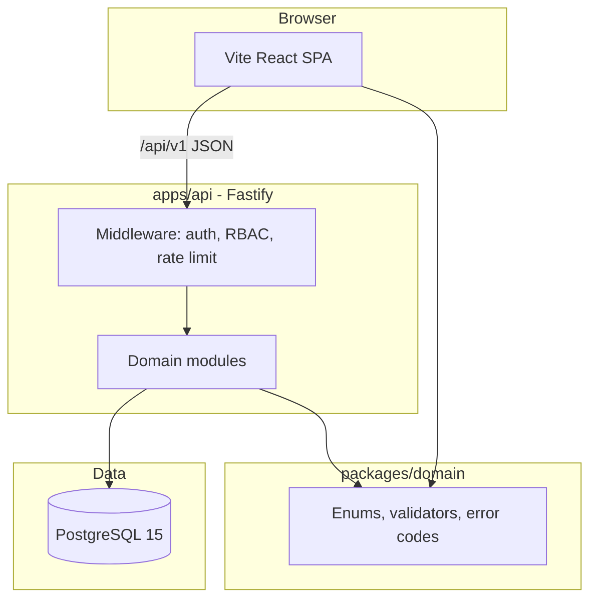

# We Check — Backend / Frontend Tech Stack

Technology choices for **We Check** MVP monorepo. Supports modular monolith architecture ([00-system-overview.md](./00-system-overview.md)), local-first development with Docker Compose PostgreSQL, and pilot-scale load (100–150 concurrent check-ins per session, up to 500 concurrent users across sessions per [NFR-23](../brds/07-non-functional-risk.md)).

**Related documents:** [System overview](./00-system-overview.md) · [Module breakdown](./02-module-breakdown.md) · [Database design](./04-database-design.md) · [API design](./05-api-design.md) · [Local development setup](./10-local-development-setup.md) · [Docker Compose local runtime](./13-docker-compose-local-runtime.md)

---

## 1. Objective

Document stack decisions so engineers and designers can implement without ambiguity. Choices favor:

- Type safety across API and web client.
- Serializable check-in transactions on PostgreSQL.
- Mobile web compatibility (iOS 15+ Safari, Android 10+ Chrome).
- Vietnam-region deployment path without vendor lock-in to a specific cloud.

---

## 2. Stack Summary

| Tier | Technology | Version |
| --- | --- | --- |
| Language | TypeScript (ESM) | 5.x |
| Runtime | Node.js LTS | ≥ 20 |
| Package manager | npm workspaces | ≥ 10 |
| API framework | Fastify | 4.x |
| Web framework | React + Vite | React 18+, Vite 5+ |
| Database | PostgreSQL | 15+ |
| DB access | `pg` (node-postgres) | 8.x |
| Migrations | Prisma migrate or Flyway | Team choice at bootstrap |
| Validation (API) | Zod + Fastify type provider | Shared schemas with web |
| Validation (web) | Zod + React Hook Form | Client-side mirror |
| Styling | Tailwind CSS | 3.x |
| UI primitives | Radix UI | Accessible headless components |
| Server state | TanStack Query | v5 |
| Routing | React Router | v6 |
| QR (instructor display) | `qrcode` library | PNG/SVG generation |
| QR (student scan) | Browser BarcodeDetector or `@zxing/browser` | Feature-detect fallback |
| Geo | Haversine in `@wecheck/domain` | No PostGIS for MVP |
| Auth | Server-side sessions; HTTP-only cookie | [05-api-design.md](./05-api-design.md) §2 |
| Password hashing | bcrypt or argon2 | [NFR-14](../brds/07-non-functional-risk.md) |
| Testing | Node test runner + Vitest (web unit) | Per [11-testing-plan.md](./11-testing-plan.md) |
| Container runtime | Docker Compose | PostgreSQL; optional full-preview |

---

## 3. Backend

### 3.1 Runtime and framework

- **Node.js LTS (≥ 20)** with **TypeScript** strict mode.
- **Fastify** REST server exposing `/api/v1/*` per [05-api-design.md](./05-api-design.md).
- **ESM** modules throughout monorepo.
- Single process for MVP; optional worker thread for QR scheduler and absence-threshold jobs.

### 3.2 Modular monolith structure

Packages map to [02-module-breakdown.md](./02-module-breakdown.md) modules:

| Package path | Module | Responsibility |
| --- | --- | --- |
| `apps/api/src/modules/identity-auth` | `identity-auth` | Users, sessions, login |
| `apps/api/src/modules/roster-enrollment` | `roster-enrollment` | Classes, enrollments, CSV import |
| `apps/api/src/modules/session-management` | `session-management` | Session CRUD, open/close/cancel |
| `apps/api/src/modules/checkin-qr` | `checkin-qr` | QR tokens, check-in pipeline |
| `apps/api/src/modules/attendance` | `attendance` | Records, manual edits, history |
| `apps/api/src/modules/reporting-export` | `reporting-export` | Reports, CSV export |
| `apps/api/src/modules/notifications` | `notifications` | In-app notifications, policy |

**Layering within each module:**

```
routes → services (orchestration, transactions) → repositories (SQL)
```

Routes perform schema validation only; business rules live in services ([08-validation-rules.md](./08-validation-rules.md)).

### 3.3 Database and persistence

- **PostgreSQL 15+** per [04-database-design.md](./04-database-design.md).
- **`pg` connection pool** — 20–50 connections per API instance.
- **No ORM required** — parameterized SQL in repositories; optional Prisma for migrations-only.
- **Serializable isolation** for `POST /check-in` transaction ([NFR-02](../brds/07-non-functional-risk.md)).
- Enum types mirror [03-domain-model.md](./03-domain-model.md) and [07-state-machines.md](./07-state-machines.md).

### 3.4 Authentication and security

| Concern | Implementation | NFR / FR |
| --- | --- | --- |
| Session storage | `auth_sessions` table; UUID session ID | FR-02 |
| Cookie | `wecheck_session`; HttpOnly; SameSite=Lax; Secure in production | NFR-09 |
| Bearer fallback | `Authorization: Bearer <sessionId>` for mobile fetch | [05-api-design.md](./05-api-design.md) §2.1 |
| Session expiry | 8 h sliding inactivity on `lastActivityAt` | NFR-16 |
| RBAC | Permission middleware per [01-roles-permissions.md](./01-roles-permissions.md) | NFR-11 |
| Rate limiting | `@fastify/rate-limit` or Redis-backed in production | [05-api-design.md](./05-api-design.md) §10.3 |

### 3.5 Cross-cutting backend concerns

| Concern | Approach |
| --- | --- |
| Error mapping | Central `ErrorMapper` → [09-error-handling.md](./09-error-handling.md) |
| Request ID | `X-Request-Id` middleware; echo in responses |
| Logging | Pino JSON structured logs ([NFR-21](../brds/07-non-functional-risk.md)) |
| Health | `GET /api/v1/health` → `{ status, db }` ([NFR-22](../brds/07-non-functional-risk.md)) |
| OpenAPI | `@fastify/swagger` → `/api/v1/openapi.json` |
| QR scheduler | In-process interval job every 30 s per Active session ([NFR-06](../brds/07-non-functional-risk.md)) |
| CORS | Dev: `localhost:3000`; prod: institution domain only |

### 3.6 Background jobs (MVP)

| Job | Trigger | Module |
| --- | --- | --- |
| QR token rotation | Every 30 s while session Active | `checkin-qr` |
| Attendance window auto-close | `scheduledStart + 10 min` | `session-management` |
| Absence threshold evaluation | On session close | `notifications` |
| Expired token cleanup | Hourly cron | `checkin-qr` |

Jobs run in-process for MVP; extract to worker when scaling beyond pilot.

---

## 4. Frontend

### 4.1 Application shell

- **Vite** SPA with **React 18** and **TypeScript**.
- **React Router v6** for role-based route trees (student, instructor, admin).
- **TanStack Query** for API caching, polling (QR countdown, live attendance every 5 s).
- Dev server proxies `/api/v1` → `http://localhost:3001` so browser sees single origin ([10-local-development-setup.md](./10-local-development-setup.md) §5.5).

### 4.2 UI and styling

| Layer | Choice | Notes |
| --- | --- | --- |
| Styling | Tailwind CSS | Utility-first; mobile-first breakpoints |
| Components | Radix UI | Dialog, dropdown, toast — accessible by default |
| Design tokens | CSS variables | Mapped in UI/UX docs (`docs/ui-ux/04-design-tokens.md`) |
| Icons | Lucide React | Consistent stroke icons |
| Tables | TanStack Table | Admin user list, attendance roster |
| Forms | React Hook Form + Zod | Shared Zod schemas from `@wecheck/domain` |
| Toasts | Radix Toast or Sonner | Vietnamese error messages |

### 4.3 Role-specific views

| Actor | Key views | Technical notes |
| --- | --- | --- |
| Student | Login, check-in (camera + GPS), history | Mobile-optimized; full viewport; minimal JS bundle |
| Instructor | Session list, session editor, QR display, live monitor, manual edit | QR view large contrast for projector ([NFR-20](../brds/07-non-functional-risk.md)) |
| TrainingOfficeAdmin | Users, roster import, reports, export, policy | Data tables with server pagination |

### 4.4 Mobile check-in client capabilities

| Capability | Web API | Fallback |
| --- | --- | --- |
| QR scan | `BarcodeDetector` (Chrome) | `@zxing/browser` file/input stream |
| GPS | `navigator.geolocation.getCurrentPosition` | 15 s timeout → `GpsDisabled` UX; **simulation** via `VITE_ENABLE_DEVICE_SIMULATION` + query params ([NFR-24](../brds/07-non-functional-risk.md)) |
| Camera permission | `getUserMedia` | Vietnamese instruction modal ([NFR-19](../brds/07-non-functional-risk.md)); sim via `cameraSim` when flag on |
| Preflight | `GET /check-in/tokens/:tokenId/preflight` | Client hook before GPS step ([BR-15](../brds/04-business-rules.md)) |
| Deep link | `/check-in?token=<id>&session=<id>` | Preflight before auto-skip scan UI; parse from QR payload `wecheck://check-in?...` |

No React Native or Capacitor in MVP ([00-system-overview.md](./00-system-overview.md) §2.7).

### 4.5 Frontend state and API access

- **Auth context:** session user, role, logout; cookie credentials on all fetch calls.
- **API client:** typed wrapper generated from OpenAPI or hand-maintained per resource.
- **Polling:** QR display 5 s interval; attendance monitor 5 s while Active ([FR-15](../brds/03-functional-requirements.md)).
- **Optimistic UI:** Not used for check-in (server outcome authoritative).

---

## 5. Shared Domain Package

**`packages/domain`** (`@wecheck/domain`) shared by API and web:

| Export | Contents |
| --- | --- |
| Enums | `SessionStatus`, `AttendanceStatus`, `CheckInOutcome`, `UserRole` |
| Error codes | Stable `errorCode` constants |
| Zod schemas | Request DTOs for forms and API |
| Pure functions | Haversine distance, radius check, token expiry |
| Messages | Vietnamese default strings keyed by errorCode |

No database or HTTP imports in domain package — enables unit tests without I/O.

---

## 6. Architecture Style



**Principles:**

- Server-authoritative attendance state ([NFR-02](../brds/07-non-functional-risk.md)).
- No business rule bypass in routes or UI components.
- GPS coordinates never stored after successful validation ([NFR-12](../brds/07-non-functional-risk.md)).
- Append-only audit for sensitive actions ([NFR-15](../brds/07-non-functional-risk.md)).

---

## 7. Monorepo Layout

| Workspace | Package name | Default port |
| --- | --- | --- |
| `apps/api` | `@wecheck/api` | 3001 |
| `apps/web` | `@wecheck/web` | 3000 |
| `packages/domain` | `@wecheck/domain` | — |
| `packages/config` | `@wecheck/config` | — |
| `tests/e2e` | `@wecheck/e2e` | — |

Root scripts (expected after bootstrap):

| Script | Action |
| --- | --- |
| `npm run dev` | Parallel API + web dev servers |
| `npm run build` | Production build all workspaces |
| `npm run test:unit` | Unit tests |
| `npm run test:integration` | Integration tests (Postgres required) |
| `npm run test:e2e` | HTTP scenario suite |
| `npm run aih:dev:db:up` | Start Compose Postgres only |

---

## 8. Mandatory Guardrails

| Rule | Rationale |
| --- | --- |
| PostgreSQL via Docker Compose for all persistence | [13-docker-compose-local-runtime.md](./13-docker-compose-local-runtime.md) |
| No in-memory / SQLite system of record | Harness hard-fail |
| Check-in in serializable transaction | [NFR-02](../brds/07-non-functional-risk.md) |
| Vietnamese user-facing strings | [NFR-17](../brds/07-non-functional-risk.md) |
| TLS 1.2+ in non-local environments | [NFR-09](../brds/07-non-functional-risk.md) |
| bcrypt/argon2 password hashing | [NFR-14](../brds/07-non-functional-risk.md) |
| Structured logs without secrets or raw GPS | [NFR-21](../brds/07-non-functional-risk.md) |

---

## 9. Deployment Profile (MVP Pilot)

| Component | Pilot specification |
| --- | --- |
| Hosting region | Vietnam ([NFR-13](../brds/07-non-functional-risk.md)) |
| API instances | 2+ behind load balancer |
| Database | Managed PostgreSQL 15+, daily backup (RPO 24 h) |
| Static web | CDN or object storage + HTTPS |
| TLS | Institution certificate or Let's Encrypt |
| Secrets | Environment variables; not in image layers |

Detailed cloud topology is IT Operations scope — not defined in this document.

---

## 10. Non-Goals (Current Phase)

| Excluded | Notes |
| --- | --- |
| Microservices decomposition | Modular monolith sufficient for pilot |
| Native mobile apps | Mobile web only |
| GraphQL | REST per API design |
| PostGIS | Haversine sufficient for MVP radius |
| Redis (required) | Optional for rate limit at scale; in-memory acceptable for local |
| Campus SSO | Email/password MVP ([FR-02](../brds/03-functional-requirements.md)); future |
| Real-time WebSocket dashboard | Polling for MVP ([FR-15](../brds/03-functional-requirements.md)) |

---

## 11. Traceability Matrix

| Stack area | FR | NFR |
| --- | --- | --- |
| Fastify REST API | FR-01–FR-16 | NFR-04, NFR-21, NFR-22 |
| PostgreSQL + transactions | FR-09 | NFR-02, NFR-03 |
| Session auth | FR-02 | NFR-10, NFR-14, NFR-16 |
| React mobile web | FR-07, FR-08 | NFR-17, NFR-18, NFR-19 |
| QR display | FR-06 | NFR-06, NFR-20 |
| CSV export | FR-13 | NFR-11 |
| Docker local Postgres | — | NFR-23 (load test baseline) |

---

## 12. Future Consideration

| Enhancement | Stack impact |
| --- | --- |
| Next.js SSR for SEO | Replace Vite SPA for marketing pages only |
| Redis session store | Horizontal API scaling with sticky-less sessions |
| `@zxing` WASM | Uniform QR scan across browsers |
| OpenTelemetry | Distributed tracing for check-in latency |
| Generated TS client | `openapi-typescript` from `/api/v1/openapi.json` |
| SSO (OIDC) | Passport.js or `@fastify/oauth2` integration |
