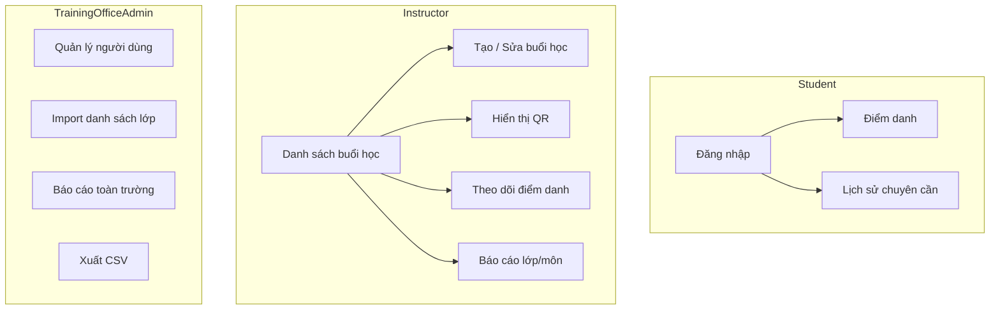

# We Check — Design Overview

High-level UI/UX direction for **We Check** MVP: digital attendance and session check-in for the Harness Engineering for Software Development (HESD) workshop program and institutional training office operations.

**Related documents:** [BRD prompt](../brds/prompt.md) · [UI/UX foundation](./01-ui-ux-foundation.md) · [Production quality bar](./00-production-ui-quality-bar.md) · [Functional requirements](../brds/03-functional-requirements.md) · [User flows](./10-user-flows.md) (downstream)

---

## 1. Design Overview

We Check serves three in-app personas with distinct contexts: students checking in under time pressure on phones, instructors operating sessions in front of a class (often projected), and training office administrators managing rosters and exports at a desk. The design prioritizes **speed and clarity** for check-in, **legibility at distance** for QR display, and **data density with guardrails** for admin tables.

| Principle | Application |
| --- | --- |
| Mobile-first check-in | Student routes designed for **320–428 px** portrait; thumb-reachable primary actions |
| Projection-aware instructor | QR and countdown optimized for classroom projector ([NFR-20](../brds/07-non-functional-risk.md)) |
| Trust through transparency | Show session name, room, and check-in window so students confirm correct class |
| Fail loud, recover fast | Vietnamese errors with next-step guidance ([NFR-19](../brds/07-non-functional-risk.md)) |
| Role-appropriate density | Minimal chrome for students; sidebar navigation for instructor/admin |
| Server-authoritative state | UI reflects API truth; no false “checked in” before confirmation |

---

## 2. Product Context

| Attribute | Value |
| --- | --- |
| Product name | We Check |
| Domain | Digital attendance and session check-in for educational workshops and classes |
| Locale | Vietnamese (`vi-VN`) UI copy |
| Cohort scale | **100–150** attendees per session |
| Check-in window | **5 minutes** target for full cohort ([prompt](../brds/prompt.md) §1) |
| Platform | Responsive web; no native apps in MVP |

**Problem:** Manual roll call wastes **15–30 minutes**, enables proxy attendance, and produces unreliable reports.

**Solution:** Rotating **30-second** QR tokens, GPS verification (default **100 m** radius), authenticated one-check-in-per-student, and exportable attendance data.

---

## 3. Personas and Primary Jobs

### 3.1 Student

| Job | UI implication |
| --- | --- |
| Check in quickly during class opening | Single-purpose check-in screen; camera/GPS permission priming |
| Confirm personal attendance history | Simple list with status badges (`Present`, `Absent`, `Excused`) |
| Recover from permission or QR errors | Inline help; link to ask instructor for manual mark ([FR-11](../brds/03-functional-requirements.md)) |

### 3.2 Instructor

| Job | UI implication |
| --- | --- |
| Open session and display QR | Wizard-lite session editor; one-click “Mở buổi học” to `Active` |
| Monitor live attendance | Dashboard with counts and roster filter by status ([FR-15](../brds/03-functional-requirements.md)) |
| Correct exceptions | Inline edit on roster row with reason field; audit notice ([BR-10](../brds/04-business-rules.md)) |

### 3.3 Training Office Admin

| Job | UI implication |
| --- | --- |
| Provision users and import rosters | Form + CSV upload with row-level error report ([FR-01](../brds/03-functional-requirements.md), [FR-03](../brds/03-functional-requirements.md)) |
| Institution-wide reporting and CSV export | Filterable reports; export button with role guard ([FR-13](../brds/03-functional-requirements.md), [BR-09](../brds/04-business-rules.md)) |

`ITOperations` has no in-app business UI in MVP.

---

## 4. Information Architecture (MVP)

Detailed page inventory: [09-page-list.md](./09-page-list.md) (downstream).

---

## 5. Visual Direction

### 5.1 Tone and brand

- **Professional and calm** — reduces anxiety during timed check-in.
- **Institutional trust** — aligns with training office operations; avoids playful gamification.
- **High signal** — status colors reserved for attendance states and alerts, not decoration.

### 5.2 Color semantics

| Semantic | Usage |
| --- | --- |
| Primary | Primary actions: “Điểm danh”, “Mở buổi học”, “Lưu” |
| Success | `Present`, successful check-in |
| Warning | `Pending`, approaching window close, absence threshold ([BR-05](../brds/04-business-rules.md)) |
| Danger | `Absent`, `Rejected`, blocking errors |
| Neutral | Tables, borders, secondary text |

Token values: [04-design-tokens.md](./04-design-tokens.md).

### 5.3 Typography

- System UI stack for fast load on student devices.
- Page titles: semibold, **20–24 px** on mobile, **24–28 px** on desktop.
- Body: **16 px** minimum on student flows ([NFR-18](../brds/07-non-functional-risk.md)).
- Monospace for session IDs and export timestamps only.

---

## 6. Critical Experience Priorities

| Priority | Flow | FR / AC |
| --- | --- | --- |
| P0 | Student QR + GPS check-in | [FR-07](../brds/03-functional-requirements.md), [FR-08](../brds/03-functional-requirements.md), [AC-07](../brds/08-acceptance-mvp-future.md), [AC-08](../brds/08-acceptance-mvp-future.md) |
| P0 | Instructor QR display | [FR-06](../brds/03-functional-requirements.md), [AC-06](../brds/08-acceptance-mvp-future.md) |
| P0 | Login gate before check-in | [FR-02](../brds/03-functional-requirements.md), [AC-02](../brds/08-acceptance-mvp-future.md) |
| P1 | Live attendance monitor | [FR-15](../brds/03-functional-requirements.md), [AC-15](../brds/08-acceptance-mvp-future.md) |
| P1 | Manual attendance edit | [FR-11](../brds/03-functional-requirements.md), [AC-11](../brds/08-acceptance-mvp-future.md) |
| P1 | Admin CSV export | [FR-13](../brds/03-functional-requirements.md), [AC-13](../brds/08-acceptance-mvp-future.md) |

---

## 7. Out of Scope (Design)

Per [prompt](../brds/prompt.md) §2.3:

- Native iOS/Android app shells
- Facial recognition UI
- Tuition or exam scheduling screens
- Deep SIS integration wizards beyond CSV import
- Offline check-in queue UI

---

## 8. Future Consideration

- Marketing landing page with institutional branding photography.
- SSO login button placement when campus IdP is integrated.
- Instructor onboarding tour (coach marks) for first session.
- Student home dashboard with upcoming sessions calendar.
