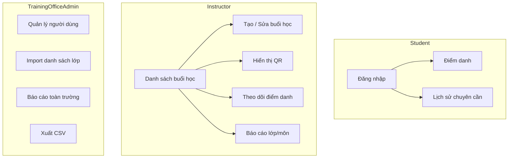

# We Check — Design Overview

High-level UI/UX direction for **We Check** MVP: digital attendance and session check-in for the Harness Engineering for Software Development (HESD) workshop program and institutional training office operations.

**Related documents:** [BRD prompt](../brds/prompt.md) · [UI/UX foundation](./01-ui-ux-foundation.md) · [Production quality bar](./00-production-ui-quality-bar.md) · [Functional requirements](../brds/03-functional-requirements.md) · [User flows](./10-user-flows.md) (downstream)

---

## 1. Design Overview

We Check serves three in-app personas with distinct contexts: students checking in under time pressure on phones, instructors operating sessions in front of a class (often projected), and training office administrators managing rosters and exports at a desk. The design prioritizes **speed and clarity** for check-in, **legibility at distance** for QR display, and **data density with guardrails** for admin tables.

| Principle | Application |
| --- | --- |
| Mobile-first check-in | Student routes designed for **320–428 px** portrait; thumb-reachable primary actions |
| Projection-aware instructor | QR and countdown optimized for classroom projector ([NFR-20](../brds/07-non-functional-risk.md)) |
| Trust through transparency | Show session name, room, and check-in window so students confirm correct class |
| Fail loud, recover fast | Vietnamese errors with next-step guidance ([NFR-19](../brds/07-non-functional-risk.md)) |
| Role-appropriate density | Minimal chrome for students; sidebar navigation for instructor/admin |
| Server-authoritative state | UI reflects API truth; no false “checked in” before confirmation |

---

## 2. Product Context

| Attribute | Value |
| --- | --- |
| Product name | We Check |
| Domain | Digital attendance and session check-in for educational workshops and classes |
| Locale | Vietnamese (`vi-VN`) UI copy |
| Cohort scale | **100–150** attendees per session |
| Check-in window | **5 minutes** target for full cohort ([prompt](../brds/prompt.md) §1) |
| Platform | Responsive web; no native apps in MVP |

**Problem:** Manual roll call wastes **15–30 minutes**, enables proxy attendance, and produces unreliable reports.

**Solution:** Rotating **30-second** QR tokens, GPS verification (default **100 m** radius), authenticated one-check-in-per-student, and exportable attendance data.

---

## 3. Personas and Primary Jobs

### 3.1 Student

| Job | UI implication |
| --- | --- |
| Check in quickly during class opening | Single-purpose check-in screen; camera/GPS permission priming |
| Confirm personal attendance history | Simple list with status badges (`Present`, `Absent`, `Excused`) |
| Recover from permission or QR errors | Inline help; link to ask instructor for manual mark ([FR-11](../brds/03-functional-requirements.md)) |

### 3.2 Instructor

| Job | UI implication |
| --- | --- |
| Open session and display QR | Wizard-lite session editor; one-click “Mở buổi học” to `Active` |
| Monitor live attendance | Dashboard with counts and roster filter by status ([FR-15](../brds/03-functional-requirements.md)) |
| Correct exceptions | Inline edit on roster row with reason field; audit notice ([BR-10](../brds/04-business-rules.md)) |

### 3.3 Training Office Admin

| Job | UI implication |
| --- | --- |
| Provision users and import rosters | Form + CSV upload with row-level error report ([FR-01](../brds/03-functional-requirements.md), [FR-03](../brds/03-functional-requirements.md)) |
| Institution-wide reporting and CSV export | Filterable reports; export button with role guard ([FR-13](../brds/03-functional-requirements.md), [BR-09](../brds/04-business-rules.md)) |

`ITOperations` has no in-app business UI in MVP.

---

## 4. Information Architecture (MVP)



Detailed page inventory: [09-page-list.md](./09-page-list.md) (downstream).

---

## 5. Visual Direction — Notion Workspace System

We Check adopts the **Notion workspace design system** ([DESIGN.md](./DESIGN.md)): calm workspace density, purple primary CTAs, warm gray surfaces, and navy auth chrome. This supersedes Campus Pulse v2. MVP UX constraints remain: 320 px student flows, 44 px touch targets, Vietnamese copy, QR projection contrast.

**Harness skills:** implementers and browser testers apply craft from [`frontend-design`](../../ai-harness/skills/frontend-design/SKILL.md) and [`design-craft-notion`](../../ai-harness/skills/design-craft-notion/SKILL.md). Token values live in [04-design-tokens.md](./04-design-tokens.md).

### 5.1 Thesis

We Check UI should feel like a **focused workspace tool** — not anxious bureaucracy or a templated dashboard. Students get calm urgency during timed check-in; instructors get data-forward clarity at projection distance; admins get dense tables with Notion-style breathing room.

### 5.2 Tone and brand

| Attribute | Expression |
| --- | --- |
| Trust | Navy brand band (`--color-brand-700`) — stable, institutional |
| Clarity | Charcoal text on warm gray surfaces — readable, calm |
| Action | Notion purple (`--color-primary-600`) — signature CTA color |
| Urgency | Orange countdown pulse when QR ≤ 10 s — not decorative red |
| Success | Mint pastel outcome moments — distinct from generic alerts |
| Restraint | One signature visual beat per flow; quiet chrome elsewhere |

**Avoid:** generic Tailwind blue dashboards, marketing hero clutter on app routes, sticky-note decorations, pricing-tier layouts, decorative numbered markers without semantic meaning.

### 5.3 Color semantics

| Semantic | Token role | Usage |
| --- | --- | --- |
| Brand navy | `--color-brand-*` | Auth hero band, dark chrome accents |
| Action primary | `--color-primary-*` | Primary CTAs: “Điểm danh”, “Mở buổi học”, “Lưu” |
| Success | `--color-success-*` | `Present`, check-in success outcome wash |
| Warning | `--color-warning-*` | `Pending`, countdown warning |
| Danger | `--color-danger-*` | `Absent`, blocking errors |
| Neutral | `--color-surface-*`, `--color-text-*`, `--color-border-*` | Tables, borders, secondary text |

QR **presentation mode** remains max-contrast black/white — decorative tokens must not weaken [NFR-20](../brds/07-non-functional-risk.md).

Full values: [04-design-tokens.md](./04-design-tokens.md) · authoritative spec: [DESIGN.md](./DESIGN.md).

### 5.4 Typography

| Role | Face | Use |
| --- | --- | --- |
| All UI | **Inter** (`var(--font-sans)`, `var(--font-display)`) | Body, headings, tables — Vietnamese subset via Google Fonts |
| Data | `var(--font-mono)` | Session IDs, export timestamps only |

Load via Google Fonts with `vietnamese` subset and `font-display: swap`. System stack remains fallback for FOUT/offline.

Scale: display 28 px, h1 24 px, h2 20 px, body 16 px (`body-md`), table meta 14 px (`body-sm`) — minimum 16 px on student routes ([NFR-18](../brds/07-non-functional-risk.md)).

### 5.5 Signature element — check-in outcome moment

Every check-in outcome (`Success`, `ExpiredQr`, `OutOfRadius`, `DuplicateCheckIn`, etc.) renders as a **full-width outcome panel**:

```
┌─────────────────────────────────────┐
│  [icon]  Headline (semibold)        │
│  Supporting detail (body)           │
│  ─────────────────────────────────  │
│  [ single primary recovery CTA ]    │
└─────────────────────────────────────┘
```

- Notion **card-tint** pastel wash (`success-50`, `warning-50`, `danger-50`, `info-50`)
- Distinct **Lucide icon** per outcome (not interchangeable `AlertCircle`)
- One recovery action — “Quét lại”, “Xem lịch sử”, “Thử lại”
- Primary CTA uses `button-primary` purple styling

Spec: [07-event-specific-components.md](./07-event-specific-components.md) §2.5 · [12-ui-states.md](./12-ui-states.md) §4.

### 5.6 Role-specific chrome

| Role | Chrome treatment |
| --- | --- |
| **Student** | Warm gray background (`--color-surface-default`); compact header; bottom nav with `pill-tab-active` indicator |
| **Instructor** | Sidebar with hairline dividers; elevated stat cards on monitor; active nav uses `--color-primary-50` pill |
| **Admin** | Same sidebar pattern; table cards with `--shadow-md` elevation |
| **Auth** | **Split panel** (≥768 px): left navy `hero-band-dark` panel + product copy, right login card with purple `button-primary` |
| **QR projection** | Unchanged fullscreen inverse — no brand decoration on `--color-qr-bg` |

Layout specs: [06-app-layout-components.md](./06-app-layout-components.md).

**Workspace density (instructor/admin):** Sidebar rhythm, database-style filter toolbars, and table spacing per [`design-craft-notion` skill](../../ai-harness/skills/design-craft-notion/SKILL.md) — all tokens from [DESIGN.md](./DESIGN.md) / [04-design-tokens.md](./04-design-tokens.md).

### 5.7 Motion

| Moment | Treatment |
| --- | --- |
| Check-in page enter | Fade + 8 px rise, `--duration-normal` |
| Outcome panel reveal | Scale 0.98→1 + opacity, `--duration-slow` |
| Card hover (desktop) | `--shadow-sm` → `--shadow-md`, translateY -1 px |
| QR countdown ≤ 10 s | Subtle amber pulse on timer (presentation mode only) |

Respect `prefers-reduced-motion: reduce` — disable pulse and translate; keep opacity instant.

---

## 6. Critical Experience Priorities

| Priority | Flow | FR / AC |
| --- | --- | --- |
| P0 | Student QR + GPS check-in | [FR-07](../brds/03-functional-requirements.md), [FR-08](../brds/03-functional-requirements.md), [AC-07](../brds/08-acceptance-mvp-future.md), [AC-08](../brds/08-acceptance-mvp-future.md) |
| P0 | Instructor QR display | [FR-06](../brds/03-functional-requirements.md), [AC-06](../brds/08-acceptance-mvp-future.md) |
| P0 | Login gate before check-in | [FR-02](../brds/03-functional-requirements.md), [AC-02](../brds/08-acceptance-mvp-future.md) |
| P0 | First admin bootstrap (`/setup`) | [FR-17](../brds/03-functional-requirements.md), [AC-17](../brds/08-acceptance-mvp-future.md) |
| P0 | Permission-gated nav and role home hubs | [FR-18](../brds/03-functional-requirements.md), [AC-18](../brds/08-acceptance-mvp-future.md) |
| P0 | QR preflight before GPS step | [FR-07](../brds/03-functional-requirements.md), [BR-15](../brds/04-business-rules.md) |
| P1 | Live attendance monitor | [FR-15](../brds/03-functional-requirements.md), [AC-15](../brds/08-acceptance-mvp-future.md) |
| P1 | Manual attendance edit | [FR-11](../brds/03-functional-requirements.md), [AC-11](../brds/08-acceptance-mvp-future.md) |
| P1 | Admin CSV export | [FR-13](../brds/03-functional-requirements.md), [AC-13](../brds/08-acceptance-mvp-future.md) |

---

## 7. Out of Scope (Design)

Per [prompt](../brds/prompt.md) §2.3:

- Native iOS/Android app shells
- Facial recognition UI
- Tuition or exam scheduling screens
- Deep SIS integration wizards beyond CSV import
- Offline check-in queue UI

---

## 8. Future Consideration

- Marketing landing page with institutional branding photography.
- SSO login button placement when campus IdP is integrated.
- Instructor onboarding tour (coach marks) for first session.
- Student home dashboard with upcoming sessions calendar.
