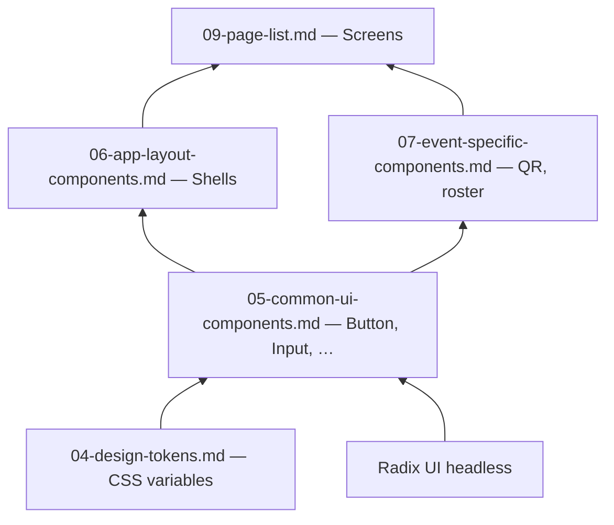

# We Check — Design System Basics

Core design system structure for **We Check** MVP: principles, semantic naming, component tiers, and extension rules. Tokens and components are specified in sibling documents.

**Related documents:** [Design tokens](./04-design-tokens.md) · [Common components](./05-common-ui-components.md) · [UI framework](./02-ui-framework-tech-stack.md) · [Production quality bar](./00-production-ui-quality-bar.md)

---

## 1. Design System

We Check uses a **lightweight in-repo design system** — not a published package. Tokens live in CSS variables; components live in `apps/web/src/components/`. The system optimizes for fast pilot delivery, accessibility via Radix primitives, and Vietnamese-language clarity.

---

## 2. Design Principles

| Principle | Description |
| --- | --- |
| Clarity over decoration | Every visual element supports scan, check-in, or audit tasks |
| Consistent semantics | Same color means same meaning everywhere (success = `Present`) |
| Accessible by default | Radix primitives + focus tokens; no custom widgets without spec |
| Mobile-first student | Student flows designed at 320 px; instructor/admin scale up |
| Projection legibility | Instructor QR mode uses maximum contrast preset |
| Honest loading | Always show loading, empty, and error states |

---

## 3. System Layers



**Dependency rule:** Pages import domain and layout components; domain imports UI primitives; UI imports tokens only (no feature imports upward).

---

## 4. Semantic Color Roles

| Role | Token prefix | Example use |
| --- | --- | --- |
| Brand primary | `--color-primary-*` | Primary buttons, active nav |
| Surface | `--color-surface-*` | Page background, cards |
| Text | `--color-text-*` | Body, muted, inverse |
| Border | `--color-border-*` | Dividers, input outlines |
| Success | `--color-success-*` | `Present`, check-in OK |
| Warning | `--color-warning-*` | `Pending`, countdown < 10 s |
| Danger | `--color-danger-*` | `Absent`, errors |
| Info | `--color-info-*` | `Excused`, tips |

Concrete values: [04-design-tokens.md](./04-design-tokens.md).

---

## 5. Typography Scale

| Token | Size | Line height | Weight | Use |
| --- | --- | --- | --- | --- |
| `text-display` | 28 px | 36 px | 600 | QR countdown (presentation) |
| `text-h1` | 24 px | 32 px | 600 | Page titles |
| `text-h2` | 20 px | 28 px | 600 | Section headers |
| `text-body` | 16 px | 24 px | 400 | Default body |
| `text-small` | 14 px | 20 px | 400 | Captions, table meta |
| `text-label` | 14 px | 20 px | 500 | Form labels |

Font family: `var(--font-sans)` — system UI stack.

---

## 6. Spacing and Layout Grid

| Token | Value | Use |
| --- | --- | --- |
| `--space-1` | 4 px | Tight icon gaps |
| `--space-2` | 8 px | Inline spacing |
| `--space-3` | 12 px | Form field gaps |
| `--space-4` | 16 px | Card padding (mobile) |
| `--space-6` | 24 px | Section separation |
| `--space-8` | 32 px | Page horizontal padding (desktop) |

**Content max-width:**

| Context | Max width |
| --- | --- |
| Student check-in | 480 px centered |
| Instructor forms | 720 px |
| Admin tables | fluid with 1280 px container |

---

## 7. Elevation and Borders

| Level | Shadow token | Use |
| --- | --- | --- |
| 0 | none | Flat lists |
| 1 | `--shadow-sm` | Cards |
| 2 | `--shadow-md` | Dropdowns, popovers |
| 3 | `--shadow-lg` | Modals |

Border radius: `--radius-sm` 4 px (inputs), `--radius-md` 8 px (cards), `--radius-lg` 12 px (modals).

---

## 8. Iconography

- Library: **Lucide React**.
- Default size: **20 px** inline, **24 px** in buttons and nav.
- Stroke width: default (2 px); do not mix filled icon sets.
- Always pair icon-only buttons with `aria-label` in Vietnamese.

Common icons:

| Concept | Icon name |
| --- | --- |
| Check-in / scan | `QrCode` |
| Location | `MapPin` |
| Success | `CheckCircle2` |
| Error | `AlertCircle` |
| Session | `Calendar` |
| Export | `Download` |
| User | `User` |

---

## 9. Motion

| Pattern | Duration | Easing |
| --- | --- | --- |
| Button press | 100 ms | ease-out |
| Modal open | 200 ms | ease-out |
| Toast enter | 250 ms | ease |
| QR refresh pulse | 400 ms | ease-in-out |

Respect `prefers-reduced-motion: reduce` — disable pulse and shorten transitions to 0 ms.

---

## 10. Component Tiers

### Tier 1 — Primitives (`components/ui/`)

Atomic, token-driven, Radix-wrapped. Listed in [05-common-ui-components.md](./05-common-ui-components.md).

### Tier 2 — Layout (`components/layout/`)

Shells, nav, page headers. Listed in [06-app-layout-components.md](./06-app-layout-components.md).

### Tier 3 — Domain (`components/domain/`)

Attendance-specific: QR display, scanner, status badges, roster row. Listed in [07-event-specific-components.md](./07-event-specific-components.md).

---

## 11. Composition Patterns

### 11.1 Page template

```
<RoleLayout>
  <PageHeader title="" actions={} />
  <PageContent>
    …
  </PageContent>
</RoleLayout>
```

### 11.2 Data table template

```
<Card>
  <TableToolbar filters actions />
  <DataTable columns data loading emptyState />
  <TablePagination />
</Card>
```

### 11.3 Form template

```
<Form schema={zodSchema} onSubmit={}>
  <FormField name="" label="" />
  <FormActions primary secondary />
</Form>
```

---

## 12. Do and Don't

| Do | Don't |
| --- | --- |
| Use `StatusBadge` for attendance states | Invent new colors per screen |
| Use token spacing scale | Arbitrary `margin: 13px` |
| Wrap Radix once in `components/ui` | Import `@radix-ui/react-dialog` in features |
| Show session state in header during live ops | Hide `Active`/`Closed` state |

---

## 13. Future Consideration

- Figma library synced to token JSON export.
- Dark theme token layer (`[data-theme="dark"]`).
- Component Storybook with Vietnamese locale toggle.
- Institution white-label logo slot in `AdminLayout` header.
