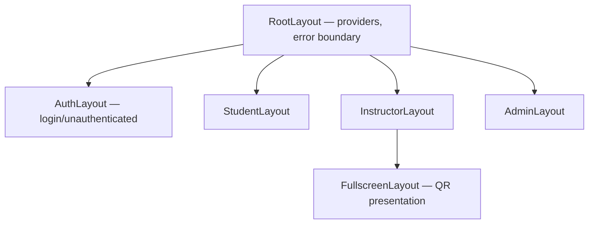

# We Check — App Layout Components

Role-based application shells and page scaffolding for **We Check** MVP. Layout components wrap routes and provide consistent navigation, headers, and content regions.

**Related documents:** [UI framework](./02-ui-framework-tech-stack.md) · [Common components](./05-common-ui-components.md) · [Design overview](./01-design-overview.md) · [01-roles-permissions.md](../technical/01-roles-permissions.md)

---

## 1. Layout

Layout components live in `apps/web/src/components/layout/`. Each role has a dedicated shell that enforces navigation scope, header content, and responsive behavior. Pages supply content via `children` or React Router `<Outlet />`.

---

## 2. Layout Hierarchy



---

## 3. RootLayout

| Responsibility | Detail |
| --- | --- |
| Error boundary | Catches render errors; shows Vietnamese fallback with reload |
| Outlet | Renders child route layout |
| Skip link | “Bỏ qua đến nội dung chính” for keyboard users |
| Document title | `We Check — {page title}` via route handle |

No navigation chrome at root level.

---

## 4. AuthLayout

Used for `/login` and password recovery (if added).

| Region | Specification |
| --- | --- |
| Container | Centered card, max-width **400 px**, `--space-4` padding |
| Header | We Check product name + subtitle “Điểm danh số cho buổi học” |
| Background | `--color-surface-default` |
| Footer | Institutional support line (optional text link) |

**Behavior:** Redirect authenticated users to role home ([FR-02](../brds/03-functional-requirements.md)). Preserve `returnUrl` query for post-login check-in deep link ([BR-06](../brds/04-business-rules.md)).

---

## 5. StudentLayout

Mobile-first shell for `Student` role routes: `/check-in`, `/history`.

### 5.1 Structure

```
┌─────────────────────────────┐
│ AppHeader (compact)         │
├─────────────────────────────┤
│                             │
│   PageContent (Outlet)      │
│                             │
├─────────────────────────────┤
│ BottomNav (optional)        │
└─────────────────────────────┘
```

### 5.2 AppHeader (student variant)

| Element | Content |
| --- | --- |
| Left | We Check logo text (links to `/check-in`) |
| Right | `UserMenu` — name + logout |

Height: **56 px**. Sticky top.

### 5.3 BottomNav

| Item | Route | Icon |
| --- | --- | --- |
| Điểm danh | `/check-in` | `QrCode` |
| Lịch sử | `/history` | `History` |

Hidden on `/check-in` when camera active (scan step) to maximize viewfinder.

### 5.4 PageContent

- Horizontal padding: `--space-4`
- Max-width: **480 px**, centered
- Min-height: fills viewport minus header/nav

### 5.5 Student layout rules

- No sidebar.
- Primary actions fixed bottom on long forms (safe-area inset for iOS).
- Student never sees instructor or admin navigation items.

---

## 6. InstructorLayout

Desktop-primary shell for `/sessions/*` and instructor reports.

### 6.1 Structure

```
┌──────────┬──────────────────────────────────┐
│          │ TopBar — breadcrumb, UserMenu    │
│ Sidebar  ├──────────────────────────────────┤
│          │                                  │
│  Nav     │   PageContent (Outlet)           │
│          │                                  │
└──────────┴──────────────────────────────────┘
```

### 6.2 Sidebar

| Item | Route | Icon |
| --- | --- | --- |
| Buổi học | `/sessions` | `Calendar` |
| Báo cáo | `/reports` | `BarChart3` |

Width: **240 px** on `lg+`; collapses to icon rail on `md`; drawer overlay on `< md`.

Active item: `--color-primary-50` background, `--color-primary-700` text.

### 6.3 TopBar

- Breadcrumb from route handle
- Session `StatusBadge` when inside active session route
- `UserMenu` right-aligned

Height: **64 px**. Sticky.

### 6.4 PageContent

- Padding: `--space-6` on desktop, `--space-4` on mobile
- Max-width: **1280 px** for tables

### 6.5 Responsive behavior

| Breakpoint | Sidebar |
| --- | --- |
| `< md` | Hamburger opens `Sheet` drawer |
| `md – lg` | Collapsed icon rail |
| `≥ lg` | Full sidebar |

---

## 7. AdminLayout

Shell for `TrainingOfficeAdmin` routes under `/admin/*`.

### 7.1 Structure

Same grid as `InstructorLayout` with expanded navigation.

### 7.2 Sidebar

| Item | Route | Icon |
| --- | --- | --- |
| Người dùng | `/admin/users` | `Users` |
| Danh sách lớp | `/admin/rosters` | `Upload` |
| Báo cáo | `/admin/reports` | `BarChart3` |
| Xuất CSV | `/admin/export` | `Download` |
| Chính sách | `/admin/policy` | `Settings` |

### 7.3 Admin-specific chrome

- “Quản trị” label in sidebar header to distinguish from instructor view.
- Export and policy routes show compliance reminder footer on destructive actions.

### 7.4 Access control

If non-admin hits `/admin/*`, render **403 Forbidden** page inside `RootLayout` (no admin nav leaked).

---

## 8. FullscreenLayout

Used for instructor QR presentation ([FR-06](../brds/03-functional-requirements.md), [NFR-20](../brds/07-non-functional-risk.md)).

| Region | Specification |
| --- | --- |
| Background | `--color-qr-bg` (black) |
| Header strip | Session title, room, `StatusBadge` `Active` — `--color-text-inverse` |
| Main | Centered QR image + countdown (`text-display`) |
| Footer | “Thoát toàn màn hình” ghost button; last-updated timestamp |
| Chrome | No sidebar; minimal UI |

Enter via “Trình chiếu QR” on session detail. Uses Fullscreen API when available.

**Countdown colors:** `--color-qr-accent` > 10 s; `--color-qr-warning` ≤ 10 s.

---

## 9. Page Scaffolding Components

### 9.1 PageHeader

| Prop | Type | Description |
| --- | --- | --- |
| `title` | string | Vietnamese page title |
| `description` | string | Optional subtitle |
| `actions` | ReactNode | Right-aligned button group |
| `backTo` | string | Optional back link |

Used on list and detail pages across roles.

### 9.2 PageContent

Wraps outlet body with consistent padding and max-width. Props: `variant` (`narrow` \| `default` \| `wide`).

| Variant | Max width |
| --- | --- |
| `narrow` | 480 px (student) |
| `default` | 720 px (forms) |
| `wide` | 1280 px (tables) |

### 9.3 SplitView

Optional two-column layout for session editor: form left, map preview right on `lg+`. Stacks on mobile.

### 9.4 ForbiddenPage

Static **403** content: title “Không có quyền truy cập”, message per [BR-08](../brds/04-business-rules.md), link back to home.

### 9.5 NotFoundPage

**404** for unknown routes with link to role home.

---

## 10. Route-to-Layout Mapping

| Route pattern | Layout | Role |
| --- | --- | --- |
| `/login` | `AuthLayout` | Public |
| `/check-in`, `/check-in/*` | `StudentLayout` | `Student` |
| `/history` | `StudentLayout` | `Student` |
| `/sessions`, `/sessions/:id`, `/sessions/:id/*` | `InstructorLayout` | `Instructor` |
| `/sessions/:id/qr-present` | `FullscreenLayout` | `Instructor` |
| `/reports`, `/reports/*` | `InstructorLayout` | `Instructor` |
| `/admin/*` | `AdminLayout` | `TrainingOfficeAdmin` |

Router guard redirects wrong role to appropriate home or `ForbiddenPage`.

---

## 11. Session Detail Layout (Instructor)

Nested layout inside `InstructorLayout` for `/sessions/:id`:

```
PageHeader — session title, StatusBadge, actions (Mở/Đóng buổi học)
Tabs — QR | Theo dõi | Danh sách | Cài đặt
Tab content (Outlet)
```

| Tab | Content |
| --- | --- |
| QR | QR preview + “Trình chiếu QR” launches `FullscreenLayout` |
| Theo dõi | `StatCard` row + polling roster ([FR-15](../brds/03-functional-requirements.md)) |
| Danh sách | Full `DataTable` with manual edit actions ([FR-11](../brds/03-functional-requirements.md)) |
| Cài đặt | Session metadata edit (only in `Draft`) |

When session `Active`, default tab is **Theo dõi**; when `Draft`, default is **Cài đặt**.

---

## 12. Live Region and Polling Chrome

Instructor session tabs show subtle status bar:

- “Cập nhật lúc HH:mm:ss” when poll succeeds
- “Không thể cập nhật — thử lại” with retry when poll fails
- Does not block QR display

---

## 13. Traceability

| Layout | FR | NFR | AC |
| --- | --- | --- | --- |
| `StudentLayout` + check-in | FR-07, FR-08 | NFR-18 | AC-07, AC-08 |
| `FullscreenLayout` | FR-06 | NFR-20 | AC-06 |
| `InstructorLayout` monitor | FR-15 | — | AC-15 |
| `AdminLayout` export | FR-13 | NFR-11 | AC-13 |
| `AuthLayout` | FR-02 | NFR-16 | AC-02 |
| `ForbiddenPage` | FR-12 | NFR-11 | AC-12 |

---

## 14. Future Consideration

- Collapsible sidebar user preference persistence.
- Instructor multi-session switcher in TopBar.
- Print stylesheet for attendance reports.
- `ITOperations` read-only status dashboard layout (separate ops portal).
