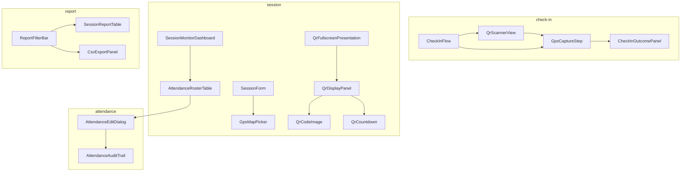

# We Check — Event-Specific Components

Domain components for **We Check** attendance workflows. These compose primitives from [05-common-ui-components.md](./05-common-ui-components.md) and render inside layouts from [06-app-layout-components.md](./06-app-layout-components.md).

**Related documents:** [UI/UX foundation](./01-ui-ux-foundation.md) · [Forms and validation UX](./08-forms-validation-ux.md) · [Page list](./09-page-list.md) · [Functional requirements](../brds/03-functional-requirements.md) · [Business rules](../brds/04-business-rules.md)

---

## 1. Component Location

Domain components live under `apps/web/src/components/domain/`, grouped by bounded context:

| Folder | Responsibility |
| --- | --- |
| `check-in/` | Student QR scan, GPS capture, outcome display |
| `session/` | Session cards, QR display, live monitor, lifecycle actions |
| `attendance/` | Roster tables, manual edit, audit trail |
| `roster/` | Class enrollment lists, CSV import |
| `report/` | Filters, summaries, export controls |
| `admin/` | User management, policy configuration |

Feature routes import from `@/components/domain/*` only — not from sibling feature modules.

---

## 2. Check-In Components (`check-in/`)

### 2.1 QrScannerView

Full-screen student camera view for mobile web QR scan ([FR-07](../brds/03-functional-requirements.md)).

| Prop | Type | Description |
| --- | --- | --- |
| `onScan` | `(token: string) => void` | Called when valid QR payload decoded |
| `onError` | `(code: ScanError) => void` | Camera permission or decode failure |
| `disabled` | boolean | When session inactive or submitting |

**Structure:**

```
┌─────────────────────────────┐
│ Viewfinder (rounded rect)   │
│  ┌─────────────────────┐    │
│  │   camera stream     │    │
│  └─────────────────────┘    │
│  "Đưa mã QR vào khung"      │
├─────────────────────────────┤
│ PermissionGuideModal slot   │
└─────────────────────────────┘
```

**Behavior:**

- Uses `getUserMedia` with `facingMode: "environment"`.
- On permission denied, opens `PermissionGuideModal` with `type="camera"` ([BR-12](../brds/04-business-rules.md)).
- Parses QR payload for session token; ignores malformed codes with toast *Không nhận diện được mã QR*.
- Hides `StudentLayout` bottom nav while active ([06-app-layout-components.md](./06-app-layout-components.md) §5.3).
- `data-testid="qr-scanner-view"`.

**Traceability:** FR-07, AC-07 · NFR-18 (mobile web)

### 2.2 GpsCaptureStep

Intermediate step after successful scan, before API submit ([FR-08](../brds/03-functional-requirements.md)).

| Prop | Type | Description |
| --- | --- | --- |
| `token` | string | Scanned QR token |
| `sessionId` | string | Resolved session |
| `onComplete` | `(outcome: CheckInOutcome) => void` | Final result |
| `onCancel` | `() => void` | Return to scanner |

**UI states:**

| State | Display |
| --- | --- |
| Requesting permission | Spinner + *Đang xác minh vị trí…* |
| Acquiring fix | Progress text with accuracy hint |
| Submitting | Disabled retry; `aria-busy` |
| Permission denied | `PermissionGuideModal` `type="gps"` |
| Success / failure | Delegates to `CheckInOutcomePanel` |

**Behavior:**

- Shows `LocationConsentBanner` on first check-in per browser ([NFR-17](../brds/07-non-functional-risk.md)).
- Retries geolocation up to **3** times within **30 seconds** on transient failure.
- Does not persist raw coordinates client-side after submit.
- On `OutOfRadius`, shows distance hint: *Bạn cách phòng học khoảng {n} m (cho phép {radius} m)*.

**Traceability:** FR-08, FR-10 · BR-02, BR-12 · AC-08, AC-09

### 2.3 CheckInFlow

Orchestrator for `/check-in` route: scanner → GPS → outcome.

| Step | Component |
| --- | --- |
| 1 — Scan | `QrScannerView` |
| 2 — Verify location | `GpsCaptureStep` |
| 3 — Result | `CheckInOutcomePanel` (from shared) |

Handles deep link `/check-in?token={token}` after login redirect ([BR-06](../brds/04-business-rules.md)). Skips scan step when token present in query.

**Traceability:** FR-02, FR-07, FR-08 · AC-02, AC-07

### 2.4 AttendanceHistoryList

Read-only paginated list for student `/history` ([FR-14](../brds/03-functional-requirements.md)).

| Prop | Type | Description |
| --- | --- | --- |
| `records` | `AttendanceHistoryItem[]` | Server-paginated data |
| `loading` | boolean | Shows skeleton rows |
| `onPageChange` | `(page: number) => void` | Pagination handler |

Each row: subject name, session date, `StatusBadge`, check-in time (if `Present`). Empty state: *Chưa có buổi học nào*.

**Traceability:** FR-14 · AC-14

---

## 3. Session Components (`session/`)

### 3.1 SessionCard

Summary card for instructor session list ([FR-04](../brds/03-functional-requirements.md)).

| Prop | Type | Description |
| --- | --- | --- |
| `session` | `SessionSummary` | Title, class, subject, schedule, status |
| `presentCount` | number | Optional live count when `Active` |
| `enrolledCount` | number | Roster size |
| `onClick` | `() => void` | Navigate to detail |

Displays: title, class/subject line, formatted schedule (`vi-VN` locale), `StatusBadge`, optional progress bar (`presentCount / enrolledCount`) when `Active`.

**Traceability:** FR-04, FR-05 · AC-04

### 3.2 SessionForm

Create/edit session metadata in `Draft` ([FR-04](../brds/03-functional-requirements.md)). Form UX: [08-forms-validation-ux.md](./08-forms-validation-ux.md) §3.

Fields: class, subject, title, scheduled start (`datetime-local`), room name, latitude, longitude, GPS radius (default **100 m**).

Embedded `GpsMapPicker` for coordinate selection. Submit disabled until coordinates valid ([BR-07](../brds/04-business-rules.md)).

**Traceability:** FR-04 · BR-07 · AC-04

### 3.3 GpsMapPicker

Interactive map for room coordinate selection.

| Prop | Type | Description |
| --- | --- | --- |
| `latitude` | number \| null | Current pin lat |
| `longitude` | number \| null | Current pin lng |
| `radiusMeters` | number | Circle overlay radius |
| `onChange` | `(lat: number, lng: number) => void` | Pin moved |
| `readOnly` | boolean | When session not `Draft` |

Uses Leaflet or MapLibre with OpenStreetMap tiles. Pin drag updates lat/lng fields. Circle overlay visualizes check-in radius. “Dùng vị trí hiện tại” button uses instructor device GPS for initial pin (optional convenience).

**Traceability:** FR-04 · BR-07

### 3.4 SessionLifecycleActions

Primary actions on session detail header ([FR-05](../brds/03-functional-requirements.md)).

| Session state | Actions |
| --- | --- |
| `Draft` | **Mở buổi học** (primary), **Hủy buổi học** (danger, confirm dialog) |
| `Active` | **Đóng buổi học** (primary, confirm dialog), **Trình chiếu QR** (secondary) |
| `Closed` / `Cancelled` | Read-only; link to reports |

**Mở buổi học** disabled with inline `Alert` when GPS missing: *Vui lòng cấu hình tọa độ phòng học trước khi mở buổi học*.

**Traceability:** FR-05 · BR-01, BR-07 · AC-05

### 3.5 QrDisplayPanel

Instructor tab preview of rotating QR ([FR-06](../brds/03-functional-requirements.md)).

| Prop | Type | Description |
| --- | --- | --- |
| `sessionId` | string | Active session |
| `token` | `QrToken \| null` | Current token from poll |
| `expiresAt` | ISO datetime | Countdown target |
| `onPresentFullscreen` | `() => void` | Launch fullscreen route |

Contains `QrCodeImage`, `QrCountdown`, session metadata strip, and **Trình chiếu QR** button.

Polls `GET /api/sessions/{id}/qr-token` every **25 seconds** (5 s buffer before expiry). Shows `ErrorState` with retry on poll failure without blocking other tabs.

**Traceability:** FR-06 · BR-03 · AC-06 · NFR-20

### 3.6 QrCodeImage

Renders QR from token payload.

| Prop | Type | Description |
| --- | --- | --- |
| `value` | string | Encoded deep link or token |
| `size` | number | Pixel dimension (default 280 preview, 480 fullscreen) |
| `ariaLabel` | string | Default: *Mã QR điểm danh buổi học* |

White quiet zone minimum **4 modules**. High error correction level (H) for projection readability.

### 3.7 QrCountdown

Circular or numeric countdown for token expiry.

| Prop | Type | Description |
| --- | --- | --- |
| `secondsRemaining` | number | 0–30 |
| `variant` | `default` \| `fullscreen` | Size and color tokens |

Color tokens: `--color-qr-accent` when > 10 s; `--color-qr-warning` when ≤ 10 s ([04-design-tokens.md](./04-design-tokens.md)). Announces tick to screen readers every 10 s via `aria-live="polite"`.

### 3.8 QrFullscreenPresentation

Fullscreen QR for classroom projection. Used inside `FullscreenLayout` at `/sessions/:id/qr-present`.

Extends `QrDisplayPanel` with larger QR, session title, room name, `StatusBadge` `Active`, and **Thoát toàn màn hình** ghost button. Invokes Fullscreen API when supported.

**Traceability:** FR-06 · AC-06 · NFR-20

### 3.9 SessionMonitorDashboard

Live attendance dashboard for **Theo dõi** tab ([FR-15](../brds/03-functional-requirements.md)).

| Region | Content |
| --- | --- |
| Stat row | Three `StatCard`: *Đã điểm danh*, *Chưa điểm danh*, *Vắng* |
| Roster grid | Compact `DataTable`: student name, ID, `StatusBadge`, check-in time |
| Alerts | `SpoofSuspected` flags as inline `Alert` rows |

Polls roster every **5 seconds** while session `Active`. Shows poll status bar from [06-app-layout-components.md](./06-app-layout-components.md) §12.

Sort default: unchecked first, then alphabetical. Row tap opens `AttendanceEditDialog` when edit window open ([FR-11](../brds/03-functional-requirements.md)).

**Traceability:** FR-15, FR-11 · AC-15, AC-11

---

## 4. Attendance Components (`attendance/`)

### 4.1 AttendanceRosterTable

Full roster on session **Danh sách** tab and report drill-down ([FR-11](../brds/03-functional-requirements.md), [FR-12](../brds/03-functional-requirements.md)).

| Column | Content |
| --- | --- |
| Mã SV | Student ID |
| Họ tên | Display name |
| Trạng thái | `StatusBadge` |
| Thời gian | Check-in timestamp or em dash |
| Thao tác | Row menu: *Chỉnh sửa* |

Server-side sort and filter by status. Bulk actions deferred to future consideration.

**Traceability:** FR-11, FR-12 · AC-11

### 4.2 AttendanceEditDialog

Manual status correction dialog ([FR-11](../brds/03-functional-requirements.md), [BR-10](../brds/04-business-rules.md)).

| Field | Required | Notes |
| --- | --- | --- |
| Trạng thái mới | Yes | `Select`: Present, Absent, Excused, Rejected |
| Ghi chú | Yes when changing to Excused or Rejected | `Textarea`, min 10 characters |
| Cảnh báo | — | Shows 24-hour edit window countdown when session `Closed` |

On submit: calls API, shows toast, refreshes roster. Disabled when edit window expired for `Instructor` (admin may still edit per BR-10).

**Traceability:** FR-11 · BR-10 · AC-11

### 4.3 AttendanceAuditTrail

Expandable panel on edited rows showing audit log entries: editor, timestamp, from → to status, note.

Read-only. Visible to `Instructor` and `TrainingOfficeAdmin`.

**Traceability:** FR-11 · BR-10

---

## 5. Roster Components (`roster/`)

### 5.1 RosterImportPanel

CSV upload for class enrollment ([FR-03](../brds/03-functional-requirements.md)).

| Step | UI |
| --- | --- |
| 1 — Select file | File input accepting `.csv`; max **5 MB** |
| 2 — Preview | First 10 rows in read-only table |
| 3 — Validate | Row-level errors highlighted |
| 4 — Confirm | Summary: *{n} dòng hợp lệ, {m} dòng lỗi* |
| 5 — Result | Success toast + link to class roster |

Required columns: `student_id`, `full_name`, `class_code`, `subject_code`. Template download link provided.

**Traceability:** FR-03 · AC-03

### 5.2 ClassRosterTable

Admin/instructor view of enrolled students per class.

Columns: student ID, name, email, enrollment status. Instructor view is read-only; admin can remove enrollment with `ConfirmDialog`.

**Traceability:** FR-03 · AC-03

---

## 6. Report Components (`report/`)

### 6.1 ReportFilterBar

Shared filter controls for instructor and admin reports ([FR-12](../brds/03-functional-requirements.md)).

| Control | Type | Notes |
| --- | --- | --- |
| Lớp | `Select` | Scoped to assigned classes (instructor) or all (admin) |
| Môn học | `Select` | Dependent on class selection |
| Từ ngày / Đến ngày | `input type="date"` | Default: current academic period |
| Áp dụng | `Button` primary | Triggers query |
| Xóa bộ lọc | `Button` ghost | Resets to defaults |

Invalid date range shows inline error: *Ngày kết thúc phải sau ngày bắt đầu*.

**Traceability:** FR-12 · AC-12 · BR-08

### 6.2 ReportSummaryCards

Row of `StatCard` for filtered range: total sessions, average attendance rate, absent count, excused count.

**Traceability:** FR-12 · AC-12

### 6.3 SessionReportTable

Aggregated session-level report: date, subject, present/absent/excused counts, link to session detail.

Uses `DataTable` with server pagination.

**Traceability:** FR-12 · AC-12

### 6.4 CsvExportPanel

Admin-only export control ([FR-13](../brds/03-functional-requirements.md), [BR-09](../brds/04-business-rules.md)).

| Element | Specification |
| --- | --- |
| Button | **Xuất CSV** with `Download` icon |
| Confirm | `ConfirmDialog` summarizing filter scope and row estimate |
| Progress | Spinner during generation; toast on completion |
| Audit notice | Footer: *Hành động xuất dữ liệu được ghi nhận trong nhật ký hệ thống* |

Hidden entirely for non-admin roles. Disabled when zero rows match filters.

**Traceability:** FR-13 · AC-13 · BR-09 · NFR-11

---

## 7. Admin Components (`admin/`)

### 7.1 UserForm

Create/edit user accounts ([FR-01](../brds/03-functional-requirements.md)).

Fields: student/staff ID, display name, email, role (`Select`), active toggle (`Switch`). Validation UX: [08-forms-validation-ux.md](./08-forms-validation-ux.md) §4.

**Traceability:** FR-01 · AC-01

### 7.2 UserListTable

Admin user directory with search, role filter, active filter, pagination.

Row actions: edit, deactivate (with confirm). Deactivated users show muted row styling.

**Traceability:** FR-01 · AC-01

### 7.3 AttendancePolicyForm

Configure institution absence threshold ([FR-16](../brds/03-functional-requirements.md)).

| Field | Default | Validation |
| --- | --- | --- |
| Ngưỡng vắng (%) | 20 | 1–100 integer |
| Bật cảnh báo tự động | off (Should) | Toggle |

Save shows success toast. When Should capability not shipped, form displays read-only defaults with note *Tính năng cảnh báo tự động sẽ có trong bản cập nhật tiếp theo* only if FR-16 deferred — otherwise fully interactive.

**Traceability:** FR-16 · BR-05 · AC-16

---

## 8. Shared Domain Widgets

### 8.1 LocationConsentBanner

First-check-in consent for GPS processing ([NFR-17](../brds/07-non-functional-risk.md)).

Dismissible `Alert` with link to privacy summary. Checkbox *Tôi đồng ý cho phép xác minh vị trí trong buổi học* required before first submit. Consent stored in `localStorage` key `wecheck.location.consent.v1`.

### 8.2 SpoofAlertBadge

Inline indicator on monitor rows when check-in flagged `SpoofSuspected` ([FR-10](../brds/03-functional-requirements.md)).

Tooltip: *Vị trí nghi ngờ giả mạo — cần xác minh thủ công*. Icon: `ShieldAlert`.

### 8.3 SessionStatusStrip

Compact header widget: session title, room, schedule, `StatusBadge`. Used in check-in outcome success state so student confirms correct session.

---

## 9. Component Dependency Graph



---

## 10. Traceability Matrix

| Component | FR | BR | AC | NFR |
| --- | --- | --- | --- | --- |
| `QrScannerView`, `CheckInFlow` | FR-07 | BR-03, BR-06 | AC-07 | NFR-18 |
| `GpsCaptureStep` | FR-08, FR-10 | BR-02, BR-12 | AC-08, AC-09 | NFR-17 |
| `CheckInOutcomePanel` (shared) | FR-09 | BR-04, BR-11 | AC-09, AC-10 | — |
| `AttendanceHistoryList` | FR-14 | — | AC-14 | — |
| `SessionForm`, `GpsMapPicker` | FR-04 | BR-07 | AC-04 | — |
| `SessionLifecycleActions` | FR-05 | BR-01 | AC-05 | — |
| `QrDisplayPanel`, `QrFullscreenPresentation` | FR-06 | BR-03 | AC-06 | NFR-20 |
| `SessionMonitorDashboard` | FR-15 | — | AC-15 | — |
| `AttendanceEditDialog` | FR-11 | BR-10 | AC-11 | — |
| `RosterImportPanel` | FR-03 | — | AC-03 | — |
| `ReportFilterBar`, `SessionReportTable` | FR-12 | BR-08 | AC-12 | — |
| `CsvExportPanel` | FR-13 | BR-09 | AC-13 | NFR-11 |
| `UserForm`, `UserListTable` | FR-01 | — | AC-01 | NFR-11 |
| `AttendancePolicyForm` | FR-16 | BR-05 | AC-16 | — |
| `LocationConsentBanner` | FR-08 | — | AC-08 | NFR-17 |

---

## 11. Future Consideration

- `PinFallbackDialog` for battery-dead check-in (deferred per [01-stakeholders-scope.md](../brds/01-stakeholders-scope.md) §2.3).
- `WifiBssIdCapture` component when indoor verification ships.
- `BulkAttendanceEdit` for multi-select roster corrections.
- `LiveActivityFeed` sidebar showing recent check-ins with animation.
- Offline queue indicator on `GpsCaptureStep` when network retry exhausts.
