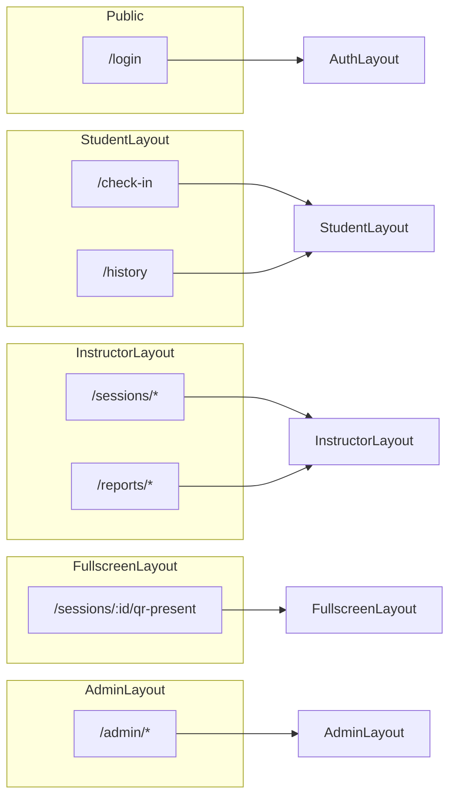

# We Check — Page List

Complete MVP page inventory for **We Check**: routes, layouts, roles, primary components, and requirement traceability. Use this document as the routing and screen-design source of truth.

**Related documents:** [App layout components](./06-app-layout-components.md) · [Event-specific components](./07-event-specific-components.md) · [Forms and validation UX](./08-forms-validation-ux.md) · [Stakeholders and scope](../brds/01-stakeholders-scope.md) · [Acceptance criteria](../brds/08-acceptance-mvp-future.md)

---

## 1. Routing Conventions

| Convention | Rule |
| --- | --- |
| Base path | Single SPA at `/`; no role prefix in URL |
| Auth guard | Protected routes redirect unauthenticated users to `/login?returnUrl=…` ([BR-06](../brds/04-business-rules.md)) |
| Role guard | Wrong role → `ForbiddenPage` (403) or redirect to role home |
| Deep links | QR check-in uses `/check-in?token={token}` |
| Document title | `We Check — {page title}` via route handle |
| Locale | All user-facing copy `vi-VN` |

Default landing after login:

| Role | Route |
| --- | --- |
| `Student` | `/check-in` |
| `Instructor` | `/sessions` |
| `TrainingOfficeAdmin` | `/admin/users` |

---

## 2. Public Pages

### 2.1 Login

| Attribute | Value |
| --- | --- |
| Route | `/login` |
| Layout | `AuthLayout` |
| Role | Public (unauthenticated) |
| Priority | Must |
| Primary components | `LoginForm` |
| Description | Email/username and password authentication. Redirects authenticated users to role home. Preserves `returnUrl` for check-in deep links. |

**Traceability:** FR-02 · BR-06 · AC-02 · NFR-16

### 2.2 Forbidden

| Attribute | Value |
| --- | --- |
| Route | `/forbidden` (internal redirect target) |
| Layout | `RootLayout` (no role nav) |
| Role | Any authenticated |
| Priority | Must |
| Primary components | `ForbiddenPage` |
| Description | Shown when user lacks permission for requested resource ([BR-08](../brds/04-business-rules.md), [BR-09](../brds/04-business-rules.md)). |

**Traceability:** FR-12, FR-13 · BR-08, BR-09 · AC-12, AC-13

### 2.3 Not Found

| Attribute | Value |
| --- | --- |
| Route | `*` (catch-all) |
| Layout | `RootLayout` |
| Role | Any |
| Priority | Must |
| Primary components | `NotFoundPage` |
| Description | Unknown routes; link back to role home. |

---

## 3. Student Pages

Shell: `StudentLayout` · Mobile-first · Bottom nav on `/check-in` and `/history`.

### 3.1 Check-In

| Attribute | Value |
| --- | --- |
| Route | `/check-in`, `/check-in/scan` |
| Layout | `StudentLayout` (bottom nav hidden during scan) |
| Role | `Student` |
| Priority | Must |
| Primary components | `CheckInFlow`, `QrScannerView`, `GpsCaptureStep`, `CheckInOutcomePanel`, `LocationConsentBanner`, `PermissionGuideModal` |
| Description | Primary student flow: scan rotating QR, verify GPS, show outcome. Supports token deep link after login. Retries network up to 3 times. |

**User flow steps:**

1. Land on scanner or consent (first visit).
2. Scan QR → acquire GPS → submit check-in.
3. Display success or actionable rejection (expired QR, out of radius, duplicate, GPS disabled).

**Traceability:** FR-02, FR-07, FR-08, FR-09, FR-10 · BR-02, BR-03, BR-04, BR-06, BR-11, BR-12 · AC-02, AC-07, AC-08, AC-09, AC-10 · NFR-17, NFR-18

### 3.2 Attendance History

| Attribute | Value |
| --- | --- |
| Route | `/history` |
| Layout | `StudentLayout` |
| Role | `Student` |
| Priority | Must |
| Primary components | `AttendanceHistoryList`, `StatusBadge`, `EmptyState` |
| Description | Read-only paginated list of student's own attendance across enrolled subjects. |

**Traceability:** FR-14 · AC-14

---

## 4. Instructor Pages

Shell: `InstructorLayout` · Sidebar: Buổi học, Báo cáo.

### 4.1 Session List

| Attribute | Value |
| --- | --- |
| Route | `/sessions` |
| Layout | `InstructorLayout` |
| Role | `Instructor` |
| Priority | Must |
| Primary components | `PageHeader`, `SessionCard`, `Button` (create), `EmptyState` |
| Description | Lists instructor's sessions grouped by status (Active first, then Draft, Closed). **Tạo buổi học** navigates to create form. |

**Traceability:** FR-04, FR-05 · AC-04, AC-05

### 4.2 Create Session

| Attribute | Value |
| --- | --- |
| Route | `/sessions/new` |
| Layout | `InstructorLayout` |
| Role | `Instructor` |
| Priority | Must |
| Primary components | `SessionForm`, `GpsMapPicker`, `SplitView`, `FormActions` |
| Description | Create session in `Draft` with room GPS. Saves as draft or opens if valid. |

**Traceability:** FR-04 · BR-07 · AC-04

### 4.3 Session Detail

| Attribute | Value |
| --- | --- |
| Route | `/sessions/:sessionId` |
| Layout | `InstructorLayout` + nested tab layout |
| Role | `Instructor` |
| Priority | Must |
| Primary components | `PageHeader`, `SessionLifecycleActions`, `StatusBadge`, `Tabs` |
| Description | Session hub with tabs: QR, Theo dõi, Danh sách, Cài đặt. Default tab: **Theo dõi** when `Active`; **Cài đặt** when `Draft`. |

**Traceability:** FR-05, FR-06 · AC-05, AC-06

#### 4.3.1 Tab — QR

| Route | `/sessions/:sessionId` (tab: QR) |
| Components | `QrDisplayPanel`, `QrCodeImage`, `QrCountdown` |
| Description | Preview rotating QR; **Trình chiếu QR** opens fullscreen. |

**Traceability:** FR-06 · AC-06 · NFR-20

#### 4.3.2 Tab — Theo dõi (Monitor)

| Route | `/sessions/:sessionId` (tab: Theo dõi) |
| Components | `SessionMonitorDashboard`, `StatCard`, `SpoofAlertBadge` |
| Description | Live attendance counts and roster; 5-second poll. Should capability — ship if schedule allows ([01-stakeholders-scope.md](../brds/01-stakeholders-scope.md) §2.1.2). |

**Traceability:** FR-15 · AC-15

#### 4.3.3 Tab — Danh sách (Roster)

| Route | `/sessions/:sessionId` (tab: Danh sách) |
| Components | `AttendanceRosterTable`, `AttendanceEditDialog`, `AttendanceAuditTrail` |
| Description | Full roster with manual edit actions during and up to 24 h after close. |

**Traceability:** FR-11 · BR-10 · AC-11

#### 4.3.4 Tab — Cài đặt (Settings)

| Route | `/sessions/:sessionId/settings` |
| Components | `SessionForm` (read-only when not Draft), `DescriptionList` |
| Description | Edit session metadata in `Draft` only. |

**Traceability:** FR-04 · AC-04

### 4.4 QR Fullscreen Presentation

| Attribute | Value |
| --- | --- |
| Route | `/sessions/:sessionId/qr-present` |
| Layout | `FullscreenLayout` |
| Role | `Instructor` |
| Priority | Must |
| Primary components | `QrFullscreenPresentation`, `QrCodeImage`, `QrCountdown` |
| Description | Projection mode for classroom. Black background, large QR, countdown, minimal chrome. |

**Traceability:** FR-06 · AC-06 · NFR-20

### 4.5 Instructor Reports

| Attribute | Value |
| --- | --- |
| Route | `/reports`, `/reports/sessions`, `/reports/students` |
| Layout | `InstructorLayout` |
| Role | `Instructor` |
| Priority | Must |
| Primary components | `ReportFilterBar`, `ReportSummaryCards`, `SessionReportTable`, `AttendanceRosterTable` |
| Description | Attendance reports scoped to instructor's assigned classes. Sub-routes for session-level and student-level aggregation. |

**Traceability:** FR-12 · BR-08 · AC-12

---

## 5. Training Office Admin Pages

Shell: `AdminLayout` · Sidebar: Người dùng, Danh sách lớp, Báo cáo, Xuất CSV, Chính sách.

### 5.1 User List

| Attribute | Value |
| --- | --- |
| Route | `/admin/users` |
| Layout | `AdminLayout` |
| Role | `TrainingOfficeAdmin` |
| Priority | Must |
| Primary components | `PageHeader`, `UserListTable`, `TableToolbar`, `Button` |
| Description | Searchable directory of all users. **Thêm người dùng** → create form. |

**Traceability:** FR-01 · AC-01 · NFR-11

### 5.2 Create / Edit User

| Attribute | Value |
| --- | --- |
| Route | `/admin/users/new`, `/admin/users/:userId` |
| Layout | `AdminLayout` |
| Role | `TrainingOfficeAdmin` |
| Priority | Must |
| Primary components | `UserForm`, `FormActions`, `ConfirmDialog` |
| Description | Provision or update student, instructor, or admin accounts. |

**Traceability:** FR-01 · AC-01

### 5.3 Class Rosters

| Attribute | Value |
| --- | --- |
| Route | `/admin/rosters`, `/admin/rosters/:classCode` |
| Layout | `AdminLayout` |
| Role | `TrainingOfficeAdmin` |
| Priority | Must |
| Primary components | `ClassRosterTable`, `TableToolbar`, `Button` (import) |
| Description | View enrollments per class. Link to import flow. |

**Traceability:** FR-03 · AC-03

### 5.4 Roster Import

| Attribute | Value |
| --- | --- |
| Route | `/admin/rosters/import` |
| Layout | `AdminLayout` |
| Role | `TrainingOfficeAdmin` |
| Priority | Must |
| Primary components | `RosterImportPanel`, `RosterImportForm`, `DataTable` (preview) |
| Description | CSV upload with validation preview and import summary. |

**Traceability:** FR-03 · AC-03

### 5.5 Admin Reports

| Attribute | Value |
| --- | --- |
| Route | `/admin/reports` |
| Layout | `AdminLayout` |
| Role | `TrainingOfficeAdmin` |
| Priority | Must |
| Primary components | `ReportFilterBar`, `ReportSummaryCards`, `SessionReportTable` |
| Description | Institution-wide attendance reports with same filter pattern as instructor view but unrestricted class scope. |

**Traceability:** FR-12 · AC-12

### 5.6 CSV Export

| Attribute | Value |
| --- | --- |
| Route | `/admin/export` |
| Layout | `AdminLayout` |
| Role | `TrainingOfficeAdmin` |
| Priority | Must |
| Primary components | `ReportFilterBar`, `CsvExportPanel`, `ConfirmDialog` |
| Description | Dedicated export page: configure filters, confirm, download CSV. Compliance footer on destructive/export actions. |

**Traceability:** FR-13 · BR-09 · AC-13 · NFR-11

### 5.7 Attendance Policy

| Attribute | Value |
| --- | --- |
| Route | `/admin/policy` |
| Layout | `AdminLayout` |
| Role | `TrainingOfficeAdmin` |
| Priority | Should |
| Primary components | `AttendancePolicyForm`, `FormActions` |
| Description | Configure absence threshold (default 20%) and auto-warning toggle. Should capability per [FR-16](../brds/03-functional-requirements.md). |

**Traceability:** FR-16 · BR-05 · AC-16

---

## 6. Page Matrix Summary

| # | Page | Route | Role | Layout | Priority |
| --- | --- | --- | --- | --- | --- |
| 1 | Login | `/login` | Public | `AuthLayout` | Must |
| 2 | Check-In | `/check-in` | Student | `StudentLayout` | Must |
| 3 | Attendance History | `/history` | Student | `StudentLayout` | Must |
| 4 | Session List | `/sessions` | Instructor | `InstructorLayout` | Must |
| 5 | Create Session | `/sessions/new` | Instructor | `InstructorLayout` | Must |
| 6 | Session Detail | `/sessions/:id` | Instructor | `InstructorLayout` | Must |
| 7 | QR Fullscreen | `/sessions/:id/qr-present` | Instructor | `FullscreenLayout` | Must |
| 8 | Instructor Reports | `/reports` | Instructor | `InstructorLayout` | Must |
| 9 | User List | `/admin/users` | Admin | `AdminLayout` | Must |
| 10 | Create/Edit User | `/admin/users/new`, `/admin/users/:id` | Admin | `AdminLayout` | Must |
| 11 | Class Rosters | `/admin/rosters` | Admin | `AdminLayout` | Must |
| 12 | Roster Import | `/admin/rosters/import` | Admin | `AdminLayout` | Must |
| 13 | Admin Reports | `/admin/reports` | Admin | `AdminLayout` | Must |
| 14 | CSV Export | `/admin/export` | Admin | `AdminLayout` | Must |
| 15 | Attendance Policy | `/admin/policy` | Admin | `AdminLayout` | Should |
| 16 | Forbidden | `/forbidden` | Any | `RootLayout` | Must |
| 17 | Not Found | `*` | Any | `RootLayout` | Must |

**Total MVP pages:** 17 (15 Must, 2 utility, 1 Should policy page).

---

## 7. Route-to-Layout Map

Consolidated from [06-app-layout-components.md](./06-app-layout-components.md) §10 with page-level detail.

---

## 8. Navigation Entry Points

| Entry | Target page | Trigger |
| --- | --- | --- |
| QR deep link | `/check-in?token=…` | Student scans classroom QR |
| Post-login redirect | Role home or `returnUrl` | Successful authentication |
| Sidebar / bottom nav | Role-scoped pages | In-app navigation |
| Session card click | `/sessions/:id` | Instructor session list |
| **Trình chiếu QR** | `/sessions/:id/qr-present` | Session detail QR tab |
| **Tạo buổi học** | `/sessions/new` | Session list header |
| **Thêm người dùng** | `/admin/users/new` | User list header |
| **Nhập CSV** | `/admin/rosters/import` | Rosters page |
| Report drill-down | Session/student sub-routes | Table row link |

---

## 9. Page State Requirements

Each page must handle states defined in [12-ui-states.md](./12-ui-states.md) (downstream). Minimum per page:

| State | Pages |
| --- | --- |
| Loading | All data-driven pages |
| Empty | Lists (sessions, history, rosters, reports) |
| Error | All with API fetch |
| Success / confirmation | Check-in, forms, export |
| Permission denied | Reports, admin routes, export |

Session detail adds tab-specific loading for QR poll and monitor poll independently.

---

## 10. Traceability to Acceptance Criteria

| Page group | AC |
| --- | --- |
| Login | AC-02 |
| Check-In | AC-02, AC-07, AC-08, AC-09, AC-10 |
| History | AC-14 |
| Session create/detail/QR | AC-04, AC-05, AC-06 |
| Session monitor | AC-15 |
| Session roster edit | AC-11 |
| Instructor reports | AC-12 |
| Admin users | AC-01 |
| Admin rosters/import | AC-03 |
| Admin reports/export | AC-12, AC-13 |
| Admin policy | AC-16 |

---

## 11. Out of Scope Pages (MVP)

The following pages are **not** built in MVP per [01-stakeholders-scope.md](../brds/01-stakeholders-scope.md) §2.2:

| Page | Rationale |
| --- | --- |
| IT Operations dashboard | No in-app business UI for `ITOperations` in MVP |
| Native app screens | Mobile web only |
| SSO provider callback UI | Deferred until IT confirms identity provider |
| Student profile / settings | Not required for check-in MVP |
| Instructor multi-session dashboard | Single-session focus sufficient for pilot |

---

## 12. Future Consideration

- `/check-in/manual` PIN fallback page for dead-battery scenarios.
- `/admin/audit-log` institution-wide audit viewer.
- `/sessions/:id/warnings` absence threshold notification center.
- `/onboarding/permissions` dedicated first-run tutorial for students.
- Print-friendly report view at `/reports/print`.
