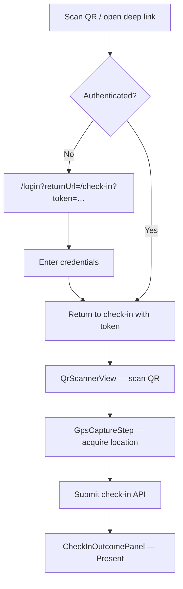
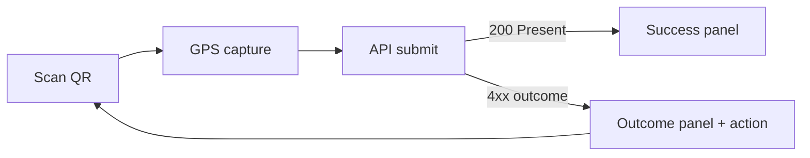
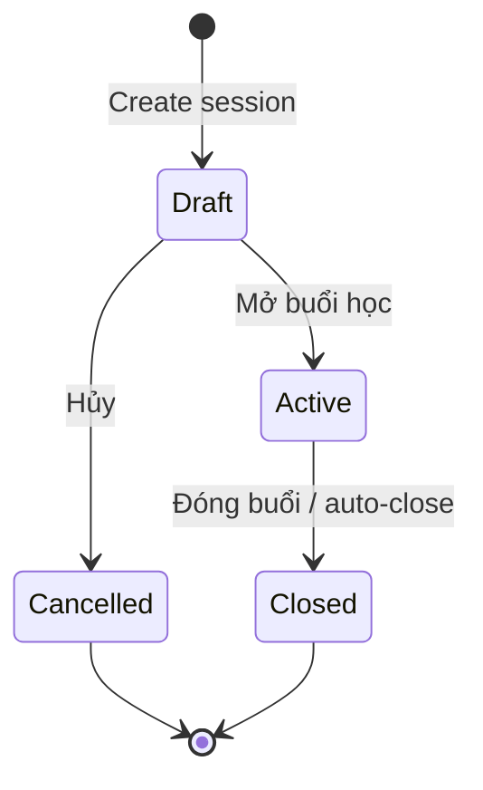
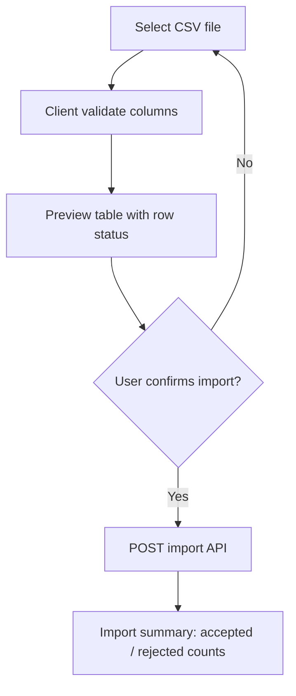

# We Check — User Flows

End-to-end user flows for **We Check** MVP: digital attendance and session check-in for educational workshops and classes. Each flow maps to pages in [09-page-list.md](./09-page-list.md) and acceptance criteria in [08-acceptance-mvp-future.md](../brds/08-acceptance-mvp-future.md).

**Related documents:** [Wireframes](./11-wireframes.md) · [UI states](./12-ui-states.md) · [Accessibility basics](./13-accessibility-basics.md) · [Listing UX](./14-listing-pages-search-filter-sort.md) · [Business workflow](../brds/02-business-workflow.md) · [Event-specific components](./07-event-specific-components.md)

---

## 1. Flow Conventions

| Convention | Rule |
| --- | --- |
| Actor labels | `Student`, `Instructor`, `TrainingOfficeAdmin` per [product meta](../product-meta.json) |
| Locale | All user-facing copy `vi-VN` |
| Auth gate | Unauthenticated access redirects to `/login?returnUrl=…` ([BR-06](../brds/04-business-rules.md), [AC-02](./../brds/08-acceptance-mvp-future.md)) |
| Success criteria | Flow completes only when API confirms server state — no optimistic “checked in” |
| Error recovery | Every rejection path offers a next action (retry, help link, or contact instructor) |
| Timing constants | QR validity **30 s**; attendance window **10 min** after scheduled start; GPS radius default **100 m** |

---

## 2. Flow — Student Login and Check-In (Happy Path)

**Actors:** `Student`  
**Entry:** Scans classroom QR or opens `/check-in`  
**Traces:** [FR-02](../brds/03-functional-requirements.md), [FR-07](../brds/03-functional-requirements.md) · [AC-02](../brds/08-acceptance-mvp-future.md), [AC-07](../brds/08-acceptance-mvp-future.md)

| Step | Screen | Action | System response |
| --- | --- | --- | --- |
| 1 | Deep link or `/check-in` | Student opens app | If no session, redirect to login preserving `returnUrl` ([AC-02a](../brds/08-acceptance-mvp-future.md)) |
| 2 | `/login` | Enter email and password | On success, redirect to check-in with token ([AC-02b](../brds/08-acceptance-mvp-future.md)) |
| 3 | `/check-in/scan` | Point camera at projected QR | Decode token; advance to GPS step |
| 4 | GPS step | Grant location permission if prompted | Acquire coordinates within **15 s** timeout |
| 5 | GPS step | Auto-submit | API validates enrollment, token, radius, duplicate rules |
| 6 | Outcome panel | View confirmation | Show *Điểm danh thành công* with session name and timestamp ([AC-07a](../brds/08-acceptance-mvp-future.md)) |

**Exit:** Student returns to scanner via **Quét mã khác** or navigates to `/history` via bottom nav.

---

## 3. Flow — Student Check-In (Rejection Paths)

**Traces:** [FR-08](../brds/03-functional-requirements.md), [FR-09](../brds/03-functional-requirements.md), [FR-10](../brds/03-functional-requirements.md) · [AC-06](../brds/08-acceptance-mvp-future.md), [AC-08](../brds/08-acceptance-mvp-future.md), [AC-09](../brds/08-acceptance-mvp-future.md), [AC-10](../brds/08-acceptance-mvp-future.md)

| Outcome | Trigger | UI message (vi-VN) | Recovery action |
| --- | --- | --- | --- |
| `ExpiredQr` | Token older than **30 s** ([BR-03](../brds/04-business-rules.md)) | *Mã QR đã hết hạn, vui lòng quét mã mới* | **Quét lại** returns to scanner ([AC-06b](../brds/08-acceptance-mvp-future.md)) |
| `OutOfRadius` | GPS outside session radius ([BR-02](../brds/04-business-rules.md)) | *Bạn đang ngoài phạm vi phòng học* + distance hint | Move closer; retry GPS |
| `GpsDisabled` | Permission denied or timeout ([BR-12](../brds/04-business-rules.md)) | *Vui lòng bật GPS và cấp quyền định vị để điểm danh* | Open `PermissionGuideModal`; link to device settings ([AC-08c](../brds/08-acceptance-mvp-future.md)) |
| `DuplicateCheckIn` | Already `Present` ([BR-04](../brds/04-business-rules.md)) | *Bạn đã điểm danh buổi học này rồi* | Show prior check-in time; link to `/history` ([AC-09a](../brds/08-acceptance-mvp-future.md)) |
| `SpoofSuspected` | Mock location or abnormal accuracy ([FR-10](../brds/03-functional-requirements.md)) | *Không thể xác minh vị trí. Vui lòng liên hệ giảng viên.* | Instruct student to see instructor for manual mark ([AC-10a](../brds/08-acceptance-mvp-future.md)) |
| `SessionNotActive` | Session `Closed` or not yet `Active` | *Buổi học chưa mở hoặc đã kết thúc* | No retry; contact instructor |
| `NotEnrolled` | Student not on roster | *Bạn không thuộc danh sách lớp này* | Contact training office ([AC-07b](../brds/08-acceptance-mvp-future.md)) |
| Network error | API unreachable after **3** retries | *Không kết nối được. Thử lại.* | **Thử lại** with exponential backoff |

---

## 4. Flow — Student Attendance History

**Actors:** `Student`  
**Route:** `/history`  
**Traces:** [FR-14](../brds/03-functional-requirements.md) · [AC-14](../brds/08-acceptance-mvp-future.md)

| Step | Action | Result |
| --- | --- | --- |
| 1 | Open **Lịch sử** from bottom nav | Load paginated list (page size **20**) |
| 2 | Scroll / tap **Tải thêm** | Append next page |
| 3 | Tap session row | Expand inline detail: subject, date, status badge, check-in time if `Present` |

**Scope:** Only the authenticated student's records ([AC-14a](../brds/08-acceptance-mvp-future.md)). Empty state when no enrollments: *Chưa có buổi học nào.*

---

## 5. Flow — Instructor Session Lifecycle

**Actors:** `Instructor`  
**Routes:** `/sessions`, `/sessions/new`, `/sessions/:sessionId`  
**Traces:** [FR-04](../brds/03-functional-requirements.md), [FR-05](../brds/03-functional-requirements.md) · [AC-04](../brds/08-acceptance-mvp-future.md), [AC-05](../brds/08-acceptance-mvp-future.md)

### 5.1 Create and open session

| Step | Screen | Action | Validation |
| --- | --- | --- | --- |
| 1 | `/sessions` | Tap **Tạo buổi học** | — |
| 2 | `/sessions/new` | Fill class, subject, schedule, room, GPS via `GpsMapPicker` | All required fields; valid coordinates ([AC-04a](../brds/08-acceptance-mvp-future.md)) |
| 3 | Form actions | **Lưu nháp** | Session saved as `Draft` |
| 4 | `/sessions/:id` (Cài đặt tab) | **Mở buổi học** | Blocked if GPS missing ([AC-04b](../brds/08-acceptance-mvp-future.md), [BR-07](../brds/04-business-rules.md)) |
| 5 | Session detail | Confirm open dialog | Session → `Active`; QR issuance starts ([AC-05a](../brds/08-acceptance-mvp-future.md)) |

### 5.2 Run live session

| Step | Tab | Action | Result |
| --- | --- | --- | --- |
| 1 | QR | View rotating QR or **Trình chiếu QR** | Fullscreen at `/sessions/:id/qr-present` ([AC-06a](../brds/08-acceptance-mvp-future.md)) |
| 2 | Theo dõi | Monitor live counts | Poll every **5 s** when Should-enabled ([AC-15](../brds/08-acceptance-mvp-future.md)) |
| 3 | Danh sách | Review roster; manual edit if needed | See §6 |
| 4 | Header | **Đóng buổi học** or wait for auto-close | `Closed` after **10 min** window ([AC-05c](../brds/08-acceptance-mvp-future.md)) |

### 5.3 Cancel draft

From `Draft` session: **Hủy buổi học** → confirm → `Cancelled` terminal state ([AC-04c](../brds/08-acceptance-mvp-future.md)).

---

## 6. Flow — Instructor Manual Attendance Edit

**Actors:** `Instructor`  
**Route:** `/sessions/:sessionId` (tab: Danh sách)  
**Traces:** [FR-11](../brds/03-functional-requirements.md) · [BR-10](../brds/04-business-rules.md) · [AC-11](../brds/08-acceptance-mvp-future.md)

| Step | Action | Rule |
| --- | --- | --- |
| 1 | Tap student row → **Chỉnh sửa** | Available when session `Active`, `Closed` within **24 h** of `closedAt` |
| 2 | Select new status (`Present`, `Absent`, `Excused`) | Optional note textarea |
| 3 | **Lưu** | API writes audit record ([AC-11a](../brds/08-acceptance-mvp-future.md)) |
| — | Edit after **24 h** | Blocked for instructor; message *Chỉ phòng đào tạo có thể chỉnh sửa sau 24 giờ* ([AC-11b](../brds/08-acceptance-mvp-future.md)) |

**Spoof override:** When student flagged `SpoofSuspected`, instructor sets `Present` with note — satisfies [AC-10b](../brds/08-acceptance-mvp-future.md).

---

## 7. Flow — Instructor Reports

**Actors:** `Instructor`  
**Routes:** `/reports`, `/reports/sessions`, `/reports/students`  
**Traces:** [FR-12](../brds/03-functional-requirements.md) · [BR-08](../brds/04-business-rules.md) · [AC-12](../brds/08-acceptance-mvp-future.md)

| Step | Action | Result |
| --- | --- | --- |
| 1 | Open **Báo cáo** sidebar | Show `ReportFilterBar` scoped to assigned classes |
| 2 | Select class, subject, date range | Apply filters; load summary cards + table |
| 3 | Tap session row | Drill to session-level roster |
| 4 | Unassigned class via URL tamper | `ForbiddenPage` ([AC-12b](../brds/08-acceptance-mvp-future.md)) |

---

## 8. Flow — Admin User Provisioning

**Actors:** `TrainingOfficeAdmin`  
**Routes:** `/admin/users`, `/admin/users/new`, `/admin/users/:userId`  
**Traces:** [FR-01](../brds/03-functional-requirements.md) · [AC-01](../brds/08-acceptance-mvp-future.md)

| Step | Action | Result |
| --- | --- | --- |
| 1 | `/admin/users` → **Thêm người dùng** | Open create form |
| 2 | Enter student ID, name, email, role | Async uniqueness check on student ID |
| 3 | **Tạo tài khoản** | Account `active=true` ([AC-01a](../brds/08-acceptance-mvp-future.md)) |
| — | Duplicate student ID | Field error; no duplicate record ([AC-01b](../brds/08-acceptance-mvp-future.md)) |
| 4 | Edit user → toggle **Ngừng hoạt động** | `active=false`; login blocked ([AC-01c](../brds/08-acceptance-mvp-future.md)) |

---

## 9. Flow — Admin Roster Import

**Actors:** `TrainingOfficeAdmin`  
**Routes:** `/admin/rosters`, `/admin/rosters/import`  
**Traces:** [FR-03](../brds/03-functional-requirements.md) · [AC-03](../brds/08-acceptance-mvp-future.md)

| Step | Action | Result |
| --- | --- | --- |
| 1 | **Nhập CSV** from rosters page | Upload panel |
| 2 | Select file | Preview valid/invalid rows |
| 3 | **Xác nhận nhập** | Partial success allowed; duplicates rejected per row ([AC-03b](../brds/08-acceptance-mvp-future.md)) |
| 4 | Summary screen | Show counts ([AC-03a](../brds/08-acceptance-mvp-future.md)) |

---

## 10. Flow — Admin Reports and CSV Export

**Actors:** `TrainingOfficeAdmin`  
**Routes:** `/admin/reports`, `/admin/export`  
**Traces:** [FR-12](../brds/03-functional-requirements.md), [FR-13](../brds/03-functional-requirements.md) · [BR-09](../brds/04-business-rules.md) · [AC-12](../brds/08-acceptance-mvp-future.md), [AC-13](../brds/08-acceptance-mvp-future.md)

| Step | Route | Action | Result |
| --- | --- | --- | --- |
| 1 | `/admin/reports` | Apply institution-wide filters | All cohorts within filter ([AC-12c](../brds/08-acceptance-mvp-future.md)) |
| 2 | `/admin/export` | Configure filters → **Xuất CSV** | Confirm dialog with compliance footer |
| 3 | Confirm | Download CSV with required columns ([AC-13a](../brds/08-acceptance-mvp-future.md)) |
| — | Instructor attempts export | Denied: *Chỉ phòng đào tạo mới có quyền xuất dữ liệu* ([AC-13b](../brds/08-acceptance-mvp-future.md)) |

---

## 11. Flow — Absence Threshold Warning (Should)

**Actors:** `Student`, `Instructor`  
**Traces:** [FR-16](../brds/03-functional-requirements.md) · [BR-05](../brds/04-business-rules.md) · [AC-16](../brds/08-acceptance-mvp-future.md)

| Step | Trigger | Notification |
| --- | --- | --- |
| 1 | Session closes; student unexcused absence rate > **20%** in subject | In-app toast/banner to student and instructor |
| 2 | Student views `/history` | Optional persistent badge on affected subject |

`Excused` absences excluded from numerator ([AC-16b](../brds/08-acceptance-mvp-future.md)). Policy configured at `/admin/policy` when Should capability ships.

---

## 12. Cross-Flow Dependencies

| Dependency | Flows affected |
| --- | --- |
| Roster must exist before check-in | Admin import (§9) → Student check-in (§2) |
| Session must be `Active` with valid GPS | Instructor lifecycle (§5) → QR display → Student scan |
| Auth session **8 h** idle timeout | All authenticated flows ([AC-02c](../brds/08-acceptance-mvp-future.md)) |
| Instructor assignment | Reports (§7), roster tab access ([AC-03c](../brds/08-acceptance-mvp-future.md)) |

---

## 13. Future Consideration

- Dedicated `/onboarding/permissions` first-run tutorial for camera/GPS ([08-acceptance-mvp-future.md](../brds/08-acceptance-mvp-future.md) §8).
- PIN fallback check-in flow when device battery dead.
- Push notifications for absence warnings (MVP uses in-app only).
- Multi-session instructor dashboard for concurrent workshops.
