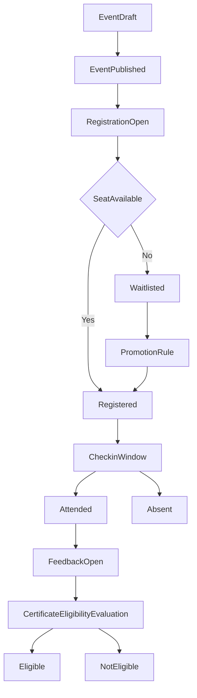

# We Event BRD - Business Workflow

## 1. End-to-End Workflow

## 2. Workflow by Stage

### Stage 1 - Event Setup
1. Organizer Admin creates an event in draft status.
2. Configure business parameters:
   - Event capacity.
   - Enable/disable waitlist.
   - Registration window.
   - Check-in window.
   - Feedback/certificate requirements.
3. Publish the event so participants can view it.

### Stage 2 - Registration Management
1. Participant submits a registration request.
2. System validates:
   - User validity.
   - Registration-open status.
   - Duplicate registration rules.
   - Remaining capacity.
3. If seats are available: assign `Registered`.
4. If full and waitlist is enabled: assign `Waitlisted`.
5. If invalid: reject based on business rules.

### Stage 3 - Pre-Event and Check-in
1. At event time, the system opens check-in according to configuration.
2. Organizer Staff or participant performs check-in.
3. System records check-in timestamp and updates attendance status.

### Stage 4 - Post-Event Feedback
1. After event completion, open feedback window.
2. Participant submits feedback.
3. System records feedback for event quality evaluation.

### Stage 5 - Certificate Eligibility
1. System runs certificate eligibility evaluation based on configured rules.
2. Conditions may include:
   - Valid attendance status.
   - Check-in within valid window.
   - Feedback submitted (if mandatory).
3. Export `Eligible` and `NotEligible` lists for organizers.

## 3. Workflow Exceptions
- Participant cancellation:
  - If within allowed deadline, system frees one seat and may promote waitlist.
- Organizer changes capacity:
  - System rebalances seat/waitlist allocation by priority order.
- Out-of-window check-in:
  - System marks it invalid or requires manual approval (rule-dependent).
