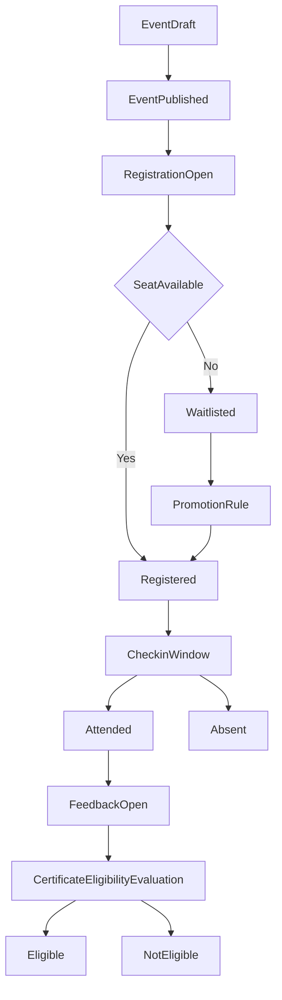

# We Event BRD - Business Workflow

## 1. End-to-End Workflow

## 2. Workflow by Stage

### Stage 1 - Event Setup
1. Organizer Admin creates an event in draft status.
2. Configure business parameters:
   - Event capacity.
   - Enable/disable waitlist.
   - Registration window.
   - Check-in window.
   - Feedback/certificate requirements.
3. Publish the event so participants can view it.

### Stage 2 - Registration Management
1. Participant submits a registration request.
2. System validates:
   - User validity.
   - Registration-open status.
   - Duplicate registration rules.
   - Remaining capacity.
3. If seats are available: assign `Registered`.
4. If full and waitlist is enabled: assign `Waitlisted`.
5. If invalid: reject based on business rules.

### Stage 2b - Waitlist Queue and Promotion
1. When capacity is full and waitlist is enabled, system assigns `Waitlisted` and creates `WaitlistEntry` with the next monotonic position (BR-04a).
2. Participant sees queue position on event detail and My Registrations (FR-10a).
3. When a seat holder (`Registered`/`CheckedIn`) cancels within policy, system frees one seat and promotes the lowest-position active waitlisted registration in the same transaction (BR-08b, FR-12).
4. When a waitlisted participant cancels, system expires the waitlist entry only — no seat release, no promotion (BR-08a, FR-11a).
5. When registration window closes, remaining `Waitlisted` registrations transition to `Expired` and active waitlist entries are expired.
6. Organizer monitors FIFO queue on the dedicated waitlist operations page; dashboard KPI links to drill-down (FR-30a).

### Stage 3 - Pre-Event and Check-in
1. At event time, the system opens check-in according to configuration.
2. Organizer Staff or participant performs check-in.
3. System records check-in timestamp and updates attendance status.

### Stage 4 - Post-Event Feedback
1. After event transitions to `Completed`, the feedback window opens per `feedbackOpenAt`/`feedbackCloseAt`.
2. System gates submission: only `Attended` registrations; participant must submit for own registration only.
3. Participant submits feedback with non-empty answers; optional in-window updates per event policy (BR-16).
4. System records one official feedback per registration and tracks mandatory-feedback completion for organizers.
5. Rejections use deterministic codes (`FEEDBACK_NOT_ALLOWED`, `FEEDBACK_DUPLICATE`) with immediate user feedback.

### Stage 5 - Certificate Eligibility
1. After attendance is finalized (`Attended`/`Absent`), eligibility evaluation becomes available.
2. System runs deterministic evaluation (FR-20):
   - Step 1: attendance baseline (`Attended` required) → else `NotEligible` / `NOT_ELIGIBLE_ATTENDANCE`
   - Step 2: mandatory feedback check when configured → else `NotEligible` / `NOT_ELIGIBLE_FEEDBACK`
   - Step 3: persist `Eligible` or `NotEligible` with `reasonCode` and `reasonText`
3. Participant views own eligibility result and reason (FR-20a); result re-evaluates when inputs change (e.g. late feedback).
4. Organizer Admin and scoped Staff view paginated `Eligible` / `NotEligible` / `Revoked` lists with reasons; Admin may revoke `Eligible` with audit (FR-37).
5. Organizer exports or reports using operational data export (FR-24).

## 3. Workflow Exceptions
- Participant cancellation:
  - Registered participant: if within allowed deadline, system frees one seat and promotes top waitlist (BR-08b).
  - Waitlisted participant: removes queue entry only; does not promote others (BR-08a).
- Organizer changes capacity:
  - System rebalances seat/waitlist allocation by priority order.
- Out-of-window check-in:
  - System marks it invalid or requires manual approval (rule-dependent).
