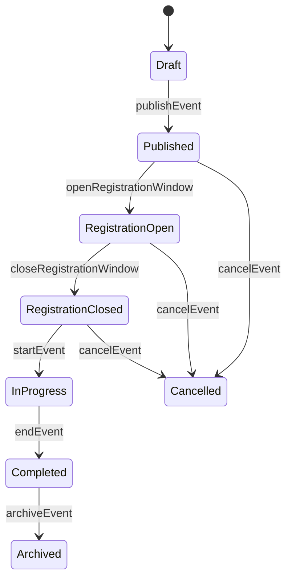
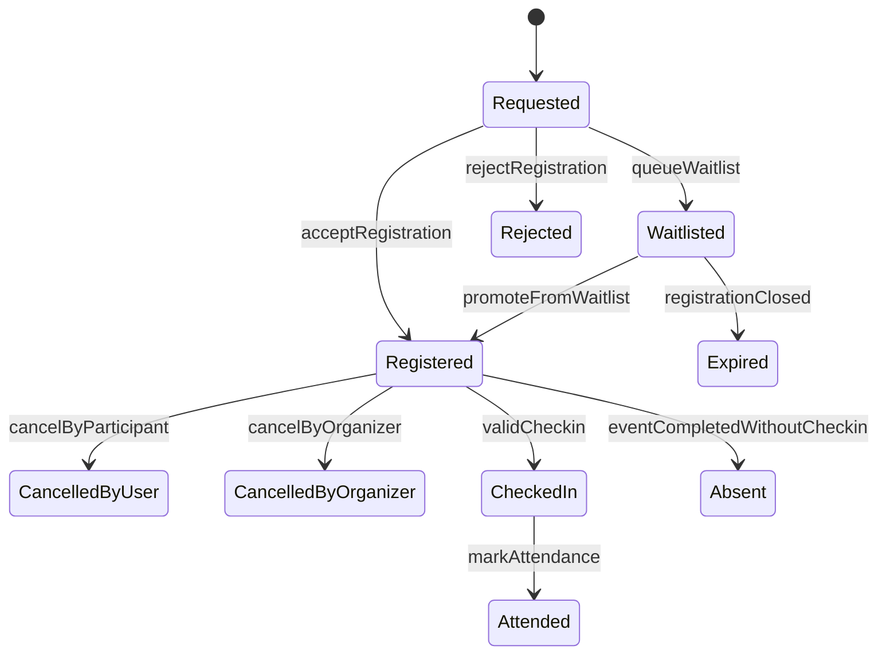
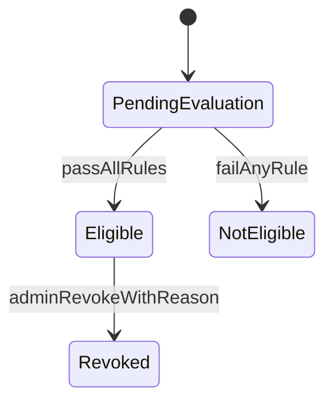

# We Event BRD - State Machine

## 1. Event State Machine

### 1.1 Event Transition Rules
| From | To | Trigger | Guard Condition |
|---|---|---|---|
| Draft | Published | `publishEvent` | Minimum required event data is complete |
| Published | RegistrationOpen | `openRegistrationWindow` | Reached registration open time or opened manually |
| RegistrationOpen | RegistrationClosed | `closeRegistrationWindow` | Deadline reached or closed manually |
| RegistrationClosed | InProgress | `startEvent` | Reached event start time |
| InProgress | Completed | `endEvent` | Event has ended |
| Completed | Archived | `archiveEvent` | Post-event reporting completed |
| Published/Open/Closed | Cancelled | `cancelEvent` | Organizer confirms cancellation |

## 2. Registration State Machine

### 2.1 Registration Transition Rules
| From | To | Trigger | Guard Condition |
|---|---|---|---|
| Requested | Registered | `acceptRegistration` | Seat available and BR-01/02 satisfied |
| Requested | Waitlisted | `queueWaitlist` | Full and waitlist enabled |
| Requested | Rejected | `rejectRegistration` | Rule violation or waitlist disabled |
| Waitlisted | Registered | `promoteFromWaitlist` | New seat available, per BR-06 |
| Registered | CancelledByUser | `cancelByParticipant` | Within cancellation policy BR-07/09 |
| Registered | CheckedIn | `validCheckin` | Within check-in window BR-10 |
| CheckedIn | Attended | `markAttendance` | Event completion |
| Registered | Absent | `eventCompletedWithoutCheckin` | No valid check-in |
| Waitlisted | Expired | `registrationClosed` | Registration window closed |

## 3. Certificate Eligibility State

Notes:
- `Eligible`/`NotEligible` is determined by BR-17 to BR-19.
- `Revoked` is a special state that requires Organizer Admin permission and reason per BR-20.
