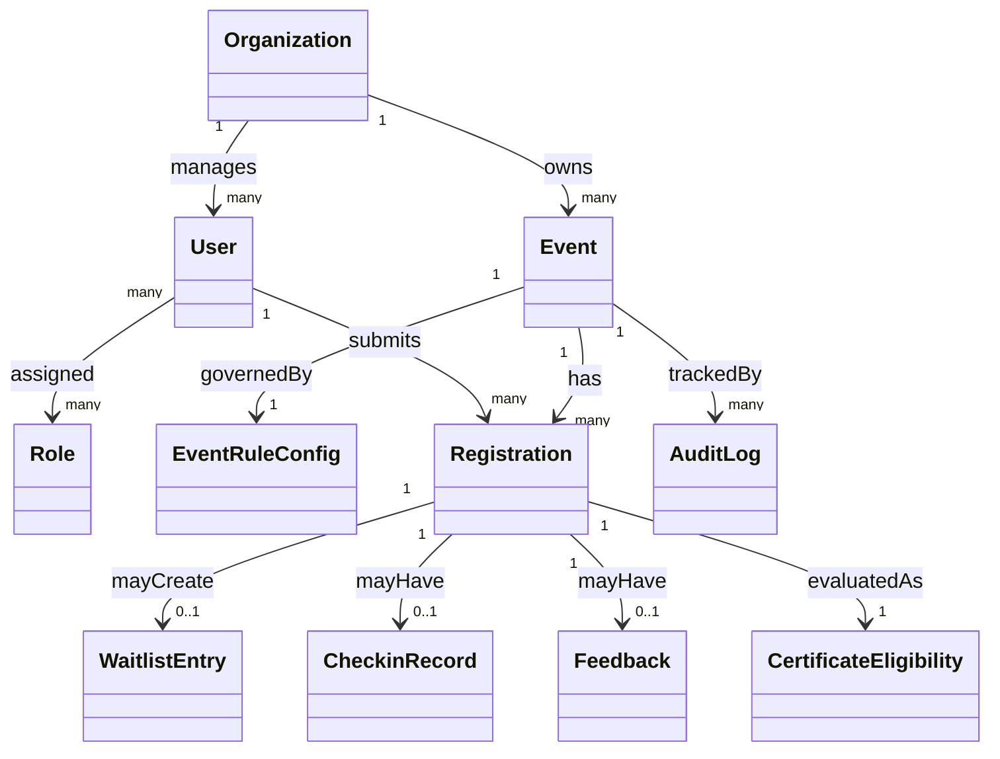

# We Event BRD - Domain Model

## 1. Domain entities

- Organization
  - Event-operating unit (school, club, department).
- User
  - System account with one or more roles.
- Role
  - Business permission set (`OrganizerAdmin`, `OrganizerStaff`, `Participant`).
- Event
  - Core domain object containing event info, schedule, and lifecycle state.
- EventRuleConfig
  - Event-level business configuration (capacity, waitlist, check-in, feedback, certificate rules).
- Registration
  - Participant registration record for an event, including status.
- WaitlistEntry
  - Queue position when event is full.
- CheckinRecord
  - Check-in record with audit metadata.
- Feedback
  - Post-event participant feedback.
- CertificateEligibility
  - Eligible/not eligible certificate evaluation result.
- AuditLog
  - History of critical changes and sensitive actions.

## 2. Relationship Model

## 3. Business Semantics and Constraints
- Constraint C-01: Registration is unique by `(Event, Participant)` in active status.
- Constraint C-02: `Registered` count must always be <= `EventRuleConfig.capacity`.
- Constraint C-03: Each `CheckinRecord` must map to one valid `Registration`.
- Constraint C-04: `CertificateEligibility` is computed from attendance + feedback + rules.
- Constraint C-05: Any `EventRuleConfig` change after registration opens must have an `AuditLog`.

## 4. Suggested Ubiquitous Terms
- Seat: a participation slot within capacity.
- Waitlist: queued list ordered by priority.
- Attendance: post check-in attendance outcome.
- Eligibility: certificate eligibility evaluation outcome.
