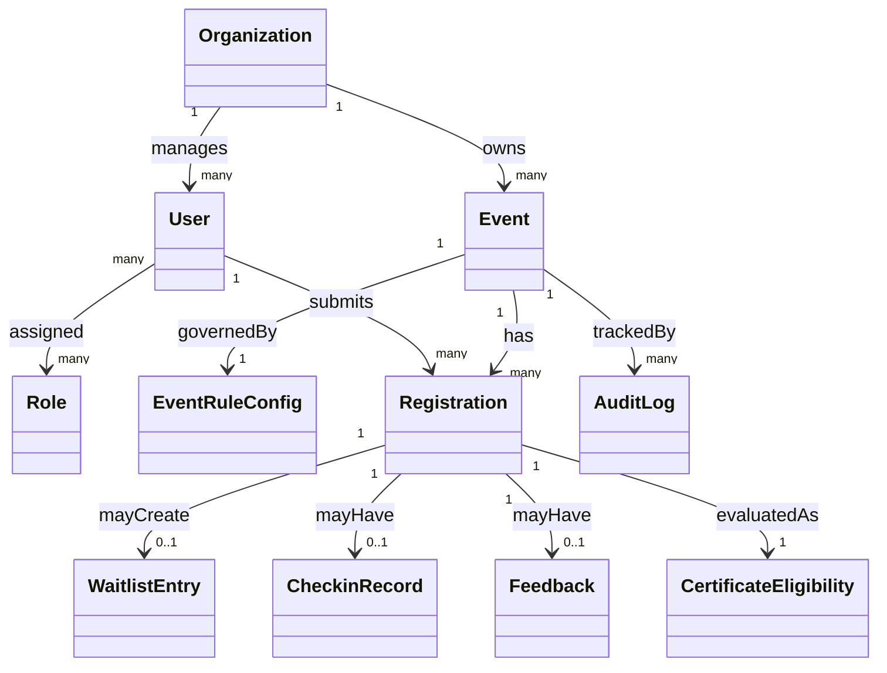

# We Event BRD - Domain Model

## 1. Domain entities

- Organization
  - Event-operating unit (school, club, department).
- User
  - System account with one or more roles.
- Role
  - Business permission set (`OrganizerAdmin`, `OrganizerStaff`, `Participant`).
- Event
  - Core domain object containing event info, schedule, and lifecycle state.
- EventRuleConfig
  - Event-level business configuration (capacity, waitlist, check-in, feedback, certificate rules).
- Registration
  - Participant registration record for an event, including status.
- WaitlistEntry
  - Queue record when registration is `Waitlisted`: stable `position`, `enqueued_at`, optional `promoted_at` / `expired_at` lifecycle markers.
- CheckinRecord
  - Check-in record with audit metadata.
- Feedback
  - Post-event participant feedback; at most one official submission per registration (optional in-window updates per policy).
- CertificateEligibility
  - Certificate evaluation result (`PendingEvaluation`, `Eligible`, `NotEligible`, `Revoked`) with reason payload.
- AuditLog
  - History of critical changes and sensitive actions.

## 2. Relationship Model

## 3. Business Semantics and Constraints
- Constraint C-01: Registration is unique by `(Event, Participant)` in active status.
- Constraint C-02: `Registered` count must always be <= `EventRuleConfig.capacity`.
- Constraint C-03: Each `CheckinRecord` must map to one valid `Registration`.
- Constraint C-04: `CertificateEligibility` is computed from attendance + feedback + rules; terminal outcomes (`Eligible`, `NotEligible`) always include reason.
- Constraint C-05: Any `EventRuleConfig` change after registration opens must have an `AuditLog`.
- Constraint C-06: Each `Registration` has at most one official `Feedback` (0..1 relationship).
- Constraint C-07: `CertificateEligibility` terminal states include `Revoked` (admin override only, reason required).
- Constraint C-08: Each `Registration` has at most one active `WaitlistEntry` (`promoted_at` and `expired_at` both null).
- Constraint C-09: Among active entries, `(Event, position)` is unique per event.
- Constraint C-10: `position` is a stable enqueue ordinal (monotonic assign); it is not compacted when other entries leave. UI copy uses “queue position,” not “people ahead.”

## 4. Suggested Ubiquitous Terms
- Seat: a participation slot within capacity (`Registered` or `CheckedIn` holders).
- Waitlist: FIFO queue of `Waitlisted` registrations ordered by active `WaitlistEntry.position`.
- Attendance: post check-in attendance outcome.
- Eligibility: certificate eligibility evaluation outcome.
