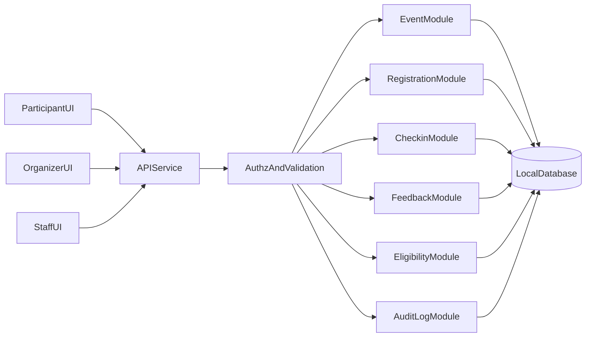

# We Event System Overview (Local-First)

## 1. Purpose
This document defines the local-first system architecture for the We Event MVP and establishes shared terminology for all design documents in `designs/`.

Primary focus for this phase:
- Local development and deterministic behavior.
- Validation and guardrails for core business rules.
- Testability and traceability from BRD to implementation.

Related reference:
- Recommended implementation stack: `12-backend-frontend-tech-stack.md`

Out of scope for this phase:
- Deployment architecture, cloud topology, CI/CD rollout, production scaling.

## 2. Product Scope (MVP)
In scope:
- Event lifecycle management.
- Capacity-aware registration with waitlist promotion.
- In-window check-in and attendance outcome.
- Feedback capture and certificate eligibility evaluation.
- RBAC and auditability for critical actions.

Out of scope:
- Payment/ticketing.
- LMS/CRM/ERP integration.
- Native mobile app.
- Automated certificate issuance/verification.

## 3. Actors and Responsibilities
- `OrganizerAdmin`: configures event rules, publishes/pauses events, executes critical overrides.
- `OrganizerStaff`: operational check-in and event support within assigned scope.
- `Participant`: views events, registers/cancels (if allowed), checks in, submits feedback.
- `System`: enforces invariants, runs promotions/evaluations, persists audit trails.

## 4. Canonical States
### 4.1 Event
`Draft -> Published -> RegistrationOpen -> RegistrationClosed -> InProgress -> Completed -> Archived`

Cancellation:
`Published|RegistrationOpen|RegistrationClosed -> Cancelled`

### 4.2 Registration
`Requested -> Registered|Waitlisted|Rejected`

Additional transitions:
- `Waitlisted -> Registered|Expired`
- `Registered -> CancelledByUser|CancelledByOrganizer|CheckedIn|Absent`
- `CheckedIn -> Attended`

### 4.3 Certificate Eligibility
`PendingEvaluation -> Eligible|NotEligible`

Exceptional transition:
`Eligible -> Revoked` (admin-only, reason required)

## 5. Local-First Architecture

Design guardrails:
- Single API boundary for validation consistency.
- Domain-layer invariants before persistence.
- Critical state transitions are audit logged.
- Deterministic rule evaluation for reproducible tests.

## 6. Quality Attributes (Local Context)
- **Consistency**: no capacity overflow, no duplicate active registrations.
- **Traceability**: every critical config/state change has actor + timestamp + reason.
- **Testability**: business rules are decomposed into deterministic validation units.
- **Operability**: local runbook supports end-to-end scenario testing.

## 7. Traceability Skeleton
| BRD Artifact | Design Coverage |
|---|---|
| FR-01..FR-04 Event Management | `00`, `02`, `05`, `06`, `07` |
| FR-05..FR-12 Registration/Capacity | `02`, `04`, `05`, `06`, `08`, `11` |
| FR-13..FR-17 Check-in/Attendance | `02`, `05`, `06`, `07`, `08`, `11` |
| FR-18..FR-21 Feedback/Eligibility | `03`, `05`, `06`, `08`, `11` |
| FR-22..FR-24 Monitoring/Reporting | `01`, `05`, `09`, `11` |
| FR-25..FR-27 RBAC and scope limits | `01`, `05`, `08`, `09`, `11` |
| BR-01..BR-09 Registration/Cancellation rules | `04`, `06`, `08`, `11` |
| BR-10..BR-13 Check-in/Audit rules | `04`, `06`, `08`, `09`, `11` |
| BR-14..BR-20 Feedback/Eligibility rules | `03`, `05`, `08`, `09`, `11` |
| BR-21..BR-22 Governance change controls | `01`, `04`, `09`, `11` |
| AC-01..AC-12 Acceptance criteria | `05`, `06`, `08`, `11` |
| NFR-01..NFR-15 Local quality constraints | `09`, `10`, `11` |

## 8. Shared Glossary
- **Active Registration**: any non-terminal registration that still occupies or competes for a seat.
- **Seat**: one capacity slot in an event.
- **Waitlist**: FIFO queue for over-capacity participants (unless future priority policy is introduced).
- **Valid Check-in**: check-in recorded strictly inside configured check-in window.
- **Eligibility Reason**: machine- and human-readable explanation for eligibility decision.
- **Critical Change**: post-registration-open rule/capacity change requiring audit metadata.
