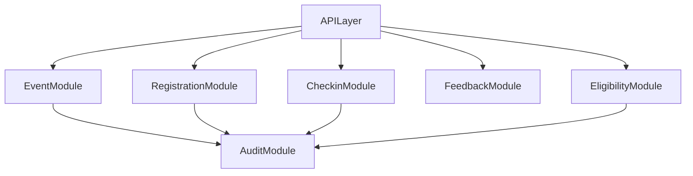

# Module Breakdown

## 1. Design Principles
- Keep business invariants in domain services, not controllers.
- Keep modules cohesive and explicitly contract-based.
- Make side effects auditable and testable.

## 2. Modules
## 2.1 Event Module
Responsibilities:
- Event creation/edit/publish/pause.
- Lifecycle transition orchestration.
- Rule config ownership linkage.

Key guardrails:
- Reject publish if required event fields are incomplete.
- Reject illegal transitions by current state.

## 2.2 Registration Module
Responsibilities:
- Registration request intake and deduplication.
- Capacity assignment and waitlist enqueue.
- Cancellation and waitlist promotion.

Key guardrails:
- Enforce one active registration per participant per event.
- Prevent `RegisteredCount > Capacity`.
- FIFO promotion unless policy extension is explicitly enabled later.

## 2.3 Check-in Module
Responsibilities:
- Staff/self check-in processing.
- Window validation and attendance linkage.
- Single valid check-in enforcement.

Key guardrails:
- Reject out-of-window check-in.
- Reject duplicate valid check-in for same registration.

## 2.4 Feedback Module
Responsibilities:
- Feedback window checks.
- One official feedback submission policy.
- Optional update-in-window handling.

Key guardrails:
- Only valid registration holders may submit.
- Enforce mandatory-feedback constraint for eligibility downstream.

## 2.5 Eligibility Module
Responsibilities:
- Compute `Eligible` / `NotEligible` with reasons.
- Consume attendance + feedback + event rules.
- Handle admin-only revocation overrides.

Key guardrails:
- Deterministic rule evaluation order.
- Every decision includes reason payload.

## 2.6 Audit Module
Responsibilities:
- Persist immutable event history for critical actions.
- Capture before/after values for sensitive updates.
- Support traceability and operational review.

Key guardrails:
- Never allow audit record mutation.
- Include actor, role, event, action, reason, timestamp.

## 3. Integration Contracts

Contract conventions:
- Commands mutate state and return versioned entity snapshots.
- Queries are side-effect free.
- Domain errors are typed and mapped to API errors consistently.

## 4. Cross-Module Transaction Boundaries
- Registration assignment + waitlist handling in one transaction.
- Cancellation + promotion in one transaction.
- Check-in write + registration status transition in one transaction.
- Eligibility evaluation + result persistence in one transaction.

## 5. BRD Traceability
- FR-01..FR-24
- BR-01..BR-19
- AC-01..AC-10

## 6. Application Structure
The API is organized as **vertical domain modules** (Event, Registration, Check-in, Feedback, Eligibility, Audit), each following the same layering:

1. **Routes** — HTTP handlers, auth guards, idempotency
2. **Services** — orchestration, transactions, audit side effects
3. **Repositories** — raw SQL persistence (no ORM)
4. **Validation** — domain rule checks before state changes

Supporting modules handle **auth**, **user provisioning**, and **organizer dashboard** queries. Cross-cutting concerns — RBAC, event scope, idempotency, pagination — sit outside individual domain modules.

Shared enums, state machines, and error codes live in `@we-event/domain` and are consumed by both API and web.

The frontend mirrors role boundaries: a **participant** namespace and an **organizer** namespace, each with its own layout and auth context.
