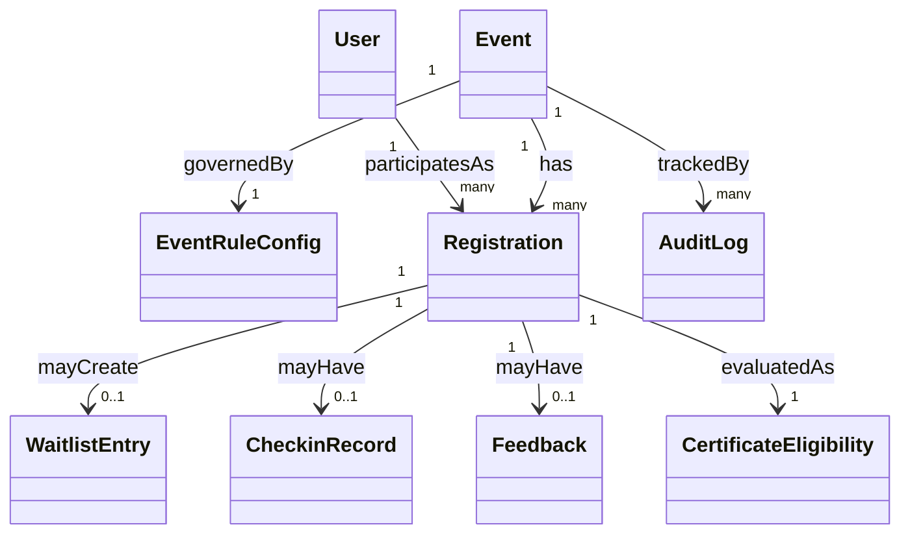

# Domain Model

## 1. Aggregates and Entities
- `Event` (aggregate root)
- `EventRuleConfig`
- `Registration` (aggregate root for participant-event lifecycle)
- `WaitlistEntry`
- `CheckinRecord`
- `Feedback`
- `CertificateEligibility`
- `AuditLog`

Context entities:
- `Organization`
- `User` (identity aggregate — email/password credentials, display name, role assignments)
- `Role`

### User entity
- `id` (UUID) — also used as `participantId` in registrations when role is `Participant`.
- `email` (unique, normalized lowercase).
- `passwordHash` (adaptive hash; never exposed in API responses).
- `displayName`.
- `createdAt`, `updatedAt`.
- Role assignments via `UserRole` (see database design): one user may hold `Participant` and/or organizer roles.

Self-service signup creates `Participant` role only. `OrganizerAdmin` and `OrganizerStaff` accounts are provisioned via seed script or admin invite — not open registration.

## 2. Core Relationships

## 3. Key Invariants
- INV-01: At most one active registration per `(eventId, participantId)`.
- INV-02: `count(Registered) <= EventRuleConfig.capacity`.
- INV-03: Waitlist ordering is FIFO by enqueue timestamp.
- INV-04: Valid check-in exists at most once per registration.
- INV-05: Eligibility output is always terminally explicit: `Eligible` or `NotEligible` with reason.
- INV-06: Post-registration-open critical config changes require audit record.

## 4. Value Objects
- `TimeWindow(openAt, closeAt)` for registration/check-in/feedback.
- `CapacityLimit(totalSeats)`.
- `EligibilityReason(code, message, metadata)`.
- `AuditReason(code, text)`.

Validation rules for value objects:
- `openAt < closeAt`.
- `totalSeats >= 0`.
- reason fields required for sensitive admin overrides.

## 5. Domain Events
- `EventPublished`
- `RegistrationRequested`
- `RegistrationAccepted`
- `RegistrationWaitlisted`
- `RegistrationCancelled`
- `WaitlistPromoted`
- `CheckinRecorded`
- `AttendanceFinalized`
- `FeedbackSubmitted`
- `EligibilityEvaluated`
- `EligibilityRevoked`
- `RuleConfigChanged`

## 6. Lifecycle Semantics
### Event
- Starts as `Draft`.
- Must be `Published` before registration can open.
- Must be `Completed` before final attendance and eligibility closure.

### Registration
- Entry through `Requested`.
- Terminal outcomes include `Rejected`, `CancelledByUser`, `CancelledByOrganizer`, `Expired`, `Absent`, `Attended`.

### Eligibility
- Starts in `PendingEvaluation`.
- Resolved to `Eligible` or `NotEligible`.
- Optional exceptional transition to `Revoked` by admin only.

## 7. BRD Traceability
- Domain entities: BRD Domain Model document.
- Constraints: BR-01..BR-22.
- State semantics: State Machine BRD.
