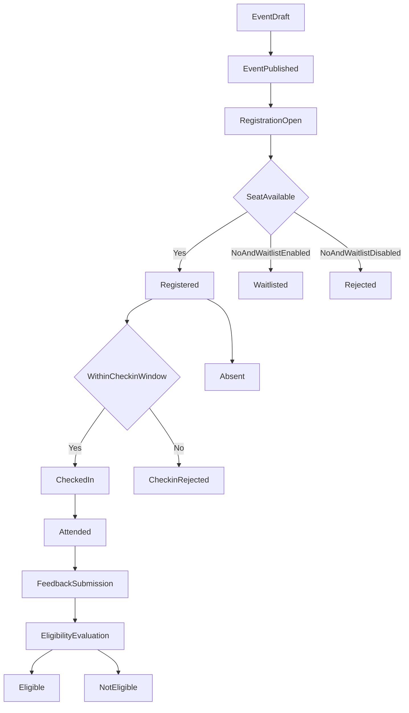

# Main Workflows

## 1. End-to-End Core Workflow

## 2. Workflow A: Event Setup and Publish
1. Admin creates event in `Draft`.
2. Admin configures `EventRuleConfig` (capacity/windows/waitlist/feedback policy).
3. System validates completeness and chronological window consistency.
4. Admin publishes event.
5. System writes `EventPublished` and audit log.

Guardrails:
- Block publish on invalid time windows.
- Block rule config mutation by non-admin users.

## 3. Workflow B: Registration and Waitlist
1. Participant sends registration request.
2. System checks:
   - registration window open,
   - duplicate active registration,
   - capacity status.
3. Outcomes:
   - `Registered` if seat available,
   - `Waitlisted` if full + waitlist enabled,
   - `Rejected` otherwise.
4. System records state transition and reason payload.

Guardrails:
- Transactional seat assignment.
- Queue insert in deterministic FIFO order.

## 4. Workflow C: Cancellation and Auto Promotion
1. Participant (or admin/staff if allowed) requests cancellation.
2. System validates cancellation policy against deadline.
3. On valid cancellation:
   - free one seat,
   - promote first waitlisted registration,
   - persist both transitions atomically.
4. Audit critical/manual overrides.

Guardrails:
- Cancellation after deadline requires explicit policy/approval path.
- Prevent double promotion race by queue locking.

## 5. Workflow D: Check-in and Attendance Finalization
1. Staff or participant (self mode) submits check-in.
2. System validates check-in window and existing valid check-in.
3. On success, persist `CheckinRecord` and move registration to `CheckedIn`.
4. At event completion:
   - `CheckedIn -> Attended`,
   - `Registered` without valid check-in -> `Absent`.

Guardrails:
- Reject out-of-window check-in.
- Keep immutable check-in audit metadata.

## 6. Workflow E: Feedback and Eligibility
1. Participant submits feedback in configured window.
2. System validates:
   - valid registration,
   - one official submission rule.
3. Eligibility evaluator executes deterministic rules:
   - registration validity,
   - attendance result,
   - feedback completion if mandatory.
4. System stores `Eligible` or `NotEligible` with reason.

Guardrails:
- Every eligibility output requires reason code/text.
- Admin revocation requires explicit reason and audit.

## 7. Exceptional Flows
- Event cancelled after publication: registration operations stop; participants receive terminal status handling.
- Late check-in attempt: return semantic error (`CHECKIN_WINDOW_CLOSED`).
- Rule change after registration open: allowed only for admin with critical-change audit.

## 8. BRD Traceability
- FR-01..FR-24
- BR-01..BR-22
- AC-01..AC-12
