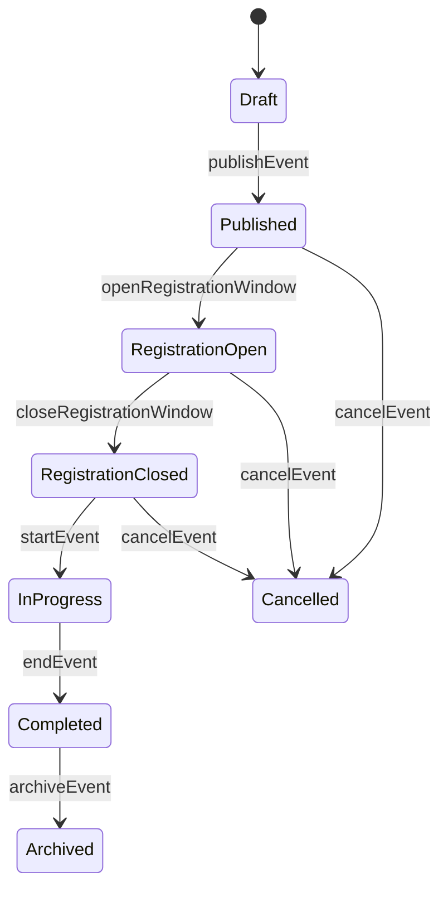
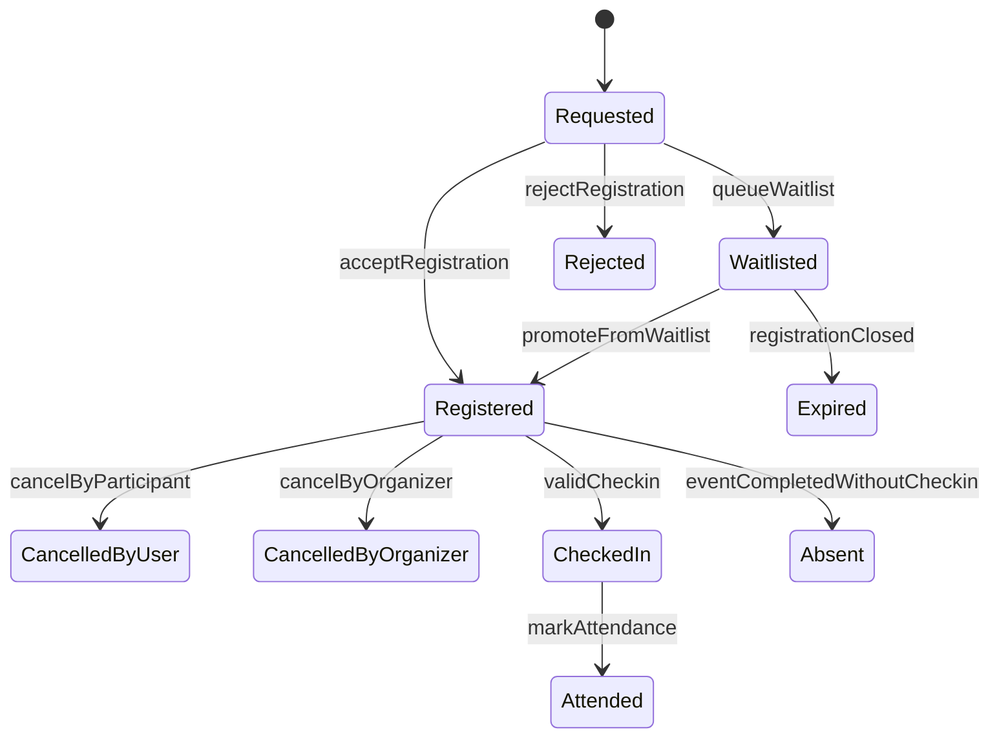
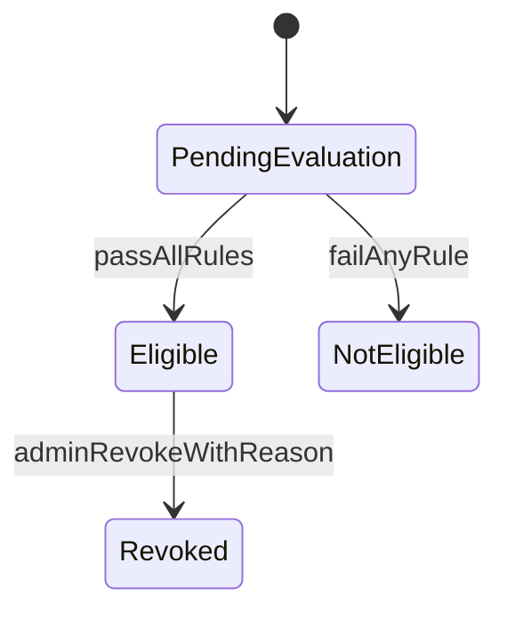

# State Machines

## 1. Event State Machine

Transition guards:
- `publishEvent`: required event metadata complete.
- `openRegistrationWindow`: current state `Published` and config present.
- `cancelEvent`: actor is admin and confirms cancellation.

## 2. Registration State Machine

Transition guards:
- `acceptRegistration`: window open + no duplicate + seat available.
- `queueWaitlist`: full and waitlist enabled.
- `validCheckin`: check-in window valid + no prior valid check-in.

## 3. Certificate Eligibility State Machine

Transition guards:
- `passAllRules`: registered and attended, feedback complete if mandatory.
- `adminRevokeWithReason`: actor role admin, reason present, audit write succeeds.

## 4. Transition Table (Condensed)
| Entity | From | To | Trigger | Guard |
|---|---|---|---|---|
| Event | Draft | Published | `publishEvent` | required fields complete |
| Event | Published | RegistrationOpen | `openRegistrationWindow` | schedule/manual open |
| Event | RegistrationClosed | InProgress | `startEvent` | event start reached |
| Registration | Requested | Registered | `acceptRegistration` | seat available + rule checks |
| Registration | Requested | Waitlisted | `queueWaitlist` | full + waitlist enabled |
| Registration | Registered | CheckedIn | `validCheckin` | in check-in window |
| Registration | CheckedIn | Attended | `markAttendance` | event complete |
| Certificate | PendingEvaluation | Eligible | `passAllRules` | attendance/feedback criteria pass |
| Certificate | Eligible | Revoked | `adminRevokeWithReason` | admin + reason + audit |

## 5. Invalid Transition Policy
- Reject with `409 Conflict` and stable error code.
- Preserve original state unchanged.
- Include transition context in logs for diagnostics.

## 6. BRD Traceability
- State machine BRD (event/registration/certificate)
- BR-01..BR-22
- AC-01..AC-12
