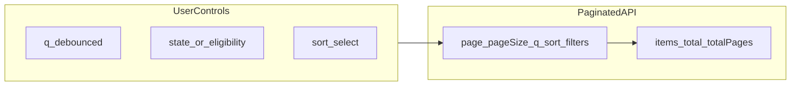

# Listing Pages — Search, Filter, and Sort

Central UX and API contract for all paginated list screens. Source requirements: FR-28 to FR-31; API details in [`docs/technical/05-api-design.md`](../technical/05-api-design.md) §3.

## 1. Control flow

All listing pages use **server-driven pagination**: one API request per page. Client must not load unbounded datasets (AC-14).

## 2. Per-page matrix

| Page | Route | Endpoint | Search `q` | Filters | Sort (allowed / default) | Layout / pageSize |
|------|-------|----------|------------|---------|--------------------------|-------------------|
| Event discovery | `/events` | `GET /events` | name, location, description (ILIKE) | `state` | `startAt:asc` (default), `updatedAt:desc` | card grid, 12 |
| My registrations | `/registrations` | `GET /me/registrations` | — *(future: event name)* | `state` | `updatedAt:desc` (default), `requestedAt:asc` | status list, 20 |
| Organizer events | `/organizer/events` | `GET /events` | same as discovery | `state` (incl. `Draft`) | `startAt:asc` (default), `updatedAt:desc` | table, 20 |
| Registrations | `/organizer/events/{id}/registrations` | `GET .../registrations` | — *(future: participant)* | `state` | `updatedAt:desc` (default), `requestedAt:asc` | table, 20 |
| Waitlist | `/organizer/events/{id}/waitlist` | `GET .../waitlist` | — *(future)* | — | `position:asc` only in MVP | table, 20 |
| Check-in console | `/organizer/events/{id}/check-in` | `GET .../attendance` | — *(future)* | — *(future: checked-in vs pending)* | `checkinAt:desc` (default) | table + row action, 20 |
| Eligibility | `/organizer/events/{id}/eligibility` | `GET .../eligibility` | — | `eligibility` | `participantId:asc` (default) | segmented tabs + table, 20 |
| Audit log | `/organizer/events/{id}/audit` | `GET .../audit-logs` | — | `entityType`, `entityId` | `createdAt:desc` (default) | table, 20 |

### Search scope (MVP)

- **Event metadata search** applies only to `GET /events` (`q` matches name, location, description).
- **Participant identity search** on organizer operational tables (registrations, waitlist, attendance) is **future scope** — see [`docs/brds/08-acceptance-mvp-future.md`](../brds/08-acceptance-mvp-future.md) §3.

### Waitlist-specific listing rules

- Waitlist table sort is **locked** to FIFO (`position:asc`) in MVP; UI subtitle or label reads “FIFO order.”
- `Waitlisted` rows also appear on the registrations list when filtered by state; include `waitlistPosition` column there.
- Participant My Registrations shows `waitlistPosition` when state is `Waitlisted` (FR-10a).

## 3. Shared UX contracts

### FilterBar

- Sticky below page header on list-heavy screens ([`06-app-layout-components.md`](06-app-layout-components.md)).
- Contains search input (where supported), filter select(s), and sort select (where supported).
- On mobile: may collapse to a single “Filters” trigger that opens a drawer/sheet.

### Search

- Debounce **300ms** before issuing API request with `q`.
- Placeholder copy: “Search by name or location” on event lists.
- Clear action resets `q` and returns to page 1.

### Filter

- Single-select for `state` or `eligibility` unless segmented tabs replace the control (eligibility page).
- Invalid filter values return API `400 INVALID_INPUT`; UI should prevent invalid enum submission.
- Changing filter resets `page` to 1.

### Sort

- MVP: **sort select** in FilterBar on event discovery, organizer events, and My Registrations.
- Options map directly to API `sort` query param (`field:asc` / `field:desc`).
- Changing sort resets `page` to 1.
- Table column-header sort is optional future enhancement.
- Waitlist and eligibility use fixed default sort only in MVP.

### Pagination

- Show item range and page control: “Showing 21–40 of 142”, prev/next disabled at bounds.
- Reset to page 1 when search, filter, or sort changes.
- Empty page beyond `totalPages` returns `items: []` with valid metadata (AC-13).

### Empty and failure states

| Condition | Title | Action |
|-----------|-------|--------|
| No rows in system | Domain-specific empty (e.g. “Waitlist is empty”) | — |
| Filters yield zero matches | “No results match your filters” | “Clear filters” resets search + filter + sort default |
| API failure | “Could not load …” | “Retry” refetches current query |

### URL query sync (recommended)

- Listing pages **SHOULD** reflect `page`, `q`, `state`, and `sort` in the URL for shareable/bookmarkable views.
- Not blocking MVP exit, but preferred for participant event discovery and organizer operational tables.

### Accessibility

- Every control has a visible `<label>` or `aria-label`.
- Filter/sort changes should update a polite live region with result count when practical.
- Pagination controls are keyboard accessible.

## 4. Sort and filter reference (API)

Invalid `page`, `pageSize`, `sort`, `state`, or `eligibility` → `400` with `INVALID_PAGINATION` or `INVALID_INPUT`.

See [`docs/technical/05-api-design.md`](../technical/05-api-design.md) §3 for defaults and response envelope.

## 5. Traceability

- FR-28, FR-29, FR-30, FR-31
- AC-13, AC-14, AC-18a–e (listing search/filter/sort)
- NFR-05, NFR-16
