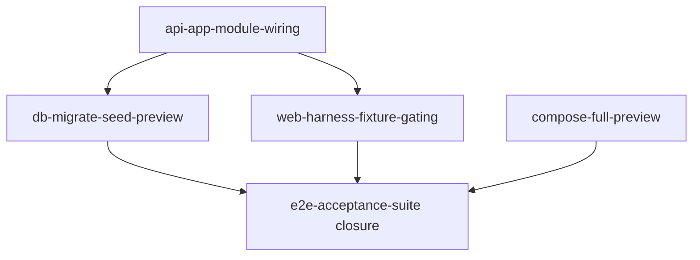

# {{PRODUCT_NAME}} — Integration Debt Register

**Purpose:** Canonical record of known gaps between **implemented feature slices** (modules + UI) and **production-integratable runtime**. Harness agents must read this before marking MVP release-ready or closing phase 4 / acceptance slices.

**Related:** [integration-checklist.md](./integration-checklist.md) · [preview-runtime.md](./preview-runtime.md) · [../whole-app-backlog.json](../whole-app-backlog.json) (phase 4 slices) · [../../docs/technical/14-integration-debt.md](../../docs/technical/14-integration-debt.md) (product doc)

**Last reviewed:** _(update when phase 4 work begins)_

---

## Why this register exists

Early-phase slices often build NestJS modules, React pages, and test harnesses in isolation. Web pages may **silently fall back to harness fixtures** when preview API routes return `NotFound` because the root application module is not fully wired.

**Do not treat `passes: true` on feature slices as MVP release readiness.** Run `npm run aih:verify:integration` and complete phase 4 backlog slices first.

---

## Gap summary

| ID | Severity | Gap | Owner slice | Blocks |
| --- | --- | --- | --- | --- |
| GAP-01 | **Critical** | Root API module missing feature imports | `api-app-module-wiring` | Real preview API, demo runbook, acceptance on live data |
| GAP-02 | **Critical** | No `db:migrate` / `db:seed` scripts or preview seed dataset | `db-migrate-seed-preview` | Demo accounts, local-dev docs |
| GAP-03 | **High** | Web harness fixture fallbacks active by default on API 404 | `web-harness-fixture-gating` | Honest staging validation |
| GAP-04 | **High** | Compose stack incomplete vs technical spec | `compose-full-preview` | `aih:preview:full`, containerized demo |
| GAP-05 | **High** | Acceptance browser gate not wired (`playwrightSpec: null`) | `e2e-acceptance-suite` | Final slice closure, browser AC sign-off |

_Add product-specific gaps below as Ralph discovers them (patterns, not literals):_

| Pattern | Example owner slice | When to add |
| --- | --- | --- |
| JWT env naming mismatch | `config-jwt-env-alignment` | Multiple env var names for same secret in docs vs code |
| Extra compose services (Redis, message bus) | `compose-full-preview` | Technical spec requires services beyond db/api/web |
| Parallel integration test flakes | owner module slice | Cross-suite pollution; fix in owning slice |
| CORS / idempotency header gaps | API or web harness slice | Preview export/retry paths blocked |
| Performance gates not rehearsed | future perf slice | NFR load tests documented but not automated |

Populate `ai-harness/config/integration-checks.json` with concrete module names, paths, and optional `jwtEnvVars`.

---

## GAP-01 — Production API not wired

**Expected:** Root application module (see `integration-checks.json` → `appModulePath`) imports all MVP backend modules listed in `requiredModules`.

**Verification:**

```bash
npm run aih:verify:integration -- --check app-module
```

**Do not** mark `api-app-module-wiring` done if modules exist only under `apps/api/src/modules/` but are absent from the root module.

---

## GAP-02 — Database migrate and seed

**Expected:** Root `package.json` exposes `db:migrate` and `db:seed`; seed creates minimum demo dataset documented in `docs/technical/10-local-development-setup.md`.

**Verification:**

```bash
npm run aih:verify:integration -- --check seed-scripts
npm run db:migrate && npm run db:seed
```

---

## GAP-03 — Harness fixture gating

**Expected:** Preview fixture data is gated by `VITE_PREVIEW_FIXTURE_MODE` (see `integration-checks.json` → `fixtureEnvVar`). Default preview uses live `/api/v1` data — no silent API-404→fixture fallback.

**Verification:**

```bash
npm run aih:verify:integration -- --check fixture-flag
```

---

## GAP-04 — Full compose preview

**Expected:** `docker-compose.yml` supports full preview profile with api + web containers (see `integration-checks.json` → `composeProfiles`).

**Verification:**

```bash
npm run aih:verify:integration -- --check compose
```

---

## GAP-05 — Acceptance browser gate

**Expected:** `tests/playwright-ui/scenarios/e2e-acceptance-suite.spec.ts` exists; browser test produces non-zero `playwrightTestCount`.

**Prerequisite:** GAP-01 + GAP-02 fixed so browser journeys hit live API where spec expects it.

**Verification:**

```bash
npm run aih:preview
npm run aih:browser-test -- e2e-acceptance-suite
npm run aih:playwright-check -- e2e-acceptance-suite
```

---

## Slice dependency order



Recommended backlog priority: wiring → seed → fixtures → compose → re-close e2e acceptance.
