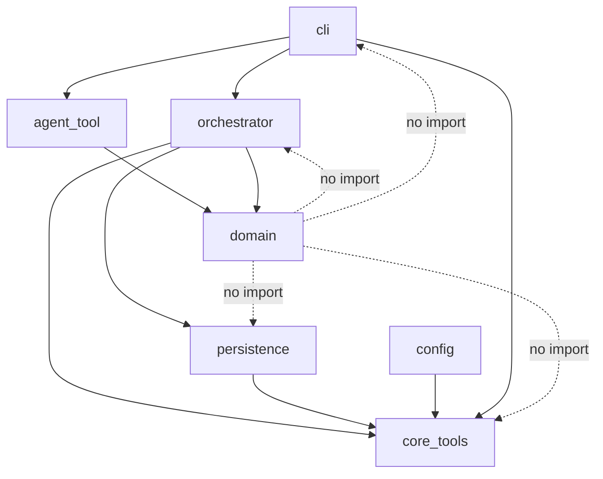

# System context and layers

**Audience:** maintainers who need component and package boundaries.

TDP (`top_down_planning`) is a product package that orchestrates planning, production, and review. Shared infrastructure lives in [`core_tools`](../../../core_tools/README.md). Operators and agents see `tdp` / `tdp agent`; they do not call these layers directly.

Dashed edges are **forbidden** imports (enforced in tests). Solid edges are allowed call/import direction.

## Layer responsibilities

| Layer | Package path | Responsibility |
| --- | --- | --- |
| Domain | `top_down_planning/domain` | Pure models and rules: plan tree, dependencies, validation, production, reviews, outcomes. No CLI, provider, or persistence. |
| Orchestrator | `top_down_planning/orchestrator` | Lifecycle: plan → review → validate → produce → amend → Sub-TDP → review output → resolve outcome. Provider session policy, ownership, teardown. |
| Agent tool | `top_down_planning/agent_tool` | `tdp agent` service: schema validation, revision CAS, authorized mutations. |
| Config | `top_down_planning/config` | Product schema (`DEFAULT_CONFIG`, allowed override paths) and `resolve_config`. |
| Persistence | `top_down_planning/persistence` | Run store: canonical snapshots, events, session references, capabilities. |
| CLI | `top_down_planning/cli` | User-facing (`tdp run`, `resume`, `doctor`, …) and agent-facing command wiring. |
| Prompts | `top_down_planning/prompts` | Jinja templates for `protocol_instructions`. |
| Shared infra | `core_tools` | Providers, config merge/`--set`, workspace paths, atomic writes, digests, revision helpers, CLI emit, observability, JSON Schema. |

## `core_tools` boundary

**Belongs in `core_tools`:** provider protocol and adapters (Cursor, stub), config merge and `--set`, workspace/resource/skill loading, atomic files and content digests, observability/redaction, minimal JSON Schema, CLI output helpers.

**Stays in TDP:** plan/production/review domain, orchestrator lifecycle, `tdp` / `tdp agent` surfaces, run-store layout, product config schema and override allowlists.

`domain` must not import `cli`, `config`, `persistence`, `orchestrator`, or `core_tools` (`tests/unit/test_layer_boundaries.py`). Orchestrator must not import presentation consoles (`rich`, `core_tools.observability.console`). Prompt/template ownership and “where a change belongs”: [maintenance](../internals/maintenance.md).

## Runtime system context

A **run** is the durable unit. The operator process (`tdp run` / `resume`) holds run ownership, creates or resumes provider subprocesses, and continues until a lifecycle stop. Agents inside those subprocesses mutate canonical state only through `tdp agent`. The Cursor adapter is POSIX-only; `stub` is test-only. [Install](../manual/install.md), [sessions](sessions.md).

Related: [package README](../../README.md), [lifecycle architecture](lifecycle.md).
