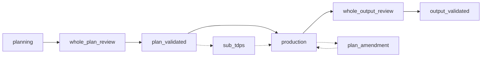

# Lifecycle terms

**Audience:** operators, runtime agents, and maintainers who must not collapse distinct state axes into one “status”.

TDP uses several independent axes. Mixing them (for example treating a review stage as the run status) makes operator and agent pages inconsistent. Define each term here and link back.

## Run status

`run.status` is one of:

| Status | Meaning |
| --- | --- |
| `running` | The run is active. `outcome` and `stop` are null. |
| `paused` | Work stopped with an **operational** stop record. `outcome` is null. Resume may continue after the stop is addressed. |
| `completed` | The run finished with a quality `outcome` (`accepted`, `rejected`, or `blocked`). `stop` is null. |
| `failed` | The run hit an **invariant** stop. `outcome` is null. This is not a quality outcome. |

Paused runs are **recoverable** in the lifecycle sense: they carry an operational `stop.code` (for example `limit_exhausted`, `user_cancelled`, `amendment_pending`, `provider_turn_failed`). Failed runs are **terminal** for that run: they carry an invariant `stop.code` (for example `orchestrator_invariant_failure`, `session_recovery_exhausted`, `sub_tdp_unit_permanently_failed`). Completed runs are also terminal.

Distinguish **continuation-command success** (`ok` on `tdp run` / `tdp resume`) from **terminal quality success**:

| Signal | Meaning |
| --- | --- |
| Continuation-command success (`ok=true`) | Durable `status=running` (including after a staged `--until` target), or `status=completed` with `outcome=accepted`. |
| `ok=false` | `status=paused` or `status=failed`, or `status=completed` with `outcome` other than `accepted`. |
| Terminal quality success | `status=completed` **and** `outcome=accepted`. |
| `target_reached` | The requested `--until` milestone was reached. Independent of `ok`. |

`--until plan` and `--until validated` can stop while the run is still `status=running`; the CLI payload then carries both `ok` and `target_reached`. See [lifecycle architecture](../architecture/lifecycle.md) and the [stop-state decision](../decisions/lifecycle-stop-states.md).

## Lifecycle phase

`run.phase` is where the engine is in the orchestration sequence. It is not the run status. Current phase names:

| Phase | Place in the loop |
| --- | --- |
| `planning` | Planner constructs the candidate plan |
| `whole_plan_review` | Mandatory whole-plan gate |
| `plan_validated` | Plan validation after plan review |
| `production` | Producer batches (and optional focused output review) |
| `plan_amendment` | Planner revises the approved plan after a producer amendment request |
| `sub_tdps` | Parent waiting on or integrating child Sub-TDP units |
| `whole_output_review` | Mandatory whole-output gate |
| `output_validated` | Output validation after output review |

A run can be `paused` or `running` in several of these phases. Do not use the phase name as a substitute for `status`.

Dashed edges are alternate paths (amendment, Sub-TDP), not a second status axis. Operator walkthrough: [lifecycle](../workflows/lifecycle.md).

## Mandatory review stage

Inside a **mandatory** `whole_plan` or `whole_output` loop, `active_stage` is a review-loop field, not `run.status` and not `run.phase`.

| Stage | Job |
| --- | --- |
| `initial_review` | Discovery: findings, families, audit attestation |
| `finding_verification` | Verify (or send back) previously reported findings |
| `scope_review` | Fresh look at the artifact without prior finding framing |

Optional `focused_plan` and `focused_output` loops have their own respond stages; they are not the mandatory whole-artifact gate. Protocol: [reviewer](../agents/reviewer.md). Internals: [review architecture](../internals/reviews.md).

## Revisions

Revisions are monotonic counters on artifacts. They are not run status.

| Revision | What it versions |
| --- | --- |
| Plan `revision` | The plan tree (`tdp agent plan apply` uses `base_revision`) |
| `production_revision` | Production state (`tdp agent production apply` uses this CAS field) |
| `output_revision` | Produced output snapshot used by completion claims and whole-output review |

Stale revision fields return `revision_conflict`. Whole-plan and whole-output approvals are bound to the current plan or output revision. The persisted completion claim is bound to those same current revisions.

## Recoverable versus terminal

| Kind | Typical signals | What operators do |
| --- | --- | --- |
| Recoverable pause | `status=paused`, operational `stop` | Diagnose, possibly change presentation/limits, `tdp resume` |
| Terminal failure | `status=failed`, invariant `stop` | Treat as a broken run; do not expect resume to continue production |
| Terminal completion | `status=completed` plus an `outcome` | Read the quality outcome; **terminal quality success** is `accepted` only |

Amendment-pending and some Sub-TDP waits are pauses, not failures. Quality `blocked`/`rejected` are completion outcomes, not `status=failed`.

Related: [quality loop](quality-loop.md), [operations](../workflows/operations.md), [troubleshooting](../manual/troubleshooting.md).
