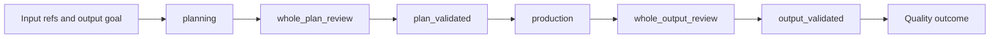

# Normal lifecycle

**Audience:** operators following a run from inputs to a final quality outcome.

This is the usual path for `tdp run --until completed` without prepared Sub-TDP packages. A bare `tdp run` defaults to `--until plan` and stops after planning construction. Phase names and status vs phase vs review stage: [lifecycle terms](../concepts/lifecycle-terms.md). Quality gates: [quality loop](../concepts/quality-loop.md). Command flags: [user CLI](../manual/cli.md).



Amendment (`plan_amendment`) and Sub-TDP (`sub_tdps`) are alternate phases, not extra statuses. See [operations](operations.md) and [prepared execution](prepared-and-sub-tdp.md).

## Input and output goal

The operator supplies authoritative inputs (`run.input_refs`) and a deliverable contract (`run.output_goal` or `run.output_goal_file`) in YAML. How those fields resolve: [configuration](../manual/configuration.md). Example: [examples/top-down-planning.yaml](../../examples/top-down-planning.yaml).

`tdp run --config <yaml>` creates the run, materializes resolved config, and starts the engine. Without `--until`, that invocation uses the argparse default `--until plan`.

## Plan

Phase `planning`. The planner session constructs the [plan tree](../concepts/plan-tree.md) through `tdp agent plan apply` until it emits `candidate_plan_ready`. Operators do not paste a plan into the host IDE. What you see on stderr: [agent sessions](agent-sessions.md).

Optional focused plan review may run during construction if enabled (`review.focused_plan.enabled`, default true).

## Review (plan)

Phase `whole_plan_review`. Mandatory whole-plan gate: reviewer `initial_review` → `finding_verification` as needed → `scope_review`. Owner (planner) revises when `changes_requested`. Protocol: [reviewer](../agents/reviewer.md).

## Validation (plan)

Phase `plan_validated`. Deterministic plan validation must pass before production. Operators can also run `tdp validate --run <id>` at any time; that does not replace the phase.

`--until validated` on `tdp run` / `tdp resume` stops once this milestone is reached.

## Production

Phase `production`. The producer records batches with evidence until applicable work items are terminal, then `submit-completion`. Optional focused output review may run. If the approved plan cannot be followed, the producer requests an amendment (`plan_amendment`) or reports blocked. [Producer protocol](../agents/producer.md).

## Output review and acceptance

Phase `whole_output_review`, then `output_validated`. Mandatory whole-output gate, then deterministic output validation. The run **completes** with `outcome` `accepted`, `rejected`, or `blocked` per the acceptance invariant on [quality loop](../concepts/quality-loop.md).

Success for continuation/resume semantics is `completed` **and** `accepted` only.

## Reading the result

```bash
tdp status --run <run-id> --config cfg.yaml
tdp inspect --run <run-id> --view active --config cfg.yaml
```

Paused vs failed vs completed: [lifecycle terms](../concepts/lifecycle-terms.md). Diagnosis: [troubleshooting](../manual/troubleshooting.md).

Related: [first run](first-run.md), [operations](operations.md).
